# 12：深度强化学习 #1 🧠

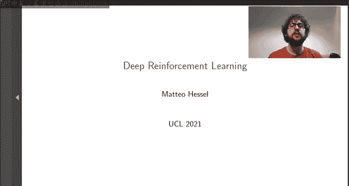

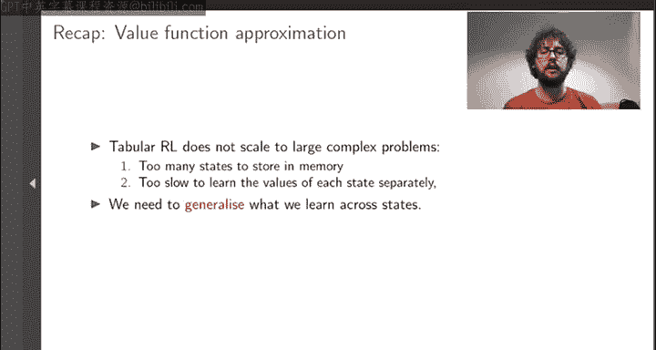

在本节课中，我们将要学习深度强化学习的核心概念。深度强化学习是传统强化学习算法与深度神经网络作为函数近似器的结合。我们将探讨其动机、面临的挑战以及一些关键的解决方案。

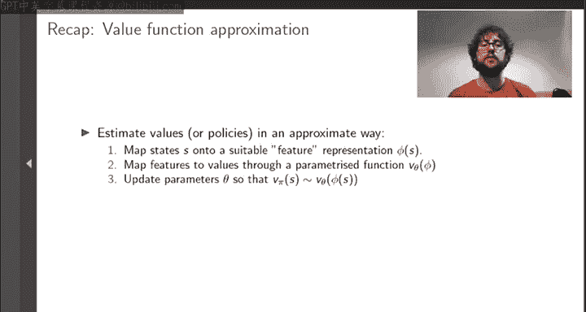

## 概述：为何需要函数近似？ 📈

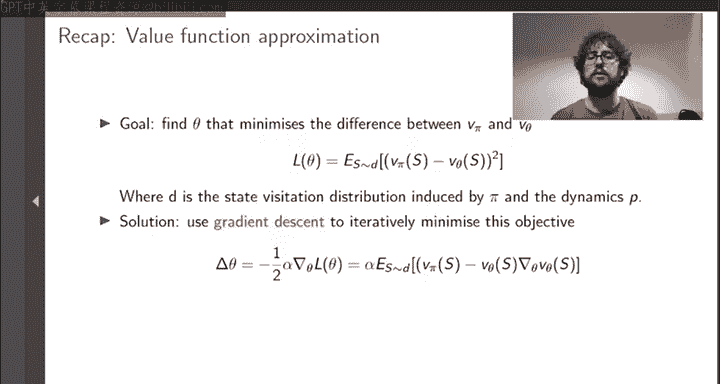

上一节我们介绍了函数近似的动机。表格型强化学习无法扩展到某些大型复杂问题。原因在于，若想为每个状态单独估计其价值，其内存成本会随状态空间线性增长，这使其不切实际。即使内存无限，也存在一个根本问题：若需访问每个状态（甚至多次）才能对其价值做出合理估计，学习过程将极其缓慢。

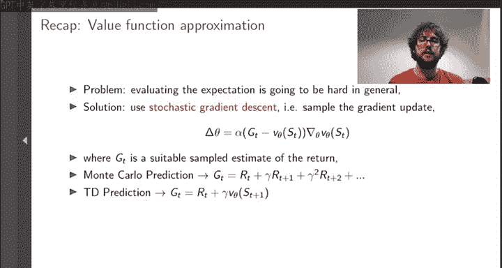

解决方案是使用函数近似，这是我们**泛化**所学知识的关键工具。它能将从一个状态学到的知识，推广到所有根据合理定义“相近”的其他状态。

## 函数近似与深度神经网络 🧠

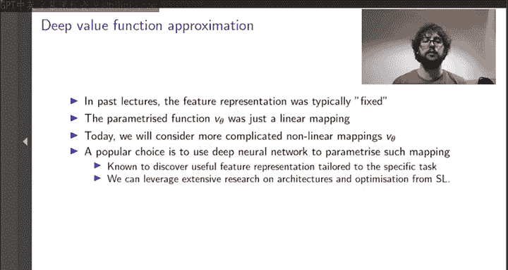

我们已经介绍了函数近似。本章的目的是专门讨论使用深度神经网络进行函数近似，这通常被称为**深度强化学习**。

在使用函数近似估计价值时，我们通常采用一个简单方案：一个固定的映射将任意状态转换为某种特征表示 φ，然后我们有一个**线性**参数化函数，将特征映射为价值。强化学习问题就变成了拟合这些参数 θ，使得价值函数 V_θ 的预测尽可能接近真实价值 V_π。

我们可以将其转化为具体算法。第一步是形式化最小化 V_θ 和 V_π 之间差异的目标，例如使用某种损失函数，如状态上的期望平方误差。这通常还会根据策略本身的访问分布进行加权，以合理分配容量。给定损失函数后，我们可以使用梯度下降来优化它。

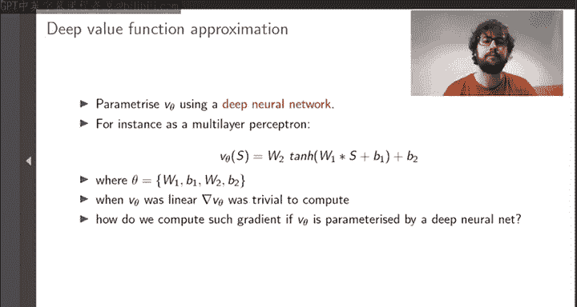

这听起来简单，但细节决定成败。在强化学习中实施此过程会引入一些微妙的挑战。首先，计算所有状态的期望过于昂贵。但更深层的问题是，我们想要准确预测的目标 V_π 本身是未知的。

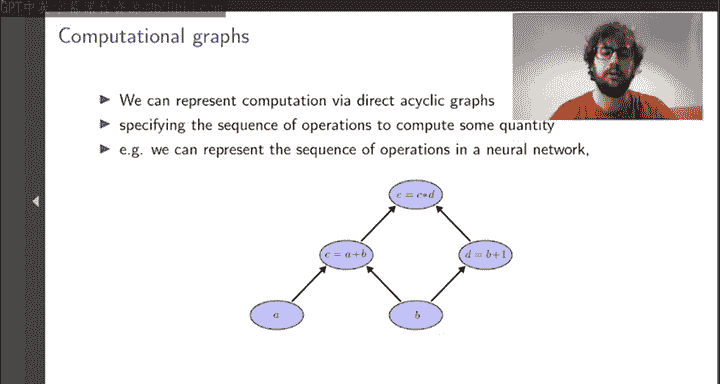

解决这两个问题的方法是：在每次梯度下降更新中，仅考虑一个或少数几个状态来采样梯度，然后使用 V 的样本估计作为目标。为此，我们可以重用所有在无模型算法中讨论过的思想。例如，我们可以通过使用幕回报作为梯度更新中的目标来进行蒙特卡洛深度预测，或者通过在我们自己的价值估计上自举来构建单步目标，从而实现深度时序差分预测算法，而自举本身也由我们希望更新的同一参数 θ 参数化。

## 为何选择神经网络？ 🔍

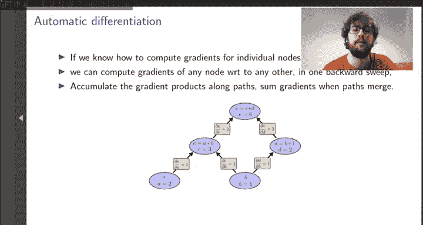

原则上这都很好。但今天我们要考虑一个更复杂的场景：特征映射 φ 可能过于简单，如果在其上仅使用线性映射，其信息不足以支持合理的价值预测。在这种情况下，我们可能希望使用从状态到价值的更复杂的**非线性**变换，例如使用深度神经网络作为函数近似器。

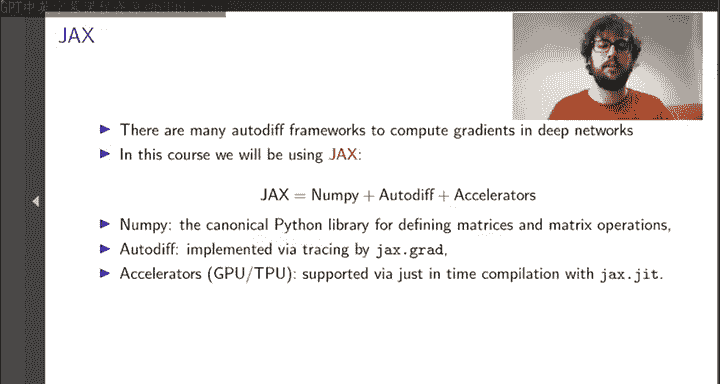

你可能会问为何选择神经网络。这确实是个好问题。需要强调的是，神经网络绝非更复杂函数近似器的唯一可能选择，但它们确实有一些优势。首先，这类参数化函数广为人知，并且已知能够发现针对特定任务（在我们的案例中是强化学习）非常有效的特征表示。重要的是，神经网络学习的这种特征表示，是通过**端到端**的梯度过程优化的，而在线性函数近似中，梯度过程仅用于定义线性映射。因此，我们有一种统一的方式来训练整个参数化模型，以表达性强的方式表示状态，并从此表示中做出合理良好的价值预测。

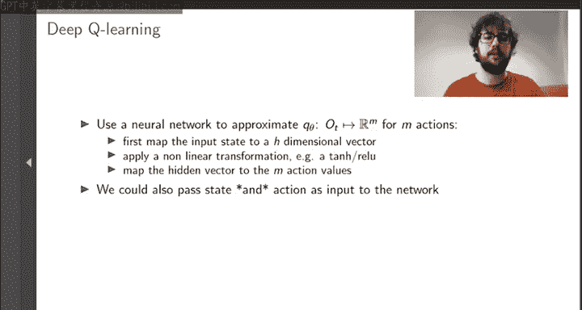

其次，考虑到深度学习在机器学习中的广泛采用，使用神经网络允许我们直接利用大量优秀的研究成果。例如，监督学习中为网络架构或优化引入的所有思想，我们都可以在强化学习中使用神经网络进行函数近似时加以利用和受益。

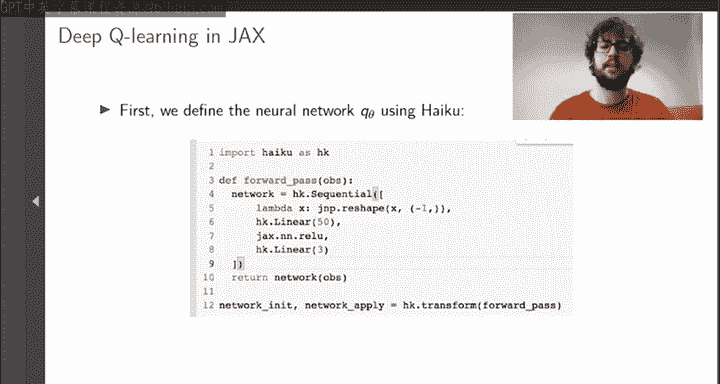

## 自动微分与计算图 ⚙️

在实践中，用神经网络参数化价值函数是什么样子？在最简单的情况下，我们可以考虑所谓的**多层感知机**。MLP 将状态的基本编码（例如，机器人的原始传感器读数）作为输入，通过应用线性映射（W*s + b）后接非线性变换（如 ReLU）来计算隐藏表示，然后实际的价值估计将作为此嵌入的线性函数计算。重要的是，这个嵌入不是固定的，而是学习得到的。我们使用 DRL 训练的价值估计的参数 θ 不仅包括最终的线性映射，还包括隐藏表示的参数，整个系统是端到端训练的。

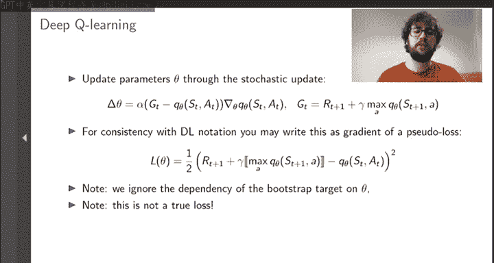

这听起来很有吸引力。但如果我们想计算关于 θ 的梯度，我们需要对 MLP 甚至更复杂的架构（如卷积网络）进行微分。事实证明，有一种方法可以以计算高效的方式为任何这些架构计算精确导数，使我们无需自行推导表达式就能获得所需的任何梯度。鉴于深度学习在现代机器学习中的流行，这些通常被称为**自动微分**的方法实际上在大多数科学计算包中都可用。

本章我们将主要关注结合 RL 和深度学习的概念性挑战，并假设我们拥有这类工具来支持我们通过任意神经网络架构获取梯度。但我想至少简要介绍一下这些工具的工作原理，因为它们对我们所做的一切和 DRL 实践都至关重要。

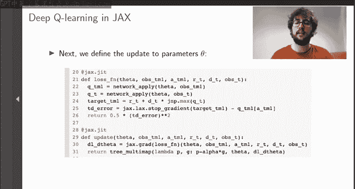

自动微分背后的第一个重要概念是**计算图**。这是任何计算（在我们的案例中是估计价值）的抽象表示，形式为有向无环图。计算图对我们有意义的原因是，如果我们知道如何计算计算图中单个节点的梯度，我们就可以通过仅运行一次计算图（从输入到输出），然后执行一次反向遍历，自动计算图中每个节点相对于任何其他节点的梯度，并在路径合并时沿路径累积和相乘梯度。

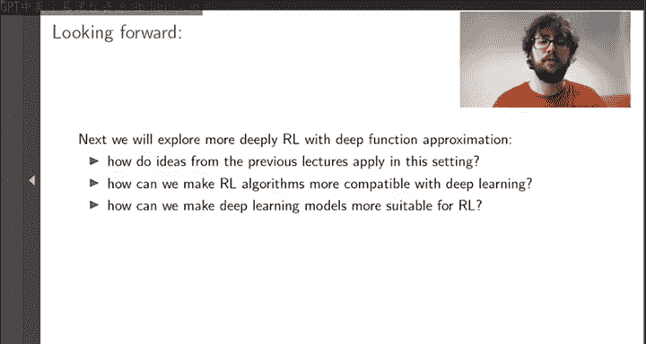

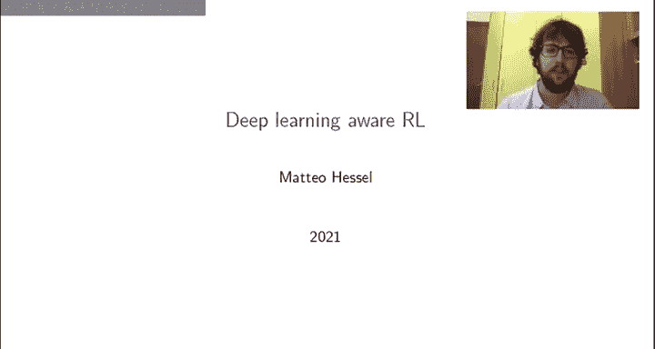

整个过程不仅计算高效（成本始终与正向传播同阶），而且精确。这不是像有限差分那样的数值近似，而是一种以完全自动的方式评估任意数值函数真实梯度的方法。

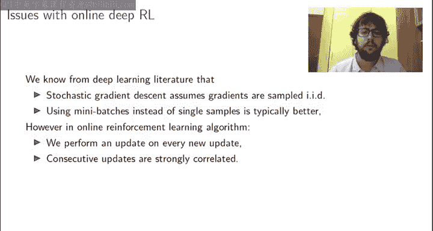

这在许多现代机器学习框架中都有原生实现，包括本课程作业选择的框架 JAX。在 JAX 中，自动微分基于追踪机制实现，并通过 `jax.grad` 程序转换暴露给用户。这是一个 JAX 实用程序，它接收一个你可以用标准格式编写的 Python 函数，然后返回另一个 Python 函数，但这个新函数计算的是原函数的梯度，并为任何给定输入评估该梯度，而不仅仅是计算正向传播。

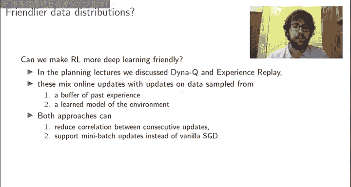

## 实现一个简单的深度 Q 学习智能体 🤖

为了结束引言部分，我想展示一个使用 JAX 的自动微分工具实现基本 Q 学习智能体的简单示例，该智能体使用神经网络作为函数近似器。

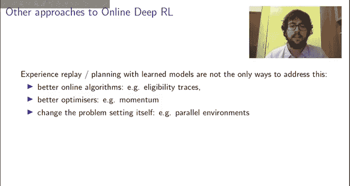

这样的深度 Q 学习智能体是什么样子？首先，我们需要选择如何近似 Q 值。为此，我们将使用一个单一的神经网络，它以状态作为输入，并输出一个向量，每个元素对应一个可用动作。例如，这个网络可以是一个如前所述的 MLP。注意，我们在这里隐含地做了一个设计选择：网络接收单个状态并输出所有动作价值。这不是严格要求，我们也可以将状态和动作都作为输入传递给网络，然后网络只返回该动作的 Q 值。但通常，如果我们能在单次前向传播中计算所有 Q 值，计算效率会更高，因此这在实践中是相当常见的选择。

在 JAX 中，我们可以使用 Haiku 模块非常简单地定义这样的神经网络。定义好网络后，我们还需要定义网络参数的梯度更新。对于 Q 学习，这看起来很像开始时展示的 DT 更新，但我们将更新特定动作的价值 Q_θ(s_t, a_t)，并使用奖励加上折扣后的最大 Q 值作为回报的样本估计目标。有趣的是，虽然你可以完全按照这种形式编写更新以匹配数学公式，但通常，如果你查看 DQN 智能体的实现，可能会看到它以略有不同的方式编写，更符合标准深度学习的习惯：定义一个伪损失函数，即本幻灯片上的第二个方程。这没问题，但要使此损失函数的梯度恢复正确的 Q 学习更新，有几个重要的注意事项。首先，在计算此损失的梯度时，我们需要忽略 max Q 对参数 θ 的依赖。其次，要意识到这不是一个真正的损失函数，它只是一个在取梯度时能返回正确更新的道具。

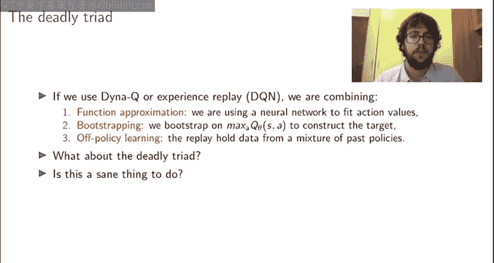

在代码中如何实现？这在 JAX 中又相当简单，因为我们可以只定义一个伪损失函数，它接收参数 θ 和转移样本（观察、动作、奖励、折扣和后续观察），然后计算在 s_t 和 s_{t+1} 处的 Q 值，通过将奖励与折扣后的最大 Q 值相加来组装目标，然后计算这两者的平方误差。关键是为了确保损失函数的梯度实现我们的 DQ 学习更新，我们必须在代码中添加 `stop_gradient` 项。`stop_gradient` 实现了这个思想：梯度计算将忽略目标 t-1 对参数 θ 的依赖。为了实际获得更新，我们需要实际计算梯度，然后通过随机梯度下降更新参数。

这当然是一个相当简单的智能体，但它实际上展示了定义深度强化学习智能体的完整流程：我们定义了网络和梯度更新，并应用了这些更新。它看起来如此简单明了的原因在于，我们利用了 JAX 强大的自动微分能力，它允许我们仅通过调用 `jax.grad` 相关数值函数，就能从损失函数（或本例中的伪损失函数）中获得更新。

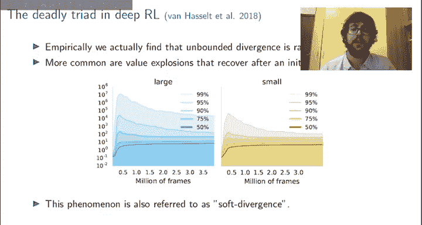

## 深度强化学习的挑战与应对 🛡️

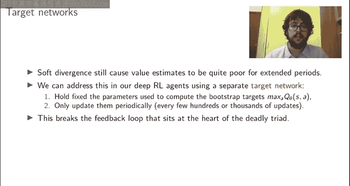

在下一节中，我们将深入探讨 DRL 的挑战，如何使强化学习部分意识到我们对函数近似的特定选择，反之亦然，如何通过理解使用强化学习目标更新参数的独特属性，使我们的深度网络更适合强化学习。

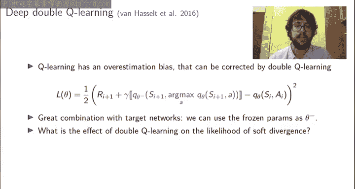

在本节中，我想让你深入了解当强化学习思想与深度学习结合时会发生什么，既包括使用深度学习进行函数近似时已知的 RL 问题如何表现，也包括我们如何通过牢记强化学习选择对函数近似的影响来控制这些问题。

让我们从上一节的简单在线 DQ 学习算法开始。这个算法有哪些潜在问题？首先，我们从深度学习文献中知道，随机梯度下降假设梯度是独立同分布采样的。如果我们使用在 MDP 连续转移上计算的梯度来更新参数，情况肯定不是这样，因为你在某一步观察到的东西与你上一步观察到的和做出的决策密切相关。另一方面，我们也知道，在深度学习中，通常使用小批量而不是单个样本，在寻找好的偏差-方差权衡方面通常更好。这似乎也不太适合上一节描述的在线深度 Q 学习算法，因为我们在每个新步骤都执行更新。

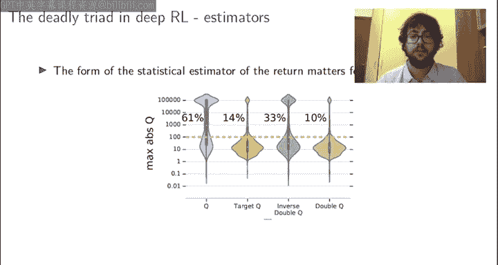

那么，我们如何使强化学习对深度学习更友好呢？回顾之前的讲座，很明显某些算法可能比其他算法更好地反映深度学习的假设。因此，在选择强化学习算法时，将深度学习放在心上是有好处的。例如，在规划讲座中，我们讨论了 Dyna-Q 和经验回放，我们混合了在线更新和从环境学习模型（Dyna-Q 情况下）或从过去经验缓冲区（经验回放情况下）采样的数据计算的更新。这两者实际上可能直接解决我们刚才在原始 DQ 学习智能体中强调的两个问题，因为通过从内存缓冲区采样状态-动作对或整个转移，我们有效地减少了连续参数更新之间的相关性，并且也免费获得了对小批量的支持。

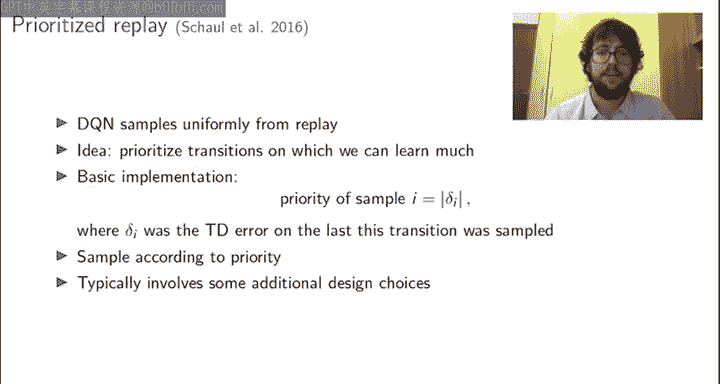

类似地，如果我们知道我们正在使用深度学习进行函数近似，我们可以做很多事情来帮助学习稳定有效。例如，我们可以使用替代的在线 RL 算法，如资格迹，它自然地整合了来自多步和多次环境交互的参数 θ 信息，而无需像 Dyna-Q 或经验回放那样需要显式规划或回放。或者，我们也可以考虑深度学习文献中的某些优化器，它们可能通过以不同方式整合多个更新的信息（例如使用动量或 Adam 更新）来解决和缓解在线深度强化学习带来的问题。最后，在某些情况下，如果我们牢记深度学习的特性，我们甚至可能能够或愿意改变问题本身，使其更易于处理。例如，我们可以考虑拥有多个与并行环境交互的智能体副本，然后在每次参数更新中混合来自多个环境实例的多样化数据。

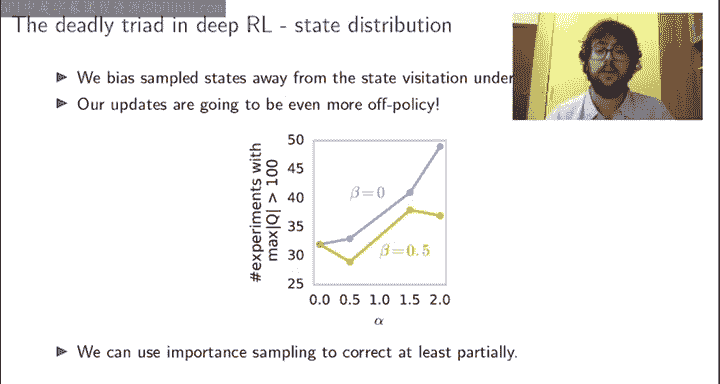

## 致命三元组与稳定性 ⚖️

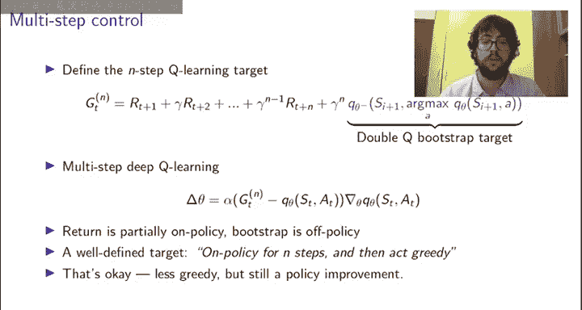

让我们更深入地探讨。我们说过，如果使用 Dyna-Q 或经验回放，我们可以解决某些问题，并更好地适应深度学习的某些假设。同时，如果你考虑 Dyna-Q 和 Q 学习，以及当我们将这些算法与函数近似结合使用时会发生什么，那么我们实际上结合了函数近似、自举（因为我们使用 Q 学习作为无模型算法）和离策略学习（因为回放过去的数据，我们实际上混合了从过去策略混合中采样的数据，而不仅仅是最新策略）。你可能记得我们将这三者的组合称为**致命三元组**，这听起来不妙。原因是，我们从理论上知道，当你结合这三样东西时，存在发散的可能性。但同时，如果你阅读深度强化学习文献，你会发现许多成功的智能体确实结合了这三种成分。这里需要注意，致命三元组指出结合这些成分时发散是可能的，但并非必然，甚至不一定很可能。因此，如果我们理解并牢记支撑 RL 和深度学习算法的特性，我们实际上可以做很多事情来确保深度强化学习的稳定性和可靠性，即使它们结合了致命三元组的所有元素。

在接下来的内容中，我想帮助你发展和理解当结合强化学习与使用神经网络进行函数近似时，致命三元组如何以及何时显现。就像我们讨论过的批处理和相关性这两个初始问题一样，通过理解并牢记 RL 和深度学习的基本特性，这已经在设计相当鲁棒的强化学习算法方面大有帮助。

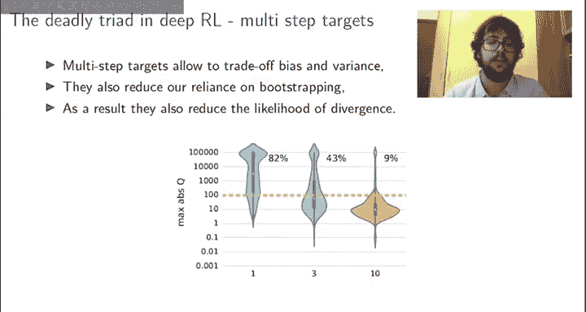

让我们从一项大规模的实证研究开始，我们观察了深度强化学习智能体在许多领域中，由于致命三元组而导致发散的出现。我们发现，经验上，无界发散实际上非常非常罕见，即使你结合了致命三元组的所有元素，参数也往往不会趋于无穷。更常见的是另一种我们称为**软发散**的现象。软发散是指价值估计最初爆炸性增长到超出合理预期的数量级，但随着时间的推移，这些估计实际上会恢复并回落到合理值。你可能会想，如果软发散在实践中大多会自行解决，它甚至值得关注吗？我们是否应该讨论如何最小化这种初始不稳定性？我认为答案是肯定的，因为即使它不会严重发散到无穷大，在价值 wildly 不正确的状态下进行数十万或数百万次环境交互，确实会影响智能体的行为和收敛到正确解的速度。

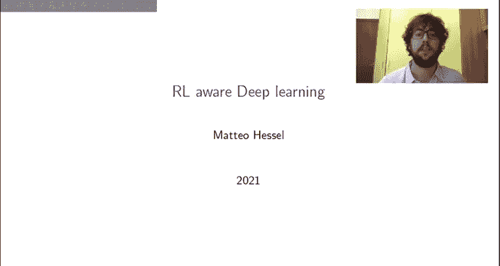

那么，让我们讨论一下我们能做些什么。不同的强化学习思想如何帮助我们确保在使用深度网络进行函数近似时，学习动态是稳定有效的？我想告诉你的第一种方法是由 DQN 算法引入的，称为**目标网络**。其思想是固定用于计算自举目标的参数（例如，在 Q 学习中，这是用于估计下一步最大 Q 值的参数），然后仅定期更新这些参数。这样做，我们干扰了致命三元组核心的反馈循环。致命三元组的核心问题是，当你更新一个状态时，你可能也不经意地更新了你将要自举的下一个状态，这可能会产生某些反馈循环。但如果用于自举的参数至少在一段时间内被冻结，那么这个反馈循环就被打破了。

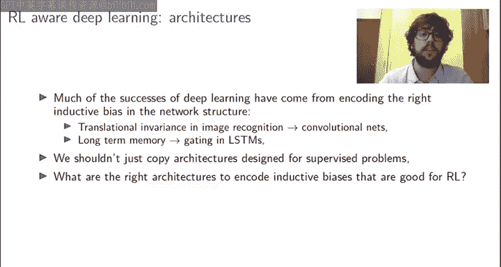

另一种方法是，我们知道 Q 学习本身即使在表格设置中也有高估偏差，这可能导致至少在初始阶段出现不合理的高价值估计。因此，这可能与致命三元组相互作用，增加观察到价值估计爆炸的可能性。如果是这种情况，那么我们可以使用例如**双 Q 学习**来减少更新的高估，这也有助于使算法相对于致命三元组更加稳定。在双 Q 学习中，我们使用独立的网络来选择自举的动作和评估该动作。巧妙的是，这实际上与目标网络的思想结合得很好，因为我们可以使用冻结的参数（目标网络的参数）作为两个网络之一。实证表明，这两种思想都具有很强的稳定效果。

总的来说，我个人发现观察这些现象以及强化学习方面的不同选择如何与由自举、离策略和函数近似组合触发的致命三元组相互作用，是非常有启发性的。有趣的是，这不仅仅是关于目标网络或双 Q 学习。在我们强化学习智能体设计选择的整个过程中，每个设计选择都可能与函数近似和我们深度网络的学习动态相互作用。

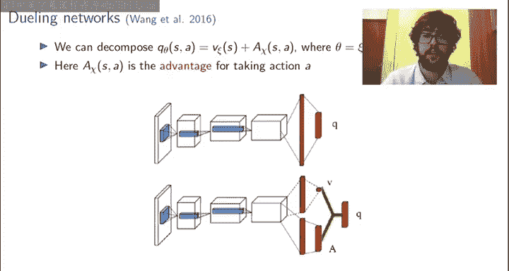

## 网络架构与强化学习 🏗️

在本节中，我想采取与上一节截然不同的视角。与其关注在设计强化学习算法时意识到函数近似的选择，我想讨论深度学习方面：我们能否设计特别适合强化学习的神经网络架构？我们能否理解用通过自举构建的目标来优化神经网络意味着什么？例如，在强化学习问题中增加网络容量意味着什么？

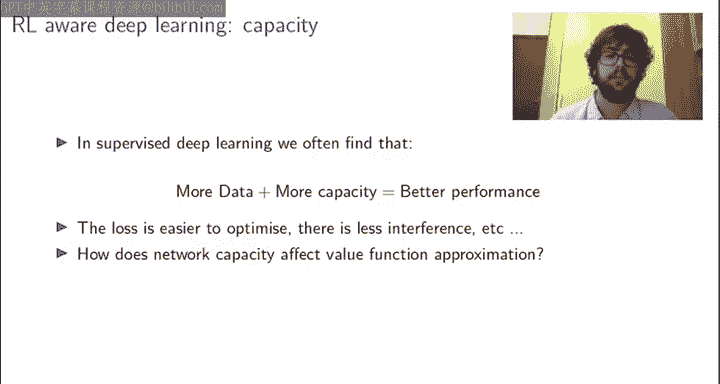

这当然是一个巨大的研究领域，我无法在本讲座中涵盖所有思想，但希望能至少给你一些直觉和思路。

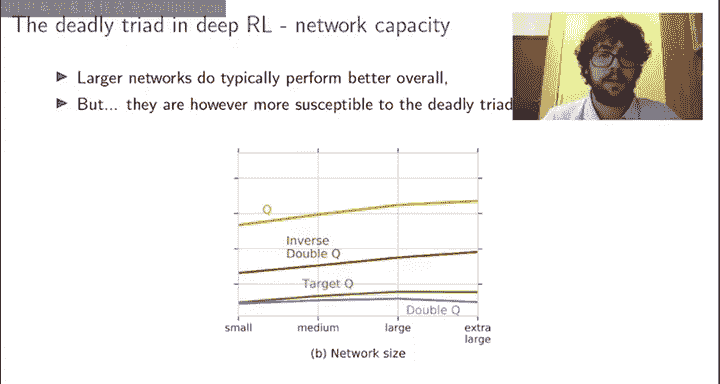

如果你思考深度学习近期的历史，其许多成功来自于能够在网络架构中编码某些归纳偏差，从而最好地支持在特定广泛类别问题中的学习，同时又不限制其仅通过端到端梯度下降为每个任务构建定制化表示的能力。例如，卷积网络的大部分能力来自于其学习平移不变特征的能力，这使得计算机视觉任务的学习变得容易得多。类似地，LSTM 通过特定架构支持长期记忆，允许梯度学习使用门控在长跨度上保留信息，这对自然语言处理的许多早期成功至关重要。

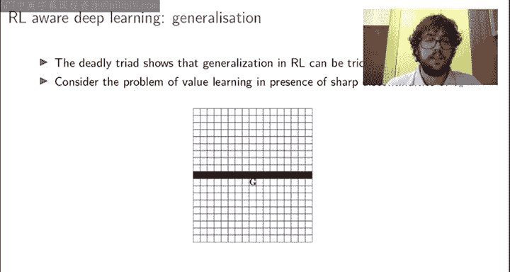

由于强化学习与视觉、自然语言处理以及深度学习最常应用的监督学习任务都相对不同，我认为如果仅仅复制为监督学习设计的网络架构就能给我们带来最优结果，那将是令人惊讶的。相反，我认为我们应该考虑什么是强化学习的正确架构，我们应该纳入哪些归纳偏差以使价值估计尽可能容易。这就是几年前引入的 Dueling Network 论文的动机，它引入了一种网络架构，可以显著提高深度 Q 学习智能体的性能，基本上是开箱即用，无需改变强化学习方面。

与卷积网络和 LSTM 一样，Dueling 架构实际上非常简单。通常，深度 Q 学习智能体使用本幻灯片顶部的网络架构。他们以观察作为输入（例如，如果智能体正在学习掌握视频游戏，则是屏幕像素），通过一些隐藏层（如果观察是视觉形式，通常是卷积层）处理此输入，然后应用一些全连接层以输出所有动作价值作为一个向量。然而，通常我们知道，我们可以将动作价值分解为状态价值估计（着眼于长期，与动作无关，仅取决于状态）加上一个即时优势项（也取决于我们即将采取的动作）的总和。这实际上暗示了一种不同的架构：像以前一样，我们以观察作为输入，如果是图像则通过一些卷积层处理，但随后网络通过求和一个标量和一个向量输出来生成 Q 值，它们有各自独立的处理流，从而强制网络将动作价值表示为动作相关项和动作无关项的总和。

如果你使用这样的架构，你可以使用标准的深度 Q 学习来训练得到的 Q 值，基本上不需要改变其他任何东西。但这有帮助吗？考虑一个具体问题，我们训练了这个 Dueling Q 网络来估计一个必须在高速公路上控制汽车的智能体的 Q 值。幻灯片中的图像显示了 Dueling 网络的标量和向量组件主要关注什么。左边的图显示了标量项主要关注什么，右边的图显示了向量（动作相关）项主要关注什么。你可以看到，左边的标量项学会主要关注道路前方远处的方向，因为这对当前状态的长期价值很重要。而右边的向量项学会主要关注汽车正前方的东西，因为这对估计每个动作的即时优势很重要。我认为这本身就很有趣，但也带来了相当显著的学习改进，智能体学习得更快、更稳定。

然而，在思考强化学习与深度学习时，网络的拓扑结构并不是唯一重要的因素。例如，在监督学习中，我们经常发现更多的数据加上更大的容量（不仅仅是更好的架构）等于更好的性能。但是，网络容量如何影响强化学习中的价值函数估计呢？根据我的经验，通常更大的网络在强化学习中也往往表现更好，但并非全是好处。

如果我们使用更大的网络，我们将更容易受到致命三元组的影响，尤其是在使用 Q 学习时。在我们之前讨论的大规模实证研究中，我们也考察了不同的网络容量。我们发现，随着我们使网络越来越大，至少最初价值可能增长到不合理估计的软发散可能性实际上增加了。这有很多原因，一个潜在的主要候选原因是更大的网络往往具有更平滑的景观，至少最初这可能意味着它可能更容易受到不适当泛