# 13：深度强化学习 #2 🧠

## 概述

在本节课中，我们将探讨深度强化学习中的核心挑战之一：表示学习。我们将学习如何通过构建更丰富的世界知识来改进智能体的表示，从而支持更好的泛化和更快的收敛。具体来说，我们将聚焦于两种主要思想：通用价值函数和分布式价值预测。

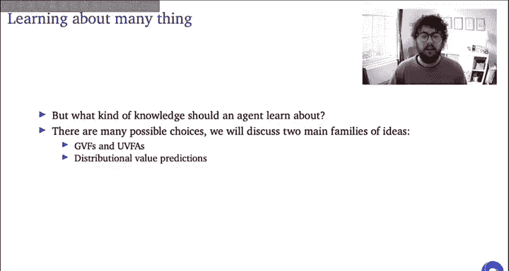

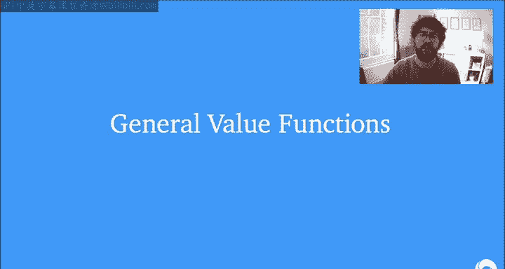

---

## 通用价值函数作为辅助任务

在上一节中，我们讨论了深度神经网络如何用于强化学习中的函数逼近，以及由此产生的问题，如“致命三角”和灾难性遗忘。这些问题本质上是不恰当泛化的问题。

本节中，我们来看看如何通过直接解决表示学习这一根本问题来应对这些挑战。核心观点是：目前我们的智能体仅为一个非常狭隘的目标（预测或最大化单一标量奖励）优化其表示。这种狭隘的目标可能导致智能体学习到过于具体、过拟合的状态表示，从而损害泛化能力。

一个自然的思路是让智能体学习关于世界的更丰富的知识，而不仅仅是单一任务奖励。我们可以从监督学习文献中汲取灵感。在众多可能的方法中，我们将重点关注两类在强化学习研究中备受关注的思想：**通用价值函数** 和 **分布式价值预测**。

### 什么是通用价值函数？

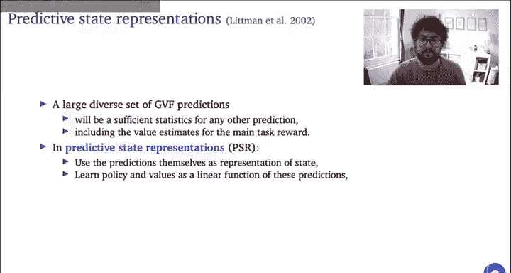

通用价值函数在形式上与标准价值函数非常相似，它预测在给定策略下，某个标量信号的期望累积折扣和。在GVF的术语中，我们选择预测的标量信号 \( C \) 被称为 **累积量**，关联的折扣因子 \( \gamma \) 定义了预测的视野，而目标策略 \( \pi \) 是计算期望时所依据的行为策略，它不一定是智能体当前执行的策略。

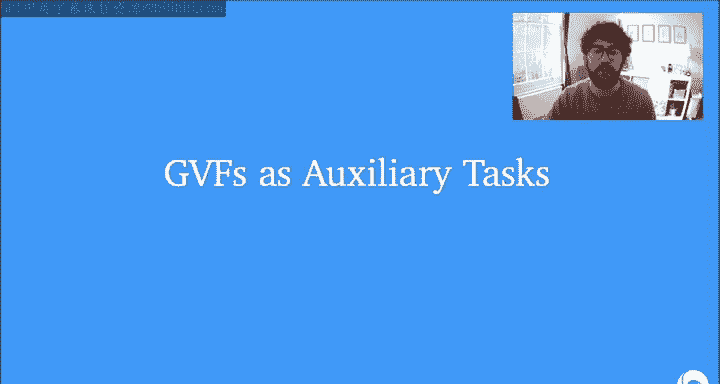

如果累积量是主任务奖励，并且在智能体策略和折扣因子下计算，那么GVF预测问题就简化为标准的策略评估。但我们可以定义许多不同的累积量、视野和假设行为来进行预测。

GVF框架的妙处在于，它允许我们用相同的机制（例如标准的TD算法）来学习所有这些丰富的预测知识。核心问题就变成了：如何利用这些预测来为智能体提供能够支持快速学习和有效泛化的良好表示？

### 使用GVF预测作为表示

一种简单直接的方法是直接将GVF预测用作表示，这被称为 **预测状态表示**。其论点是，对于一个足够大且多样化的GVF预测集合，它们将成为任何其他我们可能想做的预测（包括主任务奖励的价值预测）的充分统计量。因此，我们可以将这些GVF预测本身作为状态特征，然后将主任务的价值或策略学习为这些预测的线性函数。

### 使用GVF作为辅助任务

另一种使用GVF学习状态表示的方法是将其作为 **辅助任务**。这类似于监督学习中的自监督学习目标。这种方法特别适合深度强化学习智能体，因为神经网络的组合性质允许我们相对容易地将辅助预测与主任务预测结合起来。

具体做法是，在用于函数逼近的神经网络中，共享用于主任务预测（如策略或价值预测）和所有辅助GVF预测的底层部分。这样，主任务和辅助预测都成为单一共享隐藏表示的函数。然后，通过最小化与两类预测相关的联合损失来优化共享和非共享参数。结果是，共享的隐藏表示被迫变得更加鲁棒和通用，编码更多关于世界的信息。

以下是使用GVF作为辅助任务的具体例子：

*   **UNREAL智能体**：除了标准的价值和策略预测头外，还连接了一个辅助头，用于预测400个不同累积量的GVF。这些累积量被构造为连续观察之间像素强度的平均变化（“像素控制”损失）。辅助损失与标准策略和价值损失相加后进行优化。
*   **特征控制**：当观察不是图像或太大时，可以构造基于网络内部激活值变化的累积量，并类似地学习其GVF。

即使这些辅助累积量看起来有些随意，并且其预测结果并未直接用于决策，但它们迫使表示编码许多关于环境的有用知识（例如，动作如何影响视野中物体的位置）。这在主任务奖励稀疏的情况下尤其有用，因为辅助任务可以提供密集的学习信号，帮助在智能体看到第一个奖励之前就引导表示学习。

### 为什么辅助任务有效？几何视角

为了理解为什么使用GVF作为辅助预测是有用的，我们可以从几何角度思考表示学习。

在深度强化学习中，当我们更新价值函数时，我们不仅改变最终的价值预测，也更新表示本身以更好地支持当前的价值目标。添加辅助GVF预测相当于对这个第二步（更新表示）进行了正则化，防止表示变得对当前价值预测过于特定。

这种正则化之所以有帮助，是因为在学习过程中，智能体需要近似许多不同的价值函数（随着策略改进，价值函数在变化）。我们希望一个表示不仅能支持当前的价值预测，还能支持从初始策略价值到最优策略价值这条路径上的所有价值函数。正则化通过防止对当前价值的过拟合，使表示更有可能对未来价值也有效。

那么，哪些GVF能提供最有效的正则化呢？这取决于累积量和目标策略的选择。

*   **预测与主任务不同的累积量**：这对应于学习主任务价值多面体之外的预测。虽然没有强理论保证这会特别有助于学习路径上的价值，但像“像素控制”这样的方法在实践中效果显著。
*   **预测主任务奖励，但针对一组不同于当前策略的目标策略**：这迫使表示支持价值多面体内的一系列价值。可以证明，对于一组合适的目标策略，新的表示将捕获价值多面体的主成分，从而为近似多面体内的价值（包括学习路径上的价值）提供良好支持。然而，构造这组“正确”的策略在计算上是不可行的。
*   **预测主任务奖励，但针对过去经历过的策略**：一个实际且有效的方法是，将智能体在训练过程中已经经历过的过去策略作为GVF的目标策略。这不能保证表示能最优地支持未来价值，但至少能很好地支持学习路径的一个子集上的价值，并且计算上是可行的。实证研究表明，这种选择在多种方案中表现最佳。

---

## 处理多任务学习中的挑战

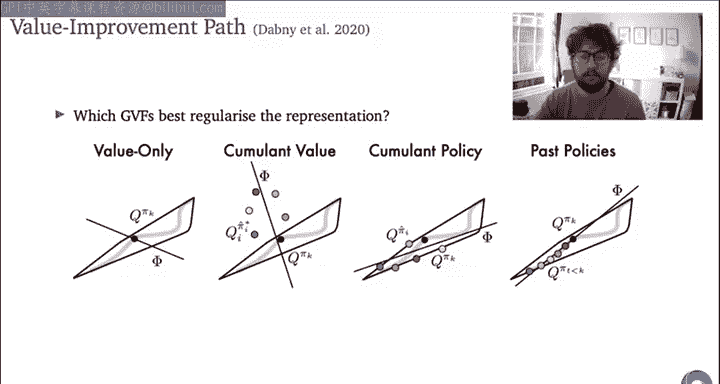

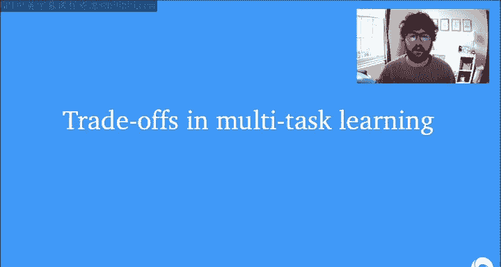

将多个GVF作为辅助任务学习，本质上将智能体学习变成了一个多任务问题。我们同时为许多可以被视为不同任务的预测训练共享表示。

这带来了一个挑战：不同的任务会竞争有限的共享资源（内存、表示容量、计算等）。任何实际的系统都需要定义权衡这些竞争需求的方式。即使不做任何处理，系统也会做出某种权衡——例如，不同GVF预测产生的梯度大小会因其累积量的频率和大小而有很大差异，这导致不同预测对共享参数更新的贡献权重不同。

为了进行合理的权衡，我们希望不同任务产生的梯度具有可比的大小。然而，在强化学习中，由于数据分布和非平稳性，实现这一点比在监督学习中（可以通过对整个数据集进行归一化）要复杂得多。

**Pop-Art算法** 就是为了解决这个问题而设计的。它通过两个步骤工作：

1.  **自适应目标归一化**：对于每个预测任务（如一个GVF），跟踪其目标值（如Q学习目标）的移动平均值（一阶矩 \( \mu \) ）和二阶矩 \( \nu \) ）。在每一步，使用归一化后的目标 \( (目标 - \mu) / \sigma \) （其中 \( \sigma = \sqrt{\nu - \mu^2} \) ）来计算梯度更新。这使得梯度大小更可控。
2.  **补偿输出层**：为了防止更新归一化统计量时影响所有其他状态的非归一化预测值，Pop-Art算法在每次更新 \( \mu \) 和 \( \sigma \) 后，对网络最后一层的权重 \( W \) 和偏置 \( b \) 进行反向调整。具体公式为：
    *   \( W' = W \cdot \frac{\sigma_{旧}}{\sigma_{新}} \)
    *   \( b' = \frac{\sigma_{旧}}{\sigma_{新}} \cdot b + \mu_{旧} - \frac{\sigma_{旧}}{\sigma_{新}} \cdot \mu_{新} \)
    这样，既能在更新中使用归一化目标获得稳定的梯度，又能保持用于自举等操作的非归一化预测值不受归一化统计量变化的影响。

Pop-Art已被证明在多任务强化学习（如同时在57个Atari游戏上训练一个智能体）中非常成功，显著提升了性能。它同样适用于GVF辅助任务场景，帮助我们以合理的方式权衡不同预测任务对共享表示的贡献。

---

## 通用价值函数学习中的开放问题

本节将讨论GVF学习中几个尚未完全解决的前沿研究问题。

### 离策略学习

我们讨论的许多辅助GVF是从与主任务策略不同的行为策略生成的经验中学习的，这已经是离策略学习。当试图从单一经验流中学习大量多样化的预测时，面临的离策略程度可能非常极端。因此，我们需要对现有离策略方法进行根本性改进才能成功。

同时，离策略学习也是一个机会。预测许多不同策略下的价值，不仅可以作为辅助任务，还可以用来生成更多样化的经验，为主任务策略的学习提供一种优秀的探索形式。如何最好地做到这一点，仍然是一个开放问题。

### 泛化

目前，我们将GVF视为一组离散的预测，它们可能共享隐藏表示，但基本上是独立学习的。如何将其扩展到成千上万个预测？一种方法是构建 **通用价值函数逼近器**：将我们想要预测的累积量或折扣因子的表示也作为网络的额外输入。这样，网络可以同时泛化跨状态和跨目标/任务。这是一个非常活跃的研究领域。

### 发现

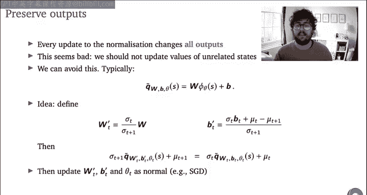

GVF从哪里来？我们如何选择学习哪些GVF？虽然我们讨论了一些构造累积量的方法（如基于像素、基于特征、基于过去策略），但如何选择学习内容的研究还远未成熟。一种近期的方法是使用 **元学习**（如元梯度）来参数化累积量和折扣因子，并在线地发现智能体应该问世界的“有用问题”。这种方法已在Atari等环境中显示出良好的性能提升。

---

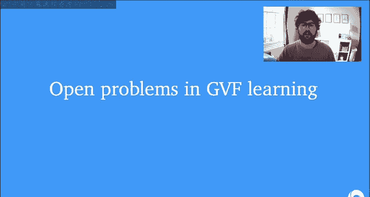

## 分布式强化学习

我们今天讨论的最后一个主题是 **分布式强化学习**。

到目前为止，我们讨论的GVF仍然以期望值的形式表示预测知识。另一种提出的方法是转向学习 **回报的完整分布**，而不仅仅是期望值。这从另一个方向泛化了通常的预测问题。

与学习多个GVF类似，学习回报分布而不仅仅是期望值，可以提供更丰富的学习信号，从而可能带来更好、更鲁棒的学习效果。然而，这需要我们对时序差分算法进行有趣的扩展。

### 分类DQN

**分类DQN** 的目标是学习真实回报分布的分类近似。首先，需要定义一个固定的支撑集（例如，从-10到+10的一系列离散值）。然后，神经网络输出一个概率向量，表示回报取每个支撑点值的概率。期望值可以通过支撑点与概率向量的点积恢复。

学习时，我们采用分布形式的自举：取下一个状态 \( S_{t+1} \) 的预测分布，将其支撑点按折扣因子 \( \gamma \) 收缩并按奖励 \( R_{t+1} \) 平移，得到一个目标分布。然后，将这个目标分布投影回原始支撑集上，并最小化当前状态 \( S_t \) 的预测分布与这个投影后目标分布之间的KL散度来更新网络。

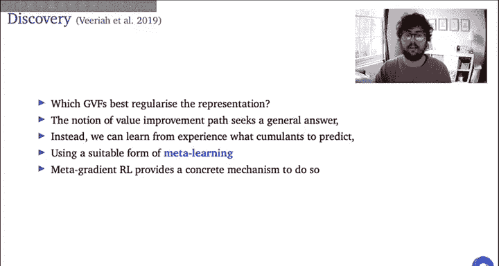

### 分位数回归DQN

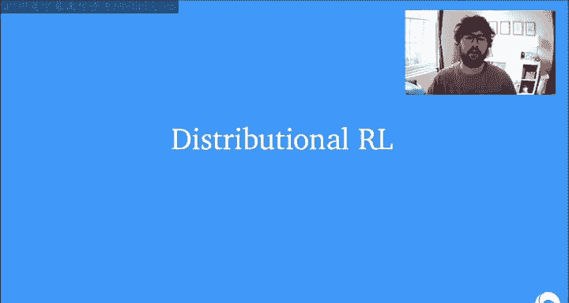

为了超越分类近似中固定支撑集的限制，**分位数回归DQN** 被提出。它调整与一组固定概率（分位数）相关联的支撑点位置，而不是调整固定支撑点的概率。这更加灵活，因为支撑点可以移动以更好地近似分布，并且对初始支撑范围的选择不那么敏感。

当然，还有更多可能的扩展（例如同时调整概率和支撑点），这是一个非常令人兴奋和有趣的研究领域。

---

## 总结

本节课我们一起学习了深度强化学习中改进表示学习的两种核心方法。

首先，我们深入探讨了 **通用价值函数**，它通过让智能体预测关于世界各种不同标量信号的累积和，来构建更丰富的知识。我们学习了如何将GVF的预测直接用作状态表示，或者更常见地，将其作为 **辅助任务** 来正则化和丰富共享的隐藏表示。我们还讨论了在多任务学习环境中平衡不同预测任务的重要性，并介绍了 **Pop-Art算法** 来自适应地归一化目标值，以实现稳定的多任务学习。

其次，我们介绍了 **分布式强化学习** 的概念，即学习回报的完整分布而不仅仅是其期望值。我们了解了 **分类DQN** 和 **分位数回归DQN** 这两种将时序差分算法扩展到分布设置的方法，它们通过提供更丰富的学习信号来潜在地改善表示和学习效果。

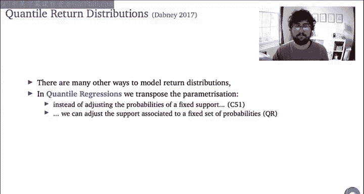

最后，我们简要探讨了GVF学习中的一些开放问题，包括 **离策略学习**、**跨预测的泛化** 以及 **GVF的自动发现**。这些领域代表了深度强化学习当前的前沿研究方向。