# 001：降维技术基础

在本节课中，我们将要学习降维技术的基础概念。我们将探讨什么是降维、为何需要降维，并介绍一些关键术语，如流形学习和维度灾难。通过本课，您将对后续深入学习具体的降维方法打下坚实的基础。

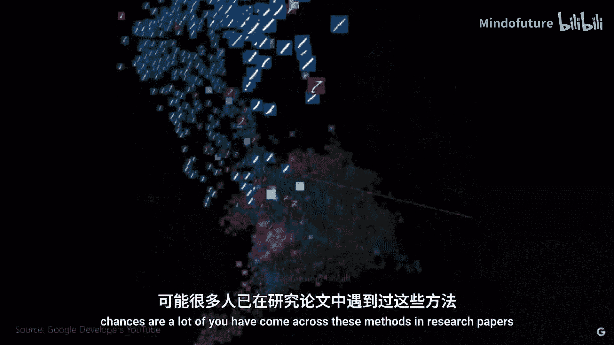

## 概述与目标

欢迎来到本系列视频。我们将探索四种不同的降维技术。

许多读者可能在研究论文或实际机器学习项目中接触过这些方法。但您是否曾想过它们背后的原理是什么？如果您对此感到好奇，那么您来对地方了。在接下来的课程中，我们将深入探讨每一种技术，并辅以一些实践体验。我们的目标是让您获得正确的理解，从而能够为您的具体问题选择合适的方法。

## 什么是降维及其重要性

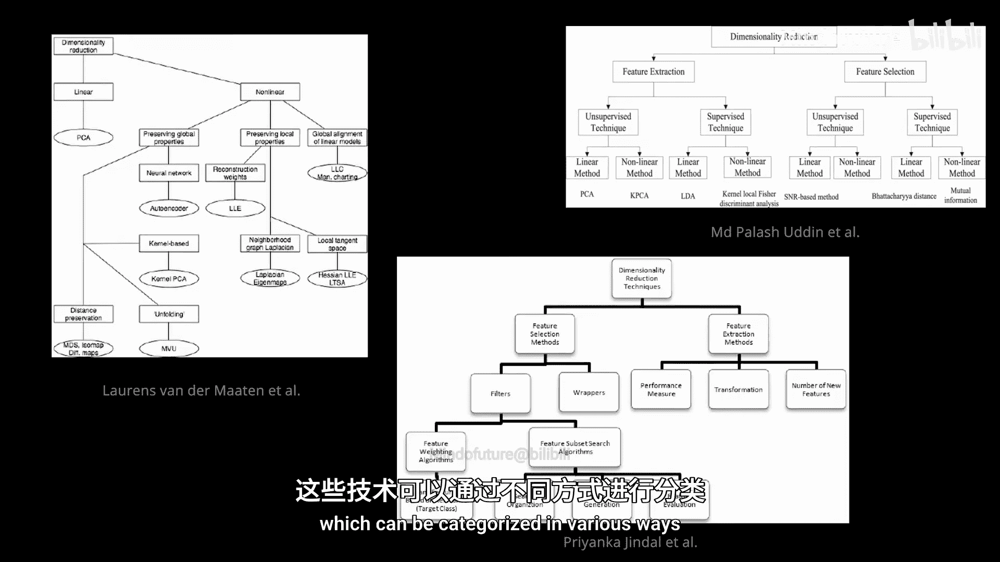

从图像数据（如MNIST手写数字）到语言模型中的词嵌入，再到分子空间，我们经常遇到高维数据。我们试图更好地理解和可视化这些数据。人类的感知能力局限于三维空间，因此多变量或多维数据需要被转换到更低维、可描绘且易于理解的空间。

例如，图像像素有数千个维度，但左上角的图表成功地将MNIST数据集进行了聚类展示。因此，这些技术对于数据分析至关重要。在本系列中，我主要关注使用这些技术来可视化数据（通常是嵌入向量）。当然，降维也常用于减少特征维度以提升机器学习算法的性能。

## 降维技术的分类

为了创建这些低维表示，我们可以从多种技术中选择，这些技术可以按不同方式分类。这里我们主要区分线性方法和非线性方法。

非线性方法属于**流形学习**的范畴。流形学习可以进一步分为局部技术和全局技术，这取决于它们是仅关注数据点的邻域，还是考虑整个数据集。

以下是本系列将讨论的技术概览：
*   **线性方法**：我们将讨论主成分分析（PCA），这可能是大家最熟悉的方法。我们还将讨论多维尺度分析（MDS）的线性变体，称为度量MDS。
*   **全局非线性方法**：我们将讨论MDS的非线性变体，称为非度量MDS。
*   **局部流形学习方法**：我们将探讨流行的t-SNE方法。
*   **介于局部与全局之间的方法**：我们将讨论UMAP。

当然，除了这里提到的，还有很多其他技术（包括基于神经网络的技术，如自编码器），但这超出了本系列的范围。希望这个分类能为您提供一个粗略的概览。

## 降维的数学概念

现在，让我们快速回顾一下降维的整体概念。我们可以用数学方式来阐述这个想法。

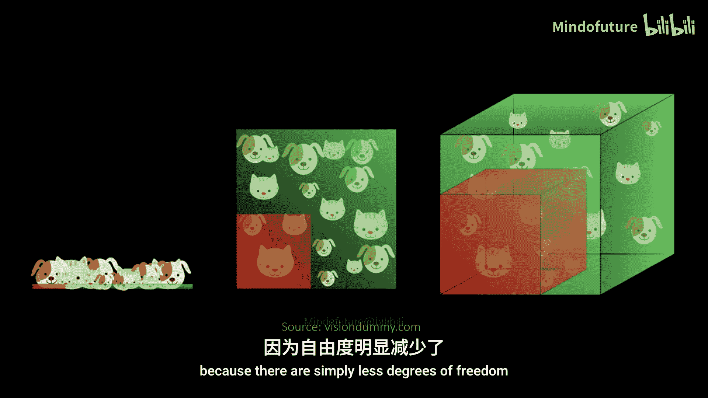

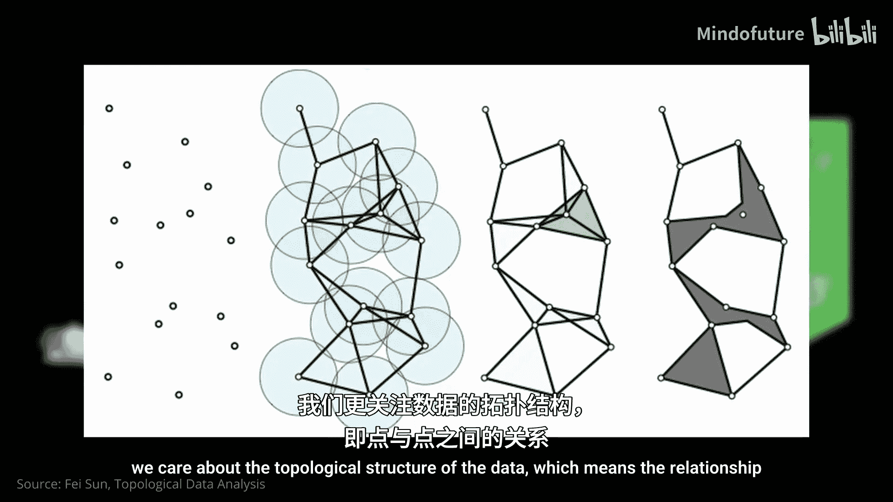

我们从一个高维数据集开始，例如，包含N个样本，每个样本的维度为M。这里的维度简单来说就是描述一个数据点所需的坐标数量。在这个例子中，M等于10。这是原始数据空间。我们假设存在一个度量标准 `D_M`，可以定义数据点在这个空间中的相似性。

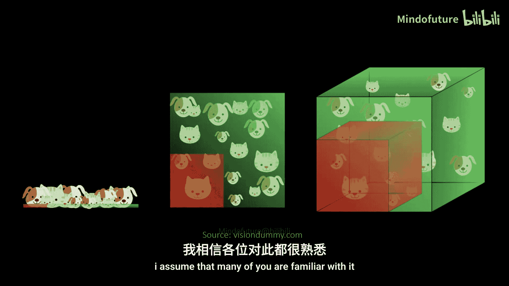

我们的目标是将这些数据点转换成一个低维表示（例如，为了可视化）。在这个例子中，我们选择二维，并将转换后的样本称为 `y`。在这个二维空间中，我们也有一个度量标准 `D_2` 来量化数据相似性。

大多数降维方法的核心思想是优化一个映射函数，该函数将高维数据转换到低维空间，同时（这是关键部分）**保持距离度量的比例关系**，从而近似原始数据空间。

当然，将10维的所有信息压缩到2维是不可能的，因为自由度减少了。因此，这种映射会存在固有的误差。大多数时候，数据中包含的实际信息不那么相关，我们更关心数据的**拓扑结构**，即数据点在空间中是如何排列和相互关联的。

## 维度灾难

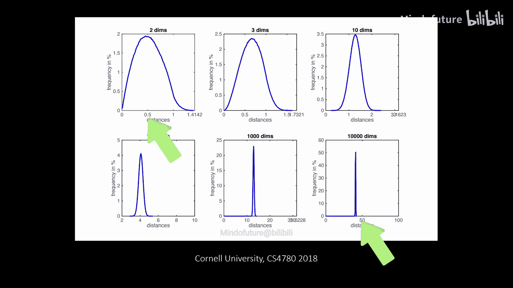

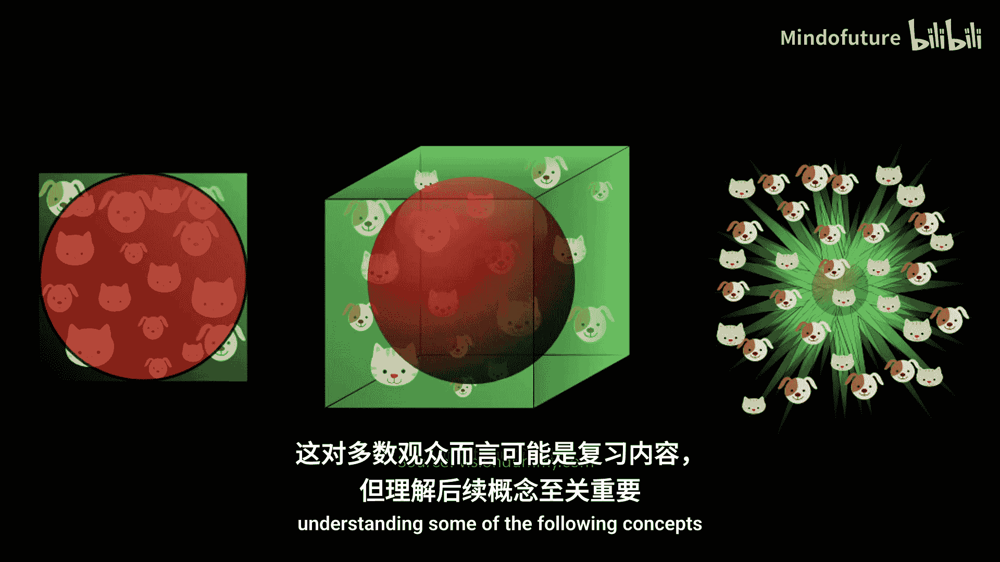

但这里存在一个困难，因为所有这些都是基于距离度量的。

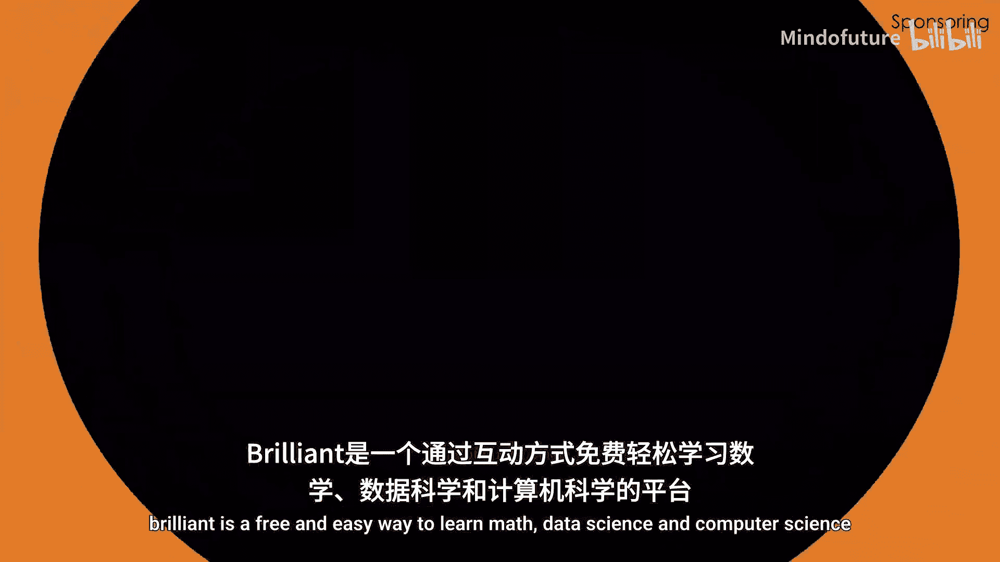

一些有趣的研究（例如，关于高维空间中距离度量惊人行为的论文）指出，距离度量在高维空间中变得不那么有意义。

所谓的**维度灾难**由贝尔曼在1961年提出，精确描述了这里发生的情况。我假设许多读者对此已经熟悉。

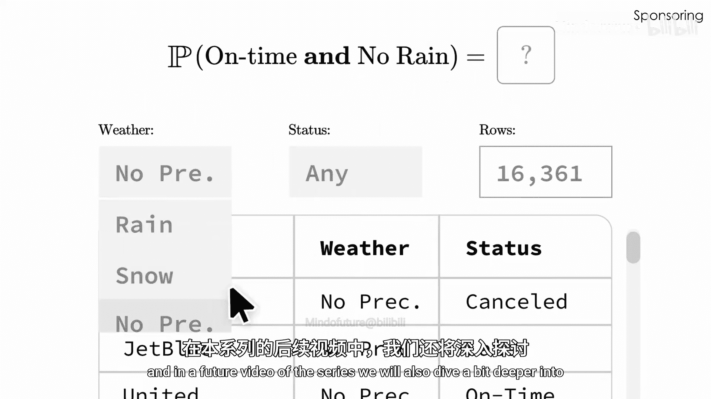

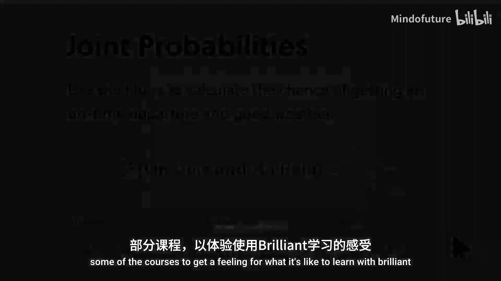

基本上，维度数量越高，距离分布就越均匀。这对于欧几里得度量尤其明显。这种**距离集中**现象也是许多机器学习算法在数据点维度过多时难以区分数据的原因之一。因此，拥有更多特征并不总是更好。

您还可以看到，距离的绝对值变得更大，这意味着维度越多，点与点之间的距离就越远。从视觉上看，这反映了一个众所周知的事实：大多数数据分布在数据空间的“外壳”和边缘，而不是集中在体积内部。这些可视化图来自visiondmy.com上一个关于维度灾难的优秀教程，链接在视频描述中。

这对大多数读者来说可能只是复习，但对于理解后续的一些概念至关重要。

## 非均匀性的恩赐与流形假设

上一节我们介绍了处理高维数据时遇到的“维度灾难”难题。本节中我们来看看解决这个问题的希望所在：数据在现实中可能具有比原始数据空间更低的**本征维度**。

与维度灾难相对的效果是所谓的**非均匀性的恩赐**。这意味着数据在原始空间中通常不是均匀分布的，因此可以被降维到一个更低维的空间。

有一个非常直观的例子：人脸图像。人脸图像由数千个像素组成，这些像素跨越了一个高维空间。非均匀性的恩赐告诉我们，大多数现实世界的数据集并非均匀分布。对于人脸图像，这意味着我们在像素空间中观察到特定的集中区域。当我们意识到可以用很少的属性（如头发特征、嘴唇形状等）来描述人脸时，这一点就更加明显了。这意味着人脸具有**内在的低维度**，因此真正相关的信息存在于更低维的空间中。有一篇关于寻找图像表示本征维度的很酷的论文，链接在视频描述中。

所谓的**流形**是从数学角度理解这一切的一个有用框架。像我们刚才看到的人脸图像这样的数据，嵌入在一个多维空间（也称为**环境空间**）中。然而，数据本身实际上可能位于一个可以在更小维度空间中找到的表面上。这样的拓扑空间被称为**流形**。这个术语源于数学家黎曼，他用它来指代可以以独特方式折叠的各种拓扑空间。

从数学上讲，流形是对平坦几何表面的描述，它在局部表现得像欧几里得空间。这意味着在流形上移动很容易，因为其邻域总是表现良好。流形有不同的类型，也有具有特定名称的流形。事实上，您可以找到大量不同类型的集合，但本视频不会深入细节，这只是给您一些概念。

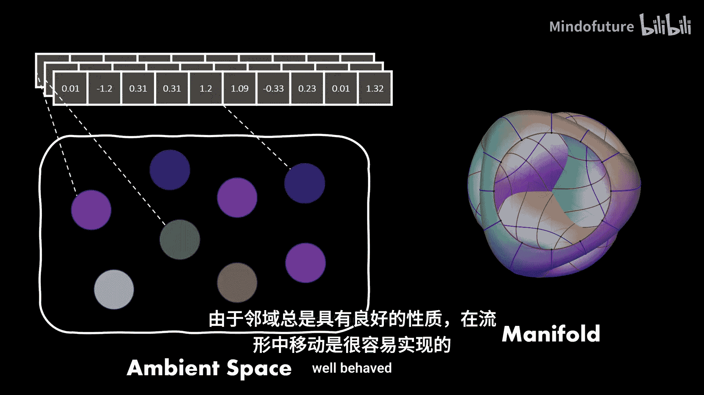

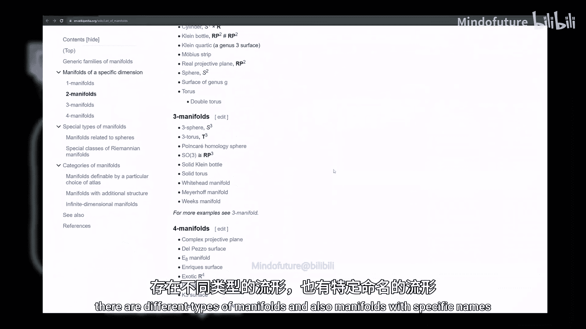

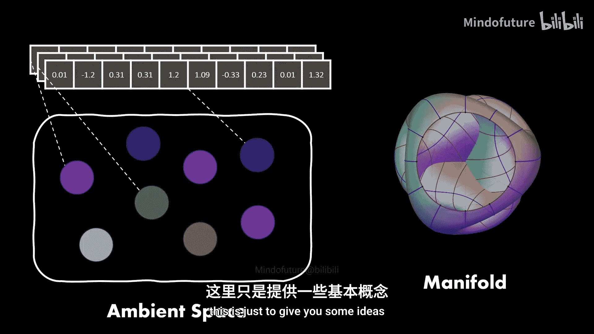

一维流形是线和圆，二维流形是球面或平面，当然，最著名的流形可能是地球。您在这里看到的**瑞士卷数据集**是评估降维技术的基准。

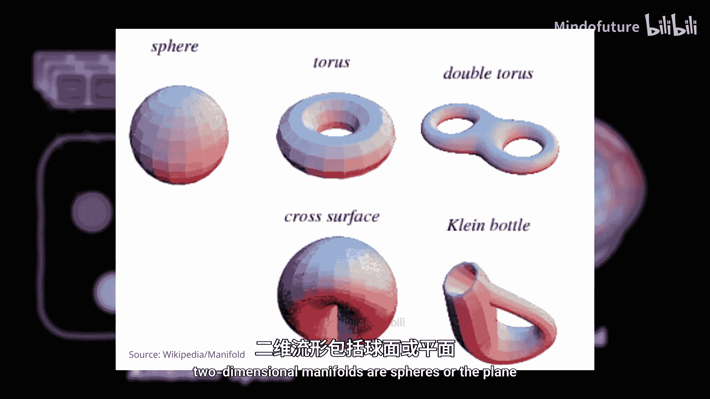

它之所以叫这个名字，是因为它看起来像美味的瑞士蛋糕卷（有多种口味）。无论如何，在左侧，数据嵌入在三维空间中并形成一个弯曲的流形。我们也说数据位于这个流形上。一个成功的流形学习算法能够将数据“展开”成右侧的形状，即更低维的二维平面流形。在许多情况下，数据在特定的流形上可以更有效地分离，从而提升机器学习算法的性能。

我刚才描述的也被称为**流形假设**。该假设认为，许多高维数据集实际上位于低维的**潜在流形**上。“潜在”是这里的关键词，因为我们通常不知道它们看起来是什么样子。这就是为什么本系列涵盖的一些技术属于流形学习方法类别，因为它们旨在近似潜在的低维流形。

## 实际应用示例

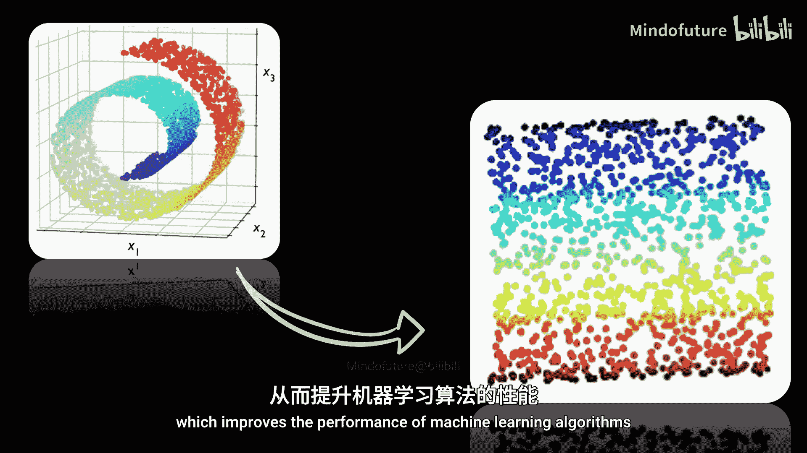

在最后一分钟，让我们看一些随机选取的降维技术在实际世界中的应用。

*   **计算生物学**：多种方法被用于基因表达数据集。例如，有论文使用UMAP来分析基因相互作用和基因聚类。我认为这是理解数据的一种非常好的方式。
*   **无监督异常检测**：降维不仅应用于有监督场景，有时所有数据都被投影到更低维度，然后应用聚类。这里有一个在时间序列数据上进行的供暖系统无监督异常检测的例子。
*   **金融市场分析**：最后一个例子表明降维几乎可以应用于任何数据集。这是使用不同降维算法对道琼斯指数进行的分析。不同的聚类表明了具有某些市场动态行为特征的数据点，例如股市崩盘或疫情。总体而言，这是在低维流形上保留拓扑信息的一个很好的例子。

## 总结

最后，以下是本次简短介绍的三个要点：

1.  **技术分类**：存在线性和非线性，以及全局和局部的技术来执行降维。
2.  **核心目标**：降维试图在保留数据结构的同时，将高维数据转换到低维空间。
3.  **流形假设**：数据可能位于低维流形上，我们可以尝试学习这些流形。

本节课中我们一起学习了降维的基础概念、面临的挑战（维度灾难）以及潜在的解决方案（流形学习）。在下一课中，我们将探讨主成分分析（PCA），这可能是最流行的降维技术。感谢观看，下次再见。

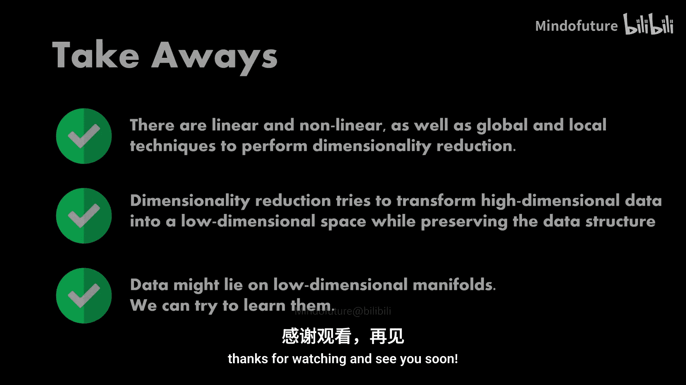

