# 002：主成分分析（PCA）🧠

在本节课中，我们将要学习一种经典且强大的降维技术——主成分分析。我们将从直观理解开始，逐步深入到算法细节，最后通过一个实际数据集的应用来巩固所学知识。

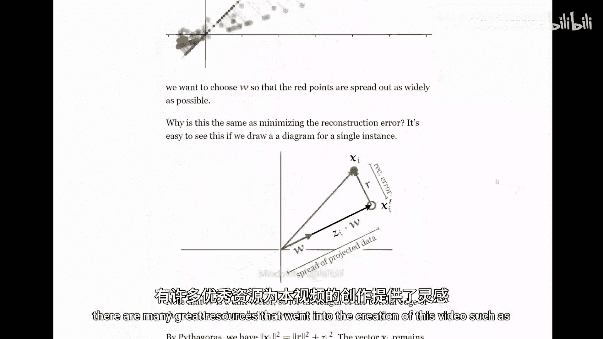

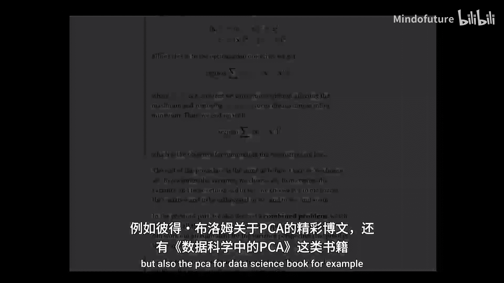

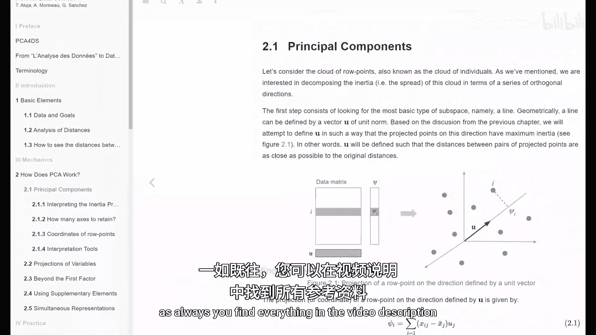

## 概述与直观理解 🎯

上一节我们介绍了降维的基本概念，本节中我们来看看最著名的方法之一：主成分分析。该方法由卡尔·皮尔逊于1901年首次提出。

为了建立对PCA工作原理的概念性理解，我们假设有一组观测数据。为了简化，我们只考虑两个维度：X1和X2。以表格形式呈现的数据可能如下所示。

PCA的核心思想是通过寻找所谓的**主成分**来减少维度数量。这些主成分互不相关，我们只保留信息量最大的那些以实现降维。我们很快会了解更多关于它们的信息。在这里，我们选择不多，因此我们将把二维数据降为一维。

如果你读过其他PCA教程，很可能听说过该技术试图尽可能多地保留数据中的方差。这听起来有些抽象，因此我们构建一个小例子来更好地理解它。

这个数据集代表城市规模（X1）与生活成本（X2）的相对关系。我们立即观察到这些数据存在冗余，因为在大多数情况下，城市规模与生活成本相关。因此，基本上一个值可以从另一个值计算出来。

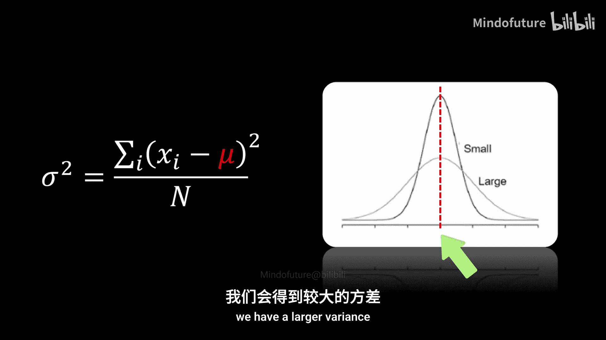

我们将突出显示两个数据点：罗马，它比其他大城市便宜得多；以及纽约市，它相当昂贵，但也相当大。这些只是虚构的例子。

你如何将这个数据集压缩到单一维度，同时尽可能多地保留信息？这里的信息主要是数据点之间的关系。你可以只使用X1，它反映了城市规模；也可以只使用X2，它反映了生活成本。事实上，有很多选择。我们也可以使用这条线作为新轴，或者使用那条线。那么，哪一条更好呢？

显然，绿线在某种程度上捕获了更多的数据。这种分布也可以通过计算方差来衡量。

**方差**的公式定义如下：我们从所有值中减去均值，然后平方以使距离为正，将结果求和并除以样本数量。总体而言，方差是衡量数据分布离散程度的指标。当数据点远离分布中心时，我们会有较大的方差；当它们更接近中心时，方差较小。

回到我们的数据集，让我们看看两个新轴的方差。较长的轴具有相当大的方差，而较短的轴方差也较小，因为沿该轴的分布较少。

现在，当我们查看数据沿这些轴的分布时，可以更清楚地看到方差。当然，这些分布图并不完全精确，只是一个草图。

一开始我们说过，我们想把二维数据降为一维，现在开始做。这可以通过将数据投影到新轴上来完成。我们稍后会看到在实践中如何进行这种投影。

现在，我们所有的数据点都位于单一维度上。我们原始的每个二维数据点都被分配了沿该轴的一个值。以表格形式呈现，看起来会是这样。

当我们回想起一开始的城市——罗马和纽约市时，我们看到左边的轴更多地捕获了数据点之间的关系，而右边的轴则显得拥挤。事实上，方差为0的极端情况意味着所有点在一个轴上的值都相同。当然，当所有数据点看起来都一样时，很难区分它们，因此，方差可以作为数据中信息量的一个衡量指标。

我们在这里看到的是数据集的两个**主成分**。它们都捕获了关于城市规模和生活成本的信息。因此，你可以将这些轴看作是我们原始特征的组合。但有趣的是，这些组合甚至比单个特征捕获了更多的信息。这就是为什么它们被称为“主”成分。它们是数据集中的主轴。

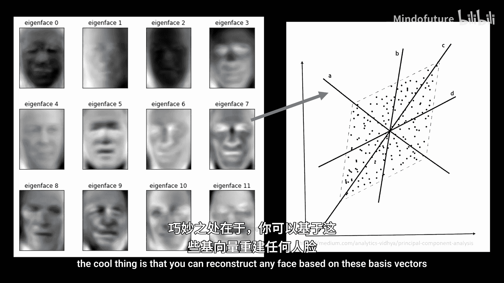

我选择这两个轴并非巧合，因为它们共同捕获了数据中的所有信息。这可以在所谓的**碎石图**中显示，该图显示了每个主成分解释的方差。

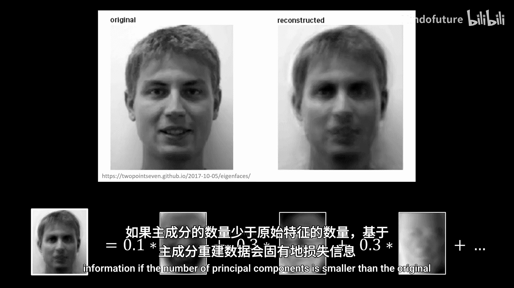

现在，降维开始发挥作用。通常，我们只保留那些能保留数据中大部分方差的主成分。因此，在这里我们只保留第一个主成分，仍然拥有二维情况下90%的信息。换句话说，我们丢弃信息量较少的主成分。

在实践中，这意味着所有点都被投影到这个新轴上。然后我们可以去掉两个原始特征，只使用新轴。我们选定的主成分在低维空间中总结了我们的数据集。

当然，我们可以将这个原理扩展到许多维度，例如高维图像。这是人脸图像数据集主成分的一个例子。将它们想象成穿越像素空间，捕获了人脸之间的大部分变化。通常，这些是面部特征，如鼻子的形状等。记住，在介绍视频中，我说过人脸可以降低到其较低的内在维度。这正是PCA在这里所做的。人脸图像的主成分被称为**特征脸**，因为它们对应于人脸图像空间的特征向量。我们稍后会了解更多。

很酷的一点是，你可以基于这些空间向量重建任何人脸。这是一个例子。图像被重建为特征脸的线性组合。当然，如果主成分的数量少于原始特征的数量，基于主成分重建数据会固有地损失一些信息。

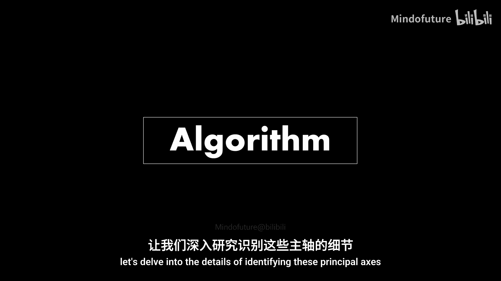

我也喜欢Peter Bloom的这个可视化。它显示了沿着一个主成分或特征脸行走时，面部特征如何变化。这就像沿着我们之前例子中新创建的轴行走一样。

主成分彼此**正交**，否则它们会捕获相关的信息。更具体地说，它们形成了一个正交基，我们将在本视频后面了解更多。从技术上讲，PCA将数据投影到一个新的坐标系中，其中轴是主成分，这被称为**基变换**，因为它平移、旋转或缩放观测值。这也意味着对于一个n维数据集，我们最终会得到n个主成分，通常我们只保留最有价值的那几个。

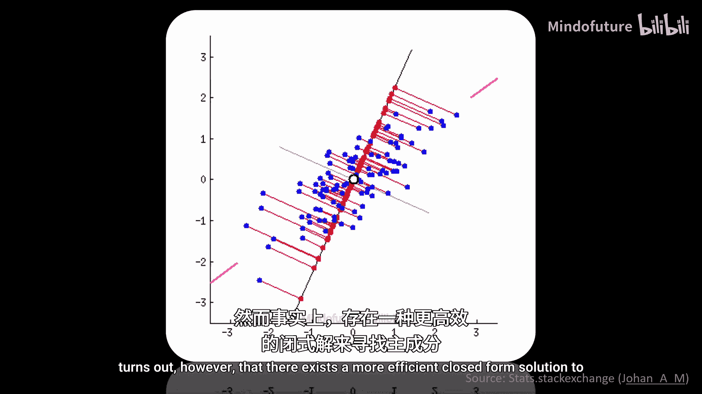

最后一点说明，经典的PCA是一种**线性方法**，因为我们只允许为这个数据集绘制直线。使用这样的曲线轴可以捕获更多的方差，但这是不可能的。不过，有一个扩展叫做**核PCA**，它也允许执行非线性降维，但我们不会在本视频中涵盖。

## 算法细节 🔍

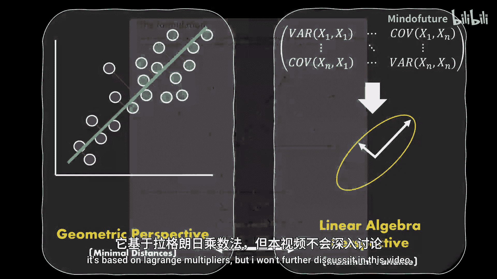

现在我们已经对PCA有了全面的理解，让我们深入探讨识别这些主轴的细节。

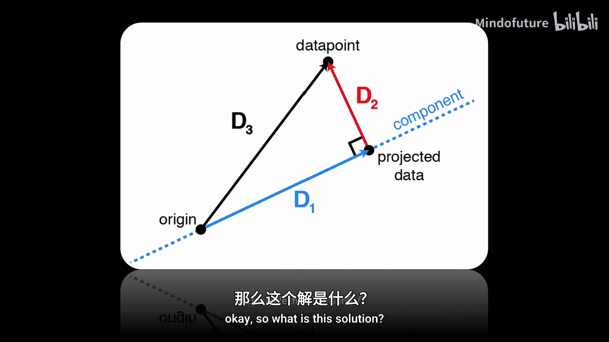

从几何上讲，我们寻找的是到所有点距离最小的线。这个动画很好地展示了这一点。当我们将数据投影到这条最佳拟合线上时，就像我们之前做的那样，我们保留了高维空间中的大部分信息。在高维中，这些线变成了平面或超平面。

你可能想到的第一个想法是，我们需要执行某种优化，比如最小化平方距离之和，就像在线性回归中做的那样。原则上我们可以这样做，例如，用梯度下降拟合一条线。然而，事实证明，存在一种更高效的、寻找主成分的闭式解。

在解释PCA时，有许多不同的方法来探讨这项技术。一些解释是几何解释：我们试图找到距离最小的线。另一些则涉及大量线性代数，还有一些讨论寻找最大方差的方向。一开始可能很难接受所有这些观点都指向寻找主成分的同一方式。事实上，最小化平方距离等同于最大化方差。在视频描述中，我放了一篇很好的博客文章，详细地从数学上推导了这个结果。它基于拉格朗日乘数法，但我不会在本视频中进一步讨论。

与其从数学上推导，我们来看看Alex Williams的这个直观可视化。沿主轴的方差分布在这里用蓝色显示。数据点到轴的距离用红色显示。利用勾股定理，我们意识到最大方差和最小距离是同时达到的，因此我们选择哪个视角并不重要。事实上，所有优化问题最终都会得到相同的解。

那么，这个解是什么？寻找主成分的高效闭式解从**协方差矩阵**开始。这在数学解中自然出现。协方差矩阵在对角线上显示变量的方差，在非对角位置显示变量之间的协方差。变量可以是生活成本和城市规模，就像开头的例子一样。两个变量之间的协方差是它们各自偏离均值的乘积之和除以观测数量，如公式所示。它告诉我们特征之间的关系，通常表示两个变量的共变，即它们是否朝同一方向移动。为了完整性，它与相关性的区别在于，相关性衡量关系的强度和方向，而协方差只衡量方向。相关性也被称为归一化协方差，但这一点目前不太重要。

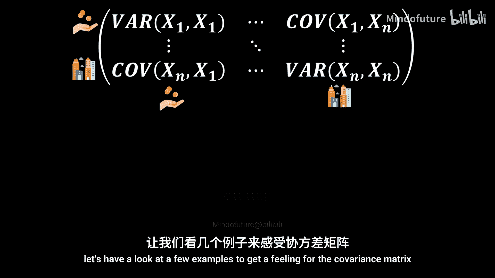

由于我们对最大方差的方向感兴趣，查看由该矩阵表示的数据集变异性是完全合理的。让我们看几个例子来感受一下协方差矩阵。对于这个数据集，特征X2的方差略高，为1.3，并且两个变量朝同一方向移动，因此变量之间的协方差也很高。正如你所见，协方差矩阵沿对角线对称。

这个例子显示每个变量的方差略低，并且没有明显的趋势表明它们如何一起移动。因此，协方差相当低。这意味着知道一个特征的值并不能告诉我们太多关于另一个特征的信息。

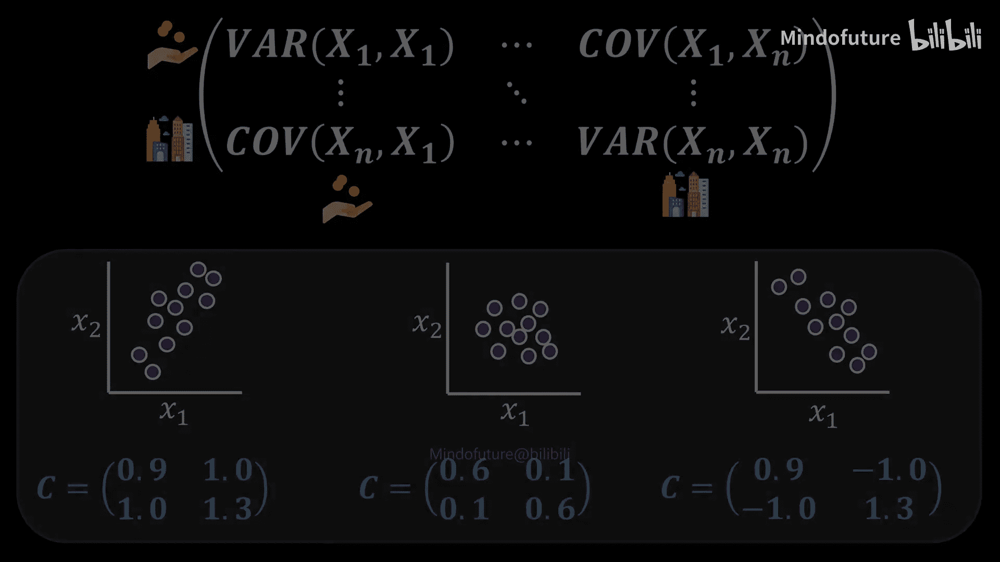

最后，这里我们有与第一个例子相同的方差，但协方差为负，因为我们有一个共同的负趋势。

所以，这里的要点是，协方差矩阵告诉我们变量的方差和共同方向。在我们继续讨论为什么协方差矩阵与寻找主成分相关之前，让我们讨论一些理解后续要点所需的线性代数基础知识。

在坐标系中，点通常用每个轴的值来描述。如果我们写（1, 2），它无非是1乘以第一个基向量加上2乘以第二个基向量。这使得数据点本身无非就是向量。

现在，每个矩阵都可以与一个线性变换相关联，例如，平移或旋转作为数据点的向量。例如，如果我们有这个矩阵并将其与我们的数据点向量相乘，我们可以使用通用的矩阵乘法规则来计算变换。这意味着每一行都与数据点的坐标相乘，从而将数据点移动到新位置。

让我们对左边的点进行这个操作。当我们将它们代入上面的表达式时，我们最终到达这些新位置。原始数据空间由单位向量张成，看起来像这样。当我们可视化目标空间时，我们看到顶部矩阵正在执行哪种变换。它将我们的所有数据点从单位球体拉伸并缩放到右边的椭圆空间。

现在，线性变换具有一些独特的特征，其中一个关键特征可以用所谓的**特征向量**来描述。这些是在变换下不改变方向的向量。假设我们有这个红色和蓝色的向量，并应用矩阵变换，从而将向量移动到这些位置。在这里，红色向量在变换后仍然指向完全相同的方向，而蓝色向量指向其他地方。红色向量就是我们所说的特征向量，因为它在变换下不改变方向。此外，向量的长度对应于所谓的**特征值**，它是衡量向量方向拉伸强度的指标。

特征向量一个非常直观的例子是，当你将手臂指向空中并转圈时，你的手臂就是旋转变换的特征向量，因为它不改变方向。

更正式地说，特征向量方程如下所示。它表明，将特征向量 **v** 与矩阵 **A** 相乘，得到的结果与将特征向量与相应的特征值相乘相同。因此，向量的方向不受影响。唯一发生的是它乘以某个标量，就像我们在前面的例子中看到的那样。通常，这被称为矩阵的对角化，因为我们可以用特征值的对角矩阵来代替我们顶部的矩阵进行乘法运算。稍后，我们也会简要讨论如何计算特征向量和特征值。

有了这些知识，我们现在可以讨论如何基于协方差矩阵找到主成分。根据一个称为**谱定理**的定理，任何对称矩阵，如协方差矩阵，总是有实特征向量和特征值。矩阵所有特征值的集合也称为矩阵的谱，这就是定理名称的由来。这意味着每个协方差矩阵都可以对角化，而对PCA来说，令人惊奇的是，协方差矩阵的特征向量对应于主成分，即具有最高方差的方向。而特征值对应于每个主成分解释的方差。

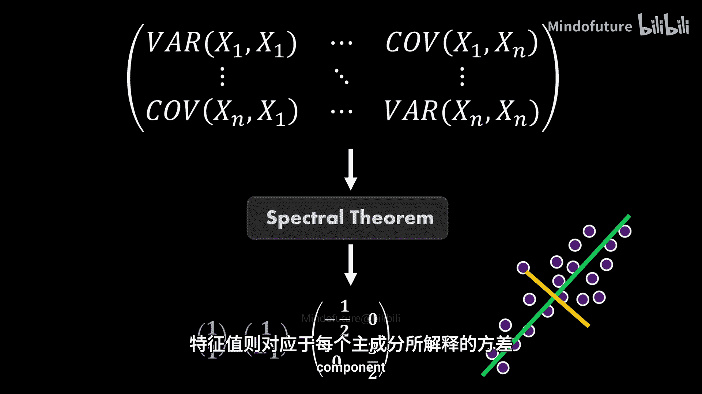

那么，这个令人惊讶的事实从何而来？协方差矩阵公式自然源于我们想要解决的数学优化问题。这里我不会进一步深入细节，但如果你有兴趣了解数学公式的样子，请查看我添加到视频描述中的链接。

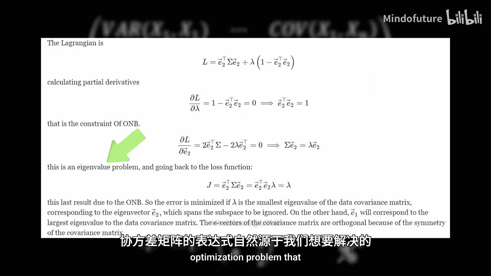

## PCA算法步骤 📝

现在我们应该准备好一切，快速浏览PCA算法的每个步骤。

第一步是**中心化数据**。中心化数据意味着数据恰好位于坐标系的原点。这可以通过减去每个特征的均值来实现。一些实现还会缩放数据，使其具有单位方差。这样做的原因是为了让每个变量有相同的贡献。可以想象，只有当每个轴的范围相同时，所有的投影才能正常工作。

第二步是**计算协方差矩阵**。正如我们现在所知，协方差矩阵有助于我们找到识别最高方差方向的闭式解。它告诉我们变量的方差以及变量之间的协方差，即变量在多大程度上一起变化。公式中，顶部显示方差，底部显示协方差。在两个表达式中，x̄ 代表相应变量的均值向量。

第三步是**特征值分解**。正如我们所学，由于协方差矩阵是对称矩阵，应用谱定理，协方差矩阵可以对角化。特征向量对应于主成分，特征值对应于沿向量的方差。这是一个可能看起来像的例子。这两个向量是两个主成分，也是协方差矩阵的特征向量。蓝色值是特征值。正如你所见，主成分1的分布大约是主成分2的三倍。

但我们实际上如何计算特征向量呢？这种特征分解是通过一些线性代数进行的，从求解矩阵的特征多项式开始。最后，我必须诚实地告诉你，当你使用你最喜欢的编程库计算PCA时，在实践中很可能不会执行特征分解，而是计算**奇异值分解**。

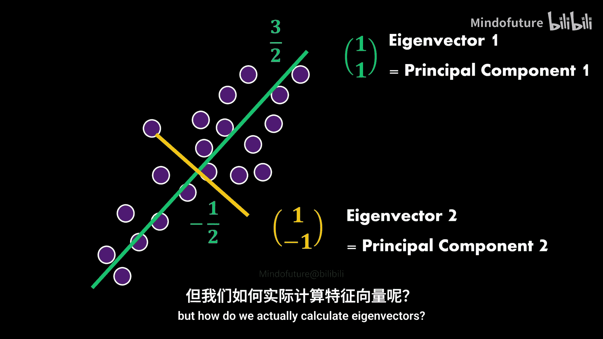

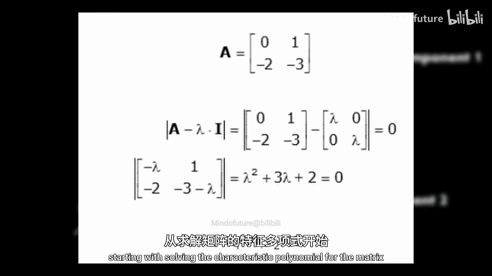

可能最关键的原因是这两种方法的运行时复杂度。特征分解具有立方复杂度，而奇异值分解的复杂度要小得多，具体取决于数据矩阵的形状。SVD是一种更通用的矩阵分解技术，也可以处理矩形矩阵。记住，特征分解只适用于方阵。它在PCA之外还有许多其他应用。它计算奇异值和奇异向量，就像特征值和特征向量一样。

当在数据集上使用SVD时，我们不必计算协方差矩阵，因为我们可以直接将其应用于数据集。这是SVD通常更快的另一个原因。当然，SVD和特征分解的结果是相同的。

那么，这是否意味着我们完全不需要特征分解呢？不完全是这样。记得我在开头谈到核PCA时，为了学习非线性主成分，数据使用核函数进行映射。在这种情况下，奇异值分解不能自然地扩展到非线性映射，我们需要利用协方差矩阵的特征分解。

好的，最后一步是使用特征向量将数据投影到新轴上。对于我们开头的例子，这个投影执行如下：我们取我们的二维数据矩阵，乘以计算出的特征向量或主成分，得到在主成分轴上的变换后数据。这正是我们在这里看到的。这是相应的数据。

对称矩阵总是有正交的特征向量。这就是为什么主成分彼此正交的原因。所以它们是直角相交的。因为它们正交，也意味着它们没有相关性。这就是为什么PCA被认为将数据投影到一个去相关的基上。

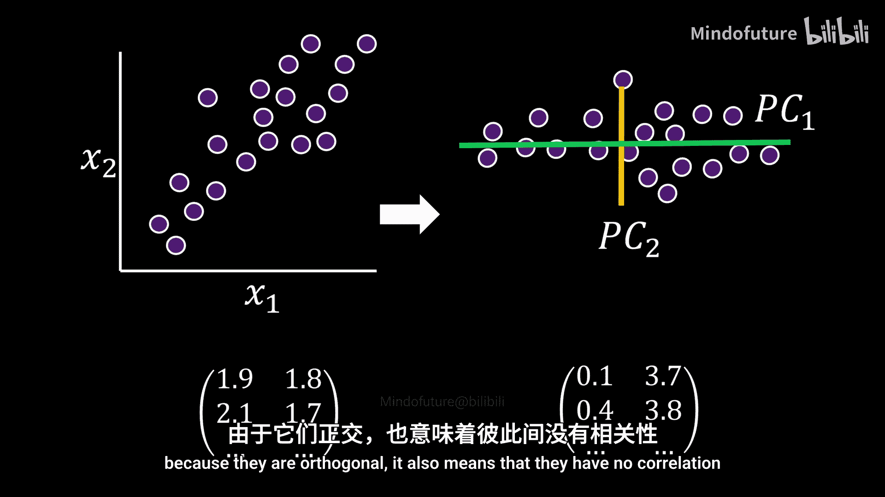

从数学上证明这一点也相当容易，为此，你可以在视频描述中找到另一个链接。

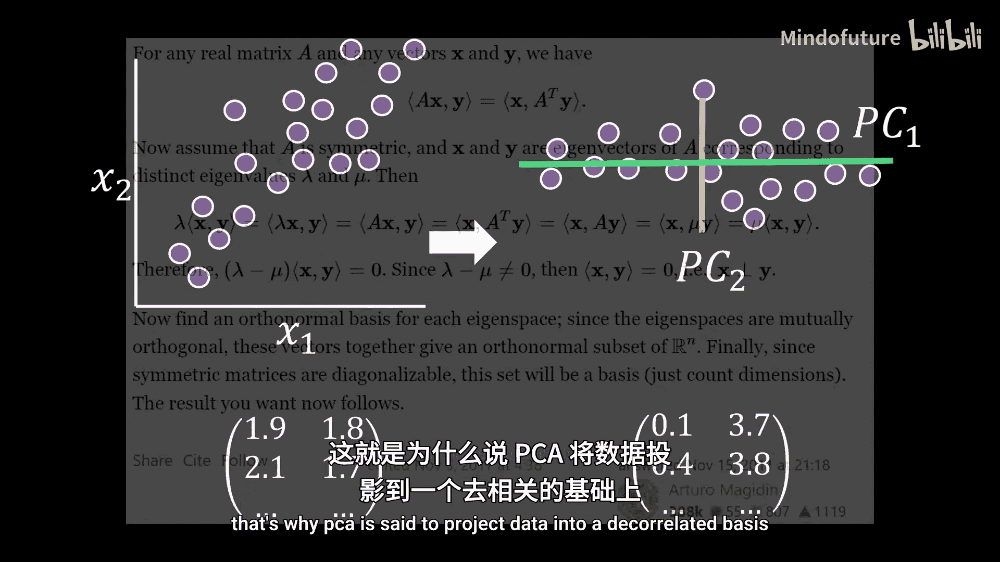

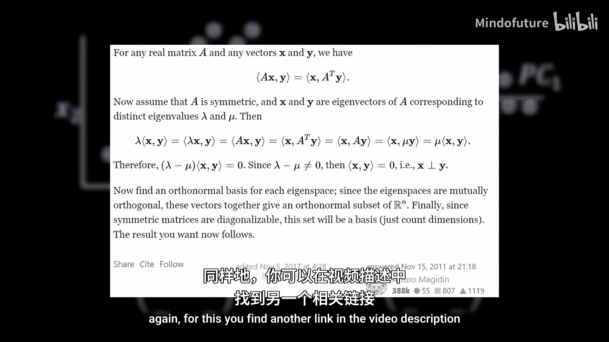

显然，我们想要降低维度。因此，我们只投影到具有最高方差的主成分上。这可以使用特征值来确定。所以，我们再次取数据矩阵，只选择具有最高特征值的特征向量，并获得在第一个主成分上的投影。我们最终得到这些投影。这是相应的数据。这就是完整的图景。

现在，让我们继续并将其应用于一个真实的数据集。

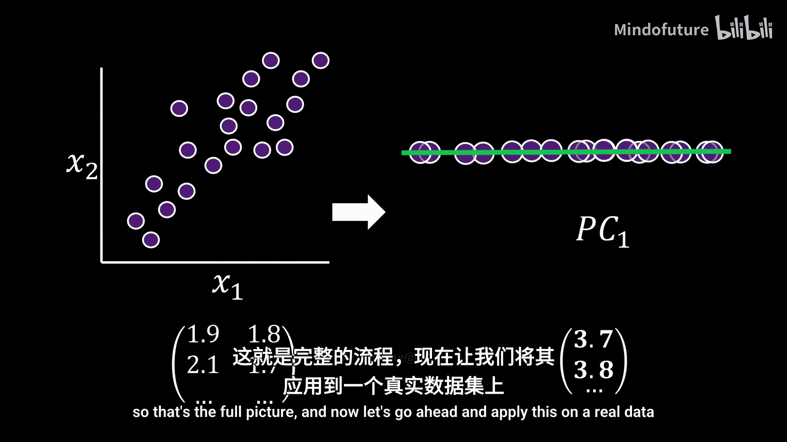

## 实际应用与总结 📊

好的，这是笔记本，你可以在描述中找到链接。我选择了Scikit-learn中的一个葡萄酒数据集，这个葡萄酒数据集有一系列描述葡萄酒不同特征的变量，我们有三个类别的葡萄酒。我不完全知道它们代表什么，但总体而言，我们大约有200个数据点和13个特征。

现在这里我定义了两个函数。一个是构建简单的Seaborn散点图。另一个是使用iVolume，一个非常棒的库来创建3D可视化。让我们运行它，如果尚未安装，它也会自动安装iVolume。

现在从第一种技术开始，我只想在这里指出，你也可以使用NumPy通过这个线性代数包来计算特征值和特征向量，并且可以使用numpy.cov来计算协方差矩阵。这里是协方差矩阵前三个特征向量和特征值的例子。

好的，现在二维投影非常简单，当然我们使用最简单的包，也就是Scikit-learn，这里我们导入PCA。正如你所见，它从decomposition导入，因为它执行一种分解。具体来说，它执行奇异值分解，正如你在文档中读到的那样。我们还将计时执行过程，以便稍后比较不同的降维技术。现在我们只需调用fit_transform，这将执行奇异值分解，然后我们将其可视化，它会显示这张图片。所以我们在二维空间中有了三个类别。

你可以用这个PCA对象做的是，你还可以使用explained_variance_ratio_和components_来提取特征值和特征向量。这很不错。

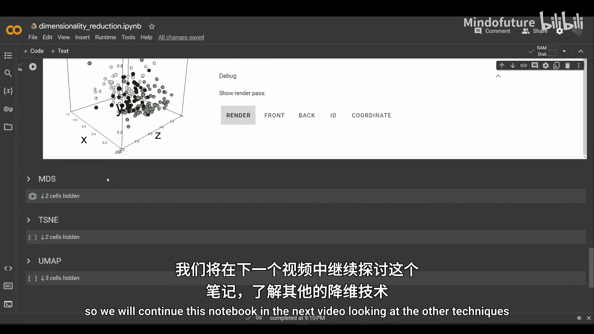

其次，仅仅因为我们有三个维度，我们也使用它们，这样我们也可以制作一个3D图。我喜欢这个库，它对于可视化非常棒。这在某些情况下可能有助于更好地表示数据。

差不多就是这样。我们将在下一个视频中继续这个笔记本，看看其他技术。

为了结束这个视频，我想快速浏览一下这个表格，我们将在其中扩展其他降维技术。对于PCA，我们可以说它是一种**全局技术**，因为我们同时纳入了所有数据。它是**线性的**，因为我们投影到线性主成分上。当然，也有扩展到非线性的方法。它是一种**基于投影的方法**，因为这种分解方法。其主要目的是使用主成分进行数据分析和可视化。它是**确定性的**，当我们重新运行时，会得到相同的结果，这对于所有技术来说并非如此。计算复杂度取决于分解方法，范围从特征值分解的立方复杂度到奇异值分解的平方复杂度。唯一的真正超参数是主成分的数量，这可以通过碎石图来确定。然后关键思想是将协方差矩阵分解为特征向量和特征值。最后，其他一些应用包括去噪、压缩或相关性分析。

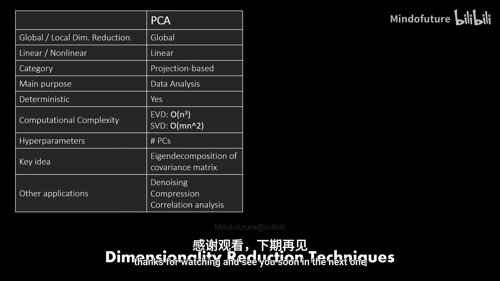

太棒了，这就是本视频中第一种技术的内容。在下一个视频中，我们将看看多维缩放。感谢观看，我们下个视频再见。