# 003：多维尺度分析（MDS）📊

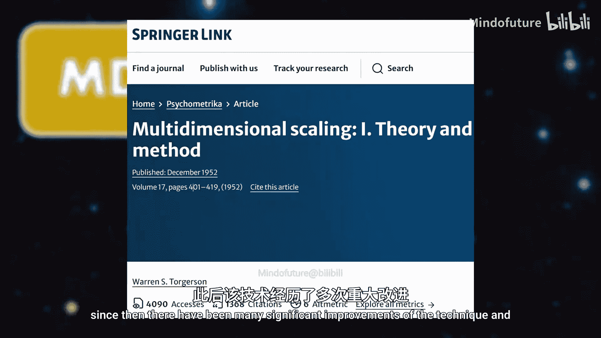

在本节课中，我们将要学习多维尺度分析（MDS）。这是一种基于距离矩阵的降维技术，其核心目标是在低维空间中保持数据点之间的原始距离关系。我们将介绍MDS的三种主要变体：经典MDS、度量MDS和非度量MDS，并探讨它们的算法原理和应用场景。

## 概述与背景

多维尺度分析（MDS）在机器学习中可能不如其他方法流行，但在统计学领域有着深厚的根基，其起源可追溯到20世纪50年代Torgerson的著作。此后，该技术经历了多次重大改进，因此MDS可以被视为一类技术，而非单一方法。

许多上世纪的思想在今天仍然具有现实意义，甚至是现代机器学习的基础。MDS的作者之一Shepard曾提出，将对象表示为空间中的点这一想法，正是现代大型神经网络中嵌入概念的早期版本。因此，了解这些经典方法非常重要。

## MDS的基本概念

对于大多数降维技术，起点是一个数据矩阵，其中列是特征，行是观测值。但MDS有所不同，它假设我们从距离矩阵开始。这个矩阵包含了基于某种距离函数计算的所有点之间的距离。

**距离矩阵** 的元素通常用 **δᵢⱼ** 表示，代表从点 i 到点 j 的距离。MDS的目标是将数据映射到低维空间，同时尽可能保持观测值之间的距离关系。右侧的空间构型旨在反映我们距离矩阵中的距离，这也是其名称的由来——我们将距离“缩放”到右侧的多维空间中。

### 为何从距离开始？

MDS起源于心理测量学，旨在帮助理解人类对相似性的判断。例如，我们可以收集人们对不同情绪对相似性的排名。我们可能没有描述这些情绪的数值特征矩阵，这意味着实际的数据空间对我们来说是潜在的。使用MDS，我们可以仅基于这些距离来可视化情绪空间。

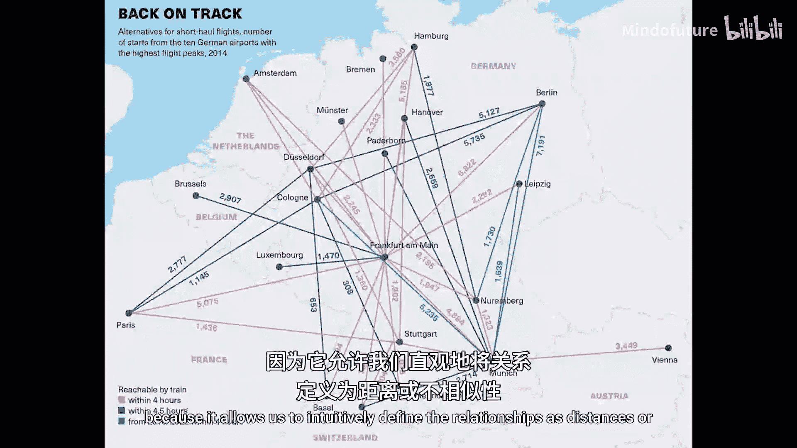

相似性总是可以转换为相异性，而相异性反映了距离。如今MDS通常使用相异性（距离）进行操作。最后，距离矩阵对此方法必须是对称的，因此我们可以仅使用该矩阵的上三角或下三角部分，对角线（点到自身的距离始终为0）可以忽略。

对于 n 个观测值，距离的数量可以使用右侧的高斯求和公式计算：**n(n-1)/2**。

## 数学框架与示例

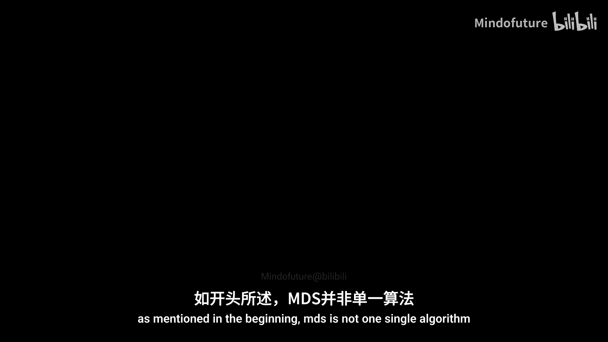

我们将使用一个标准示例来说明MDS：城市间的飞行距离。这很合适，因为它允许我们直观地将关系定义为距离或相异性。

给定一个距离矩阵，任务是找到最优的、保持距离的低维映射。找到这样的映射意味着我们需要在 p 维空间中找到一组向量。具有挑战性的部分是，我们需要根据距离矩阵保持到所有其他点的距离。

如前所述，矩阵中的每个距离通常表示为 **δᵢⱼ**。低维空间中的距离可以表示为 **dᵢⱼ**。MDS的目标是近似距离矩阵，使得每个个体距离 **dᵢⱼ** 都近似于原始矩阵中的距离 **δᵢⱼ**。我们可以使用像平方距离这样的误差度量来优化这个近似。

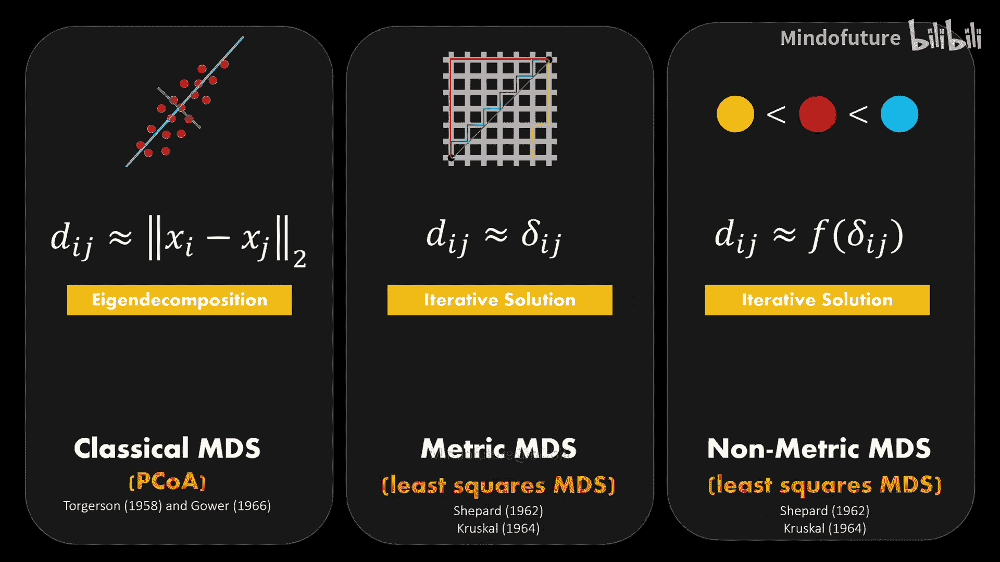

## MDS的三种变体

MDS不是单一的算法，而是一系列方法的集合。在高层次上，主要有以下三个子类别：

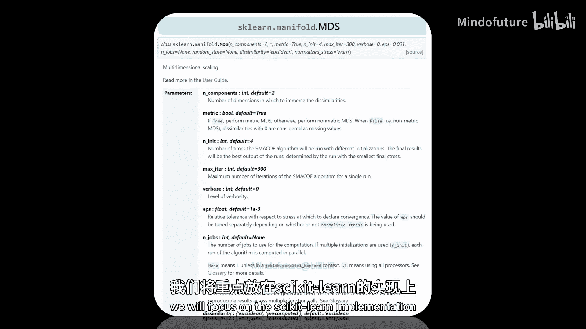

1.  **经典MDS**：由Torgerson和Gower独立发表，与主成分分析（PCA）有很多共同点，因此也被称为主坐标分析。它在底层使用特征分解来寻找最优映射。该投影仅在我们假设距离为欧几里得距离时才有效。
2.  **度量MDS**：主要由Shepard和Kruskal发表，使用迭代算法寻找解。这里的距离可以是非欧几里得的。经典MDS可以看作是度量MDS的一个特例。
3.  **非度量MDS**：用于定性关系的情况。即当我们没有直接的距离信息，只有顺序排名时。对此，会对距离应用单调函数（如升序或降序），并使用迭代优化算法寻找解。

在文献中，符号有时可能令人困惑。在本教程中，我们明确：**δᵢⱼ** 是原始距离，**dᵢⱼ** 是映射空间中的距离，而 **d̂ᵢⱼ** 称为相异性，将在本视频最后部分变得相关。

## 经典多维尺度分析（经典MDS）🔍

经典MDS算法，也称为主坐标分析或Torgerson-Gower MDS，包含三个步骤。首先，我们构造一个所谓的格拉姆矩阵。然后对该格拉姆矩阵进行特征分解。最后，我们将距离投影到新坐标上。

### 步骤详解

**1. 构造格拉姆矩阵**
我们假设距离是欧几里得距离。对于两个向量 **xᵢ** 和 **xⱼ**，欧几里得范数对应于距离的内积或标量积。关键点在于，我们的情况正好相反：我们拥有距离，并希望找到生成距离矩阵的向量（坐标）。为了找到这些向量，我们需要重新表述表达式，以便从中获得坐标。

通过线性代数的一个简单技巧，我们可以在方程的右侧只留下距离，完全独立于 **xᵢ** 和 **xⱼ** 的坐标。如果我们对所有点都这样做，最终会得到内积矩阵，也称为格拉姆矩阵。技术上讲，这只是前述项的矩阵表示。

**格拉姆矩阵 S** 的闭式方程为：**S = -0.5 * C * D² * C**，其中 **D²** 是所有距离元素的逐元素平方结果，**C** 是中心化矩阵，用于去除行和列的平均值，使行和列居中。这种中心化是为了结合平移不变性。

**2. 特征分解**
由于格拉姆矩阵是对称且正定的，可以通过特征分解进行对角化。我们可以使用特征向量来投影数据，就像在上一个视频（PCA）中一样。但请记住，这种经典的PCA方法仅在我们拥有欧几里得距离时才有效。

**3. 投影到新坐标**
最后一步是使用特征向量投影格拉姆矩阵，以找到我们构型的点。为此，我们将特征向量乘以格拉姆矩阵的平方根。平方根在重新表述特征问题时自然出现。为了降维，我们可以只保留属于最大特征值的前 n 个特征向量。就像PCA一样，第一个坐标包含最大的变异，并解释了大部分的距离关系。

关于这个解的一个备注是：它并不唯一，因为构型的坐标可以被旋转或反射，仍然会产生相同的距离矩阵。所以在这个反向过程中，当计算距离时，所有关于位置和方向的信息都丢失了。

## 度量多维尺度分析（度量MDS）⚖️

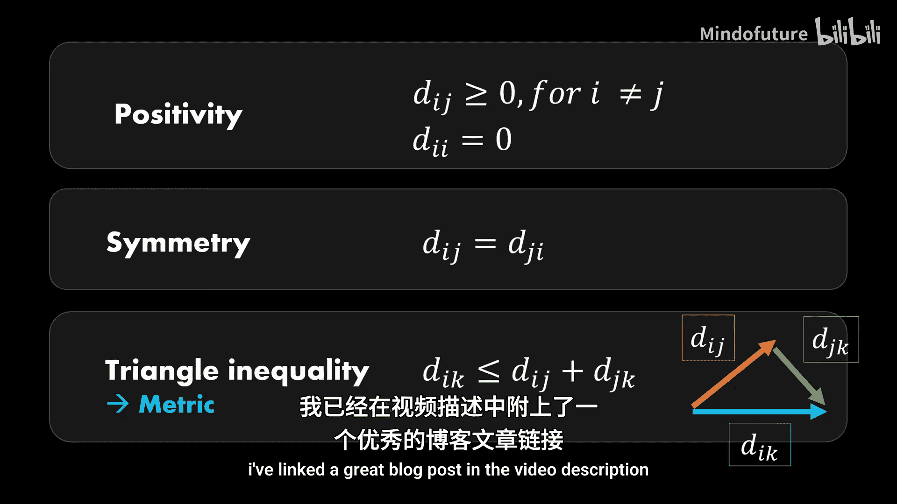

度量MDS基于最小二乘损失函数，有时也称为最小二乘MDS。之前我们假设距离矩阵是欧几里得的，但事实证明还有许多其他距离度量可用。因此，度量MDS是一种更通用的算法，可以为任何距离函数找到映射。缺点是我们不能像上一节那样利用任何闭式解，因此度量MDS使用迭代优化算法。

### 距离度量的精确定义

在数学上，距离度量需要满足三个公理：
1.  距离必须为正，且点到自身的距离为0。
2.  距离必须对称，即从 i 到 j 的距离与从 j 到 i 的距离相同。
3.  距离度量需要满足三角不等式，这意味着三个点之间较短距离之和总是需要大于最长距离。

如果一个距离函数满足三角不等式，则称为度量距离；如果不满足，则称为非度量距离。这也是度量MDS和非度量MDS名称的由来。

### 度量MDS算法步骤

度量MDS是一种迭代方法，步骤概述如下：
1.  **初始化低维点**：可以随机初始化，也有更高级的策略。
2.  **计算低维映射的距离矩阵**：请注意，原始距离仍然可以使用任何距离度量，但低维近似通常表示为欧几里得距离，因为这对人类来说最直观。
3.  **计算损失函数（应力）**：该函数比较低维距离与提供的距离。
4.  **使用优化程序（如梯度下降）最小化误差**。

### 应力函数

原始应力函数定义为：**Stress = Σᵢⱼ (δᵢⱼ - dᵢⱼ)²**。它是原始距离矩阵与低维构型距离矩阵之间的简单平方距离。应力公式中的求和意味着我们可以利用对称性。

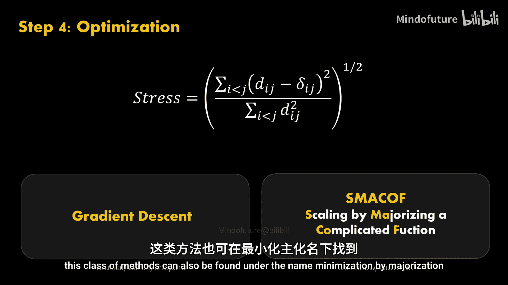

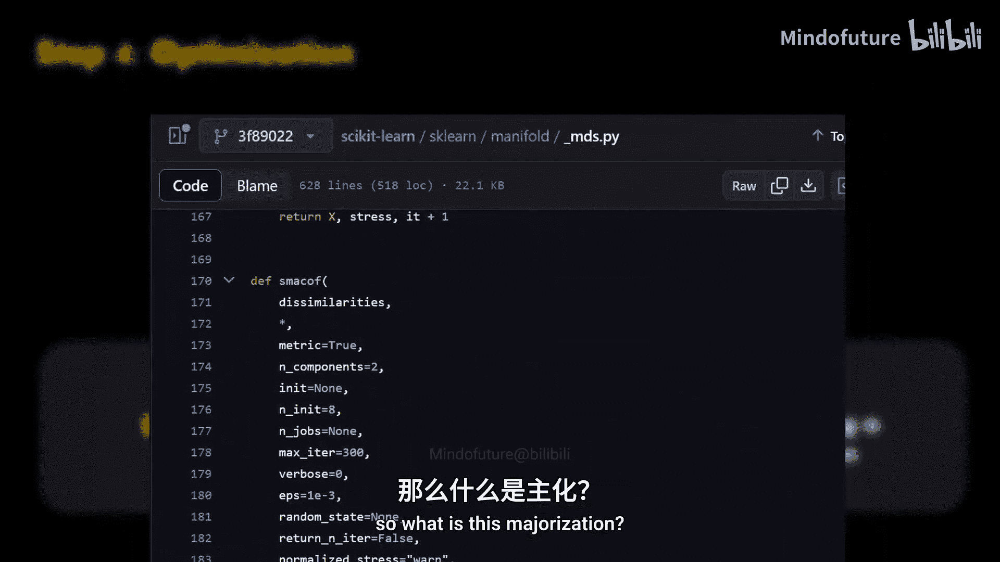

Kruskal提出了一个改进，即对应力进行归一化：**Normalized Stress = √[ Σᵢⱼ (δᵢⱼ - dᵢⱼ)² / Σᵢⱼ δᵢⱼ² ]**。分母是一个缩放因子，使整个项在均匀拉伸或收缩下保持不变。归一化应力的一个便利特性是它的值在0和1之间。Kruskal还提供了经验评估，建议哪些归一化应力值是可接受的。一般来说，任何高于20%的应力值都表明对真实距离的拟合非常差。

应力函数有几种变体和扩展。例如，可以引入权重 **wᵢⱼ** 来表示距离的重要性，这也可用于处理缺失数据。Sammon应力是另一个MDS误差函数，它在拟合过程中给予小距离更多权重，从而更好地保持小距离。

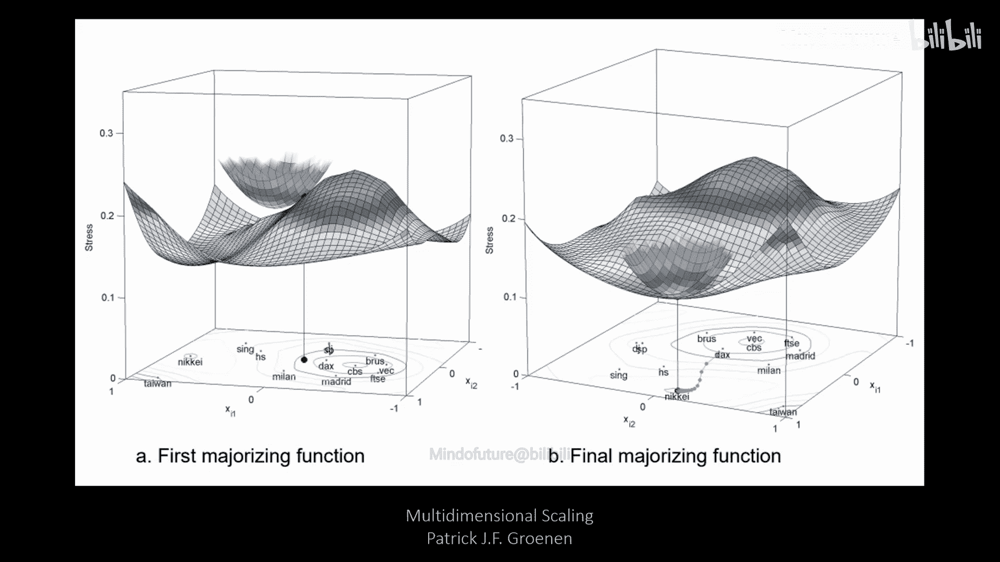

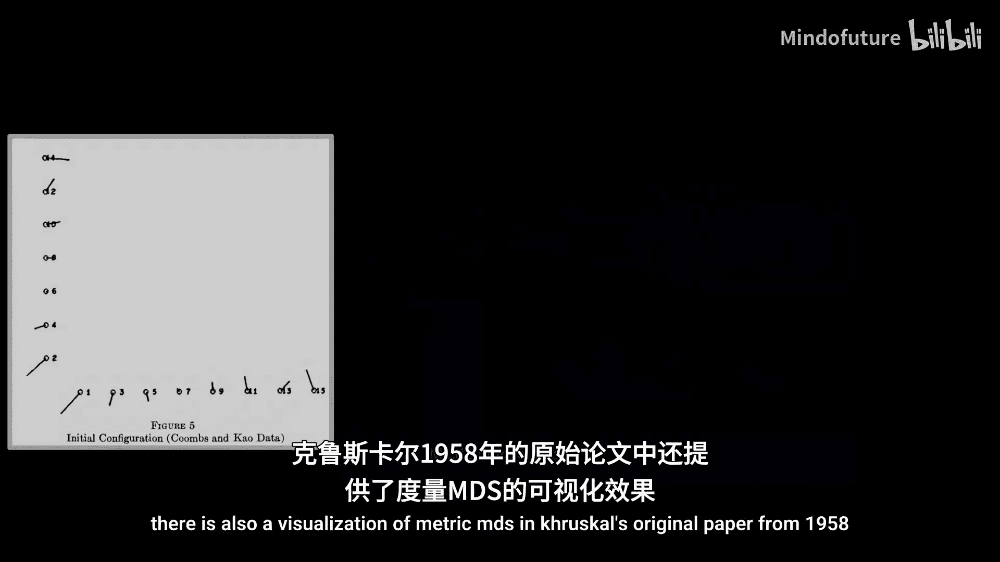

除了使用Kruskal的应力值进行经验评估外，还有另一种评估MDS拟合优度的方法：Shepard图。它是实际距离与低维空间距离之间的散点图。理想的拟合将使所有点都落在对角线上。

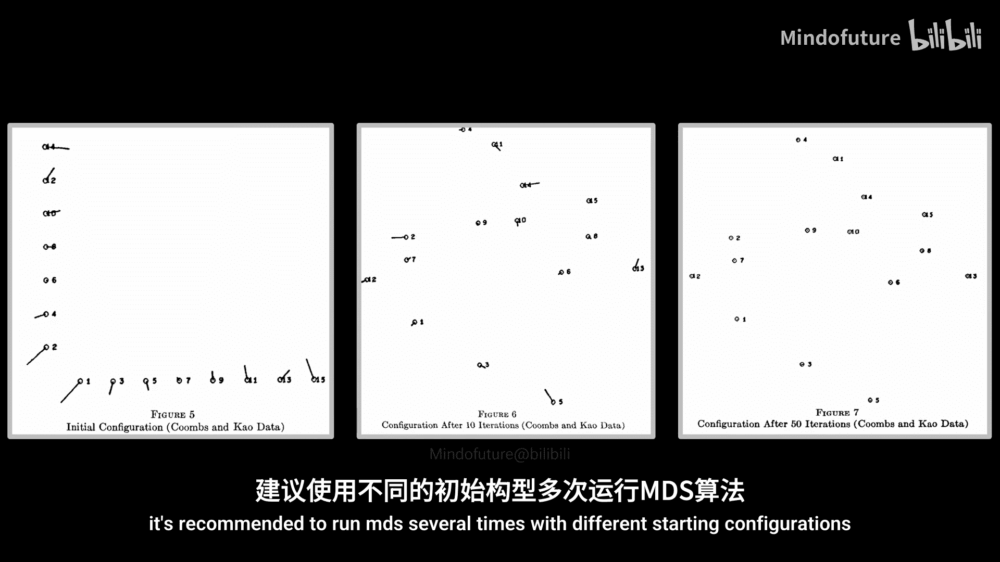

### 最小化应力函数

一般来说，几乎任何选择的优化算法都可以使用。Kruskal最初提出了一种类似于神经网络中使用的梯度下降算法。然而，梯度下降不能保证一个好的解，因为应力目标函数是非凸的。

对MDS最重要的贡献之一是de Leeuw的SMACOF算法。这种优化方法代表“通过优化一个复杂函数进行缩放”。这类方法也可以称为“通过优化进行最小化”。这正是scikit-learn在调用`fit`函数时使用的算法。

简而言之，这种方法利用函数的凸性来寻找最小值。由于应力是一个非凸函数，因此定义一个凸的替代函数来最小化目标。这意味着应力被包裹在一个更简单的函数中。然后，该算法通过支持点迭代地最小化优化后的应力函数。SMACOF的优势在于它保证了单调收敛。

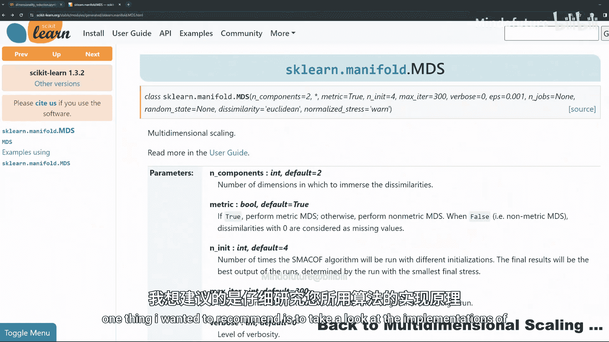

与所有优化算法一样，局部最小值是一个问题，建议使用不同的起始配置多次运行MDS。

### 如何选择最佳维度？

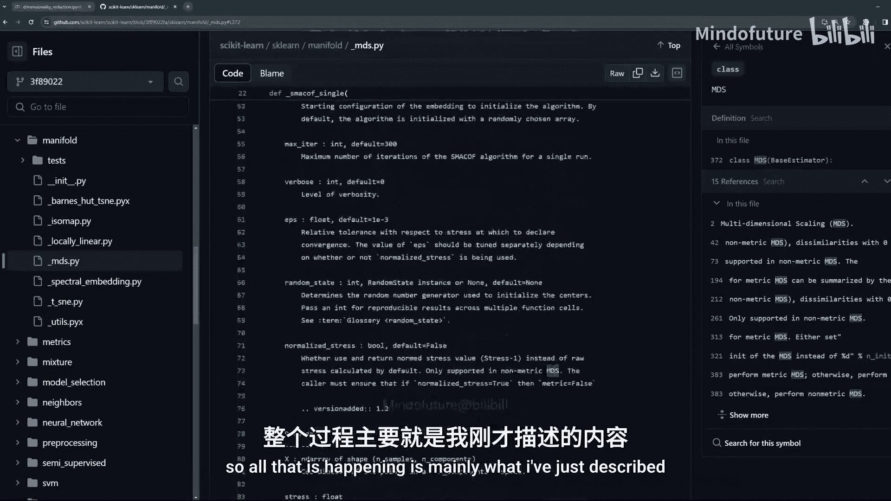

我们再次在Kruskal的论文中找到了答案。我们只需多次运行算法，并绘制应力值与维度的关系图。这实际上类似于PCA中的碎石图，我们可以利用肘部准则来找到具有足够近似的维度。更高的维度自然会导致更小的应力值，因为我们有更多的空间来定位点。

## 非度量多维尺度分析（非度量MDS）📈

非度量距离是违反三角不等式的距离。一个常见的例子是顺序数据。当我们根据相似性对数据进行排名时，也很容易违反三角不等式。这就是非度量MDS名称的由来。

顺序数据非常有用，因为它允许我们仅基于比较来表达距离，而比较大多数时候比计算实际距离值更容易。因此，顺序MDS的目标是找到一个保持距离顺序的构型，就像在原始距离矩阵中一样。这个顺序可以简单地通过将所有距离按递增顺序排列来定义。

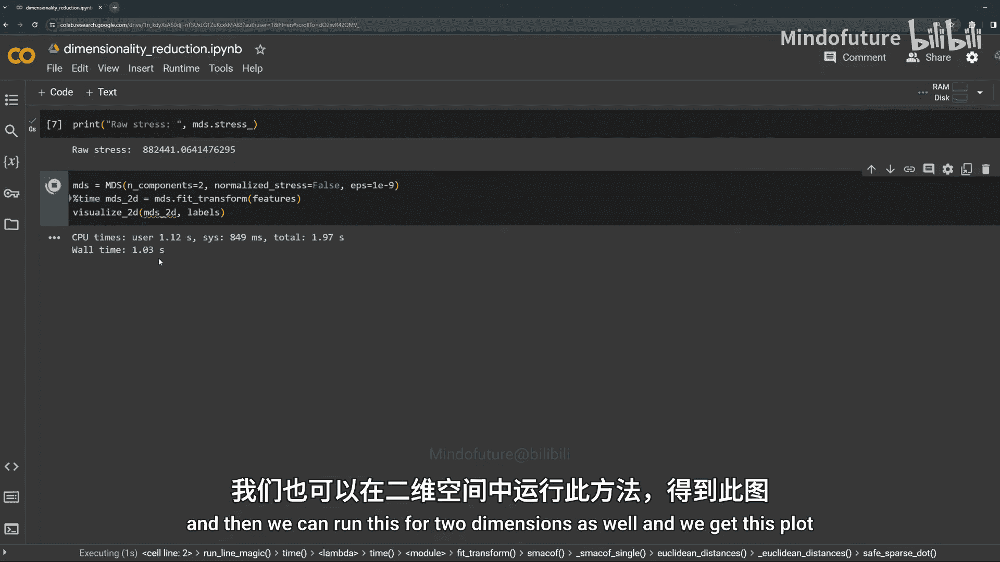

### 如何确保距离顺序得以保持？

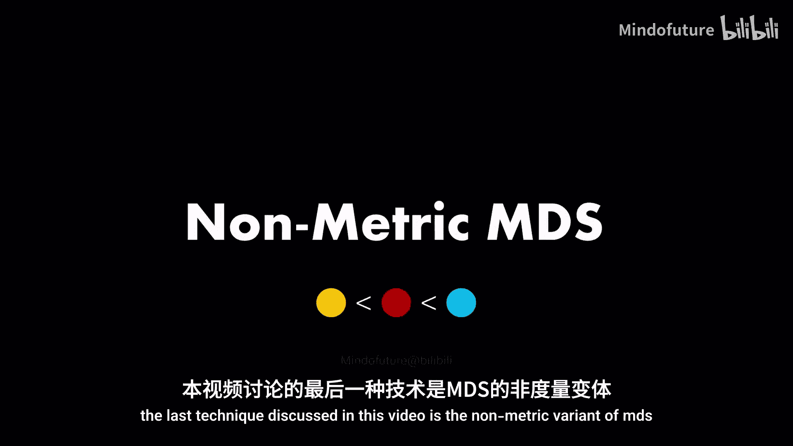

为此，Kruskal引入了一个单调函数，将原始距离映射到所谓的相异性，记为 **d̂ᵢⱼ**。一般来说，单调函数是保持顺序的函数。给定原始距离，函数的输出也应该产生相同的顺序。因此，函数 **f** 总是非递增或总是非递减。

这些函数当然有一些需要学习的参数。对于顺序函数，这些参数可以使用最小二乘单调回归（也称为等渗回归）来学习。拟合这样的顺序函数看起来像图像中的红线。单调回归可以使用称为“相邻违反者算法”的迭代算法来解决。

使用拟合线，我们现在可以将低维距离与相异性进行比较，从而优化排名顺序，而不是实际的距离值。MDS的优化过程仅通过使用从单调回归模型预测的相异性而略有改变。其余部分基本保持不变，意味着我们也使用SMACOF来优化应力函数。因此，在顺序MDS中，我们同时学习单调函数的参数以及数据点的坐标。

## 技术对比与总结

让我们进一步扩展我们的对比表。MDS是一种全局技术，因为我们同时考虑所有点。

*   **经典MDS**：像PCA一样，是线性方法，基于投影，是确定性的，具有立方复杂度（因为需要找到格拉姆矩阵的特征对）。
*   **迭代度量MDS和非度量MDS**：都是非线性方法，属于流形学习技术，由于随机选择的起点而非确定性，复杂度大致为二次方。

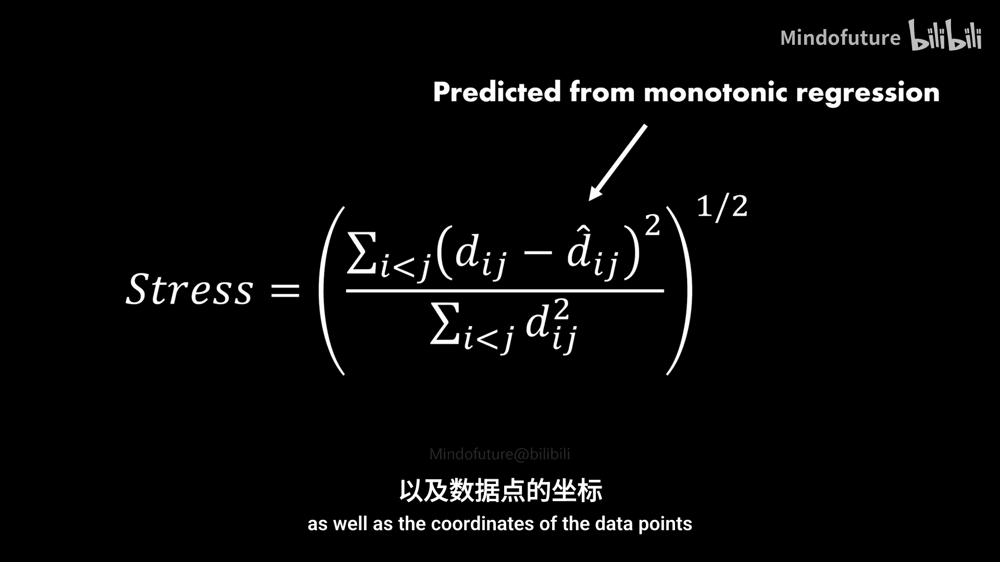

大多数时候，MDS仅用于较小的数据集。但也有该算法的近似版本可用。主要的超参数包括：使用的度量、选择的维度、迭代次数和应力容差ε。

关键思想是：经典MDS中的特征分解，以及其他情况下的最小化平方距离的迭代算法。

最后，MDS有许多应用，其中包括计算生物学中的基因聚类。

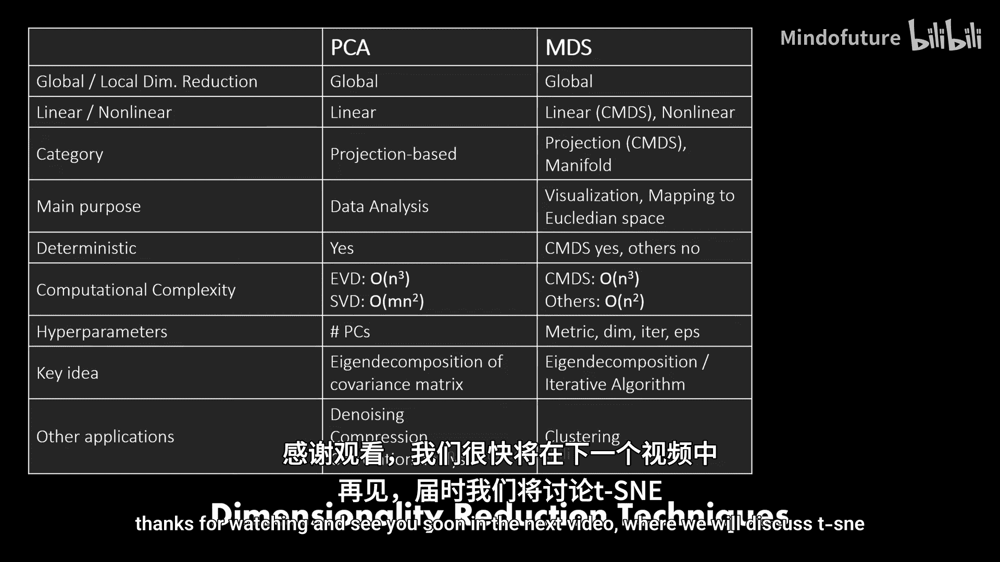

本节课中，我们一起学习了多维尺度分析（MDS）的基本概念、三种主要变体（经典、度量、非度量）及其算法原理。MDS作为一种基于距离的降维技术，在数据可视化和探索性数据分析中具有独特价值。希望本教程能帮助你理解这一经典而强大的方法。