# 004：t-分布随机邻居嵌入（t-SNE）


在本节课中，我们将要学习一种非常流行的降维技术——t-分布随机邻居嵌入（t-SNE）。我们将从它的前身SNE开始，逐步了解其核心思想、改进之处，以及如何将其扩展到处理海量数据。课程内容将力求简单直白，确保初学者能够理解。

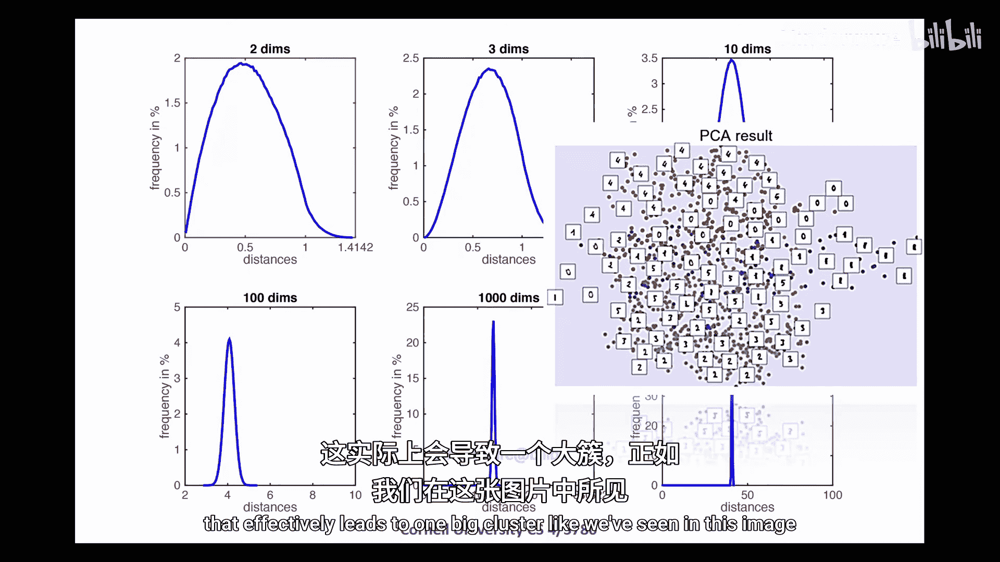

## 🎼 概述：从流形学习到t-SNE

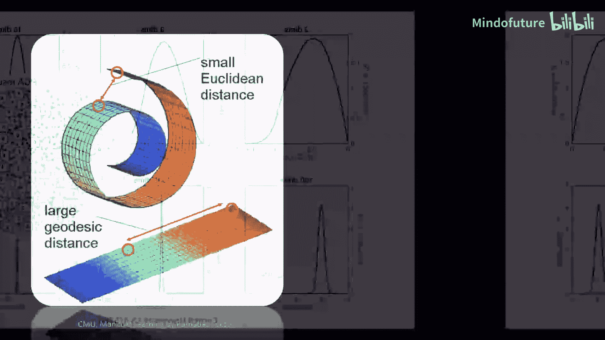

上一节我们介绍了MDS，本节中我们来看看t-SNE。t-SNE被认为是一种流形学习技术。这意味着它是一种非线性降维方法，与PCA等线性方法相比，通常能产生更好的低维嵌入效果。

例如，在处理手写数字数据集时，t-SNE的二维表示比PCA更加有组织。其根本原因在于，PCA试图将所有点之间的全局欧几里得距离映射到嵌入空间中，而在高维空间中，欧几里得距离并不是一个理想的选择。这就是我们在系列第一课中提到的“维度诅咒”问题：在低维空间中完全保留所有成对距离是不可能的，因为维度越少，可用于放置点的空间就越小，导致所有点被迫挤在一起，形成一个大的聚类。


一个直观理解欧几里得距离局限性的方法是观察瑞士卷数据集。PCA基于欧几里得距离，会将卷顶部距离近的点映射为近邻，即使它们在实际的流形结构上并非直接邻居。正确的、能够“展开”瑞士卷的距离被称为测地线距离，即曲面上连接两点的最短曲线。t-SNE的核心思想之一，就是通过构建“邻居到邻居”的路径来近似这种测地线距离，因此它被称为一种邻居嵌入技术。

接下来，我们将按照历史发展顺序，介绍构建现代t-SNE算法的三个重要贡献：
1.  **随机邻居嵌入（SNE）**：由Geoffrey Hinton和Sam Roweis于2002年提出，奠定了基本框架。
2.  **t-SNE**：由Laurens van der Maaten和Geoffrey Hinton在后续论文中提出，引入了几项关键改进。
3.  **Barnes-Hut t-SNE**：同样由Laurens van der Maaten提出，提供了将t-SNE扩展到数百万数据点的工具箱。

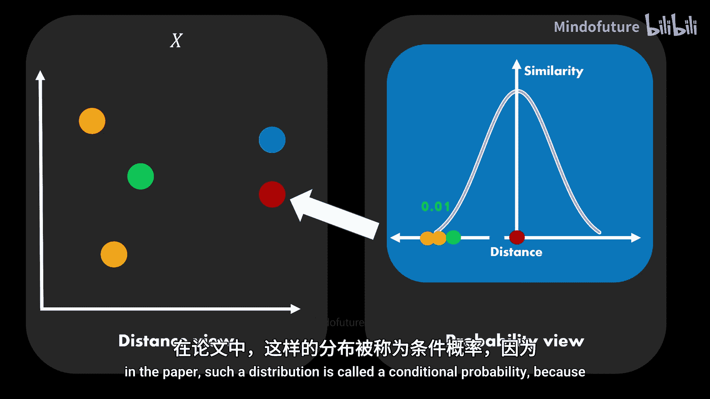

## 🎼 SNE：随机邻居嵌入算法

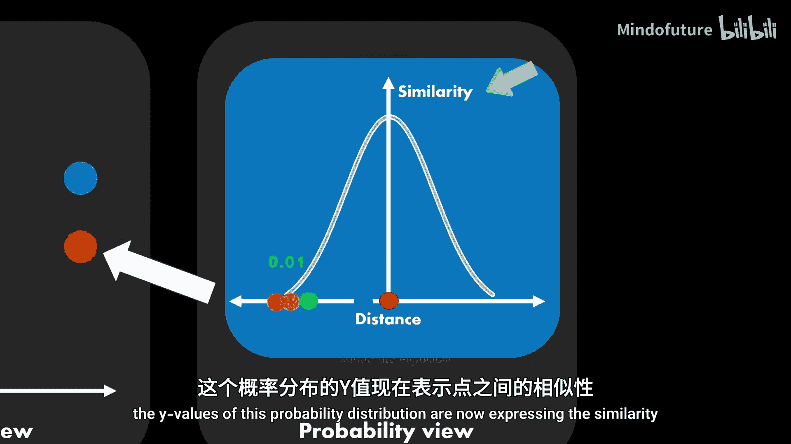

SNE论文提出了将高维数据映射到低维空间的基本思路。我们沿用之前视频的符号：高维数据记为 **X**，低维数据（例如二维）记为 **Y**。我们的目标是保留原始数据的结构。

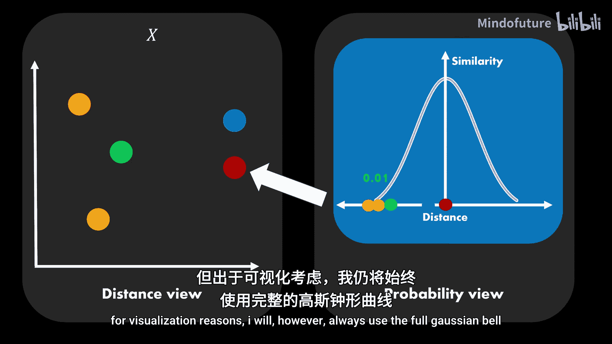

以下是SNE算法的步骤总结：

**第一步：计算成对距离**
首先，计算所有高维数据点之间的成对距离，通常使用欧几里得距离函数，得到一个距离矩阵。

**第二步：将距离转换为概率分布（引入局部性）**
SNE通过为每个点应用高斯分布，将距离转换为概率分布，从而只关注每个点的局部邻域。对于点 **i**，其与点 **j** 的相似性条件概率 **p_{j|i}** 计算公式如下：

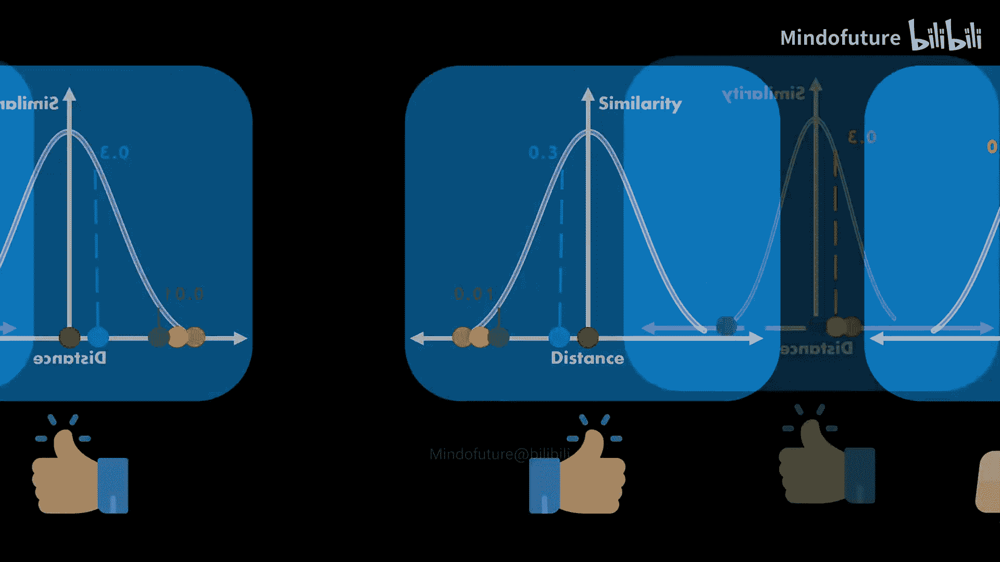

$$
p_{j|i} = \frac{\exp(-||x_i - x_j||^2 / 2\sigma_i^2)}{\sum_{k \neq i} \exp(-||x_i - x_k||^2 / 2\sigma_i^2)}
$$

其中，**σ_i** 是以点 **i** 为中心的高斯分布的方差。这个概率值在0到1之间，点越近，概率值越高。这相当于为所有数据点赋予了一个权重，使得远处的点变得无关紧要，从而缓解了维度缩放问题。

**第三步：通过困惑度确定最优方差**
然而，对所有点使用相同的方差并不理想。在密集区域需要较小的方差，在稀疏区域需要较大的方差。SNE使用**困惑度**这个超参数来控制每个点邻域的大小。困惑度近似地表示高斯核覆盖的邻居数量。算法会为每个点 **i** 执行二分搜索，寻找最优的 **σ_i**，使得该点条件分布的困惑度接近用户指定的值（例如30）。这平衡了保留全局和局部结构的需求。

**第四步：构建低维空间并计算损失**
在低维嵌入空间 **Y** 中，我们同样为每个点构建一个概率分布 **q_{j|i}**。在原始SNE中，也使用高斯分布。然后，我们需要比较高维分布 **P** 和低维分布 **Q** 的相似性。SNE使用**KL散度**作为损失函数：

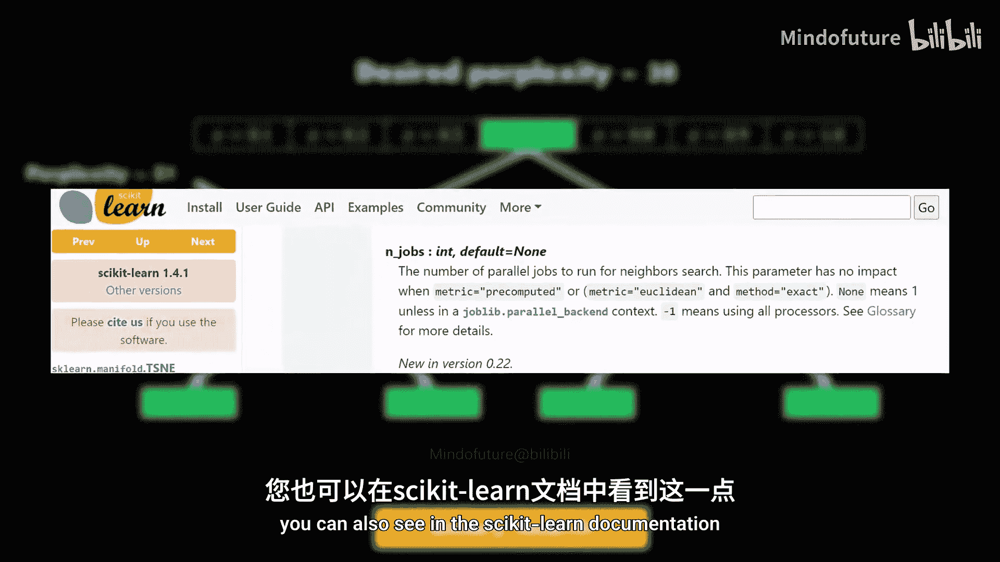

$$
C = \sum_i KL(P_i || Q_i) = \sum_i \sum_j p_{j|i} \log \frac{p_{j|i}}{q_{j|i}}
$$

这个损失函数会更多地惩罚近邻点映射不一致的情况。我们的目标是通过移动低维空间中的点 **Y** 来最小化这个损失。

**第五步：梯度下降优化**
通过梯度下降法优化损失函数。梯度可以直观地解释为点之间弹簧的合力：如果低维空间中的距离与高维相似度不匹配，就会产生吸引或排斥的力，直到系统达到稳定状态。

以下是SNE算法的完整步骤总结：
1.  随机初始化低维点，或使用PCA结果作为初始配置。
2.  计算所有点之间的成对欧几里得距离。
3.  通过应用高斯分布将距离转换为概率，引入局部性。
4.  使用二分搜索为每个点的分布寻找最优方差 **σ_i**，使各点拥有大致相同数量的邻居（即困惑度一致）。
5.  通过优化每个数据点在高维和低维概率分布之间的KL散度，来更新低维点的位置。

## 🎼 从SNE到t-SNE：关键改进

t-SNE本质上是SNE加上几项改进，但整体算法框架不变。最重要的改进动机来自于**拥挤问题**。

**拥挤问题**
想象一个二维数据点集需要映射到一维直线上。无论我们如何排列这些点，总有一些点无法被放置在与其高维相似度匹配的正确距离上，因为低维空间没有足够的“空间”。这导致在优化过程中，微小的吸引力会使所有点挤在一起，难以形成清晰的簇。

**解决方案：使用t分布**
t-SNE的核心改进是在**低维空间**中使用**学生t分布**（自由度为1）来代替高斯分布，这就是“t”的由来。与高斯分布相比，t分布具有更重的尾部。

这意味着，在低维空间中，即使两个点距离较远，它们仍然会被分配一个相对较高的相似性概率 **q_{j|i}**。这减少了对“本应稍远”的点的惩罚（即减少了不必要的排斥力），允许低维嵌入有更多的“误差”空间，从而有效缓解拥挤问题，帮助形成更清晰的簇。

使用t分布还有额外好处：
1.  无需为每个点进行二分搜索寻找方差，所有点使用相同的分布。
2.  计算更高效，因为t分布的计算不涉及指数运算。

**其他重要改进**
1.  **对称概率**：在SNE中，条件概率 **p_{j|i}** 和 **p_{i|j}** 不一定相等。t-SNE通过将条件概率对称化，计算联合概率 **p_{ij} = (p_{j|i} + p_{i|j}) / 2n**。这使异常值也能对损失函数产生贡献，防止它们被忽略，同时简化了梯度计算。
2.  **早期放大**：在优化初期，将损失函数梯度中的**吸引力**部分乘以一个大于1的因子。这有助于属于同一簇但初始位置分散的点克服排斥力，快速聚集到一起。在若干轮迭代后，吸引力恢复常态，以便形成紧密的簇。

应用于真实数据集（如基因组小鼠数据）时，这些改进使得t-SNE能够形成更紧密、分离更清晰的聚类。

## 🎼 代码实践与参数

现在，让我们简要看一下如何在`scikit-learn`中使用t-SNE。

```python
from sklearn.manifold import TSNE
from sklearn.datasets import load_digits
import matplotlib.pyplot as plt

# 加载数据
digits = load_digits()
X = digits.data
y = digits.target

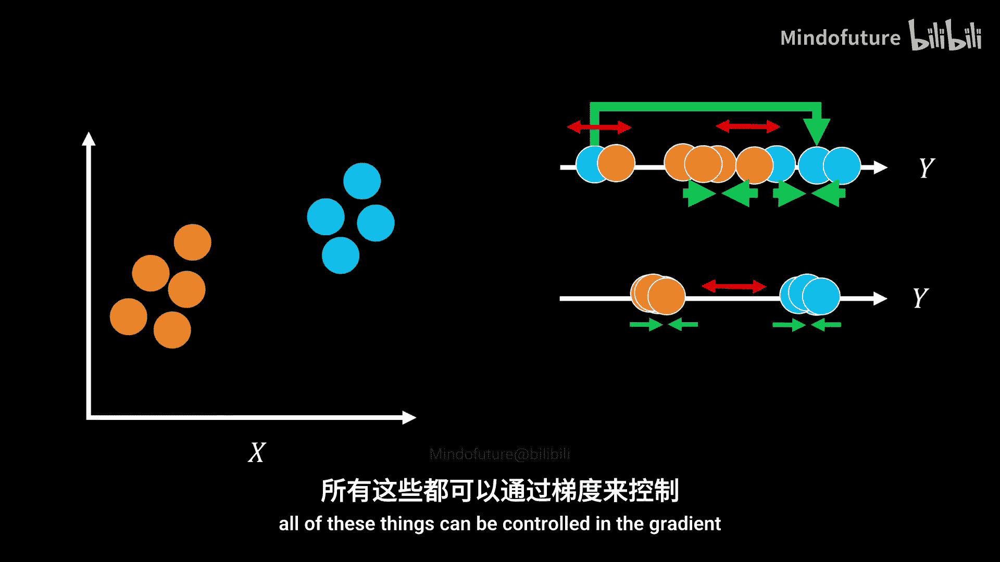

# 创建t-SNE模型
tsne = TSNE(
    n_components=2,      # 目标维度
    perplexity=30,       # 困惑度，通常介于5到50之间
    early_exaggeration=12.0, # 早期放大因子
    learning_rate='auto', # 学习率
    init='pca',          # 初始化方式，推荐‘pca’
    n_iter=1000,         # 优化迭代次数
    n_jobs=-1            # 使用所有CPU核心并行计算
)

# 执行降维
X_embedded = tsne.fit_transform(X)

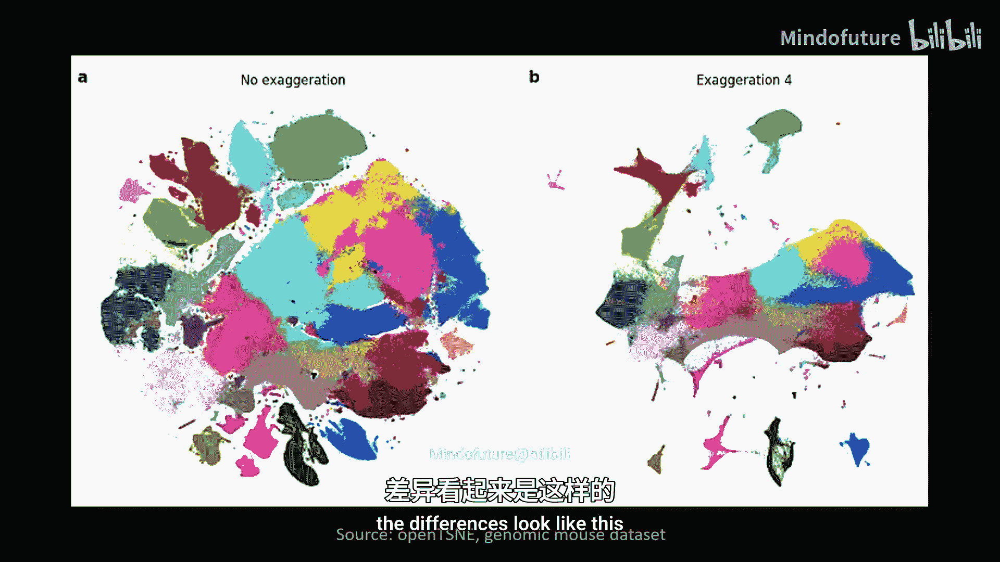

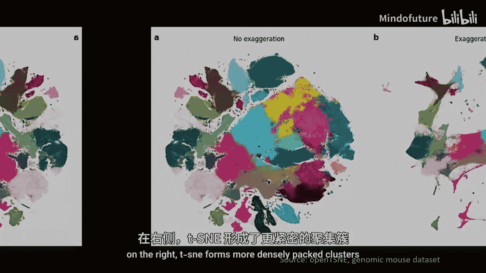

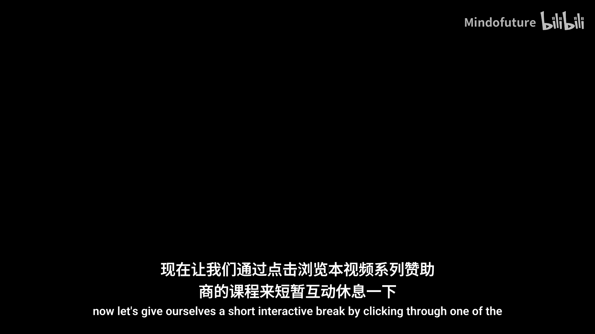

# 可视化
plt.scatter(X_embedded[:, 0], X_embedded[:, 1], c=y, cmap='Spectral', s=5)
plt.colorbar()
plt.show()
```


关键参数说明：
*   `perplexity`：困惑度，控制每个点考虑的邻居数量，影响簇的紧密度。
*   `early_exaggeration`：早期放大因子，影响初始聚类速度。
*   `init`：初始化方式，`‘pca’`通常比随机初始化效果更好、更稳定。
*   `n_iter`：优化迭代次数。

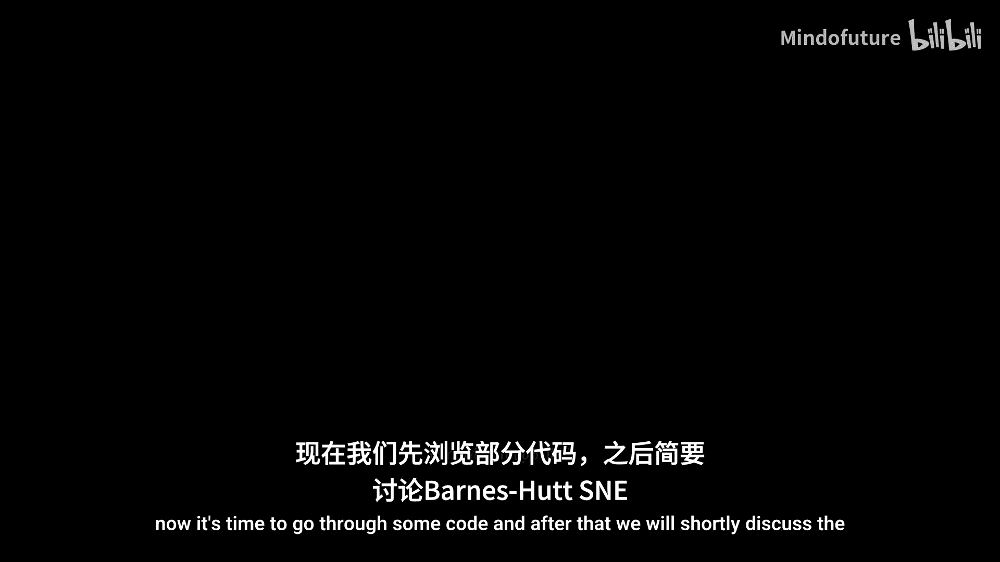

**重要提示**：t-SNE主要用于**可视化**，其输出结果（如簇间距离）不一定具有可解释性，且每次运行结果可能因随机初始化而不同。

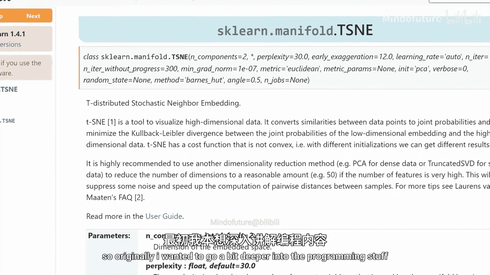

## 🎼 扩展：Barnes-Hut t-SNE 加速算法

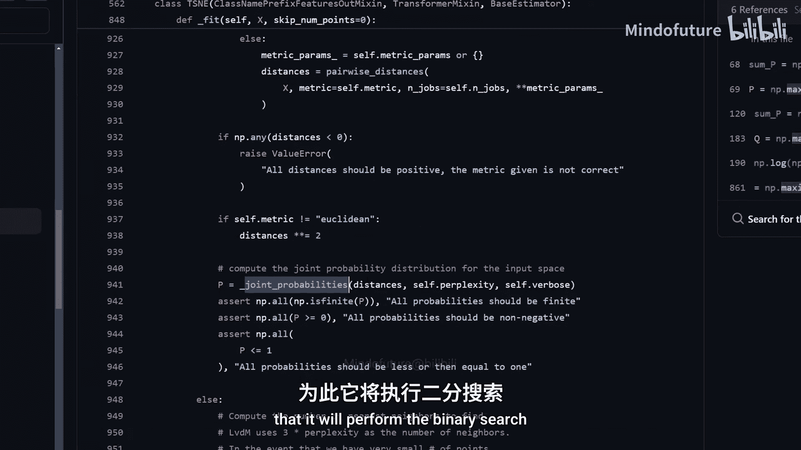

标准t-SNE的计算复杂度是 **O(N²)**，这对于大数据集（如百万级数据点）是难以承受的。Barnes-Hut t-SNE 将复杂度降低到 **O(N log N)**，使其得以广泛应用。

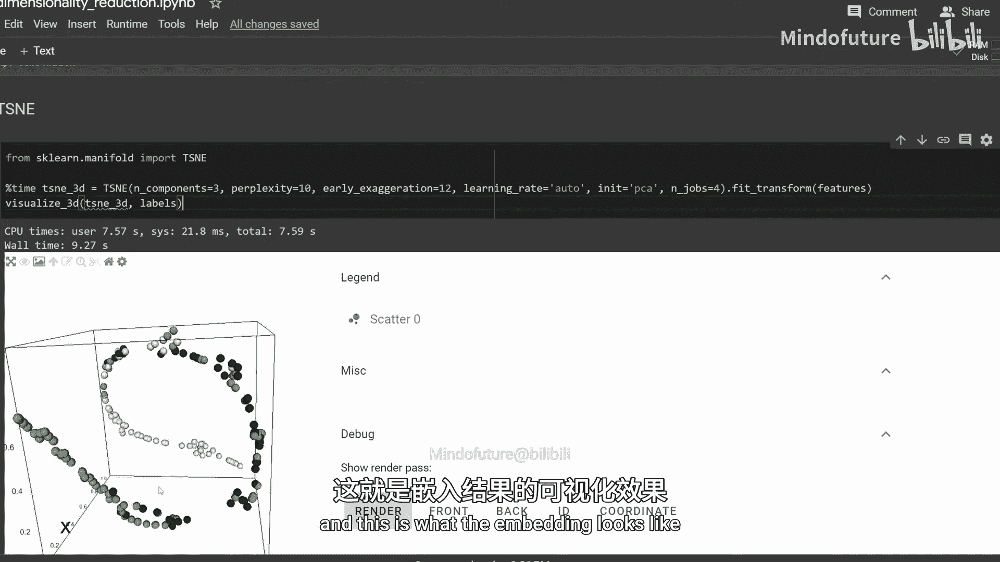

其灵感来源于物理学中的N体模拟问题。Barnes-Hut算法通过构建一个**四叉树**（在2D中）或**八叉树**（在3D中）来近似计算作用力。

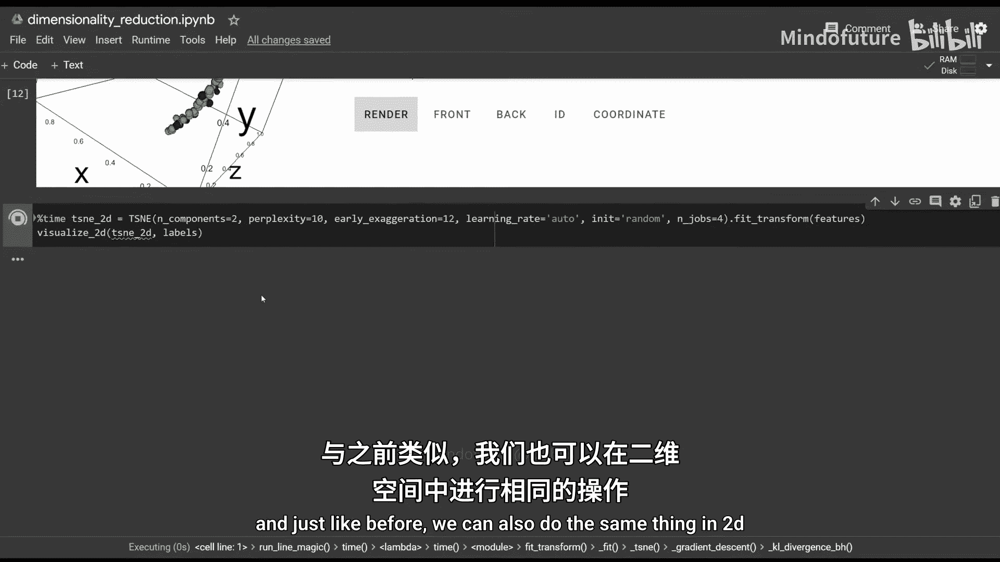

**核心思想**：
1.  将空间递归地划分为单元格。
2.  对于距离较远的点群，不再计算该群中每个点对目标点的作用力，而是将整个点群汇总为其质心，用质心来近似计算排斥力。
3.  通过遍历树结构，可以高效地计算所有远距离点群对目标点的近似排斥力。

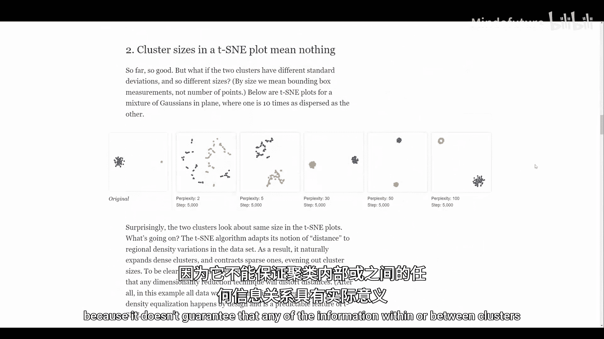

在`scikit-learn`中，`TSNE`类的`method`参数默认为`‘barnes_hut’`，这就是使用了该加速算法。如果设置为`‘exact’`，则会使用精确但更慢的计算方式。

## 🎼 总结与对比

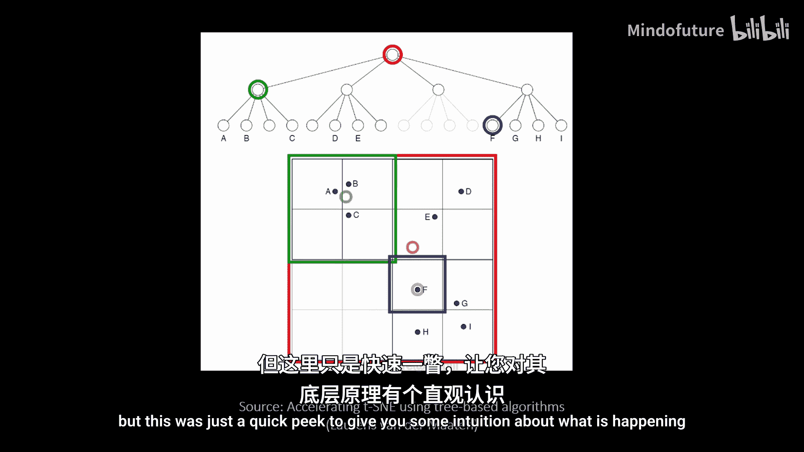

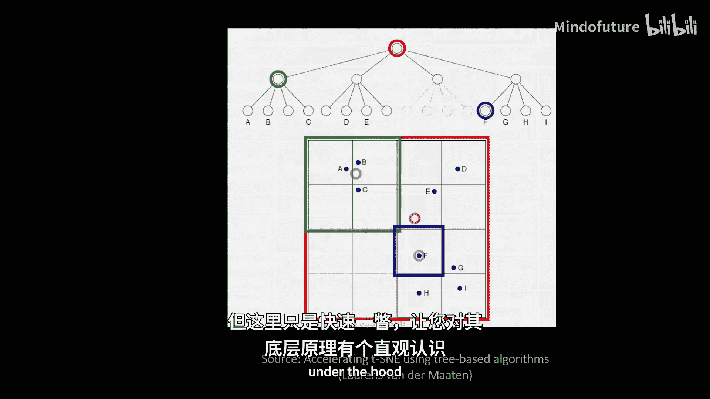

本节课中我们一起学习了t-SNE降维技术。让我们通过一个对比表来总结其特性：

| 特性 | t-SNE 描述 |
| :--- | :--- |
| **类型** | 局部、非线性技术，属于流形学习。 |
| **主要目的** | **数据可视化**，以获得对数据结构的直观感受。 |
| **随机性** | 是。损失函数非凸，不同初始化可能导致不同结果。 |
| **计算复杂度** | 标准版为 O(N²)，Barnes-Hut加速版为 O(N log N)。 |
| **关键参数** | `perplexity`（困惑度）、`early_exaggeration`（早期放大）、梯度下降相关参数。 |
| **核心思想** | 基于每个点的局部邻域关系来构建嵌入，使用t分布缓解低维空间拥挤问题。 |
| **处理新数据** | **不能**直接应用于新数据。模型训练后，若想添加新点，需要重新运行整个算法（包括新旧所有数据）。 |
| **主要应用** | 几乎专用于高维数据的二维或三维可视化。 |

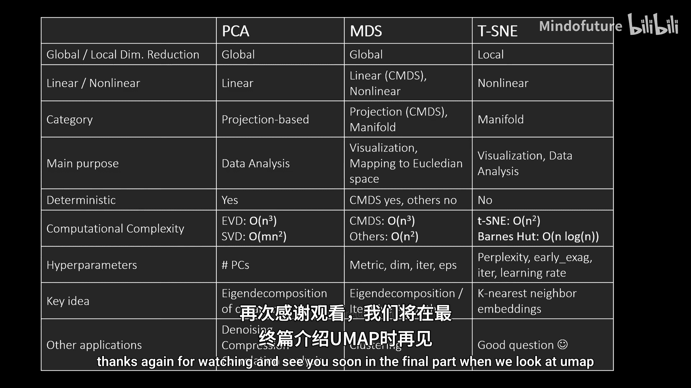


总而言之，t-SNE是一种强大的可视化工具，它能揭示高维数据中复杂的局部结构。理解其背后的SNE基础、拥挤问题、t分布的作用以及加速原理，有助于我们更有效地使用和解释其结果。下一节，我们将学习本系列的最后一个降维方法：UMAP。