# 005：均匀流形近似与投影（UMAP）

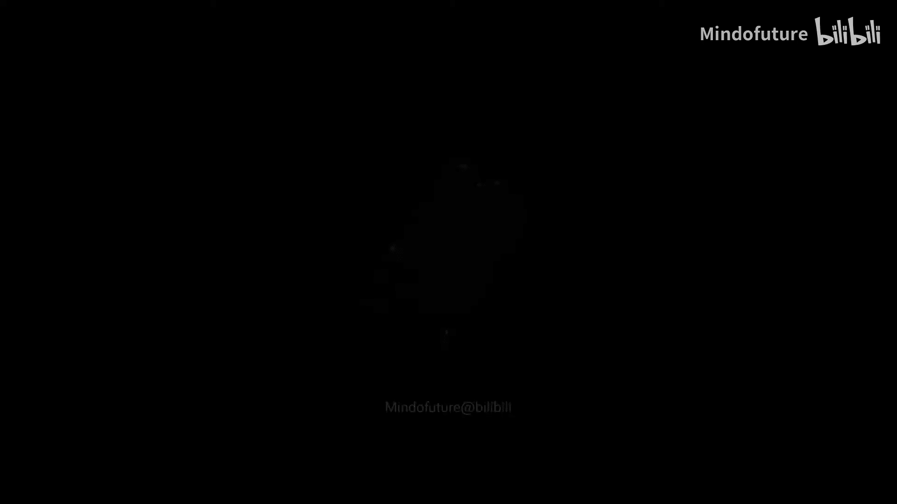

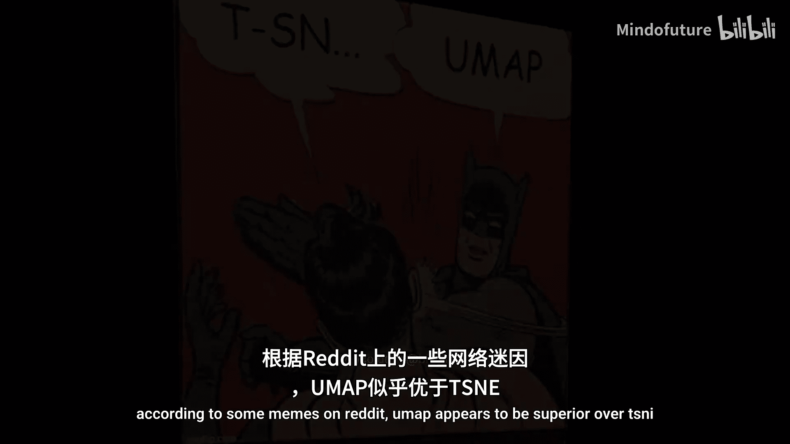


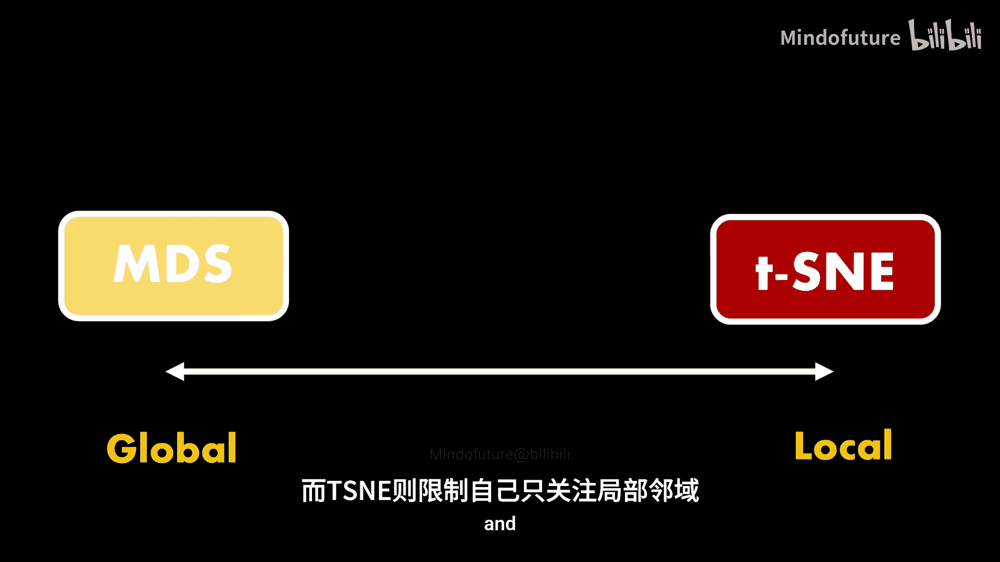

在本节课中，我们将要学习一种较新的降维技术——均匀流形近似与投影（UMAP）。我们将探讨其理论基础、算法步骤、与t-SNE的异同，并通过代码实践来加深理解。

## 概述

在前面的课程中，我们介绍了PCA、MDS和t-SNE。本节是降维系列的最后一节，我们将聚焦于UMAP。UMAP声称能同时保留数据的局部和大部分全局结构，并且计算效率更高。我们将验证这些说法，并深入理解其背后的原理。

## 理论基础：拓扑数据分析入门

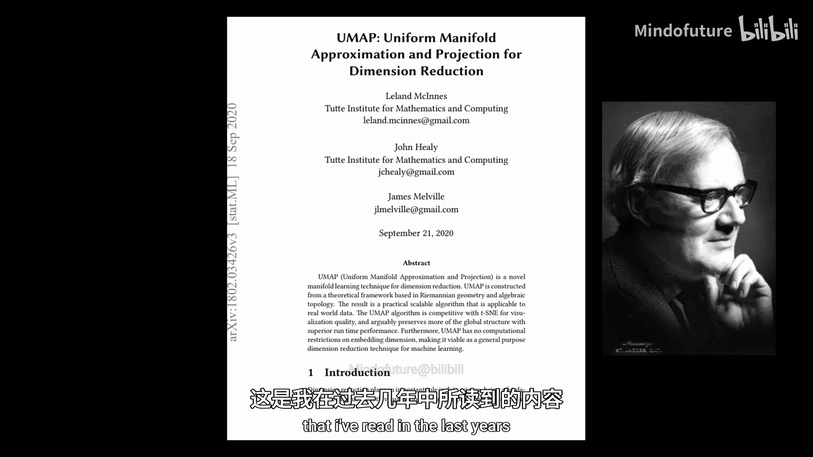

上一节我们介绍了t-SNE的局限性，本节中我们来看看UMAP如何尝试解决这些问题。要理解UMAP，我们需要先了解一些拓扑数据分析（TDA）的基础概念。

数据点通常位于一个高维空间（环境空间）中。TDA关注的是数据在这个空间中的形状，或者说流形。TDA工具箱中的方法可以帮助我们提取数据的拓扑和几何特征，例如连接、环路或空洞。

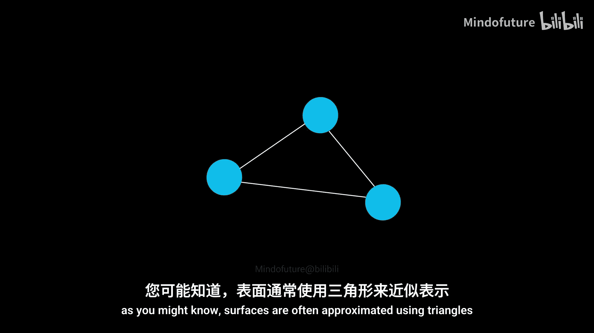

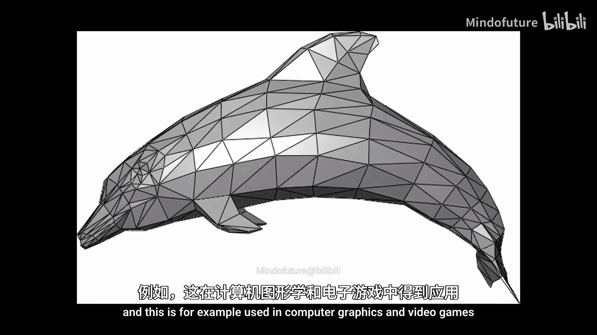

这些特征的计算基于“单纯形”。三角形是二维的单纯形，而它的高维推广（如三维的四面体）也统称为单纯形。TDA的一个基本思想是通过沿着面粘合单纯形来近似数据的几何形状，结果形成一个“单纯复形”。

那么，如何构建这样的单纯复形呢？常用的方法是“过滤”。我们以每个点为中心放置一个半径为 ε 的球。当这些球以特定方式重叠时，我们就连接对应的点。对于每个半径 ε，这都会自动生成一个图。

UMAP主要关心的是由0维和1维单纯形决定的“Vietoris-Rips复形”。通过这种过滤过程，我们可以很好地感受数据的形状。

## UMAP算法原理

有了TDA的基础，我们现在可以分两步讨论UMAP算法。首先，使用Vietoris-Rips复形构建一个拓扑表示，这实际上给出了一个k近邻图。其次，找到一个具有类似拓扑结构的低维表示，这最终是在欧几里得2D或3D空间中的图布局优化。

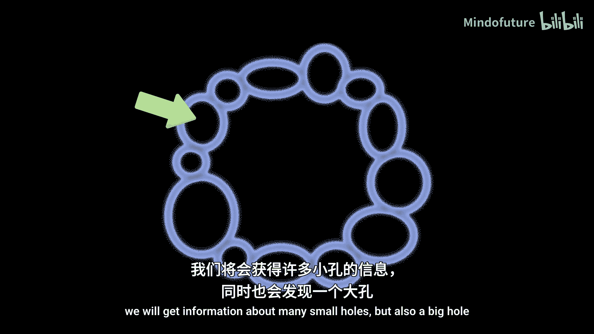

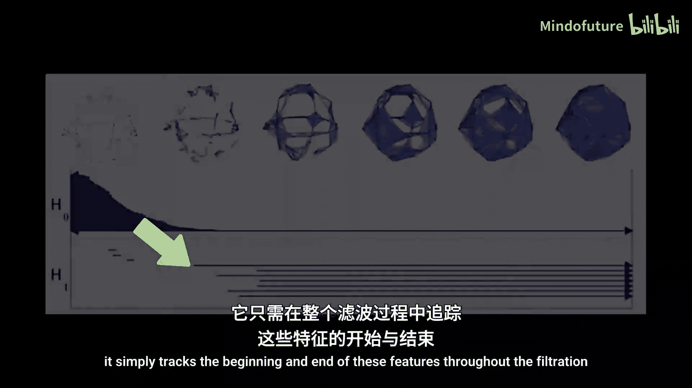

### 第一步：构建加权k近邻图

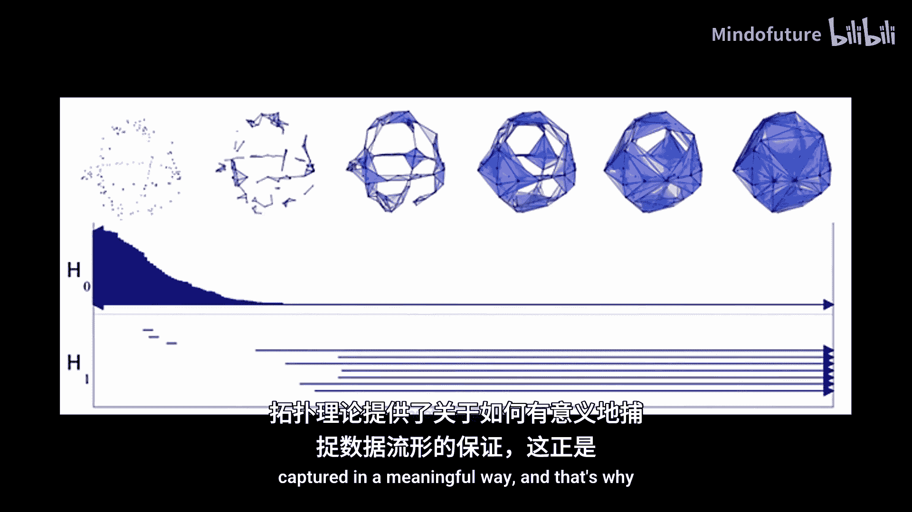

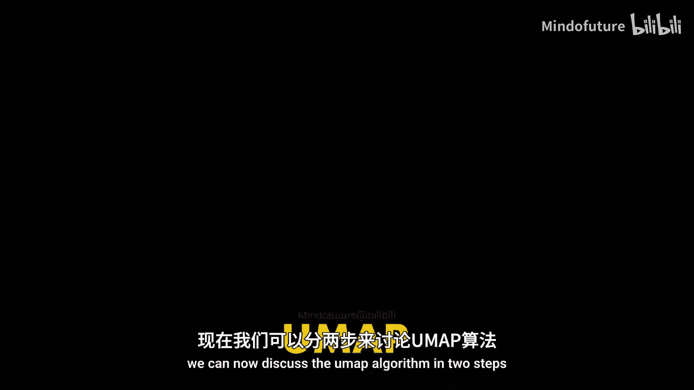

在TDA介绍中，我们学习了如何通过放置固定半径的球来构建Vietoris-Rips复形。UMAP也做类似的事情，但关键问题是：应该选择多大的半径来构建一个能近似数据所在流形的单纯复形？

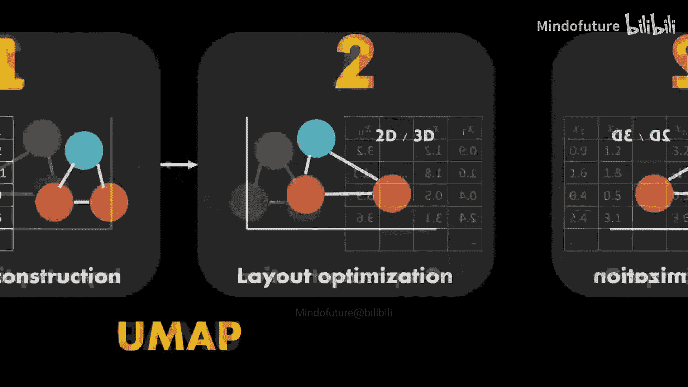

对于所有数据集，并没有一个通用的半径。因此，UMAP引入了一个超参数：**邻居数量（n_neighbors）**。这与“均匀（Uniform）”有关。

如果数据在流形上均匀分布，那么在任何地方放置一个给定半径的球，捕获的邻居数量大致相同。这会使问题变得简单。然而，现实世界的数据通常不是均匀分布的。

UMAP通过为每个点定义一个**个体化的距离函数**来解决这个问题，使得数据相对于该度量近似均匀分布。这样，均匀分布的假设仍然成立。在实践中，这意味着稀疏聚集的区域会收缩，而密集聚集的区域会扩大。

我们不再选择半径，而是选择邻居数量K的值。这更方便，因为选择实际距离高度依赖于数据集，而像10个邻居这样的默认值对大多数数据集都适用。

围绕每个点，我们使用指数衰减来加权邻居，距离越近的邻居权重越高。这可以解释为连接存在的概率。UMAP还增加了一个**局部连通性约束**，使得衰减从第一个邻居之后才开始，确保第一个邻居的连接权重总是1。

以下是定义这个距离函数的公式：

```
ρ_i = min{d(x_i, x_j) | 1 ≤ j ≤ k}  # 到第k个邻居的最小距离
σ_i 通过求解以下方程得到：
∑_{j=1}^{k} exp(-max(0, d(x_i, x_j) - ρ_i) / σ_i) = log2(k)
```

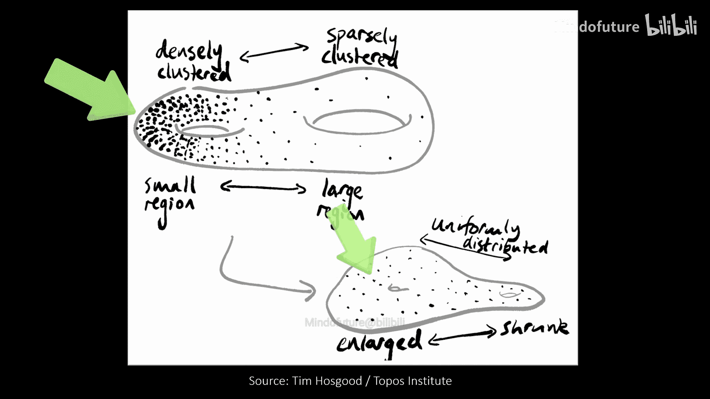

这个公式确保了围绕每个点的“球”能捕获概率质量约为log2(k)。K作为一个全局常数，定义了我们在多大程度上局部地估计度量。设置更高的K值意味着每个点周围有更大的“球”，从而捕获更多的全局结构。

给定这个新的距离函数，我们为数据集中的每个个体点获得了一个局部视图（一个加权的k近邻图）。接下来的挑战是将所有这些个体加权图合并成一个代表整个流形的大型单纯复形。

UMAP通过将图转换为**模糊单纯集**来实现合并。在模糊单纯集中，成员关系不是二元的，而是0到1之间的概率，这正是我们边权重的情况。模糊拓扑中已经定义了合并表示的明确操作。合并后的边权重表示至少有一条边存在的概率。

通过这种合并方法，我们在数学上保证了能获得整个数据集的适当拓扑表示。

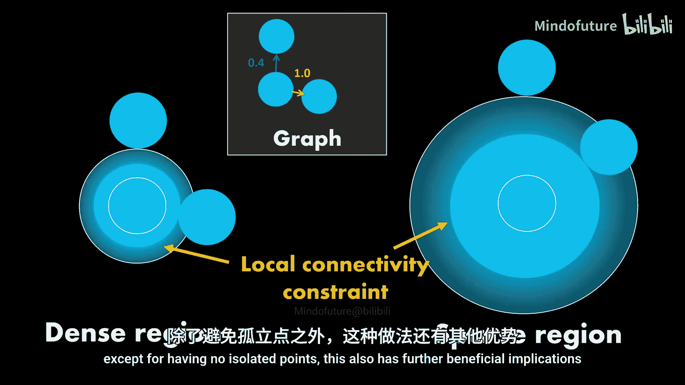

### 第二步：优化低维嵌入

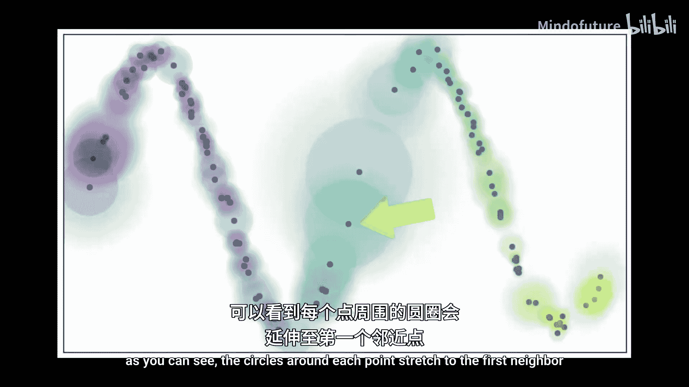

现在，我们有了代表数据结构的加权k近邻图（称为H）。对于低维（2D或3D）空间，我们以某种方式初始化点（通常使用谱嵌入以获得更好的起点）。对于这组点，我们应用与高维空间相同的程序，得到另一个带权边的k近邻图（称为L）。

我们的目标是改变这个低维图，使其尽可能好地近似高维图。由于节点存在一一对应关系，我们只需要比较边，更具体地说，是比较边的权重，即比较两个图的邻接矩阵。

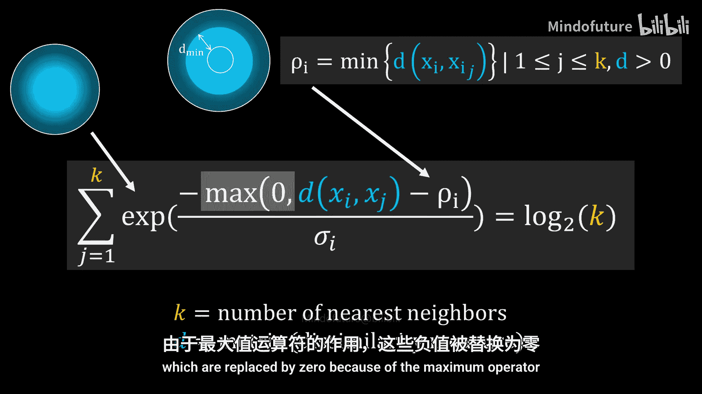

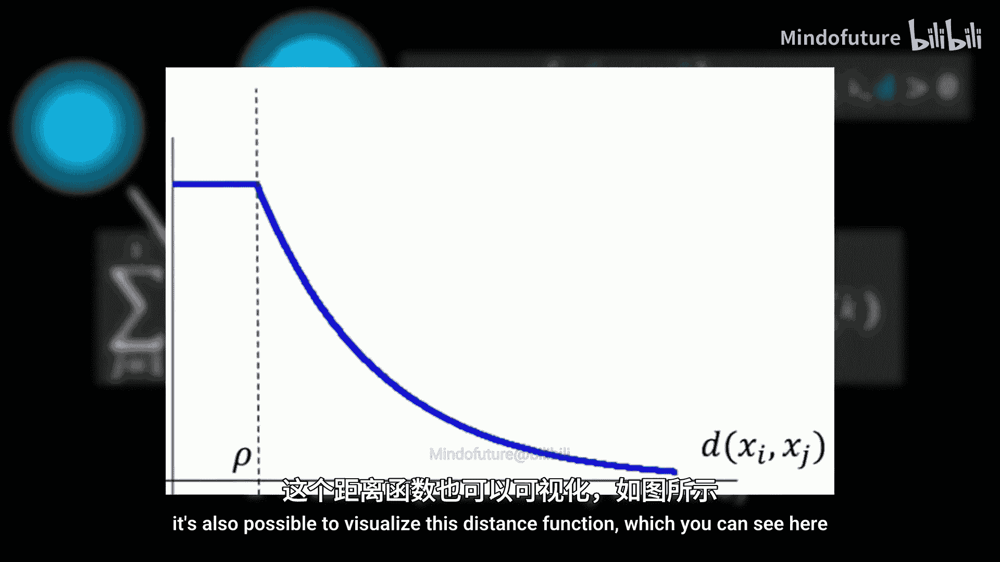

边是伯努利变量，因此对所有存在的边使用交叉熵来比较是合理的。损失函数如下：

```
C = ∑_{i,j} [ a_{ij}^H log(a_{ij}^L) + (1 - a_{ij}^H) log(1 - a_{ij}^L) ]
```


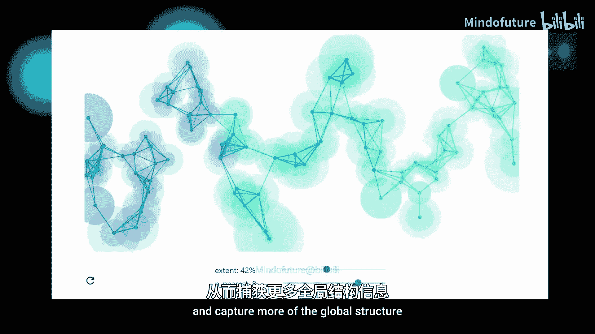

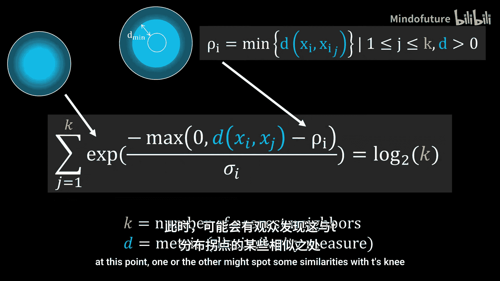

其中 `a_{ij}^H` 和 `a_{ij}^L` 分别是高维和低维图中节点i和j之间的边权重（概率）。第一项确保当高维图中边概率高时，低维点彼此靠近；第二项确保概率低的点在嵌入空间中远离。

使用这个损失函数，我们可以通过随机梯度下降同时优化所有点的位置。这对应于一种力导向图布局算法，点之间相互吸引或排斥直到达到稳定状态。

## 实现细节与超参数

以下是UMAP实现中的四个额外细节：
1.  **寻找k近邻**：使用高效的“最近邻下降”算法，其经验复杂度接近线性。
2.  **损失函数简化**：实际实现中对损失函数进行了轻微简化。
3.  **负采样**：使用负采样技术，避免处理邻接矩阵中的所有负边，以加速优化。
4.  **初始化**：低维点的初始化不是随机的，而是使用**谱嵌入**技术，为低维点提供更好的起始位置。

UMAP有两个主要超参数：
*   **n_neighbors**：控制局部与全局结构的平衡。较小的值强调局部结构，较大的值捕获更多全局结构。
*   **min_dist**：控制低维嵌入中点聚集的紧密程度。较小的值会使点更紧密地聚集。

## 代码实践

现在让我们进行一些动手编码。首先，我们导入必要的库并加载数据。

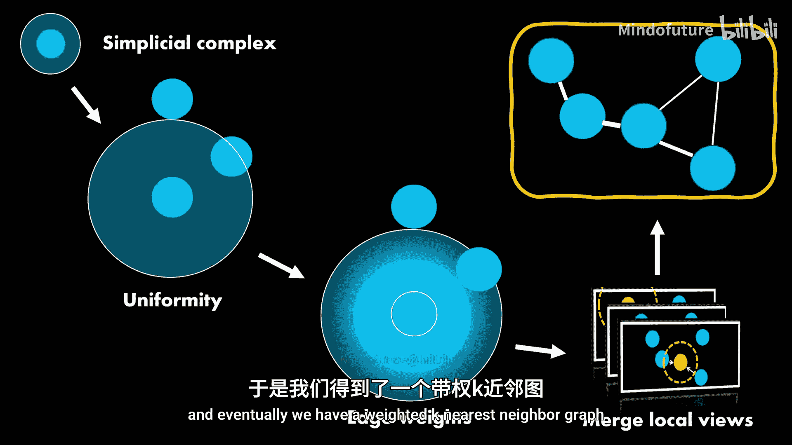

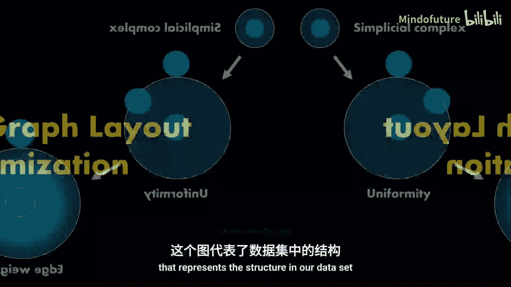

```python
import umap
import numpy as np
import matplotlib.pyplot as plt
from sklearn.datasets import load_digits

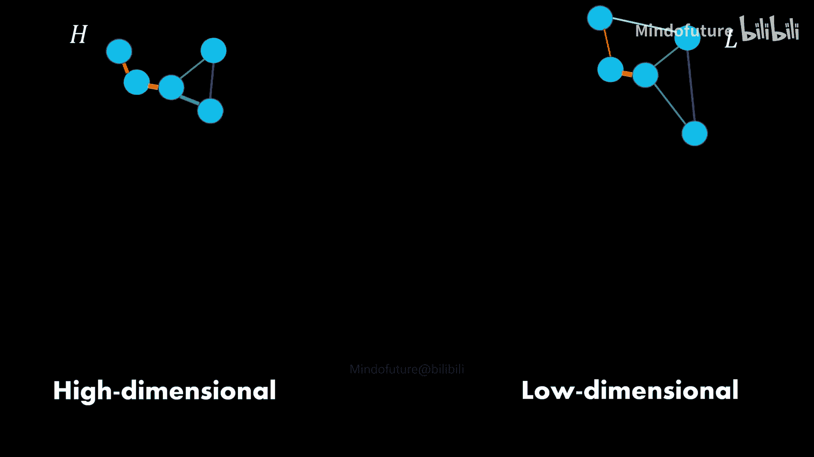

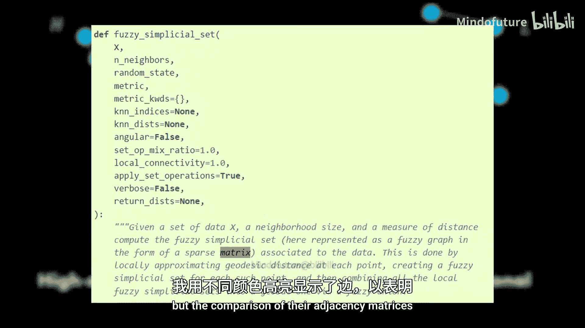

# 加载示例数据集
digits = load_digits()
data = digits.data
labels = digits.target
```

接下来，我们创建UMAP转换器并拟合数据。我们将尝试二维和三维嵌入。

```python
# 创建UMAP转换器，降至2维
reducer_2d = umap.UMAP(n_components=2, n_neighbors=15, min_dist=0.1, metric='euclidean')
embedding_2d = reducer_2d.fit_transform(data)

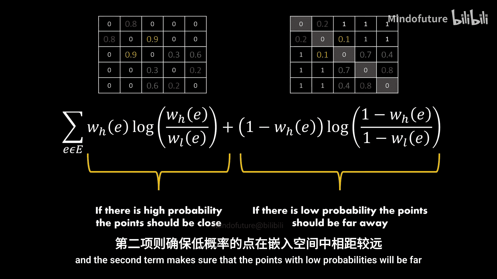

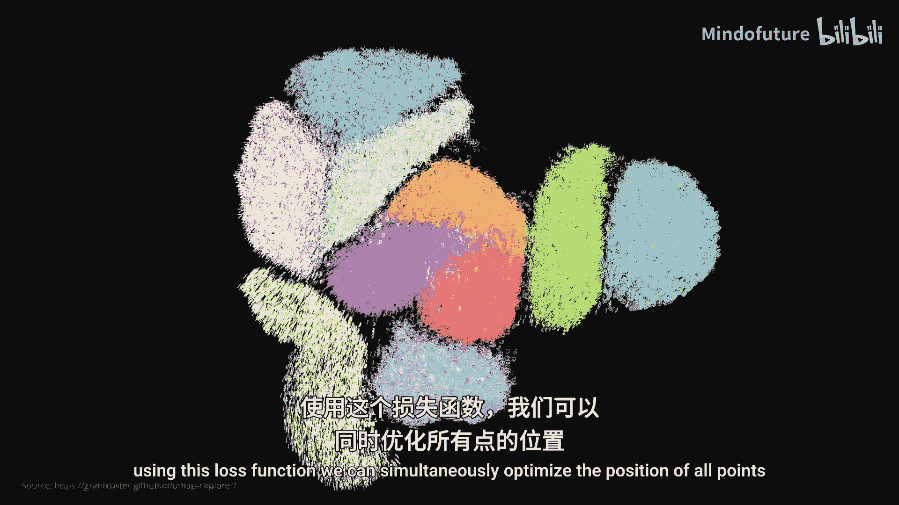

# 创建UMAP转换器，降至3维
reducer_3d = umap.UMAP(n_components=3, n_neighbors=15, min_dist=0.1, metric='euclidean')
embedding_3d = reducer_3d.fit_transform(data)
```

现在，我们可以可视化结果。

```python
# 可视化2D嵌入
plt.figure(figsize=(10, 8))
scatter = plt.scatter(embedding_2d[:, 0], embedding_2d[:, 1], c=labels, cmap='Spectral', s=5)
plt.colorbar(scatter, boundaries=np.arange(11)-0.5).set_ticks(np.arange(10))
plt.title('UMAP projection of the Digits dataset (2D)')
plt.show()
```

UMAP包本身维护良好，文档详尽，并提供了许多示例。`n_neighbors`、`min_dist`、`n_components`和`metric`是其核心参数。

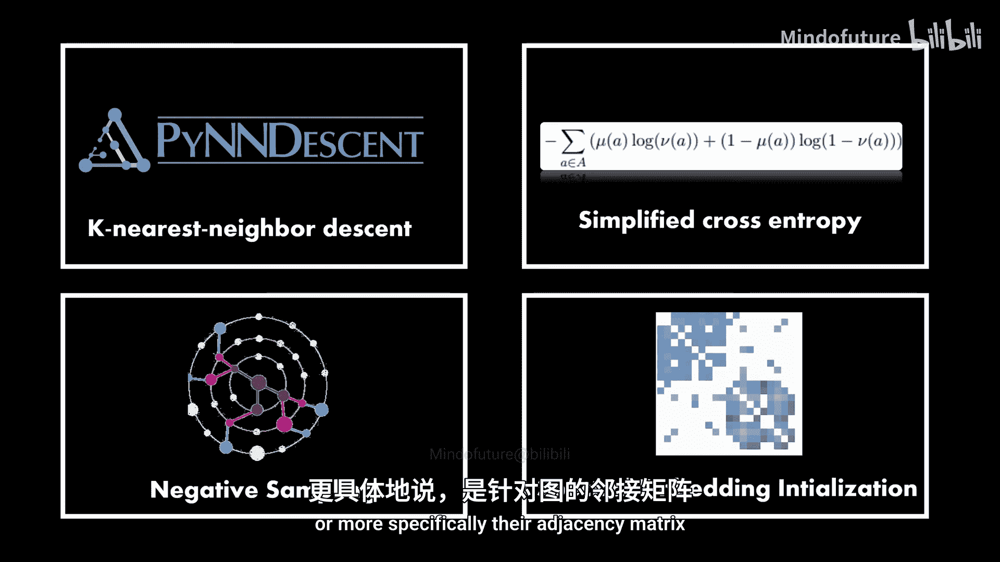

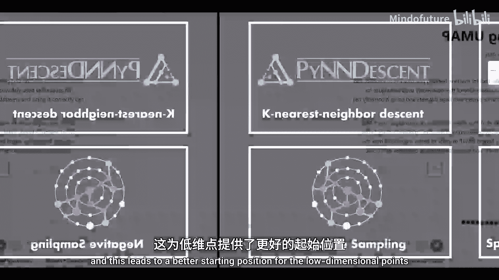

## UMAP与t-SNE的比较

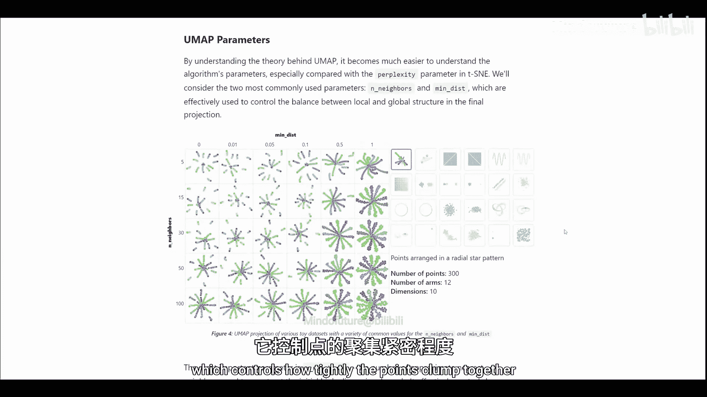

UMAP和t-SNE在许多方面非常相似，因为它们都基于最近邻创建低维嵌入。

观察它们的距离函数，可以发现一些相似之处：两者都使用指数核，并有一个参数（σ或ρ）来控制强度。UMAP额外增加了局部连通性约束，这对保持全局结构有益。

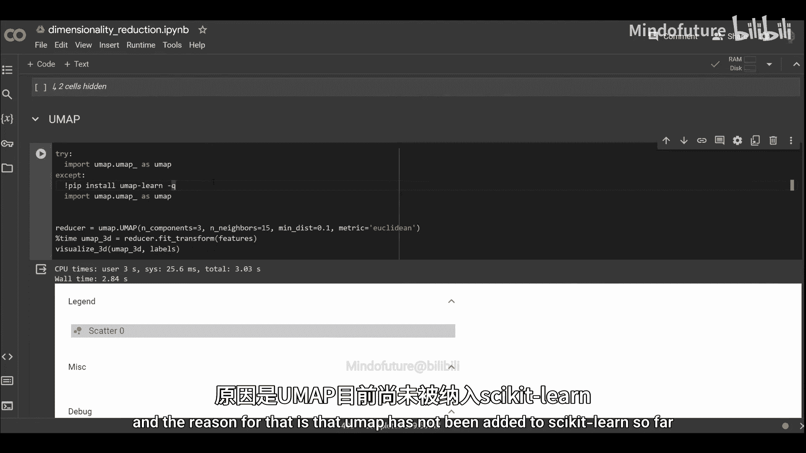


在t-SNE中，我们使用困惑度来调整局部和全局视图之间的分辨率尺度。在UMAP中，我们使用邻居数量，这不仅更直观，而且更容易选择。

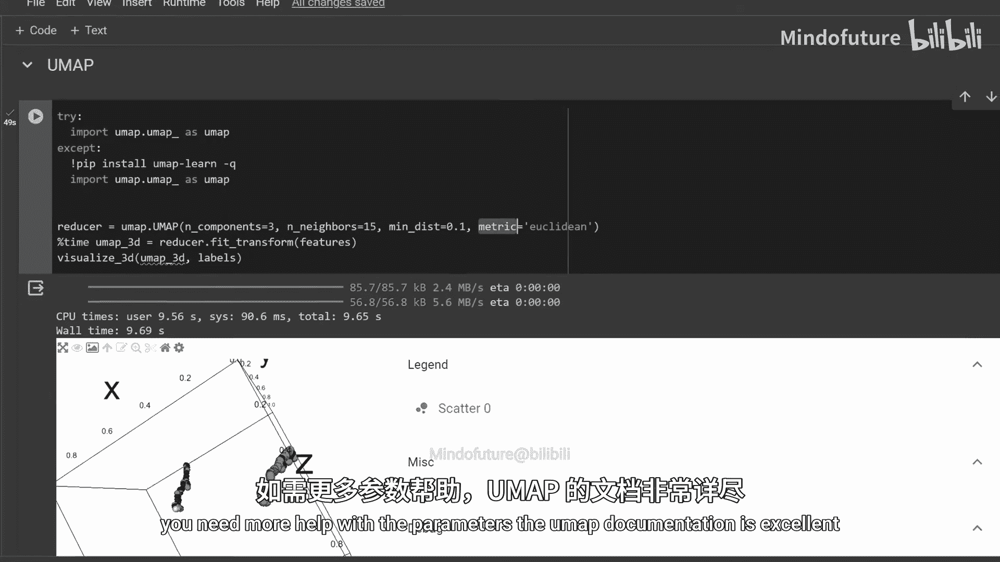

有文献讨论了二者之间更多的联系，并认为UMAP只是t-SNE的一个特例。

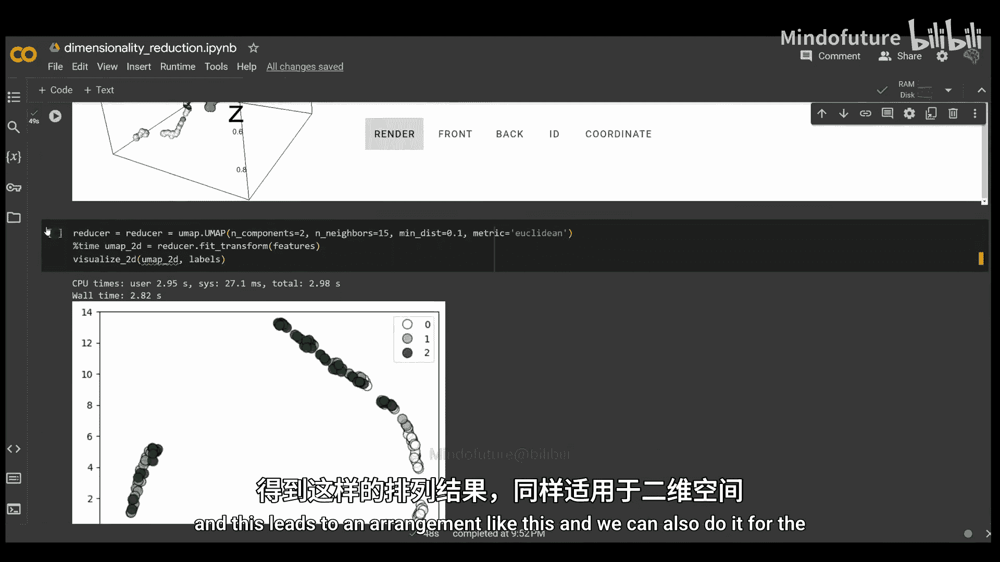

让我们完成本系列的比较表：

| 特性 | UMAP |
| :--- | :--- |
| **类型** | 局部、非线性流形学习 |
| **主要目的** | 可视化与数据分析 |
| **确定性** | 否（使用了随机近似以加速） |
| **计算复杂度** | ~ O(N^1.14) （经验估计） |
| **关键超参数** | `n_neighbors`, `min_dist` |
| **核心思想** | 构建模糊单纯复形，最终得到加权k近邻图 |
| **流行领域** | 生物信息学等 |

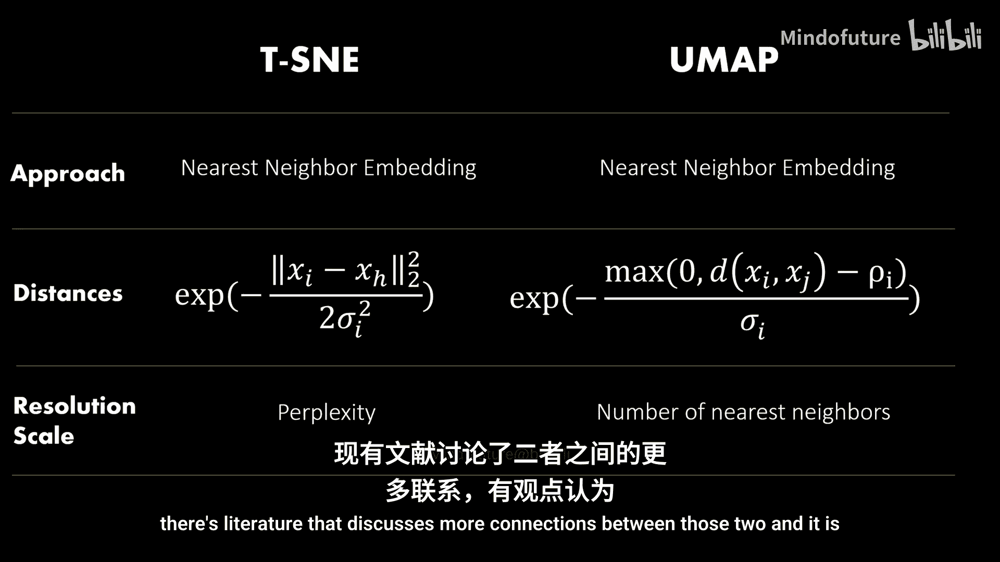

## 总结

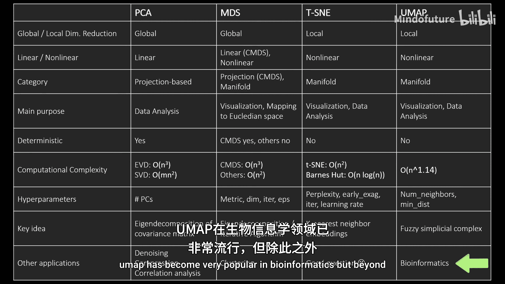

本节课中我们一起学习了均匀流形近似与投影（UMAP）。我们从拓扑数据分析的基础知识开始，理解了UMAP如何通过构建加权k近邻图来捕捉数据流形的局部和全局结构。我们详细探讨了其算法的两个核心步骤：构建高维拓扑表示和优化低维嵌入。通过代码实践，我们看到了UMAP的应用。最后，我们比较了UMAP与t-SNE的异同，并总结了UMAP的特性。

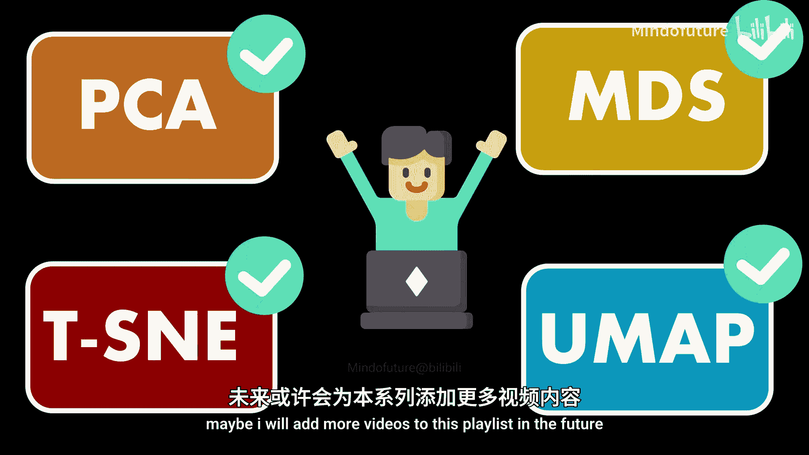


恭喜你完成了整个降维技术系列！我们介绍了PCA、MDS、t-SNE和UMAP这四种关键技术，为你打下了坚实的基础。当然，降维领域还有许多其他方法，未来可能会继续补充。感谢观看！