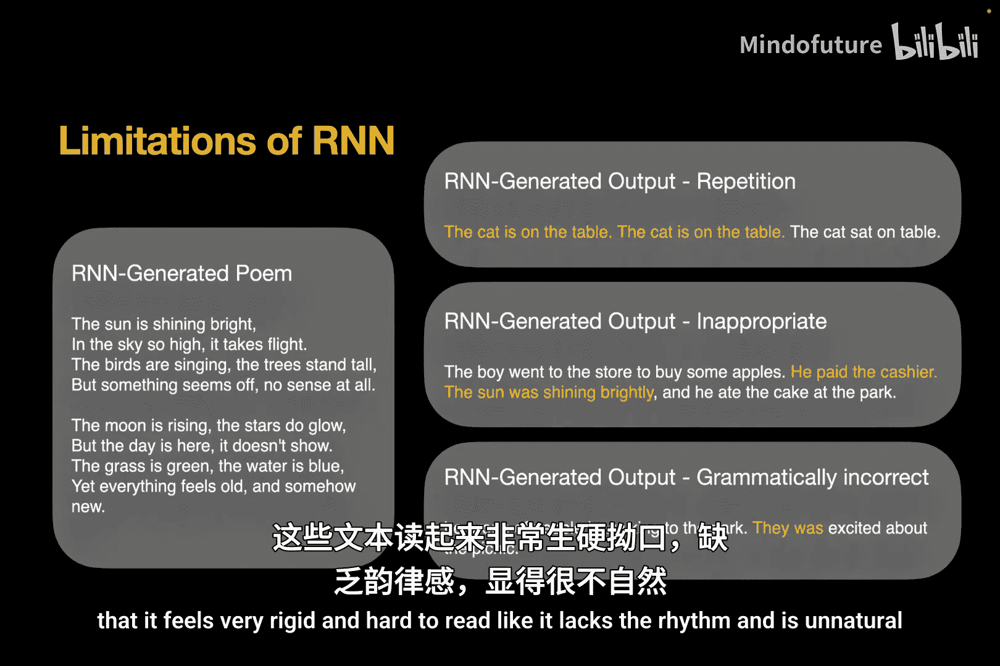
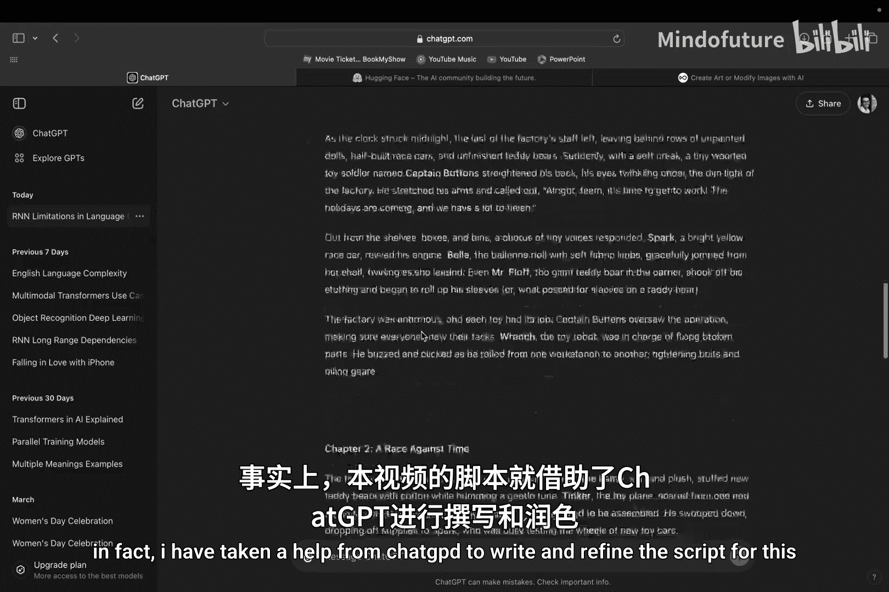
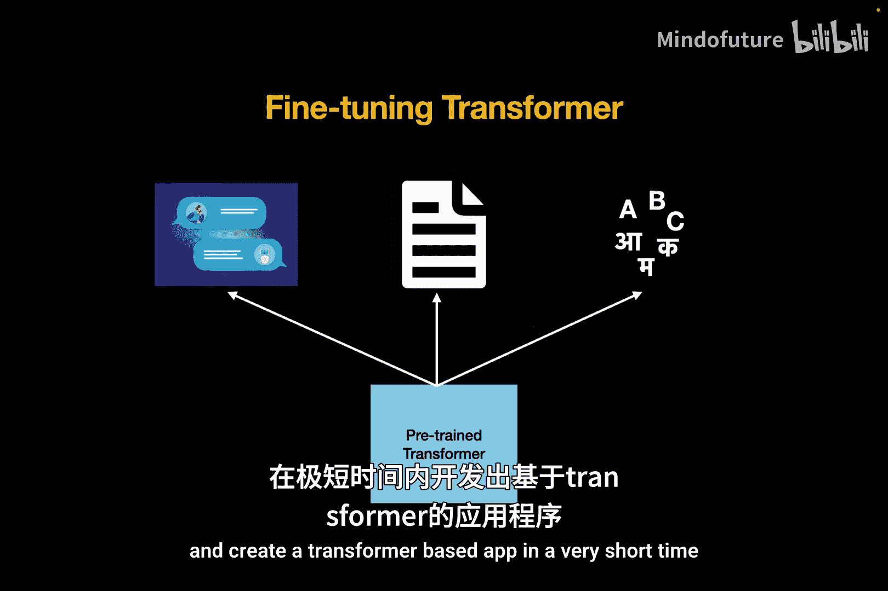
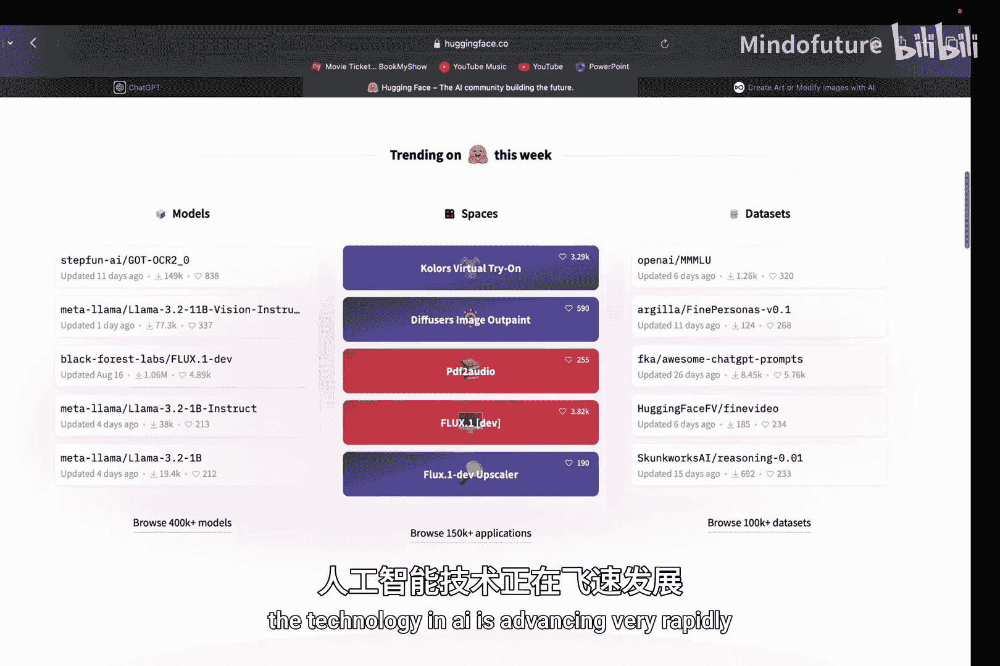
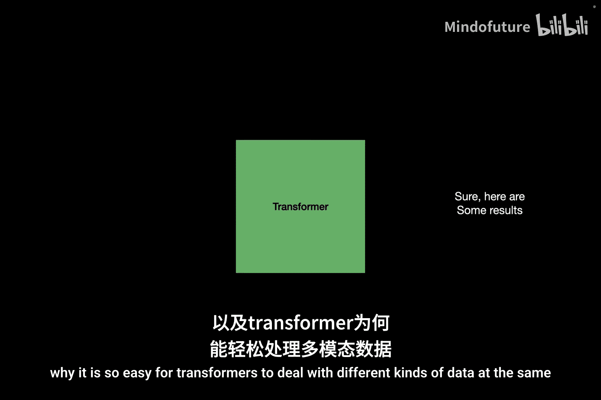

# 001：Transformer简介 🚀

在本节课中，我们将深入探讨人工智能领域最具突破性的进展——Transformer架构。Transformer是一种深度学习模型，它彻底改变了AI行业，是ChatGPT、谷歌翻译、Meta AI以及DALL-E等图像生成工具的核心。我们将了解什么是Transformer，它为何如此强大，并概述本系列课程的学习目标。

---

## 概述

从本视频开始，我们将深入探讨人工智能领域最具突破性的进展，那就是Transformer。Transformer是如今彻底改变AI行业的深度学习模型。它们是ChatGPT、谷歌翻译、Meta AI以及DALL-E等图像生成工具的关键组成部分。Transformer使得AI能够执行理解和回应自然语言等认知任务，而所有先前的模型都未能做到这一点。如今，Transformer已经非常先进，甚至被用于计算机视觉任务。

那么，什么是Transformer？它们是如何变得如此强大的？这正是我们将在本系列视频中学习的内容。我们将了解什么是Transformer，是什么让它们如此特别，并详细剖析Transformer的每一个组成部分。我们不会像互联网上大量内容那样只停留在表面概述，而是会深入探讨其背后的数学原理、科学家们决定在Transformer架构中加入某些组件的原因，以及这一切如何神奇地协同工作。

在本系列课程结束时，我的目标是让你能够极其详细地理解Transformer架构和设计，并能够在纸上从头开始复现它。这将是一门中级课程，你需要对神经网络、循环神经网络有基本的理解，最好也了解卷积神经网络。一旦你了解了这些知识，理解Transformer的工作原理就会变得非常容易。如果你之前没有学习过神经网络和循环神经网络，可以点击右上角的“i”按钮，它会带你进入我的神经网络和循环神经网络播放列表。

---

## RNN的局限性

上一节我们介绍了本系列的学习目标。本节中，我们来看看Transformer出现之前，主流模型RNN（循环神经网络）存在哪些局限性，这些局限性正是催生Transformer的原因。

如果你阅读RNN生成的文字，会发现它们虽然不错，但缺乏句子中的自然流畅感。有时会出现单词或句子的重复，有时内容不恰当。例如，它会突然将上下文切换到完全不同的内容，或者有时语法不正确。我们甚至有很多由RNN生成的诗歌例子。但当我们阅读它们时，会感觉非常生硬、难以阅读，缺乏节奏感且不自然。

另一方面，基于Transformer的应用程序生成的文字非常好，甚至可以帮助我们纠正语法错误，并改善电子邮件、文章或消息中文字的自然流畅度。事实上，我在编写本视频脚本时，就借助了ChatGPT来撰写和润色。

那么，RNN到底存在什么问题？如果你还记得，RNN是这样工作的：我们在不同的时间步依次传递输入单词，并更新这个隐藏状态，它充当记忆上下文。这个记忆上下文在每个时间步都会被每个新单词覆盖，在句子结束时，记忆上下文理论上拥有整个句子的上下文摘要。

RNN的问题在于，其记忆上下文是有限的，只能存储有限数量的数据，并且每个新单词都会更新它。它可能不记得在句子开头看到的内容，这被称为**梯度消失问题**——句子开头的梯度在句子后期被覆盖或消失了。我们确实尝试通过LSTM和GRU等RNN模型的变体来解决这个问题，并在一定程度上增加了句子长度。但即使是LSTM和GRU，它们的记忆上下文也是有限的，在处理像多个段落、文章或论文这样的大句子时，仍然难以应对梯度消失问题。因此，RNN无法处理长文本中的**长距离依赖**，即出现在句子开头的单词与出现在句子末尾的单词之间的关系。

假设我们以某种方式克服了梯度消失问题，并能够保存文章的整个上下文。这种顺序处理输入的另一个问题是，处理长句子需要更多时间，因为输入是按顺序处理的，我必须等待前一个输入处理完毕才能处理当前输入。通读整篇文章需要更多时间，因此训练会非常慢。

除此之外，RNN仍然有一些无法完全解决的局限性。例如，英语中有很多单词在不同的上下文中可能意味着完全不同的事物。英语语言有很多错综复杂和微妙之处，基于RNN的模型无法解释。

一个单词在英语中可以表示不同的事物。例如，如果我提到单词“light”，你会想到什么？可能是人类眼睛可见的波长光谱。但如果我说“light weight”，这与作为波长的“light”无关，现在我们的上下文完全转移到了重量度量上，指的是重量较轻的东西。那“light blue”呢？现在上下文完全转移到了颜色上，表示较浅的蓝色阴影。再说“light a candle”，现在“light”充当动词。同一个单词在不同的上下文中可能意味着完全不同的事物。

RNN无法解决这个问题，这就是为什么RNN生成的单词感觉不自然或生硬。

RNN无法解决这个问题的原因是它使用**词嵌入**来表示单词。词嵌入是向量中的一组固定数字，对应于对象的某些特征。例如，单词“apple”的词嵌入可能有一些较高的值对应于“科技”，也可能有一些较高的值对应于“水果”，但它是一个固定的向量。如果我有两个句子：“I love Apple phones”和“I love Apple juice”，那么我将在两个句子中使用相同的固定词嵌入来表示单词“apple”。假设它的值有50%的科技属性和50%的水果属性。现在，因为它50%科技、50%水果，所以无法有效地表示该句子中“apple”这个词。我需要的是能够根据上下文灵活、动态地改变单词“apple”的词嵌入的能力。例如，如果我谈论的是苹果汁，我希望“是水果”、“是食物”等属性的值更高；当我谈论苹果手机时，我希望“是科技”、“能打电话”、“智能”等属性的值更高。只有使用这种词嵌入，我才能有效地表示该上下文中的单词“apple”。

---

## Transformer的核心：自注意力机制

上一节我们探讨了RNN的局限性，特别是其无法动态理解上下文。本节中，我们将介绍Transformer解决此问题的核心机制——自注意力。

Transformer拥有这种能力，它可以动态改变单词的词嵌入表示，因为Transformer使用了称为**自注意力**的机制。自注意力是Transformer的核心，使其异常强大。我们将在后续视频中深入探讨自注意力，这里先简要介绍它是什么。

自注意力是一种机制，用于捕捉输入句子中单词之间的依赖关系和关联。它会创建一个映射，告诉哪些单词彼此密切相关。例如，如果我有这个句子“I love Apple”，那么自注意力可能会在单词“I”和“love”之间建立紧密的依赖关系，表明主语“I”正在执行“love”这个动作。同样，它可能在单词“apple”和“phone”之间建立紧密的依赖关系，表明这两个词在句子中是一起的。

一旦识别出这些依赖关系，它将为句子中的每个单词生成一个新的词嵌入表示。例如，如果我将“I love apple phones”这个句子输入自注意力机制，它会尝试识别相关和依赖的单词，并基于这种依赖关系，改变该句子中每个单词的嵌入表示。因此，最初“apple”有50%科技和50%水果属性，经过自注意力处理后，它会更多地偏向科技侧，将其表示为一家科技公司。这样，它就被一个更丰富的嵌入所取代，这个嵌入代表了“apple”在这个句子中的真实含义。同样，如果我有“Apple juice”，那么它可能会在单词“apple”和“juice”之间建立紧密的依赖关系，并将“apple”的词嵌入更多地偏向水果侧。理解这一点非常重要，所以我将再举一个例子来解释。

以“light”为例。如果最初“light”的词嵌入与“闪光”、“明亮”、“波”等相关，那么在自注意力操作之后，它将修改单词“light”的嵌入，使其更恰当地表示句子中的上下文。如果我谈论的是“light weight”，那么“light”的词嵌入将更多地偏向“轻盈的”、“重量”、“精致”、“透气”等词。如果我谈论的是“light blue”，那么它将更多地偏向颜色侧，也许介于蓝色和白色之间。如果我说“light-headed”，它可能会转向“放松”、“昏厥”或“头晕”等词。由于Transformer的这种能力，Transformer理解和生成的语言自然流畅。它理解“Apple phones”与“Apple juice”的含义区别。

不仅如此，这还赋予了Transformer想象不存在事物的能力。例如，如果我要求ChatGPT生成一张“长满叶子的云”的图片。它不会为我生成云和叶子两张独立的图片，而是会识别“长满叶子的”和“云”这两个词之间的关系，并生成完全想象出来的东西。但因为自注意力机制动态改变了单词“cloud”的表示，它会为其添加“长满叶子的”属性，结果将是一朵具有叶子属性的云，使其成为“长满叶子的云”。这难道不令人着迷吗？现在AI甚至具备了像我们人类一样想象事物的能力。

但Transformer的能力不仅限于此，它还能做得更多。你是否想过，同一个英语句子可以有多种解释？例如，以这个句子为例：“She saw the man with the telescope.” 它可以有多种解释，在英语中可能是模糊的。一种解释可能是：她看到了那个拿着望远镜的男人。另一种可能是：她用望远镜看到了那个男人。这两种解释都是有效的。在观察这个句子时，Transformer不仅可以生成一种，还可以生成多种不同的注意力图，捕捉句子的不同解释。在第一种解释中，它可能捕捉“man”和“telescope”之间的关系；而在第二种解释中，它可能捕捉单词“she”和“telescope”之间的关系。生成多种解释后，它可以根据段落的周围上下文选择适当的解释。这被称为**多头注意力**，我们将在本系列后面详细讨论。对于RNN来说，这是绝对不可能做到的。

---

## Transformer的架构规模与并行处理

上一节我们了解了自注意力如何赋予Transformer动态理解上下文的能力。本节中，我们来看看Transformer的架构规模，以及它是如何通过并行处理实现高效训练的。

那么，Transformer是如何做到这些令人着迷的事情的？它的架构有多大？有多复杂？Transformer的规模如何？有多少参数？现代基于Transformer的应用程序拥有非常非常多的参数。OpenAI的GPT-3模型大约有1750亿个参数，这相当于仅可学习参数本身就占用了350GB的数据。你知道GPT-4有多少参数吗？1.8万亿。这相当于3.6TB的参数。很疯狂，对吧？那么你应该问我，训练如此庞大的模型是如何可能的？训练它们可能需要数年时间，也许在你我变老之前都无法完成。

我对这个问题的回答是，Transformer拥有另一个RNN无法具备的能力。还记得吗，对于RNN，每个输入单词都是顺序处理的。要处理任何单词，我需要更新其之前所有单词的上下文向量。RNN的这种顺序处理使其非常慢，因此很难用大量数据训练RNN模型。而在Transformer中，我从未说过需要按顺序处理单词。在Transformer中，所有单词同时作为输入传递，新的词嵌入向量是基于它们彼此之间的关系计算出来的。因此，Transformer中没有这种顺序依赖关系。正因为如此，我可以并行处理所有单词。这四个单词是同时处理的。由于这种并行化，我甚至可以使用多个GPU来处理一个长输入句子，同时传递输入中的所有单词，多个GPU将并行处理它们，为每个单词生成新的嵌入表示。因此，如果我的句子有100个单词，那么处理这100个单词所需的时间与处理1个单词所需的时间相同。而类似的事情在RNN中是不可能的。RNN只能使用1个GPU，因为每个单词都是按顺序一个接一个处理的。这使得Transformer的训练速度比基于RNN的模型快得多，甚至预测也更快。虽然涉及1.8万亿个参数，但GPT-4只需几秒或几毫秒就能做出响应。正因为如此，“大语言模型”（LLM）这个术语才成为行业的热门词汇，因为现在人们可以轻松地用海量数据训练模型。

之前我说过，RNN难以处理长距离依赖或捕捉彼此相距很远的单词之间的关系（可能相隔多个段落）。自注意力和Transformer在这方面有帮助吗？由于我们并行同时处理单词，我可以将所有单词视为处于同一空间中。无论单词在句子中相距多远，我都可以计算它们之间的依赖关系。通过消除单词的顺序处理，我们甚至解决了捕捉长距离依赖的问题，并且可以处理任意长度的句子。

---

## 迁移学习与多模态能力

上一节我们探讨了Transformer如何通过并行处理实现高效训练。本节中，我们来看看Transformer另外两个关键优势：迁移学习能力和多模态处理能力。

正如我之前所说，我们才刚刚开始列举Transformer的好处。我们还没有结束。另一个使Transformer在工业界被广泛接受并具有巨大可扩展性的特性是，它允许**迁移学习**。什么是迁移学习？你可能以前听说过。迁移学习是一种技术，我分两个阶段训练模型：一个是**预训练阶段**，我训练它执行一些通用任务；另一个是**微调阶段**，我针对特定任务训练它。这最初是在卷积神经网络中引入的。我可以创建一个深度卷积神经网络模型，并对模型进行预训练，使其学习宇宙中的通用特征和通用对象。主要目的是让模型能够理解不同对象的样子，并对这些特征有一个大致的了解。

一旦模型预训练完成，我就可以针对特定任务（如猫狗分类或物体检测）进行微调。与CNN类似，我可以采用一个Transformer模型并对其进行预训练，使其理解通用的英语语言。我会做的是：提供随机的部分句子，并让它预测下一个单词。我将使用来自书籍、新闻文章等的大量此类数据对其进行训练。尽管这种训练没有达到任何特定目的，但模型将对英语语言有一个大致的了解，比如哪些单词彼此相关，它将掌握性别和语法的一般概念。一旦模型对英语语言和单词之间的关系有了大致了解，我就可以采用这个预训练模型，并针对更具体的任务（如问答聊天机器人、文本摘要或语言翻译等）进行微调。同一个预训练模型可以针对多个不同的任务进行微调。微调需要的数据量和时间比预训练要少得多。由于我已经创建了一个预训练模型并重用于多个不同的应用程序，因此创建特定应用程序的监控成本和时间显著减少。

这种预训练在RNN中是不可能的，或者即使可能，由于RNN有限的记忆上下文大小及其在大量数据上训练的局限性，效果也不是很好。如果没有预训练和微调阶段，传统的RNN将需要从头开始分别针对所有这些特定任务进行训练，从而显著增加成本和时间。此外，由于Transformer模型的这一特性，我们能够快速扩展并在很短的时间内创建基于Transformer的应用程序。最近，一家名为Hugging Face的公司在该行业变得非常流行，它提供了各种预训练的基于Transformer的模型，以及用少量数据和几行代码进行微调的工具。任何新的AI初创公司都可以来到这个平台，Hugging Face将提供开箱即用的预训练模型，并帮助他们根据需求在特定任务上微调该模型，而无需从头开始创建和训练模型。这难道不神奇吗？当我第一次了解到这一点时，我感到非常惊奇。现在，任何人都可以在很短的时间内创建可扩展的大语言模型，这些模型可以像我们人类一样执行认知任务。技术和AI正在飞速发展。

最后，我想讨论的Transformer的最后一个特性是**多模态**。Transformer中的自注意力不仅可以用于解释文本，还可以用于解释不同类型的数据，如图像、音频和视频。它可以理解和生成跨不同数据类型的内容。这意味着我可以输入我想要生成的图像的文本描述，Transformer将生成一张图像；或者，另一方面，我可以向Transformer输入一张图像，它可以生成该图像的文本描述；或者，我可以同时提供图像和文本作为输入，并向其提出一些具体问题。这个处理视觉和语言的领域被称为**视觉语言模型**。

在本系列后面，我们将看到这是如何完成的，以及为什么Transformer如此容易同时处理不同类型的数据。OpenAI有一个名为DALL-E的应用程序，你可以在其中给出你想要生成的图像的描述，它将为你生成一张图像。甚至在生成图像之后，你还可以根据你的需求进行细化，比如你可以改变面部表情或改变图像中的其他一些细节。借助Transformer，我们可以融合来自不同模态的信息，从而产生更丰富、更具上下文感知能力的模型，该模型可以同时处理图像、文本、音频和视频。通过这种方式，AI能够比历史上任何时候都更接近地模仿人类的理解和创造力。

---

## 总结与展望

本节课中，我们一起学习了Transformer架构的简介。我们首先概述了Transformer在AI领域的重要性及其应用。接着，我们探讨了其前身RNN模型的局限性，包括梯度消失问题、顺序处理的低效性以及无法动态理解上下文。然后，我们深入介绍了Transformer的核心——自注意力机制，它如何通过计算单词间的关系来动态生成上下文相关的词嵌入，从而解决RNN的不足。我们还了解了Transformer庞大的参数规模和高效的并行处理能力，这使得训练大语言模型成为可能。最后，我们讨论了Transformer支持迁移学习和处理多模态数据（文本、图像、音频、视频）的强大特性，这使其成为当今最先进的AI模型基础。

我非常高兴能带你继续探索Transformer的工作原理。我们将看到Transformer的每一个组成部分，是什么构成了Transformer，以及它们为何如此有效。我们不仅会看到直观的表面概述，还会深入探讨其中的数学原理。和往常一样，如果你觉得本视频有帮助，请点击点赞按钮，与你的朋友分享，因为制作这样的视频需要很多精力。考虑订阅并支持本频道，以便我能继续制作更多这样的未来视频。请在下面的评论部分告诉我你对本视频的看法，我们下期再见。

