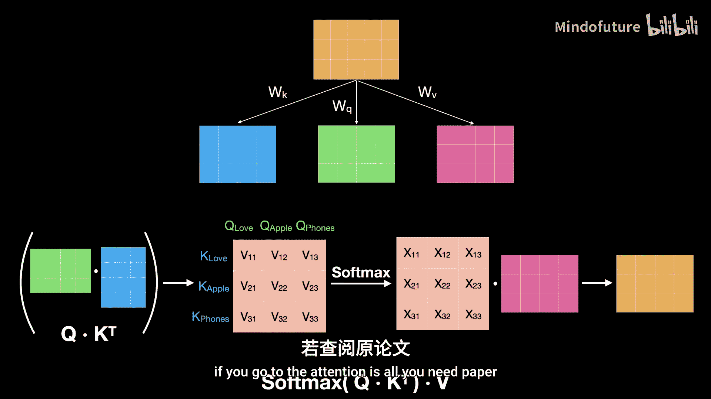

# 002：自注意力机制详解

在本节课中，我们将要学习Transformer架构的核心——自注意力机制。我们将从零开始，一步步理解它要解决的问题、其工作原理以及它为何如此强大。

## 概述：为何需要自注意力？

在自然语言中，同一个词在不同的上下文中可能具有完全不同的含义。例如，“light”这个词，在“light weight”中表示“轻的”，在“light blue”中表示“浅色的”，在“light a candle”中则表示“点燃”。传统的词嵌入模型为每个词分配一个固定的向量表示，无法根据上下文动态调整其含义。自注意力机制的目标，就是为句子中的每个词生成一个**上下文相关的词表示**，使其能更准确地反映该词在特定句子中的真实含义。

上一节我们介绍了自注意力要解决的核心问题，本节中我们来看看它是如何具体实现的。

## 从问题到解决方案

要生成“Apple”在句子“I love Apple phones”中的新表示，我们需要考虑句子中所有其他词对它的影响。一个直观的想法是，新的“Apple”表示可以由句子中所有词的词嵌入按一定比例组合而成。

以下是构建新词表示的基本思路：

*   **新表示构成**：新“Apple” = (与“love”的关联度 × “love”的词嵌入) + (与“Apple”自身的关联度 × “Apple”的词嵌入) + (与“phones”的关联度 × “phones”的词嵌入)。
*   **核心任务**：关键在于如何计算“Apple”与句子中每个词之间的“关联度”。

这些关联度本质上衡量的是词与词之间的**相似性**。在词嵌入空间中，距离越近的词通常语义越相似。因此，我们可以通过计算词嵌入向量之间的点积来量化相似性。

**公式**：`相似性分数 = 词向量A · 词向量B的转置`

然而，直接计算出的点积分数可能很大、很小甚至是负数，我们需要将其转化为概率分布（总和为1），以便进行加权组合。这里我们使用Softmax函数。

**公式**：`概率 = Softmax(相似性分数)`

最终，新的词表示就是这些概率与对应词向量的加权和。

## 引入可学习参数

上述基础方法存在两个主要问题：
1.  **缺乏可学习性**：整个过程是固定的数学运算，模型无法通过训练学习针对特定任务调整哪些相似性是重要的。
2.  **对称性问题**：使用相同的词向量计算相似性，会导致“A与B的相似性”等于“B与A的相似性”，这可能不符合实际需求。

为了解决这些问题，我们为每个词引入三个不同的可学习变换，生成三个新的向量：
*   **查询向量 (Query, Q)**：用于“主动询问”与其他词的相关性。
*   **键向量 (Key, K)**：用于“被询问”，提供与其他词匹配的键。
*   **值向量 (Value, V)**：包含词的实际信息内容，用于最终的加权组合。

**生成方式**：`Q = 词嵌入 * W_q`, `K = 词嵌入 * W_k`, `V = 词嵌入 * W_v`
其中 `W_q`, `W_k`, `W_v` 是可训练的权重矩阵。

现在，计算“Apple”与“phones”的关联度，变为计算 `Q_apple` 和 `K_phones` 的点积。这样，关联度计算变得不对称且可学习。

## 完整的自注意力操作流程

以下是计算一个词（例如“Apple”）新表示的具体步骤：

1.  **计算相似性分数**：用“Apple”的查询向量 `Q_apple` 分别与句子中所有词（包括自身）的键向量 `K` 做点积。
    `分数_i = Q_apple · K_i^T`
2.  **应用Softmax**：将所有分数通过Softmax函数，得到归一化的注意力权重（概率）。
    `注意力权重_i = Softmax(分数_i)`
3.  **加权求和**：将注意力权重与对应词的值向量 `V` 相乘并求和，得到“Apple”的新表示。
    `新表示_apple = Σ(注意力权重_i * V_i)`

这个过程会并行应用于句子中的每一个词，为每个词都生成一个全新的、上下文相关的表示。

## 自注意力的优势

自注意力机制带来了两大关键优势：

*   **并行计算**：由于句子中每个词的新表示计算是相互独立的，因此可以完全并行化处理。这与RNN必须按序列顺序处理截然不同，极大地提升了训练和推理速度。其计算复杂度与序列长度呈线性关系，且能充分利用GPU的并行计算能力。
*   **捕获长程依赖**：在计算某个词的表示时，自注意力会直接考虑句子中所有其他词的信息，无论它们距离多远。这有效解决了RNN难以处理长距离依赖的问题。

## 矩阵形式与最终公式

在实际实现中，所有计算都以矩阵形式进行，以提升效率。

假设输入句子矩阵 `X` 的形状为 `(n, d_model)`，其中 `n` 是词数，`d_model` 是词嵌入维度。

1.  计算Q, K, V矩阵：
    `Q = X * W_q`, `K = X * W_k`, `V = X * W_v`
2.  计算注意力分数并应用Softmax：
    `注意力权重 = Softmax( (Q * K^T) / sqrt(d_k) )`
    （注：除以 `sqrt(d_k)` 是为了稳定梯度，防止点积结果过大，这将在后续课程中详解。）
3.  计算输出：
    `输出 = 注意力权重 * V`

**最终公式**：
`自注意力(Q, K, V) = softmax( (Q K^T) / sqrt(d_k) ) V`

这正是论文《Attention Is All You Need》中提出的缩放点积注意力公式。

## 总结

本节课中我们一起学习了Transformer的核心——自注意力机制。我们从**上下文词表示**的需求出发，逐步推导出通过计算词间相似性、引入可学习的Q、K、V向量来动态调整词表示的方法。我们详细剖析了自注意力操作的每一步流程，并理解了它带来的**并行计算**和**捕获长程依赖**的巨大优势。最后，我们看到了其高效的矩阵运算形式及标准数学公式。掌握自注意力是理解现代大语言模型的基础，在接下来的课程中，我们将以此为基础，探索Transformer架构的其他组成部分。