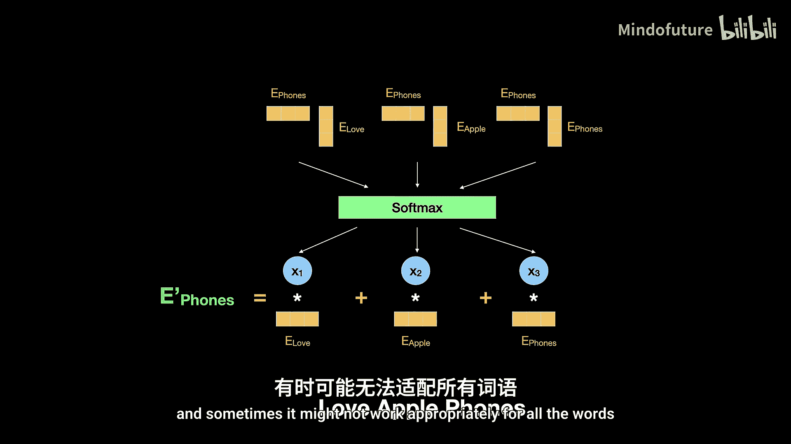
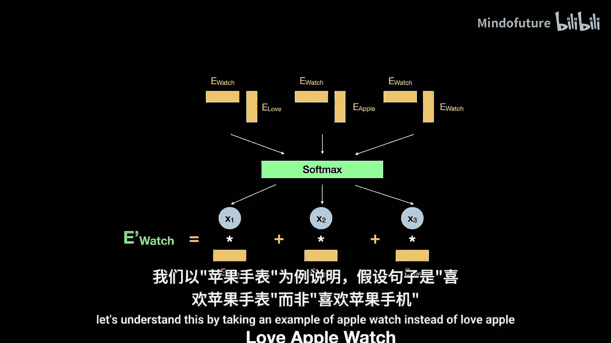
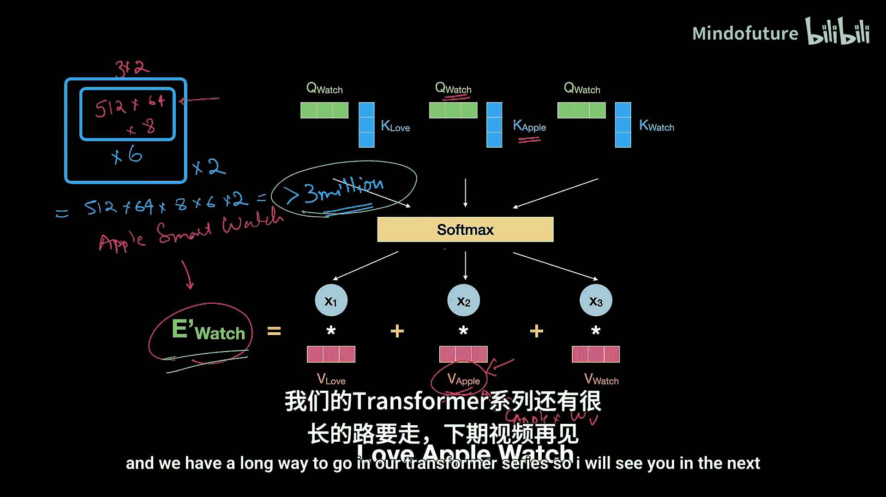

# 003：自注意力中的线性变换

在本节课中，我们将深入探讨自注意力机制中的线性变换。我们将理解为何需要引入可学习的参数，以及线性变换如何帮助模型更准确地捕捉词语间的相关性和生成更贴合上下文的词表示。

在上一节中，我们介绍了自注意力机制的基本操作，并提到需要将输入词嵌入与权重矩阵 **W^Q**、**W^K**、**W^V** 相乘。本节中，我们将详细分析这种线性变换为何是自注意力机制的关键，并通过数学示例证明其有效性。

## 自注意力机制回顾

首先，让我们快速回顾自注意力机制的目的和基本流程。自注意力旨在为句子中的每个词生成一个基于上下文的新表示。例如，在句子“我爱苹果手机”和“我爱苹果汁”中，“苹果”一词的含义不同。我们希望“苹果”的新表示能根据其周围的词（如“手机”或“汁”）进行调整。

以下是自注意力计算新词表示的基本步骤：
1.  为句子中的每个词计算其与所有词（包括自身）的相似度得分。
2.  使用Softmax函数将这些得分转换为概率分布（总和为1）。
3.  将这些概率作为权重，对原始词嵌入进行加权求和，得到新词表示。

在基础版本中，相似度通过词嵌入向量的点积计算：`相似度 = 词嵌入_i · 词嵌入_j`。然而，这种方法存在局限性。

## 基础自注意力的局限性

让我们通过一个例子来理解基础方法的不足。考虑句子“我爱苹果手表”。我们希望“手表”的新表示能体现“苹果智能手表”的含义。

在词嵌入空间中，“手表”的向量可能靠近“时钟”、“时间”等词，而“苹果”的向量可能同时包含“水果”和“科技公司”的属性。因此，直接计算“手表”和“苹果”的点积相似度可能会很低，因为它们的原始向量在空间中可能相距较远。

这会导致两个问题：
1.  **相关性捕捉不足**：生成的“手表”新表示中，来自“苹果”的成分会非常少。
2.  **特征混合不当**：即使加入了一点“苹果”的成分，这个成分也同时包含了“水果”和“科技公司”的特征，而理想情况下，“苹果手表”不应包含“水果”特征。

为了解决这些问题，我们需要在计算相似度和生成新表示时引入**可学习的参数**。

## 引入线性变换

解决方案是将输入词嵌入与三个可训练的权重矩阵相乘：
*   **查询（Query）**：`Q = 词嵌入 * W^Q`
*   **键（Key）**：`K = 词嵌入 * W^K`
*   **值（Value）**：`V = 词嵌入 * W^V`

这种向量与矩阵的乘法操作称为**线性变换**。它在神经网络中很常见，其核心公式为：
`输出 = 输入 * W + b`
在自注意力中，我们通常省略偏置项 `b` 和非线性激活函数，专注于线性变换本身。

线性变换主要实现两个目标：
1.  **改变维度**：例如，将512维的词嵌入向量投影到64维的空间。
2.  **提取并增强相关特征**：这是更关键的作用。权重矩阵 `W` 经过训练后，能够从原始输入中筛选并放大对当前任务（如理解“苹果手表”）最重要的特征，同时弱化或不相关的特征。

## 线性变换如何工作：一个数学示例

让我们通过一个简化的例子来具体理解。假设我们的词嵌入只有三个维度，分别代表三个特征：[是科技产品， 是手表， 是水果]。

我们定义三个词的嵌入向量：
*   **苹果** `[2, 0, 2]`：高“是水果”特征，中等“是科技产品”特征（因为苹果公司）。
*   **橙子** `[0, 0, 3]`：只有高“是水果”特征。
*   **手表** `[1, 3, 0]`：高“是手表”和“是科技产品”特征。

现在，假设我们有一个为电子产品商店训练的权重矩阵 **W**，其目的是提取“科技相关”的特征。我们设定：
`W = [[4, 2, 0], [3, 1, 1]]`

我们对每个词进行线性变换：`新向量 = 旧向量 * W`

*   **苹果**的新向量：`[2, 0, 2] * W = [2*4+0*2+2*0, 2*3+0*1+2*1] = [8, 8]`
*   **橙子**的新向量：`[0, 0, 3] * W = [0*4+0*2+3*0, 0*3+0*1+3*1] = [0, 3]`
*   **手表**的新向量：`[1, 3, 0] * W = [1*4+3*2+0*0, 1*3+3*1+0*1] = [10, 6]`

观察结果：
*   经过变换后，“苹果”的向量`[8,8]`值很高，表明其科技属性被提取和放大了。
*   “橙子”的向量`[0,3]`值很低，表明其科技属性很少。
*   “手表”的向量`[10,6]`也具有高值。

这个新向量空间更专注于“科技相关”的特征。对于模型来说，使用变换后的`[8,8]`来表示“苹果”，比使用原始的`[2,0,2]`更能清晰地表明“苹果科技公司”的含义。

## 线性变换如何解决“苹果手表”问题

现在，我们将这个原理应用到自注意力中。在计算“手表”的新表示时：
1.  **计算查询Q、键K、值V**：
    *   假设 `Q_watch = E_watch * W^Q = [10, 6]` （如上例计算）
    *   假设 `K_apple = E_apple * W^K`，`K_watch = E_watch * W^K`。通过精心设计（实则是训练）`W^K`，我们可以得到类似 `K_apple = [10, 6]`，`K_watch = [4, 4]` 的结果。
2.  **计算相似度**：
    *   `相似度(手表, 苹果) = Q_watch · K_apple = [10,6] · [10,6] = 136`
    *   `相似度(手表, 手表) = Q_watch · K_watch = [10,6] · [4,4] = 64`
3.  **结果**：现在，“手表”与“苹果”的相似度（136）远高于“手表”与自身的相似度（64）。这意味着在生成“手表”的新表示时，“苹果”的贡献将占主导。

同时，`V_apple = E_apple * W^V` 生成的“值”向量，也经过了线性变换，主要包含“苹果科技公司”的丰富特征，而不是“水果”特征。

因此，最终“手表”的新表示将是这些高权重、富含科技特征的向量的加权和，从而能够更准确地表示“苹果智能手表”的概念。

## 模型的强大之处

你可能会问，模型如何为成千上万的词语学会正确的权重？在真实的Transformer模型中，参数规模极其庞大：
*   原始论文中，词嵌入维度为512，线性变换后为64。
*   他们不使用一个，而是使用**8个**这样的权重矩阵组（即8个头），以便从不同角度捕捉信息。
*   这仅仅是**一个**编码器块中的**一个**多头注意力层。一个完整的Transformer模型有6个这样的编码器块，还有解码器部分。

这意味着，处理像“手表”这样的单个词语，一个Transformer块就可能动用数百万个参数。通过在海量文本数据上进行训练，反向传播算法会自动调整这些数以百万计的参数，使模型学会捕捉词语之间复杂的、对任务有用的依赖关系，并生成精准的上下文相关表示。

## 总结

本节课中，我们一起学习了自注意力机制中线性变换的核心作用。我们首先回顾了基础自注意力的局限性，即无法有效捕捉特定上下文下的词语相关性。然后，我们引入了可学习的权重矩阵 **W^Q**、**W^K**、**W^V**，并通过线性变换的数学示例，详细说明了它如何实现**降维**和**提取任务相关特征**这两个关键功能。最后，我们证明了通过引入这些可训练参数，模型能够学会显著提升相关词语（如“手表”和“苹果”）之间的相似度得分，并利用富含相关特征的“值”向量，最终生成更准确、更贴合上下文的新词表示。这为理解Transformer模型强大的表征能力奠定了基础。