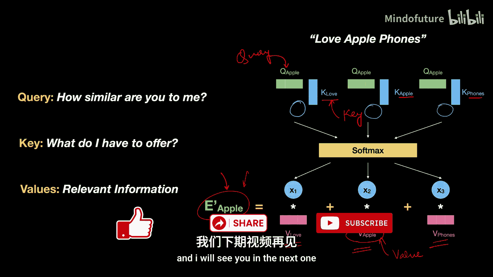
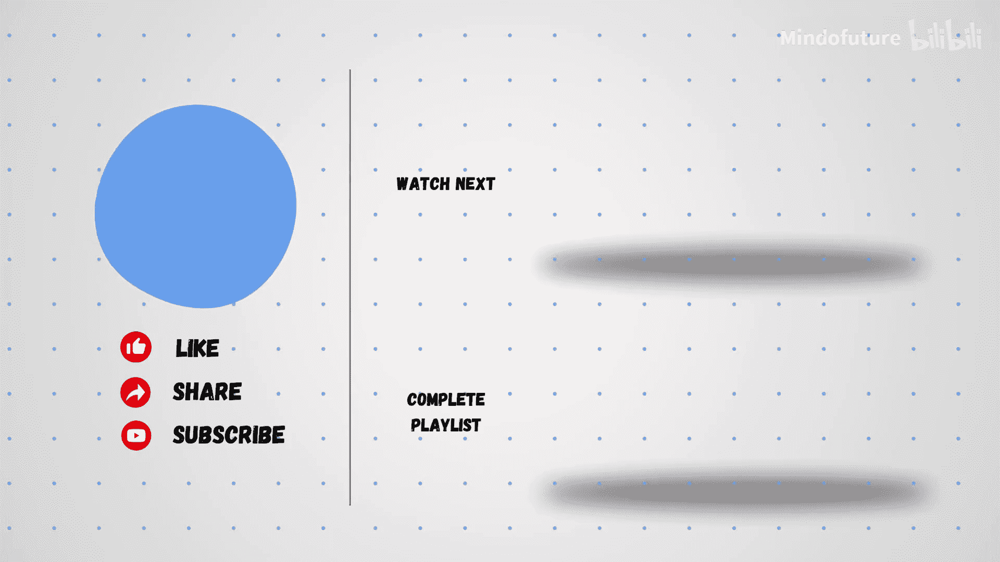

# 004：为什么叫查询、键和值？自注意力机制详解

在本节课中，我们将要学习Transformer自注意力机制中“查询”、“键”和“值”命名的由来。理解这些术语的类比，有助于我们更直观地把握自注意力机制的工作原理。

在上一节关于自注意力的视频中，我们了解到需要将词嵌入向量分别与三个权重矩阵 **W<sub>Q</sub>**、**W<sub>K</sub>** 和 **W<sub>V</sub>** 相乘。你可能会好奇，为什么作者特意选择了“查询”、“键”和“值”这些名称。本节将对此进行解释。

## 计算机科学中的概念类比

在计算机科学中，“查询”、“键”和“值”有特定的含义。我们可以通过一个Python字典的例子来理解。

假设我们有一个字典，它将动物名称映射到其叫声：

```python
animal_sounds = {
    "dog": "woof",
    "cat": "meow",
    "cow": "moo"
}
```

在这个例子中：
*   **键** 是字典的索引，例如 `"dog"`, `"cat"`。
*   **查询** 是我们向字典提出的问题，例如 `animal_sounds["dog"]`。
*   **值** 是查询返回的实际信息，例如 `"woof"`。

字典会根据我们提供的“键”来响应“查询”，并返回对应的“值”。基于不同的键，返回的值也会不同。

## 自注意力机制中的类比

类似的类比被应用在自注意力机制中。在自注意力中，我们将一个词的“查询”向量与句子中所有词的“键”向量进行比较。

例如，我们的句子是“我爱苹果手机”，我们想为“苹果”这个词生成新的表示。

我们会将“苹果”的查询向量 **Q<sub>苹果</sub>** 与“我”、“爱”、“苹果”、“手机”的键向量 **K<sub>我</sub>**、**K<sub>爱</sub>**、**K<sub>苹果</sub>**、**K<sub>手机</sub>** 逐一比较。基于这个比较，会生成一个相似度分数。

你可以这样理解：**Q<sub>苹果</sub>** 在向所有的键向量提出一个查询。它在问：“你们和我有多相似？” 而键向量则通过它们所携带的信息来“回答”这个问题。

这就是为什么这些向量被称为“查询”和“键”向量。查询向量向键向量提出一个具体问题（关于相似度），键向量则用其包含的信息来回应。**Q** 和 **K** 的点积运算最终返回这两个向量之间的相似度分数。

## 值向量的作用

得到相似度分数后，我们会将其输入Softmax函数，转换为概率分布。这些概率随后会与“值”向量相乘。

以下是为什么它们被称为“值”向量的原因：不同“值”向量的加权组合，最终形成了“苹果”这个词的新表示 **E’<sub>苹果</sub>**。

整体上，这个新的 **E’<sub>苹果</sub>** 是由这些值向量按不同比例组合而成的。因此，值向量是构成新词表示的实际的、相关的信息。正因为它们是被传递以生成新表示的实际相关信息，所以这些向量被称为“值”向量。

## 总结

本节课中，我们一起学习了Transformer自注意力机制中“查询”、“键”和“值”命名的来源。我们通过字典的类比，理解了查询提出问题、键作为索引、值作为返回信息的基本概念，并将这一概念映射到了自注意力机制中查询向量与键向量计算相似度、并用值向量加权求和生成新表示的过程。理解这些术语有助于夯实Transformer架构的基础知识。






