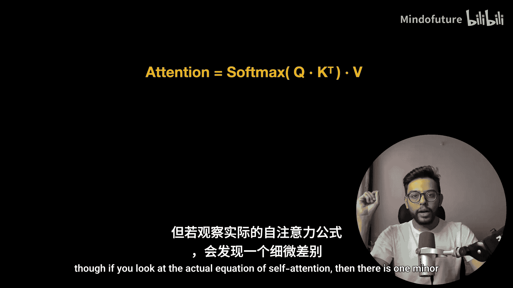
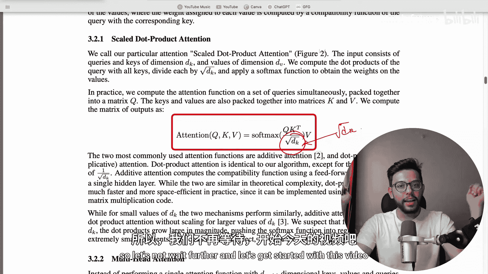
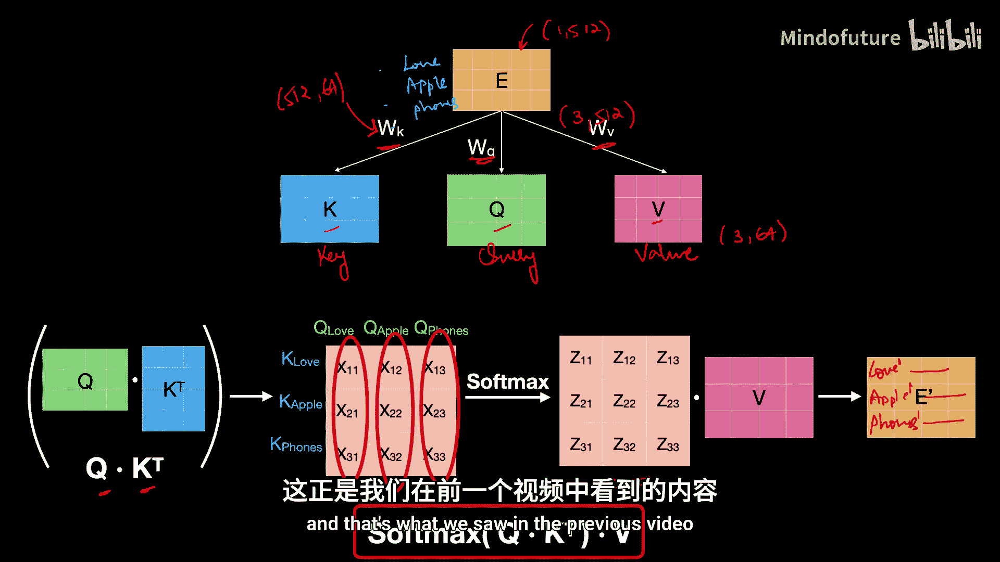
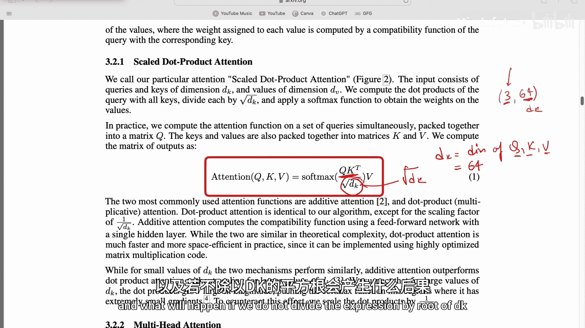
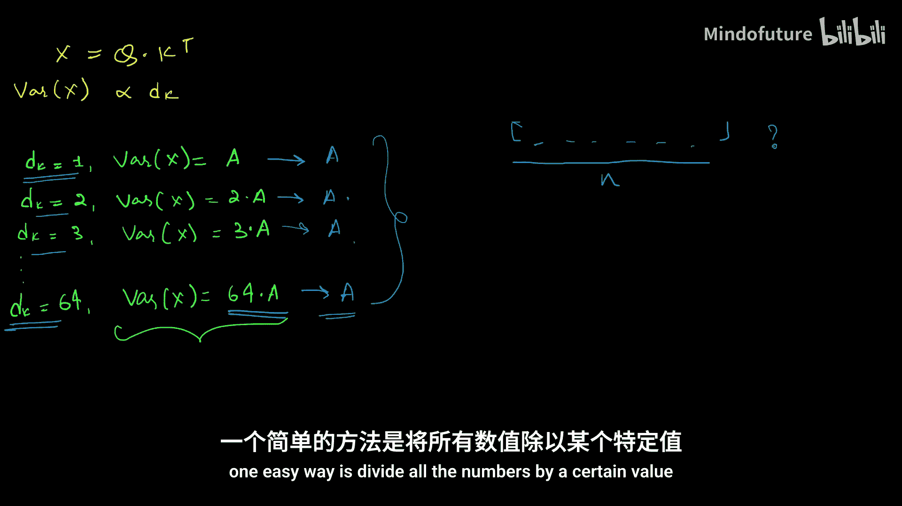
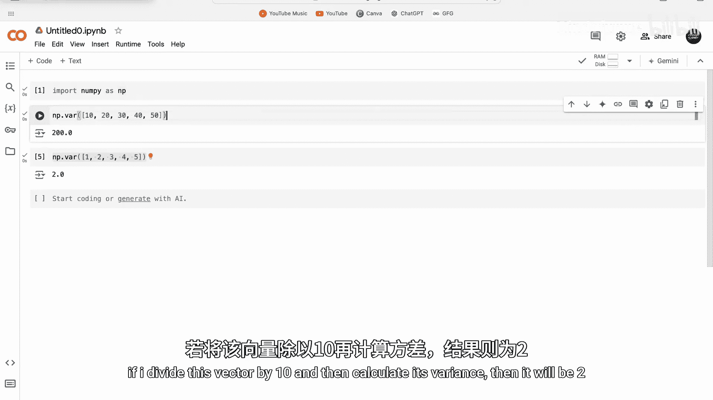
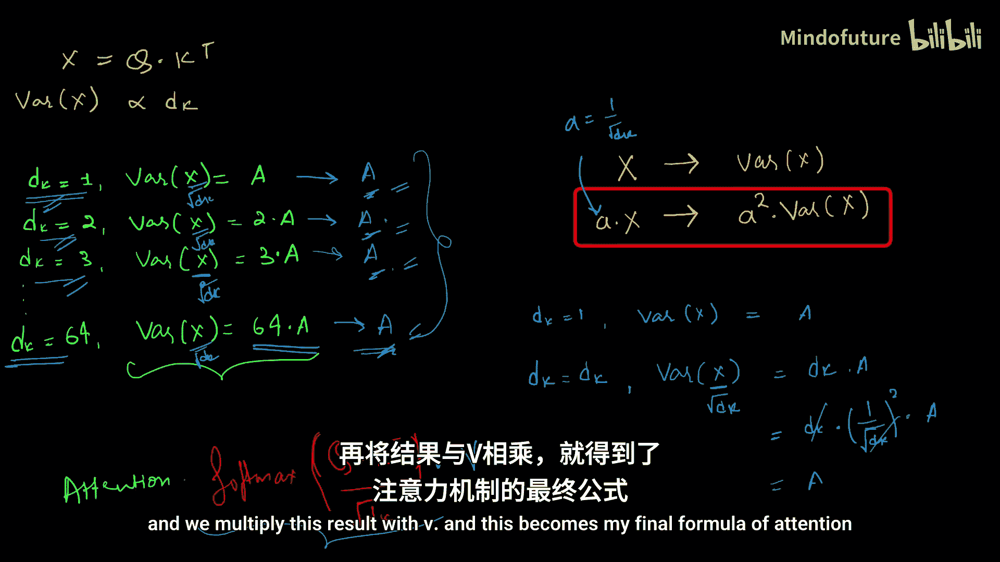

# 005：缩放点积注意力机制 🎯

在本节课中，我们将要学习Transformer架构中的一个核心组件——缩放点积注意力机制。我们将深入探讨其数学原理，特别是为什么需要在计算中引入一个缩放因子。

在上一节中，我们从零推导了自注意力机制的公式。然而，如果你查看原始论文《Attention Is All You Need》中的公式，会发现一个细微但至关重要的区别：在计算点积后，需要除以一个因子 `sqrt(d_k)`。本节中，我们将详细解释这个缩放因子的作用及其必要性。

## 回顾：自注意力机制基础

首先，让我们简要回顾一下上一节的内容。

假设我们有一个句子：“Love Apple Phones”。我们会进行以下操作：
1.  获取每个单词的词嵌入向量，并组成矩阵 `X`。
2.  将 `X` 分别与三个权重矩阵 `W_Q`、`W_K`、`W_V` 相乘，得到查询（Query）、键（Key）和值（Value）矩阵：`Q`、`K`、`V`。
3.  计算 `Q` 和 `K` 的转置的点积，得到注意力分数矩阵，该矩阵表示了单词之间的依赖关系。
4.  对注意力分数矩阵应用 `softmax` 函数，将其转换为概率分布。
5.  将 `softmax` 的输出与值矩阵 `V` 相乘，得到新的、融合了上下文信息的词表示。

我们推导出的公式如下：
`Attention(Q, K, V) = softmax(Q * K^T) * V`

然而，论文中的标准公式是：
`Attention(Q, K, V) = softmax(Q * K^T / sqrt(d_k)) * V`

这里的 `d_k` 是查询和键向量的维度。我们的核心问题就是：**为什么需要除以 `sqrt(d_k)`？**

## 缩放的必要性：方差问题

我们需要除以 `sqrt(d_k)`，主要是基于一个数学特性：**矩阵点积结果的方差与参与计算的向量的维度成正比**。

这意味着什么？假设我们计算 `Q` 和 `K^T` 的点积得到矩阵 `X`。`X` 中每个元素 `x_ij` 是 `Q` 的第 `i` 行向量与 `K^T` 的第 `j` 列向量（即 `K` 的第 `j` 行）的点积。随着向量维度 `d_k` 增大，这些点积结果的值的分布（方差）也会变得更大。

### 直观理解

我们可以通过一个简单的例子来直观感受：

*   假设我们使用维度为2的随机向量（值在-10到10之间）进行点积，结果值的范围可能在-23到23之间，均值接近0。
*   如果使用维度为5的随机向量进行同样的操作，结果值的范围可能扩大到-49到122之间，均值也可能偏离0更远。

显然，高维向量点积结果的数值波动（方差）更大。这是因为点积是多个乘积项的和，维度越高，求和项越多，总和的潜在最大值和最小值就越大，从而导致方差增大。

### 数学关系

在理想条件下（假设矩阵 `Q` 和 `K` 中的元素是均值为0、方差为1的独立随机变量），点积结果矩阵 `C = Q * K^T` 的方差满足：
`Var(C) = d_k * Var(Q_row) * Var(K_row) ≈ d_k`

这表明，`C` 的方差确实与维度 `d_k` 成正比。

## 高方差在深度学习中的问题

那么，在注意力机制中，高方差会带来什么问题？关键在于后续的 `softmax` 操作。

`softmax` 函数的特性是放大输入值之间的差异。对于输入向量 `[7, 3]`，`softmax` 输出可能是 `[0.98, 0.02]`，将70% vs 30%的差异放大到了98% vs 2%。

如果输入 `softmax` 的矩阵 `Q*K^T` 方差很大（即某些值极大，某些值极小），`softmax` 会将其推向极端：某些输出概率接近1，而其他所有输出概率接近0。

这会导致**梯度消失问题**，阻碍模型训练：
1.  在反向传播时，梯度通过 `softmax` 传递。
2.  当 `softmax` 输出非常尖锐（一个值接近1，其余接近0）时，相对于非最大值的输入梯度会变得非常小。
3.  这些微小的梯度在多层网络中反向传播时会不断衰减，最终导致底层网络的权重几乎得不到更新。
4.  模型无法有效利用所有的参数进行学习，训练过程会陷入停滞。

## 解决方案：除以 `sqrt(d_k)`

为了稳定训练，我们需要控制点积结果的方差，使其不随 `d_k` 增大而剧烈变化。目标是将方差保持在一个稳定的水平。

根据方差的性质：如果 `Var(X) = σ^2`，那么 `Var(a * X) = a^2 * σ^2`。

*   设未缩放的注意力分数为 `X = Q * K^T`。
*   在理想情况下，`Var(X) ∝ d_k`。我们可以表示为 `Var(X) = d_k * σ^2`，其中 `σ^2` 是 `d_k=1` 时的基础方差。
*   为了抵消 `d_k` 的影响，我们将 `X` 除以 `sqrt(d_k)`。
*   令缩放后的分数为 `X_scaled = X / sqrt(d_k)`。
*   那么，`Var(X_scaled) = Var(X) / (sqrt(d_k))^2 = (d_k * σ^2) / d_k = σ^2`。

**结论**：通过除以 `sqrt(d_k)`，我们确保了无论查询和键的维度 `d_k` 是多少，输入到 `softmax` 函数的值的方差都大致保持恒定。这防止了梯度消失，使得模型训练更加平稳和高效。

因此，完整的、稳定的缩放点积注意力公式为：
`Attention(Q, K, V) = softmax( (Q * K^T) / sqrt(d_k) ) * V`

## 总结

本节课中我们一起学习了缩放点积注意力机制的核心思想。我们首先回顾了自注意力的计算流程，然后指出了原始公式与标准公式的关键差异——缩放因子 `1/sqrt(d_k)`。

我们深入探讨了其背后的原因：
1.  矩阵点积结果的方差与向量维度 `d_k` 成正比。
2.  高方差的输入会使 `softmax` 输出变得极端，引发梯度消失问题，阻碍深度学习模型训练。
3.  通过除以 `sqrt(d_k)`，我们可以将点积结果的方差归一化，使其不受维度影响，从而保证训练的稳定性。

理解这个缩放步骤对于掌握Transformer架构的细节至关重要。它为接下来学习多头注意力机制奠定了坚实的数学和概念基础。在下一节中，我们将看到如何并行地使用多个这样的缩放点积注意力头，以增强模型捕捉不同子空间信息的能力。