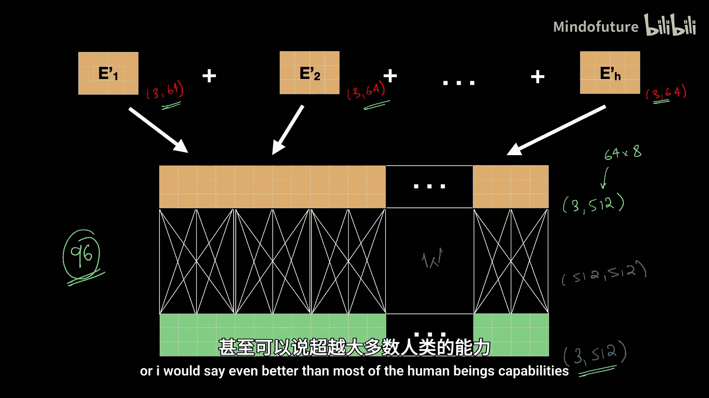

# 006：多头注意力机制

## 概述
在本节课中，我们将要学习Transformer架构中的一个核心组件：多头注意力机制。我们将了解为什么单一的注意力头不足以理解复杂的语言，以及如何通过多个注意力头来捕捉句子中丰富的、多层次的语义关系。

---

## 从单头注意力到多头注意力

在之前的课程中，我们详细介绍了单头注意力机制的工作原理。它通过分析句子中词语之间的关系，为每个词生成基于上下文的新表示。然而，语言是极其复杂的。

同一个词在不同的语境下可能有完全不同的含义。例如，“light”可以指“光”、“轻的”、“浅色的”或“点燃”。单头注意力机制试图在一个统一的视角下捕捉所有这些关系，但这存在局限性。

上一节我们介绍了单头注意力如何解决词义的上下文依赖问题，本节中我们来看看它的局限性以及为什么需要升级。

### 单头注意力的局限性
语言的理解需要同时建立词语之间多种复杂的关系，包括主语、宾语、地点、情感等。有时，一个句子甚至可能存在歧义，拥有多种可能的解释。

例如，分析句子“她用望远镜看到了那个男人”。
*   一种解释是：她使用了望远镜去看那个男人。（“她”和“望远镜”之间存在强依赖）
*   另一种解释是：她看到了那个拿着望远镜的男人。（“男人”和“望远镜”之间存在强依赖）

如果我们只使用一个注意力头，它可能只能捕捉到其中一种依赖模式，而无法同时为两种可能的解释生成不同的注意力模式。模型因此可能做出不准确的预测。

随着句子变长，需要捕捉的依赖关系也更多。对于单头注意力来说，要在一个注意力模式中有效突出多个实体间的强依赖关系，几乎是不可能的。它只能捕捉有限数量的关系。

因此，我们的自注意力机制需要一个升级版本来捕捉句子中的这种复杂性。好消息是，这个升级可以很容易地实现。

---

## 多头注意力的核心思想

为了理解为什么需要多头注意力，我们可以类比计算机硬件。想象你的电脑只有一根内存条。对于简单任务，它快速高效。但当运行高分辨率游戏或处理大型数据集时，一根内存条就不够用了，系统会变慢甚至无法处理。

为了解决复杂的日常任务，我们只需增加一根内存条，将内存容量提升一倍，从而获得更强大的引擎来处理复杂任务。如果两根不够，你甚至可以添加更多。

单头注意力就像一根内存条。它专注于捕捉句子中的某些模式或关系，例如识别主语或跟踪某个词在上下文中的含义。但是，随着语言复杂性的增加——其微妙的含义、长距离依赖和层次化的语义——单头注意力无法有效地全部捕捉。

这就是多头注意力发挥作用的地方。

### 多头注意力如何工作
在多头注意力中，我们使用多个注意力头，每个头都专门关注句子的特定部分或特定类型的关系。

以下是多头注意力中不同头可能关注的示例：
*   一个注意力头可能识别实体之间的空间关系（例如，物体放在哪里）。
*   另一个头可能识别主语-动词-宾语的关系。
*   第三个头可能识别不同时间点实体之间的关系。
*   再一个头可能以完全不同的方式解读句子。

所有这些不同的关系为句子中的实体提供了更丰富、更多样化的上下文信息。

这就像在卷积神经网络中使用不同的滤波器。在CNN的一层中，我们使用多个滤波器，每个滤波器从图像中识别独特的模式（如垂直边缘、水平边缘或颜色模式）。这些滤波器共同产生丰富的特征图，模型通过这些特征图来理解图像。

Transformer采用了类似的策略。我们可以将Transformer中的每个自注意力头视为CNN中的一个滤波器。每个自注意力头识别词语之间的关系以产生上下文特征。我们使用多个注意力头来识别句子中词语之间不同且多样的关系。所有这些关系结合起来，为我们提供了从句子中提取的丰富多样的特征，帮助我们做出高度上下文感知的预测，并理解语言的全部细微差别。

---

## 多头注意力的工作机制

现在，让我们具体看看多头注意力在Transformer中是如何工作的。

让我们回顾一下句子“我爱苹果手机”的简单例子。在自注意力中，关键组件是通过乘以权重矩阵 **`WK`**, **`WQ`**, **`WV`** 得到的键、查询和值矩阵。

单头注意力的流程如下：
1.  首先，将查询矩阵 **`Q`** 和键矩阵 **`K`** 相乘，以识别句子中词语之间的关系。
2.  将结果除以 **`√(d_k)`**，其中 **`d_k`** 是查询、键和值向量的长度（用于缩放，稳定梯度）。
3.  之后，将结果传入Softmax函数。
4.  最后，将Softmax的输出与值矩阵 **`V`** 相乘。
5.  这为句子中的所有词生成了新的词表示。例如，会得到“爱”、“苹果”、“手机”各自的新向量表示。

在多头注意力中，我们所做的改变是：
**`MultiHead(Q, K, V) = Concat(head_1, head_2, ..., head_h) * W^O`**
**`where head_i = Attention(Q * W_i^Q, K * W_i^K, V * W_i^V)`**

具体来说：
*   我们不再使用一组可学习的矩阵 **`WQ, WK, WV`**，而是使用多组这样的矩阵。
*   这为相同的输入生成了多组查询、键和值。每组都帮助我们捕捉输入的不同视角。
*   一个注意力头将使用第一组 **`(Q1, K1, V1)`** 进行处理。
*   另一个注意力头将使用第二组 **`(Q2, K2, V2)`** 进行处理，依此类推。

每个头内部的注意力机制是相同的，都是基于上下文感知生成新的词表示。但现在，我们不再只为每个词生成一个新表示，而是为句子中的每个词生成 **`H`** 个新表示（**`H`** 是注意力头的数量）。

这意味着，对于“苹果”这个词，向量 **`Apple'1`** 是它的一个新表示，**`Apple'2`** 是另一个新表示，直到 **`Apple'H`**。每个输出都捕捉了句子的不同方面。

### 整合多头输出
一旦我们从每个注意力头获得了输出，我们如何进一步处理呢？

以下是处理步骤：
1.  **拼接**：我们将所有头的输出拼接起来，形成一个单一的矩阵。这个长向量是 **`Apple'1, Apple'2, ..., Apple'H`** 的拼接。
2.  **线性变换**：然后，我们通过一个线性变换对这个拼接后的矩阵进行进一步处理。这个线性变换将为句子中的每个词创建最终的统一词表示。这个变换是通过将拼接后的矩阵 **`Z`** 乘以另一个可学习的参数矩阵 **`W^O`** 来实现的：**`Z' = Z * W^O`**。

你可能会问，为什么需要这个线性变换？

让我们再次回到CNN的类比。在CNN中，卷积层使用不同滤波器产生特征图后，我们会在末尾添加一个全连接层。这个全连接层的工作是解释卷积滤波器生成的不同特征模式，并对整个输入图像进行理解。

多头注意力中的线性变换起着类似的作用。首先，我们从“苹果”的静态词嵌入开始。然后，不同的注意力头为“苹果”创建了不同的特征模式（向量）。每个头从不同视角看待“苹果”。然而，我们仍然需要解释这个拼接后的输出。而且，有可能某个头将“苹果”解释为水果，而忽略了它可能是科技公司的可能性，这种解释可能是不相关的。线性变换的工作就是保留相关特征，并为“苹果”创建一个合适的、统一的表示。这个统一表示将包含“苹果”在该句子中的整体上下文信息。

---

## 维度与配置

在我们结束本视频之前，让我们谈谈这里涉及的矩阵维度，并回答“应该使用多少个注意力头”的问题。

在原始的《Attention Is All You Need》论文中：
*   每个词嵌入的维度是 **`d_model = 512`**。
*   假设输入有3个词，则输入矩阵大小为 **`[3, 512]`**。
*   该输入通过与大小为 **`[512, d_k]`** 的 **`W`** 矩阵进行线性变换，得到键、查询、值矩阵，其大小为 **`[3, d_k]`**。论文中设定 **`d_k = d_v = d_model / h = 64`**（当 **`h=8`** 时）。
*   每个注意力头处理这些 **`[3, 64]`** 维的键、查询、值，并生成一个同样为 **`[3, 64]`** 维的输出。
*   在论文中，头的数量 **`h`** 被设为 **`8`**。
*   拼接这8个 **`[3, 64]`** 维的输出后，我们得到一个大小为 **`[3, 512]`** 的结果矩阵（因为 **`64 * 8 = 512`**）。
*   然后，这个矩阵再通过一个大小为 **`[512, 512]`** 的 **`W^O`** 矩阵进行线性变换，得到最终的输出 **`[3, 512]`**。

请注意，我们以 **`[3, 512]`** 大小的输入开始，并以相同大小的输出结束。但现在，这个输出是高度上下文感知的，甚至能够捕捉不同的解释。

## 总结

本节课中，我们一起学习了Transformer架构中的多头注意力机制。我们首先回顾了单头注意力的局限性，它难以捕捉语言中复杂、多层次的语义关系和歧义。接着，我们引入了多头注意力的概念，它通过使用多个独立的注意力头，让模型能够从不同视角（如语法、语义、空间关系等）并行分析句子，就像CNN使用多个滤波器提取不同图像特征一样。

我们详细探讨了多头注意力的工作机制：为相同的输入生成多组查询、键和值，分别计算注意力并得到多个上下文向量，最后将这些向量拼接并通过一个线性变换层整合成统一的表示。我们还了解了其典型的维度配置。

多头注意力是Transformer强大理解能力的关键之一。例如，GPT-3模型使用了96个注意力头，使其能够从96种不同的视角解读每个句子，获得了接近甚至超越人类的语言理解能力。下一节课，我们将探讨Transformer的另一个关键部分：位置编码。

---
**注**：本教程根据提供的视频内容整理，旨在解释多头注意力机制的核心概念，已移除原视频中的语气词和互动提示，并按照要求的结构和格式进行呈现。