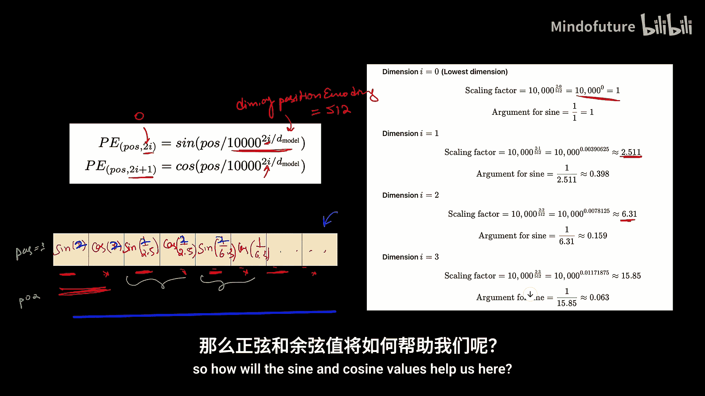
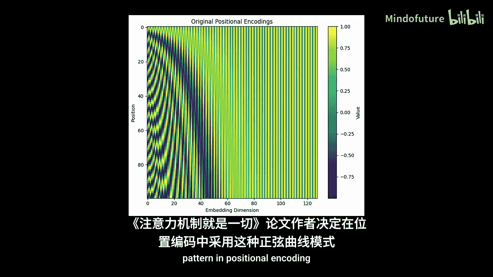
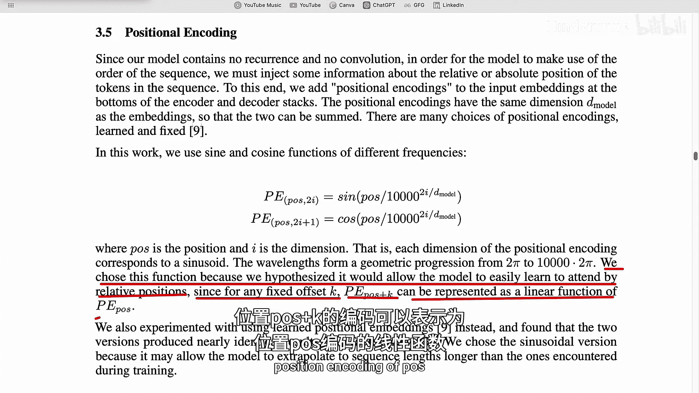
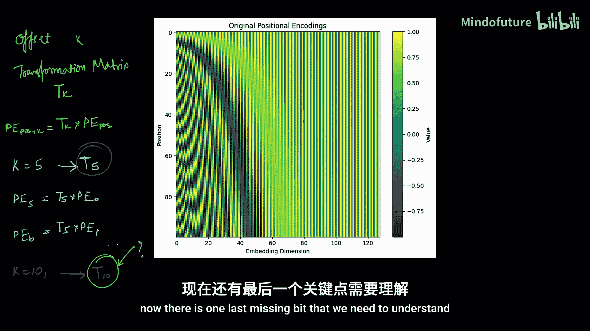
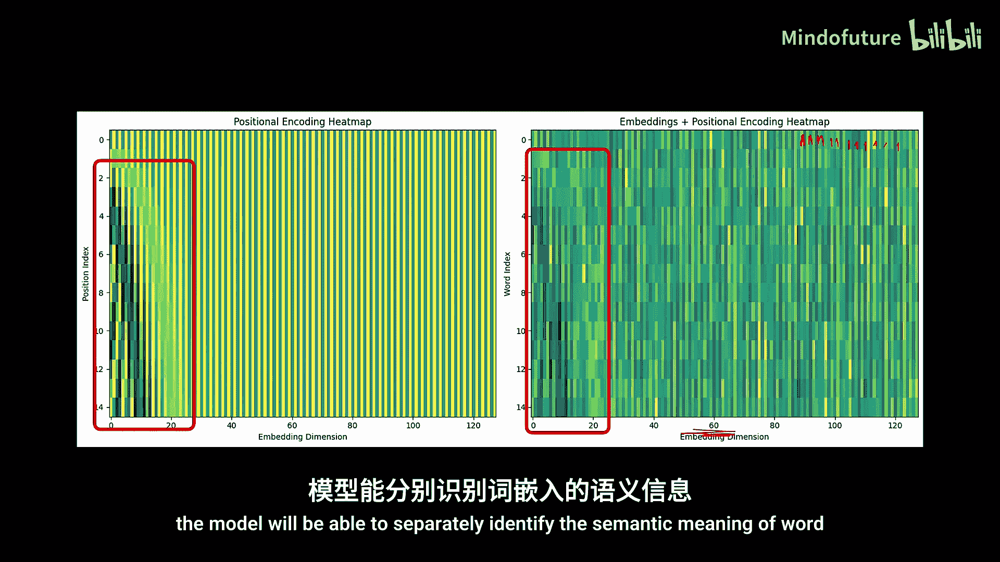
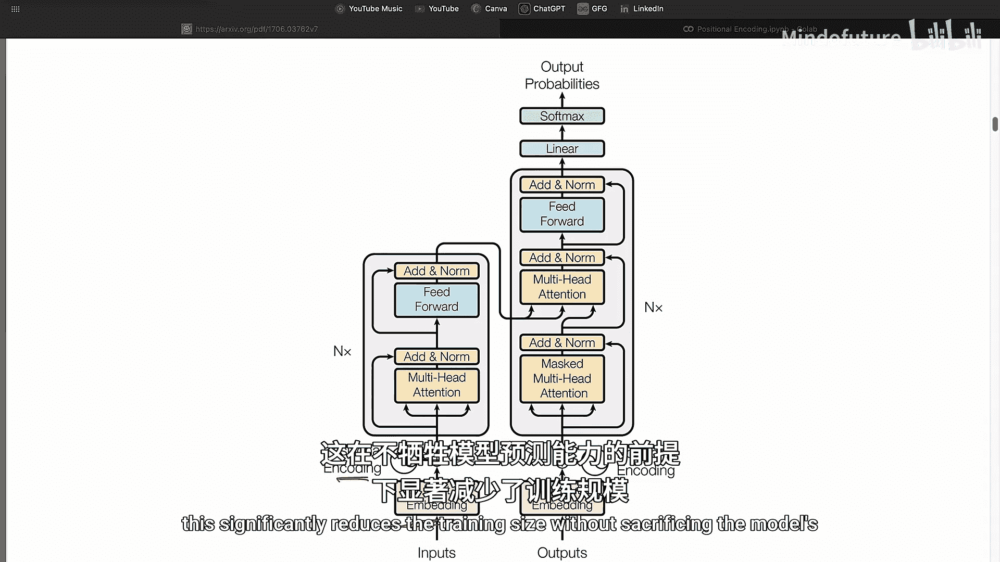
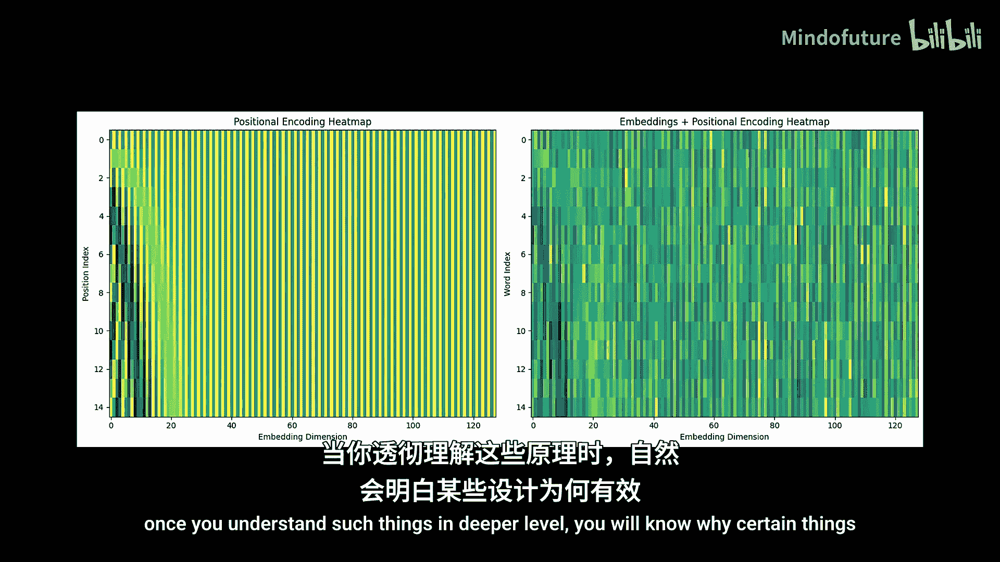

# 007：位置编码详解 🧠

在本节课中，我们将要学习Transformer架构中的一个核心组件：位置编码。我们将探讨为什么需要它、它是什么、以及它如何帮助模型理解单词的顺序。我们还将深入分析位置编码如何与词嵌入结合，以及为什么这种结合不会相互干扰。

---

## 为什么需要位置编码？🤔

上一节我们介绍了自注意力机制并行处理单词的能力。本节中我们来看看这种并行化带来的一个关键问题。

自注意力机制并行处理单词。这意味着它天生不具备任何顺序感。

我们需要找到一种机制，能够注入单词的位置信息，以便模型能够按顺序解释句子。

这就是位置编码发挥作用的地方。

在自然语言处理任务中，了解单词的顺序至关重要。请看以下两个句子：
*   “猫追老鼠”
*   “老鼠追猫”

这两个句子使用了相同的单词，但由于顺序不同，它们的含义完全不同。如果将它们输入自注意力机制，由于并行处理所有单词且无法感知顺序，它会为这两个句子生成完全相同的注意力模式，仿佛它们是相同的句子。这种缺乏顺序理解的能力是自注意力的一个显著限制。

---

## 位置编码的设计思路 💡

既然我们不能回到RNN那样的顺序处理方式，那么如何解决这个问题呢？唯一的办法是，在将词嵌入输入自注意力机制时，同时传递一些额外的信息，让模型了解句子中单词的顺序。

以下是设计位置编码时需要考虑的几个关键点：

*   **不能使用离散值**：像1, 2, 3这样的离散数字不利于神经网络训练，模型难以像人类一样解释它们。
*   **数值需要有界**：如果句子长度增加到100或1000个单词，位置值也会随之增大。引入如此大的值会扭曲训练焦点，导致梯度不稳定。
*   **需要连续且规律的值**：我们需要的是一种能生成连续值、且所有值都在特定范围内的函数。

我们最终的目标是向模型提供一个特定的模式，使其能够理解两个单词是彼此接近还是相距甚远。

---

## 正弦函数：一个起点 📈

正弦函数是连续的、周期性的，其值在-1到1的特定范围内。这似乎符合我们的部分要求。

我们可以尝试用 `sin(1)` 表示第一个位置，`sin(2)` 表示第二个位置，依此类推。这解决了离散性和无界性的问题。

但正弦函数存在一个明显问题：**周期性**。在足够长的序列中，不同位置可能产生相同的正弦值，导致两个位置编码相同，从而混淆模型。

---

## 正弦-余弦对：增强唯一性 🔄

为了降低两个位置编码完全相同的概率，我们可以使用向量而非标量来表示位置。

一个简单的想法是使用一个**正弦-余弦对**。这样，第一个位置由向量 `[sin(1), cos(1)]` 编码，第二个位置由 `[sin(2), cos(2)]` 编码。

使用正弦-余弦对降低了向量完全相同的可能性，但由于模式本身具有周期性，在足够长的句子中，向量仍有可能再次变得相同。

---

## 多频率正弦-余弦对：最终的解决方案 🏗️

为了进一步降低重复概率，我们可以使用更多维度的向量，即使用多对具有不同频率的正弦和余弦函数。

例如，我们可以使用一个四维向量，其中两对正弦-余弦使用不同的频率（如第一对频率为ω，第二对频率为ω/2）。这样，在向量再次相同之前，我们可以处理更长的位置范围。

这正是原始Transformer论文作者所做的。他们使用了**512维的位置编码向量**，这由**256对**正弦和余弦函数生成。每一对都有递减的频率（例如，第一对频率为ω，第二对频率为ω/2，第三对频率为ω/3，等等）。

通过使用这种512维、具有正弦-余弦对的位置编码，我们可以处理极长的句子（超过数千万单词），并保证所有值连续、有界，且能唯一标识位置。

以下是Transformer论文中使用的精确公式：

对于位置 `pos` 和维度索引 `i`：
*   在偶数维度（`2i`）：`PE(pos, 2i) = sin(pos / 10000^(2i/d_model))`
*   在奇数维度（`2i+1`）：`PE(pos, 2i+1) = cos(pos / 10000^(2i/d_model))`

其中 `d_model` 是位置编码的维度（例如512）。`i` 是遍历向量维度的索引。

---

## 模型如何理解相对位置？ 🧩

模型如何仅凭正弦和余弦值来识别单词的位置呢？关键在于我们为模型提供了一个**特定且可预测的模式**。

如果我们为100个位置生成128维的位置编码并绘制热图，会发现它遵循一个可预测的一致模式。颜色梯度随着位置下移而平滑变化。

观察任意两个位置编码向量：
*   如果两个位置**相近**，它们向量中的大多数值几乎相似，只有最初几个维度的值发生变化。
*   如果两个位置**相距较远**，那么即使在较高维度，你也会开始注意到差异。

这种模式如此可预测，以至于如果知道位置 `p` 的编码，我们就有能力预测位置 `p+k` 的编码。对于任何偏移量 `k`，都存在一个变换矩阵 `T(k)`，使得：
`PE(pos + k) = T(k) * PE(pos)`

这意味着模型在训练过程中将学会识别这种可预测的模式。我们并没有明确告诉模型计算两个位置向量之间的差异，但由于这种特定的可预测性，模型将能够隐式地理解位置之间的偏移量 `k`，从而理解单词的相对顺序。

---

## 位置编码如何与词嵌入结合？ ➕

现在，我们知道了如何生成位置编码。接下来需要将其与词嵌入结合，作为自注意力机制的输入。

一种直观的方法是**拼接**：将一个512维的词嵌入向量和一个512维的位置编码向量拼接起来，形成一个1024维的输入向量。

但这种方法存在一个缺点：它会显著增加模型参数。输入维度翻倍意味着查询、键、值权重矩阵（`W_Q`, `W_K`, `W_V`）的尺寸也要翻倍。考虑到Transformer使用多头注意力和多个层，参数总量将大幅增加，从而减慢训练和预测速度。

因此，原始Transformer论文采用了一种更巧妙的方法：**元素级加法**。将512维的词嵌入向量与512维的位置编码向量直接相加，得到一个512维的结果向量。

你可能会问：将两个向量相加，难道不会相互干扰并扭曲它们所携带的信息吗？位置编码不会扭曲词嵌入的语义含义吗？反之亦然？

答案是：**不会**。位置编码的设计使其不会干扰词嵌入的语义含义。因为位置编码是由不同频率的正弦曲线生成的，它具有一种与词嵌入截然不同的特定模式。

实验证明，在将位置编码添加到词嵌入之后，语义结构仍然保持完整。含义相似的单词在向量空间中仍然聚集在一起。同时，位置编码的内在模式也得以保留。因此，模型能够分别识别词嵌入的语义含义和单词的位置顺序。

通过使用元素级加法，Transformer避免了因输入尺寸增大而带来的计算开销，显著减少了训练负担，且没有牺牲模型的预测能力。

---

## 总结 📚

本节课中我们一起学习了Transformer中位置编码的核心概念。我们了解到：
1.  由于自注意力机制的并行性，模型需要额外信息来理解单词顺序。
2.  位置编码通过一组具有递减频率的正弦和余弦函数生成，创造了连续、有界且唯一的位置表示。
3.  这种正弦曲线模式具有可预测性，使模型能够学会理解单词之间的相对位置。
4.  位置编码通过**元素级加法**与词嵌入结合，这种方式既高效又能保持两者信息的独立性。

理解这些细节有助于我们深入认识Transformer架构为何如此强大和高效。在接下来的课程中，我们将继续探索Transformer的其他方面。