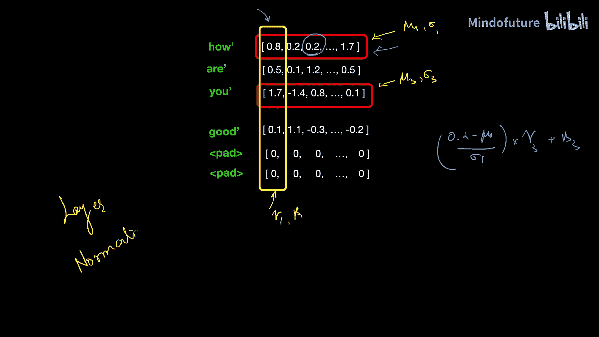

# 008：层归一化 (Layer Normalization) 的最简解释

在本节课中，我们将学习Transformer架构中的一个关键组件：**层归一化**。我们将探讨为什么在训练深度神经网络时需要归一化，理解“内部协变量偏移”问题，并详细解释层归一化的工作原理及其在Transformer中的具体应用方式。

## 为什么需要归一化？🤔

上一节我们提到了训练深度神经网络的挑战。本节中，我们来看看为什么数据预处理中的归一化至关重要。

训练一个深度神经网络，特别是Transformer，是具有挑战性的。它涉及数十亿甚至数万亿的参数。参数如此之多，梯度消失或爆炸等问题很常见。层归一化有助于我们稳定模型的训练。

归一化能提高训练速度和稳定性。以下是一个例子来说明原因。

想象我们有一个包含两列的数据集：一列是房屋的平方英尺面积，另一列是房间数量。使用这两个特征，我们想预测房屋价格。但这里存在一个问题：这两列数据的数值尺度差异巨大。房屋面积可能以千计，而房间数量范围是1到10。这种数据值尺度或范围存在巨大差异的情况，被称为**未归一化数据**。

当我们把这种未归一化数据输入模型时，损失函数的等高线会变得**细长**。这会产生严重的影响。对于细长的损失函数等高线，我们不能使用较高的学习率，否则会“超调”，导致训练无法进行。因此，为了稳定训练，我们不得不使用较小的学习率。但较小的学习率意味着需要更多时间收敛到最小值，训练会变慢。除此之外，数据还具有高方差，我们已经讨论过高方差如何导致梯度爆炸或消失，这是训练任何深度学习模型时的严重问题。

这就是归一化发挥作用的地方。

## 什么是归一化？📊

那么，究竟什么是归一化呢？归一化意味着以某种方式缩放数据，使其**均值变为0，标准差变为1**。

如果最初数据是这样不对称分布的，那么在归一化之后，它将围绕均值（即0）中心化。因此，归一化将数据排列成围绕零对称的分布。

我们如何用数学方法将这种数据转换成那种数据呢？这非常简单。我们所做的就是**用每个数据点减去其均值，再除以标准差**。

所以，如果这是我的数据，我将计算其均值和标准差，然后用每个数据点减去均值，再除以标准差，这将把数据转换成这种形式。

以我们的房屋面积列为例，我计算了它的均值（结果是1710）和标准差（结果是605）。为了归一化这一列，我们必须用每个值减去均值并除以标准差。应用这个归一化操作后，你可以看到大多数值都围绕0中心化。

一旦我们归一化了数据，损失函数的等高线就变成了**圆形**。有了这种圆形等高线，我们甚至可以使用稍高的学习率，这将确保我们的训练更快。

因此，归一化通过避免梯度消失或爆炸来帮助我们稳定模型训练，并且还能使模型更快收敛。

## 内部协变量偏移 🔄

但是，在一个非常深的神经网络中，仅仅归一化输入是不够的。因为这类深度网络会经历一种称为**内部协变量偏移**的现象。

现在，这是什么意思？让我们一步步分解。

术语“协变量偏移”指的是训练和测试之间数据分布的差异。例如，假设你训练一个模型来识别红玫瑰。模型完美地学会了识别红玫瑰。你给它看任何红玫瑰的图片，它都能以高置信度识别出来。但如果你在测试时展示一张白玫瑰的图片会发生什么？这会完全迷惑模型，因为输入分布与它在训练期间看到的不同。

在深度神经网络中，类似的数据分布偏移在训练期间于这些中间层中**持续发生**。在这样的网络中，后续层的输入是前一层产生的输出。在训练模型时，这些权重在反向传播操作中不断变化，这反过来又改变了每一层产生的输出。因此，在这一轮迭代中馈送到该层的数据将与它之前看到的非常不同。这就好比这些层在每次迭代中看到的数据都大不相同。因为这种数据分布在深度神经网络的中间层中持续变化，所以被称为**内部协变量偏移**。

这就像学习一门新语言。想象一下，如果你的老师每天教你完全不同的语法规则，这难道不会让人不知所措吗？你还没有巩固之前学过的知识，现在又被大量的新信息轰炸。你真正需要的是分布的**渐进变化**，以使训练过程更平滑。

所以，即使你已经对网络的输入进行了归一化，但由于它已经被处理了这么多次，这些层产生的输出**不会**是归一化的。因此，我们也需要对这些后续的中间层进行归一化。这就是层归一化的相关性所在。

## 如何归一化中间层？🧠

那么，显而易见的问题是：我们如何归一化这些中间层？我们已经看到了如何归一化输入数据。但是，这个归一化过程如何应用到这些中间层呢？让我们来看一下。

我展示了一个深度神经网络中某一层的简化图像。想象它是其中一个中间层，这些是与前一层连接的权重。这一层将产生一些输出。我们希望在训练期间归一化这一层产生的输出。

模型的输入是一批数据，所以假设我们的批量大小为3个数据点，并且这一层有5个神经元。总共有 3 x 5 个数据值。这是一批数据。这是第一个数据点产生的激活值，这是第二个数据点产生的相同激活或神经元的值，依此类推。

现在，我们想做的是**分别归一化每个神经元的激活值**。这意味着我想分别归一化这个激活值、这个激活值，以及这个激活值。

所以，对于这三个数据点（对应第一个神经元），我将计算它的 μ1 和 σ1。对于这三个数据点（对应第二个神经元），我将计算 μ2 和 σ2，依此类推。

现在，为了归一化这个值，我将用每个数据点减去其对应的均值，再除以其标准差。

所以，这个数据点可以通过减去 μ4 并除以 σ4 来归一化。同样地，这个数据点可以通过减去 μ5 并除以 σ5 来归一化。

因此，我们是**按批次、为每个激活值单独**进行归一化的。这就是归一化应用于内部层的方式。

## 缩放与偏移：可学习的参数 ⚖️

但是，我们并不止步于仅仅归一化。我们还会执行另一个操作，这个操作称为**缩放和偏移**。

假设 Z 是我的初始数据点。我执行了归一化过程，得到了 Z_norm。我单独处理这个 Z_norm。我所做的是**将一个 gamma 参数乘以 Z_norm，再加上一个 beta 参数**。

这些 **gamma** 和 **beta** 是**可学习的参数**。它们的值在模型训练期间进行调整，就像我们调整权重和偏置的值一样。

所以，我们不仅仅是像这样归一化数据，我们还执行了一个缩放和偏移操作，其中我们将归一化后的值与可学习参数 gamma 和 beta 相乘和相加。

我知道你可能会想：为什么要执行这个缩放和偏移操作？它难道不会抵消归一化过程吗？因为在归一化中，你是用某个值减去，再用另一个值除；而在缩放和偏移中，你是用某个值乘，再加上另一个值。所以这个操作与你归一化所做的完全相反。如果在训练模型后，你的 gamma 结果等于你的 sigma，而你的 beta 结果等于 mu，那么会发生什么？你最终会得到与开始时完全相同的值。所以这个缩放和偏移看起来像是归一化的逆过程。

那么，我们为什么这样做呢？答案是**灵活性**。有时，某些层并不需要数据完全归一化，它们在数据稍微未归一化时表现更好。所以我们让模型自己决定什么对它最有利。

这些参数 gamma 和 beta 在训练模型之前被初始化为 1 和 0。在模型训练期间，它们的值在反向传播操作中调整，就像权重和偏置的值被调整一样，模型将自行决定它需要多少归一化。

因此，**归一化稳定了训练，但缩放和偏移让模型学习最优的变换**。

## 批归一化 vs. 层归一化 ⚔️

我刚刚强调的这个归一化和缩放偏移的两阶段过程被称为**批归一化**。因为我们是**跨批次、为每个激活值单独**进行归一化的。

等等，我说对了吗？这是关于层归一化的视频，不是批归一化。那我为什么要介绍批归一化呢？这是因为批归一化和层归一化之间有一点区别。

批归一化的过程在深度神经网络中非常常见，但它**不能**应用于Transformer。用于NLP任务的Transformer需要使用**层归一化**。

一个显而易见的问题仍然存在：这种归一化将如何应用于Transformer？到目前为止，我们只看了简单的神经网络，但这将如何应用于Transformer呢？

让我们看看Transformer中的层是如何组成的。Transformer层由自注意力和其他一些块组成。我们想要归一化这些层产生的数据。

我们知道自注意力是做什么的：它接收输入词嵌入，并为每个词创建一个新的词表示。如果我的嵌入向量是512维的，那么它也会为该词产生另一个512维的输出，这是该词的新表示。

在训练模型时，它以批次接收数据。假设这里的批量大小是2，每个批次我们传递两个句子。每个句子的最大长度是3个词，每个词是一个512维的词嵌入。

所以我有一个大小为 `2 x 3 x 512` 的输入矩阵。注意，对于较短的句子，我用零填充它们，以匹配最大句子长度。

当我将这个输入传递给自注意力块时，它将为每个词生成新的词表示，并生成另一个 `2 x 3 x 512` 维的矩阵。这些填充将不受影响，因为任何数乘以0都将保持为0。

我们的目标是归一化这个 `2 x 3 x 512` 维的矩阵。我们该怎么做呢？

让我尝试对此应用批归一化。批归一化是**跨批次、针对特定特征**应用的。为此，让我将两个句子堆叠在一起，这样我的矩阵就变成了 `6 x 512` 维。

所以我有512维的特征。如果我想应用批归一化，那么我将针对一个特定特征跨批次应用它。这意味着我将计算它的 μ1 和 σ1，然后执行归一化操作。对于最后一个特征，我将计算 μ512 和 σ512，我可以简单地像这样执行归一化。

但是，等等，这里有一个问题。你能识别出那个问题吗？问题是这个数据包含**零填充**，而这些零将成为这个归一化过程的一部分，并会影响我们的 μ 和 σ 值。实际上，我只想归一化这四个有效数据点，但在归一化过程中，如果我也包含这些零，那么它会影响我的 μ 和 σ。你认为，如果我们在归一化过程中保留这些零填充，归一化后的值会是数据的真实表示吗？不，不会，因为这些零会扭曲结果。所以我们需要将这些零从归一化中排除。这就是为什么**批归一化不能应用于Transformer**。

## Transformer中的层归一化 🏗️

那么，如果不是跨批次归一化，而是**跨特定数据点**归一化呢？这正是**层归一化**所做的。

与批归一化不同，层归一化在每个数据点上独立操作。所以 μ 和 σ 的值将针对一个特定数据点计算，但我的 gamma 和 beta 参数将针对特定特征添加。

因此，归一化是沿着**这个方向**（特征维度），但缩放和偏移是沿着**这个方向**（批次和序列维度）。

所以，如果我要向你展示对这个点（例如，第二个句子的第一个词的第三个特征）的归一化，它将通过减去 μ1、除以 σ1、乘以 gamma3 并加上 beta3 来获得。

如果你查看原始的《Attention Is All You Need》论文，你会注意到这种层归一化被应用于Transformer中的**每一层之后**。

在现实世界的应用和像GPT这样的模型中，我们堆叠了多个Transformer块，这使得整个架构极其深。这使得归一化对于训练的稳定性至关重要。

即使归一化是一个简单的概念，它也极其重要。没有它，训练将不会有效，并且将是时间和金钱的简单浪费。

## 总结 📝

本节课中，我们一起学习了层归一化在Transformer架构中的核心作用。

*   **归一化的必要性**：处理未归一化数据可以稳定训练，避免梯度问题，并加速收敛。
*   **内部协变量偏移**：深度网络中间层输入分布持续变化，需要持续归一化。
*   **层归一化原理**：对单个样本的所有特征计算均值μ和标准差σ，进行归一化，再通过可学习的参数γ和β进行缩放和偏移，公式为：`输出 = γ * ((输入 - μ) / σ) + β`。
*   **与批归一化的区别**：批归一化跨批次归一化同一特征，受填充零影响，不适用于Transformer。层归一化跨单个样本的所有特征归一化，不受批次内其他样本影响，是Transformer的首选。
*   **在Transformer中的应用**：层归一化被应用于每个子层（如自注意力层、前馈网络层）的输出之后，为深层堆叠的Transformer块提供了稳定的训练环境。

归一化是确保现代大型深度学习模型能够被成功训练的基础技术之一。