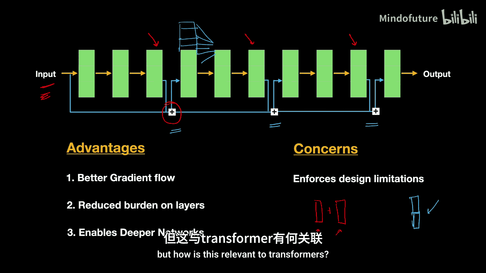
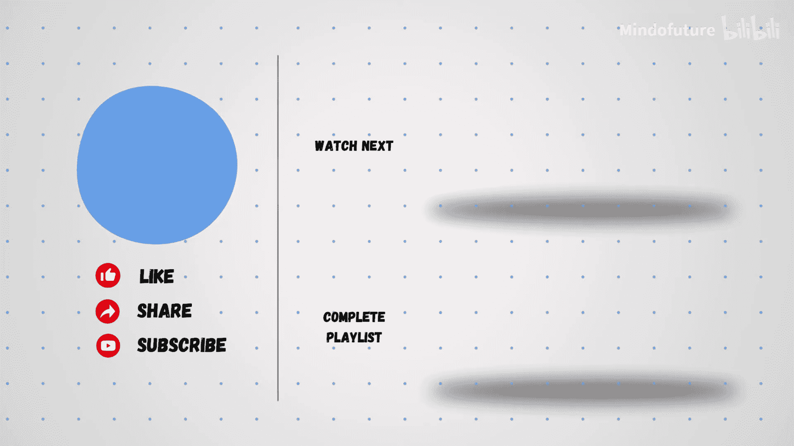

# 009：残差连接如何稳定训练 🧠

在本节课中，我们将要学习Transformer架构中的一个关键概念——残差连接。我们将探讨深度神经网络训练中的难题，以及残差连接如何通过提供信息流动的“捷径”来解决这些问题，从而稳定和加速深度模型的训练。

---

## 深度网络训练的挑战

像Transformer这样的深度神经网络训练起来非常困难。它们常常遭受梯度消失或梯度爆炸问题的困扰，这使得训练极具挑战性。

在上一节视频中，我们学习了层归一化，它有助于稳定模型的训练。本节中，我们来讨论另一个强大的概念——残差连接。

### 为什么训练深度网络如此困难？

想象一个未经训练的、权重随机初始化的深度神经网络。当你将一个输入通过网络传递时，它会在每一层与这些随机权重相乘。这个过程会逐渐扭曲输入，导致信息丢失。

对于最初的几层，这种丢失可能微不足道。然而，随着输入在多个层中传播，每一次变换都会造成额外的损失。当信号到达输出层时，几乎所有相关信息都已丢失，只剩下噪声。

在反向传播过程中，模型会根据它在输出预测中看到的情况来尝试更新权重。由于输出预测只是噪声，后面几层的权重更新将不会有效。不仅如此，前面几层的权重更新也不会有效，因为在反向传播期间梯度向后流动时，它们会经过许多层而呈指数级缩小。

这些梯度的值很小且小于1。为了更新初始层的权重，所有后续层的梯度将被相乘。当你将许多小数相乘时，结果会趋近于0。这种现象被称为**梯度消失问题**。

这就是为什么在训练一个非常深的网络时，我们会在很长一段训练时间内几乎看不到损失函数的下降。甚至有可能我们的模型永远无法收敛。如果我们无法训练它，那么我们创建的深度复杂模型实际上就变得毫无用处。

---

## 解决方案：残差连接

那么，我们该如何应对？解决方案比想象的要简单。

我们的目标是为网络中的所有层提供有意义的输入信息，无论网络有多深。问题在于，后面的层完全依赖前面的层来提供输入信息，而信息由于与许多随机初始化的权重矩阵相乘而丢失。因此，这些后面的层无法获得相关的输入信息，并且在反向传播中，由于梯度消失问题，权重更新也不够有效。

为了解决这个问题，我们能否为信息流动设计一条更好的路径呢？与其只有图中黄色高亮显示的这条长路径，我们能否为所有这些层提供一条“捷径”路径，让它们能更好地访问输入信息？

这正是残差连接所做的事情。残差连接不是只有单一的信息流动路径，而是增加了另一条“捷径”路径，将输入传递给后面的层。

现在，输入信息将在两条路径中流动：一条是图中黄色高亮显示的较长路径，另一条是蓝色高亮显示的较短路径。

### 残差连接的工作原理

在残差连接中，我们将网络划分为多个块。每个块的输入是两个向量的和：一个向量是前一个块的输入，另一个向量是前一个块的输出。

这意味着，我们不是直接将这一层的输出传递给下一层，而是将该输出与其输入进行**逐元素相加**，然后将结果传递给下一个块。

因此，现在网络在块内部有更好的信息流动（输入将通过黄色高亮显示的常规路径流动），但在块外部，输入将通过蓝色高亮显示的较短路径传播。这些较短的路径被称为**跳跃连接**。

这种设计确保了输入数据能够适当地通过网络的所有层。这就像为训练过程提供了一个“启动器”。

想象一下你去健身房训练自己。如果你从第一天就开始举极重的重量，你能举起来并取得进步吗？不能，你可能需要他人的辅助。训练深度网络也是如此。与其要求模型从一开始就承担所有繁重的工作，我们通过提供更好的输入信息访问途径来辅助它。这确保了训练从最初的几个周期就开始逐步进行，我们应该会立即看到损失函数稳步下降。

---

## 残差连接的优势

但这还不是全部。残差连接还提供了其他一些优势。

### 优势一：更好的梯度流动

通过残差连接，我们不仅在正向传播中有了更好的信息流，在反向传播中也获得了更好的梯度流动。梯度现在有一条更短的路径到达早期层，权重更新也将通过两条路径发生：一条通过较长的黄色路径，另一条通过较短的蓝色路径。

在模型训练的初始阶段，我们看到较长的路径会因梯度微弱和梯度消失问题而挣扎。但现在，由于我们有了短路径，这将确保有意义的更新从一开始就发生。这应该会带来即时且稳定的损失下降。随着训练的进行，当长路径变得有效时，损失将继续下降，使模型能够超越浅层网络。

### 优势二：减轻每层负担

由于网络的每个块都能访问几乎未改变的输入，这些层的负担减轻了。它们不再需要独自找出输入的每一个重要细节。相反，这些层可以专注于学习**残差信息**——它们可以专注于在输入之上添加什么额外信息，以增强信息流，从而获得更好的预测。这使得它们的工作变得更容易，因为它们现在有更简单的信息需要学习，从而实现了深度网络相对更快的训练。

### 优势三：支持构建更深网络

由于我们有了信息流动的捷径路径，以及将信息传递到非常深层的方法，我们可以增加网络的深度。我们将有可能训练更深的网络。这就是为什么现代架构可以远超传统的浅层网络，使其能够稳健地学习极其复杂的信息。

---

## 残差连接的设计考量

使用残差连接唯一需要注意的是，它对网络设计施加了一些限制。由于我们执行的是逐元素加法，我们必须确保该层的维度与输入的维度相同。因为如果你想对两个向量进行逐元素相加，它们的大小必须相同。这就是为什么网络中的某些层必须具有与输入相同的形状。

如果你不想执行逐元素加法，也可以在这两者之间执行**连接**操作。通过连接，你可以拥有不同的维度。但请记住，每当你执行连接操作时，整体维度将急剧增加，与之相关的权重也会增加，这意味着参数数量会爆炸式增长。因此，通常执行的是逐元素加法，而不是连接。

尽管如此，残差连接是改进和稳定极深度网络训练的一个极佳方法。

---

## 残差连接在Transformer中的应用

我知道你心中可能还有一个问题：这很棒，我知道残差连接了，但这与Transformer有什么关系？我们如何将残差连接应用到Transformer中？

答案在于Transformer设计的精妙之处。Transformer网络的每一层产生的输出大小与其输入相同。例如，多头注意力块的输出与其输入相同：它接收每个词的512维向量，也为每个词生成512维向量。同样，前馈网络也保持这个维度。前馈网络的输入是多头注意力产生的输出，即每个词的512维向量。前馈网络也为每个词生成512维输出。无论你在整个架构中选择哪一层，这种设计都是一致的。

你在每一层之后看到的“Add”部分，就是**残差连接**。多头注意力的输入会与其输出相加。前馈网络的输入会与其输出相加。这个过程在所有层中持续进行。

我们将在下一个视频中详细讨论这个架构，研究编码器块和解码器块的整个设计，以及各层如何堆叠在一起。但我希望你理解了残差连接的重要性及其在Transformer中的用法。

在Transformer架构中添加这些残差连接确保了其在训练期间的稳定性。你可以看到编码器块被乘以N次，这意味着我们将堆叠许多编码器块，然后在上面堆叠许多解码器块。在像GPT这样的模型中，深度极其巨大，这就是为什么残差连接在模型训练中扮演着重要角色。

像残差连接和归一化这样微小的细节，显著影响了训练的稳定性和性能。它们可能在原始论文中没有受到太多关注，但它们使深度学习的突破成为可能。

现在，可以说你已经完全准备好学习我们将在下一个视频中介绍的编码器架构了。

---

## 总结

本节课中，我们一起学习了Transformer架构中的残差连接。我们首先探讨了深度神经网络训练中面临的梯度消失挑战。接着，我们介绍了残差连接的概念，它通过创建信息流动的“捷径”来解决这些问题。我们详细说明了残差连接的工作原理、它带来的三大优势（更好的梯度流动、减轻层负担、支持更深网络），以及其在设计上的考量。最后，我们明确了残差连接是Transformer架构稳定训练的关键组件，其逐元素相加的特性完美适配了Transformer各层输入输出维度一致的设计。

理解残差连接，是深入掌握现代深度神经网络，尤其是Transformer系列模型的重要一步。