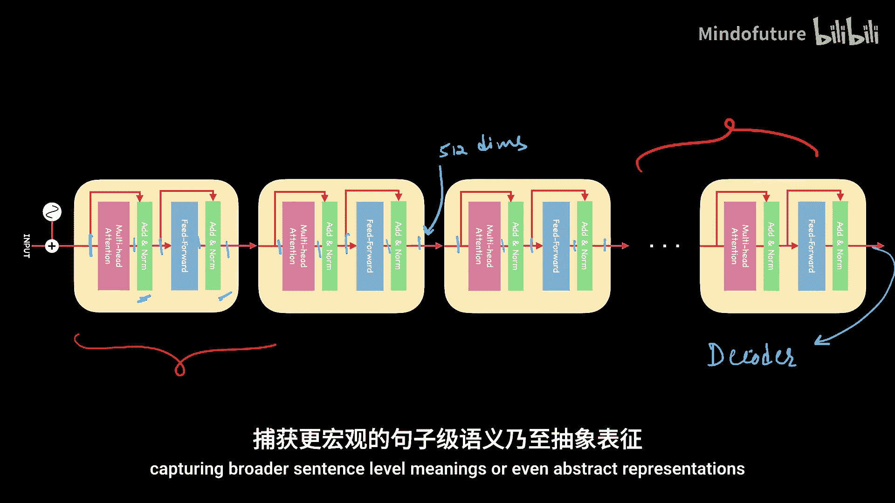

# 010：编码器架构详解 🧠

在本节课中，我们将深入探讨Transformer模型的核心组成部分——编码器的完整架构。我们将从输入开始，逐步构建每一层，并解释其作用和重要性。

---

## 输入：词嵌入与位置编码

首先，我们从模型的输入开始。对于自然语言处理任务，输入通常是词嵌入。词嵌入是一种将词语表示为数字向量的有效方法，它能通过比较两个词嵌入来提供词语的上下文或含义。

然而，词嵌入存在一个问题：它们是静态的。这意味着同一个词在不同语境下（例如“light”在“light weight”和“light blue”中）使用的是相同的向量表示，这可能导致模型理解不准确。我们需要一种动态调整词嵌入值的方法，使其能根据上下文变化。

为了解决这个问题，我们引入了**位置编码**。位置编码是向量，它为多头注意力机制提供词语的位置信息。我们将词嵌入向量与位置编码向量进行**逐元素相加**，然后再输入到编码器中。这样，模型就能同时理解词语的含义和其在句子中的顺序。

**公式表示：**
`输入 = 词嵌入 + 位置编码`

---

## 核心机制：多头自注意力

上一节我们介绍了如何准备输入，本节中我们来看看编码器的核心——多头自注意力机制。自注意力是Transformer成功的关键，它允许模型根据输入上下文动态调整词语的表示。

自注意力以词嵌入（已加上位置编码）作为输入，通过观察句子中其他词语，为每个词生成新的、包含上下文信息的表示。它能捕捉词语之间的依赖关系。

但是，语言的复杂性使得单一的自注意力头难以捕捉所有关系。例如，在句子“Keys on the table belong to Sarah”中，单词“keys”需要同时捕捉与“on the table”的空间关系以及与“belong to Sarah”的所属关系。

因此，我们使用**多头自注意力**。这就像为你的电脑添加更多内存条，每个“头”专注于捕捉一种特定类型的关系（如空间、主语-宾语、时间等）。在原始论文中，使用了8个注意力头。

以下是多头自注意力的工作流程：
1.  输入（例如，3个词，每个词512维）被复制并送入8个独立的注意力头。
2.  每个头独立计算，输出一个新的词表示（例如，3个词，每个词64维）。
3.  将8个头的输出在特征维度上**拼接**起来，得到一个3x512的矩阵。
4.  将这个拼接后的矩阵通过一个线性变换层（权重矩阵 `W`），最终输出一个3x512的矩阵。

这个输出包含了丰富的、上下文感知的信息。此外，多头注意力机制可以并行处理所有词语，极大提升了训练速度。

---

## 稳定训练：Add & Norm 层

在多头注意力层之后，我们添加了一个“Add & Norm”层。这个层执行两个关键操作：“加”和“归一化”。

“加”指的是**残差连接**。它将多头注意力层的输入直接加到其输出上。这创建了一条“捷径”，让原始信息能更顺畅地流向网络深处，有助于缓解深度网络中的梯度消失问题。

“归一化”指的是**层归一化**。它对激活值进行标准化处理，确保数据在通过网络层时保持稳定分布，从而加速模型训练的收敛过程。

**公式表示（简化）：**
`输出 = LayerNorm(注意力层输出 + 注意力层输入)`

这个“Add & Norm”层在编码器和解码器的每个主要子层后都会使用，是保证模型训练稳定的重要组件。

---

## 引入非线性：前馈神经网络

到目前为止，我们介绍的操作（线性变换、注意力计算）都是线性的。然而，仅使用线性操作会严重限制模型学习复杂模式的能力，并且多个线性层可以等效为一个线性层。

为了解决这个问题，编码器中引入了**前馈神经网络**层。这是一个简单的全连接网络，通常包含两个线性变换层和一个非线性激活函数（如ReLU）。

其工作流程如下：
1.  输入（例如，3x512）首先通过第一个线性层，将维度**扩展**到更大的空间（例如，2048维）。这增加了模型的容量，使其能够学习更复杂的特征。
2.  然后应用ReLU激活函数，引入**非线性**。
3.  最后通过第二个线性层，将维度**缩减**回原始大小（512维），以匹配后续“Add & Norm”层的输入要求。

**代码表示（概念）：**
```python
output = linear_layer_2( relu( linear_layer_1(input) ) )
```
前馈网络的作用是：1) 引入非线性，使模型能够拟合复杂数据；2) 通过扩展维度增加模型的学习能力。

---

## 构建深度：堆叠编码器块

现在，我们已经了解了编码器的一个完整块：它由**多头自注意力层**、**Add & Norm层**、**前馈网络层**和另一个**Add & Norm层**顺序连接而成。

为了学习更深层次和更抽象的语言模式，原始Transformer论文将6个这样的编码器块**堆叠**起来。每个块的输出直接作为下一个块的输入。

关于堆叠编码器块，有几个关键点需要注意：
*   **参数独立**：每个编码器块中的权重参数都是独立且不同的，在训练过程中分别学习。
*   **单次位置编码**：位置编码只在第一个编码器块的输入处添加一次，后续块直接传递前一块的输出。
*   **维度一致**：得益于“Add & Norm”层，每个块的输入和输出维度始终保持一致（例如，序列长度 x 512）。

这种深度堆叠的结构类似于其他深度神经网络：浅层可能捕捉词语级别的简单关系，而深层则能构建更复杂的句子级语义和抽象表示。

---

## 总结与展望

本节课中，我们一起学习了Transformer编码器的完整架构。我们从**词嵌入和位置编码**开始，理解了如何为模型准备包含顺序信息的输入。然后，我们深入探讨了**多头自注意力机制**，它是模型理解上下文的核心。接着，我们介绍了**Add & Norm层**如何通过残差连接和层归一化来稳定训练。最后，我们解释了**前馈神经网络**的作用以及通过**堆叠多个编码器块**来构建深度模型的方法。




编码器的输出将被传递给解码器，用于生成最终的预测结果。在下一节课中，我们将探讨解码器的架构，特别是其中关键的**掩码多头注意力**机制。完成这两部分的学习后，你将能透彻理解Transformer的设计精髓。