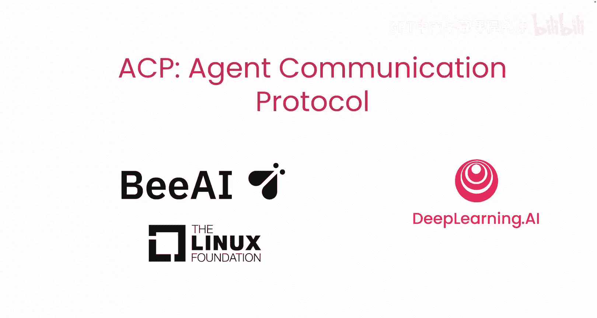
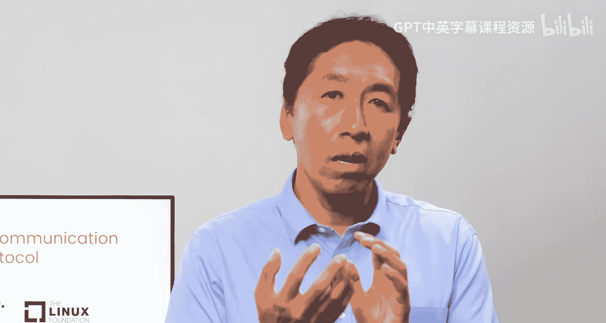
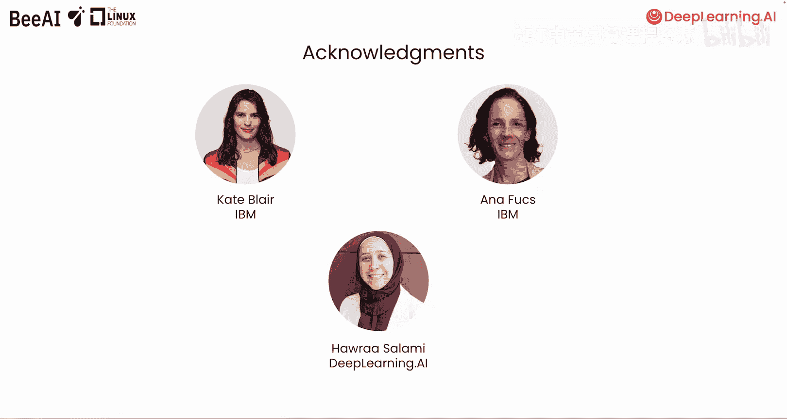

# 001：1. 课程介绍

在本节课中，我们将要学习**代理通信协议（Agent Communication Protocol, ACP）**。这是一个由IBM Research的BAI项目合作构建的开源协议，旨在标准化不同代理（Agent）之间的通信与协作。通过本课程，你将学会如何构建和运行通过ACP进行通信的代理，并配置顺序和分层的工作流。

## 课程概述

欢迎来到ACP课程。本课程由Sandy Besson（AI研究工程师兼生态系统负责人）和Nicholas Rent（IBM AI开发者倡导负责人）共同讲授。我们将一起构建一个通过ACP进行通信和协作的代理团队。



## ACP 的核心架构

上一节我们介绍了课程目标，本节中我们来看看ACP的基本工作原理。ACP采用客户端-服务器架构来标准化代理间的交互。

一个代理可以托管在**ACP服务器**上。该服务器接收来自**ACP客户端**的REST请求，并将这些请求转发给代理执行。

```
[用户/进程] -> [ACP客户端] -> [ACP服务器] -> [代理]
```

ACP客户端本身可以是一个代理或任何其他进程。它通过发现ACP服务器的端点来定位代理，并发起请求。这种统一的客户端-服务器接口旨在标准化跨团队代理之间的通信。

## ACP 的实际应用示例

为了理解ACP如何工作，让我们看一个客户服务的多代理系统示例。

以下是该系统可能包含的代理类型：
*   **物流代理**：由一个团队构建，负责回答与订单状态相关的问题。
*   **产品问答代理**：由另一个团队构建，使用RAG技术回答与产品相关的通用问题。
*   **路由代理**：作为ACP客户端运行，处理客户咨询并将其路由到专门的代理。

每个团队都可以通过一个ACP服务器使其代理可用。这样，即使代理使用完全不同的框架构建，甚至后续切换框架，其他团队也无需修改自己的代码，因为所有通信都通过标准化的ACP协议进行。



## ACP 的优势与生态

这种标准化也使得将任何现有代理集成到多代理工作流中变得非常容易。你可以将一个现有代理包装在ACP服务器中，从而使ACP客户端能够发现并集成它。这些代理还可以在**注册表**或**代理目录**中可见，以提供集中化的列表并简化搜索，尤其适用于大规模部署或企业环境。

ACP是一个开源且开放治理的协议，这意味着没有单一公司控制它。其发展由社区共同塑造。

值得注意的是，ACP可以与**模型上下文协议（MCP）** 互补使用。一个ACP代理可以使用MCP来访问工具，同时使用ACP与其他代理交互。

## 本课程实践内容

在接下来的课程实践中，你将逐步构建复杂的多代理工作流。

以下是本课程的主要实践步骤：
1.  将一个使用Q AI框架构建的RAG代理包装到ACP服务器中，并通过ACP客户端与其交互，创建一个顺序工作流。
2.  将另一个使用Small Agents框架构建的代理包装到第二个ACP服务器中。
3.  在ACP客户端中，学习如何发现这两个代理并将它们按顺序链接起来。
4.  构建一个分层工作流，使用在ACP客户端中编码的第三个路由代理（使用Small Agents框架），将输入查询路由到指定的专业代理，而非简单顺序执行。
5.  扩展Small Agent ACP服务器，使其使用MCP来获取工具访问权限。
6.  学习如何发现并将一个现有的ACP代理导入BAI平台（一个用于代理发现的开源注册表）。

## 总结与展望

本节课中我们一起学习了ACP的基本概念、架构、优势以及本课程的大纲。ACP标准化了代理间的通信，这些代理可能由同一开发者、同一组织的不同团队、甚至不同组织开发。它不仅能用于本地开发环境，还能连接分布式代理。




在下一课中，Sandy将带领我们开始动手实践，深入探索如何构建你的第一个ACP代理。让我们进入下一个视频开始学习吧。