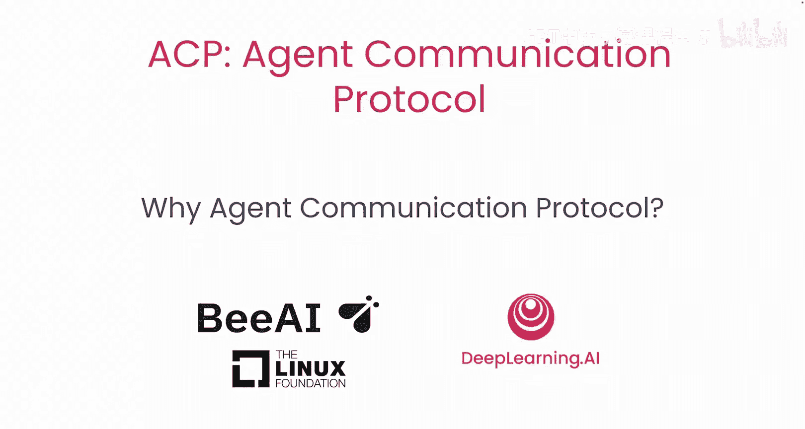
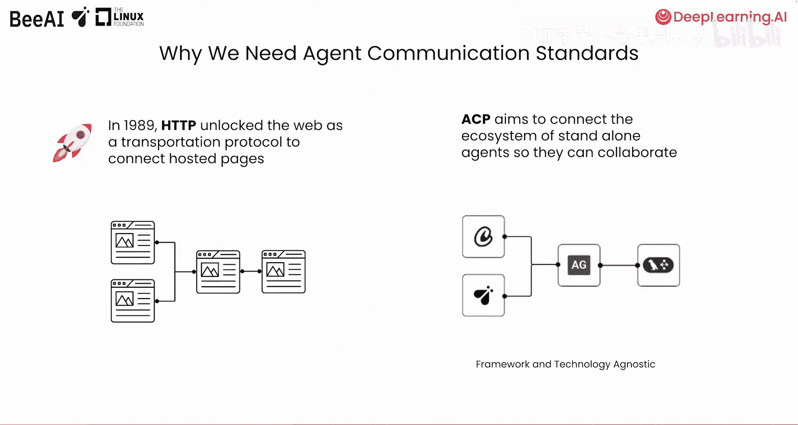
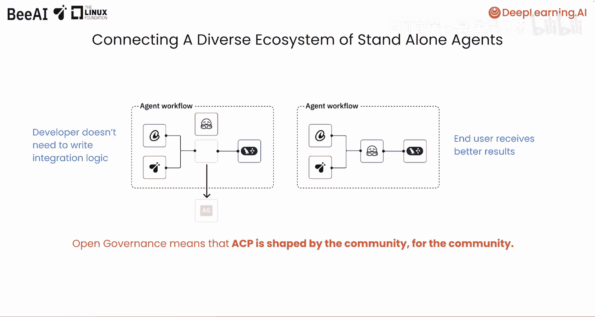
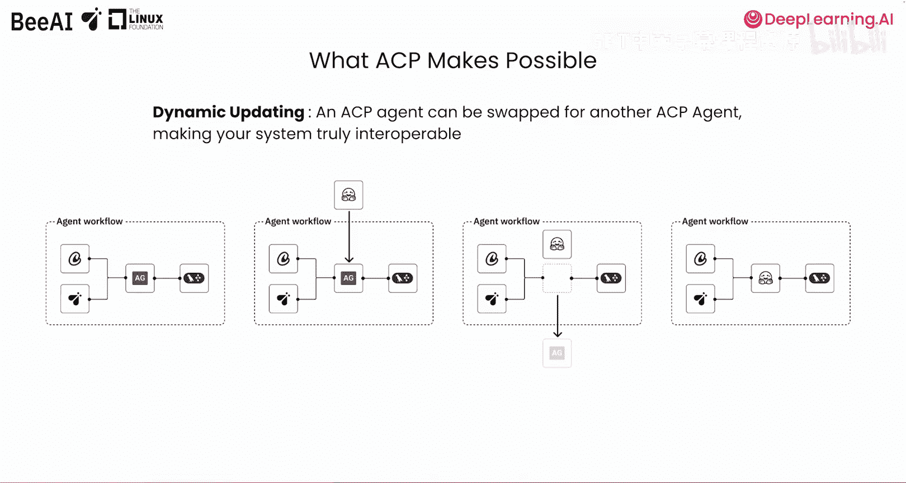
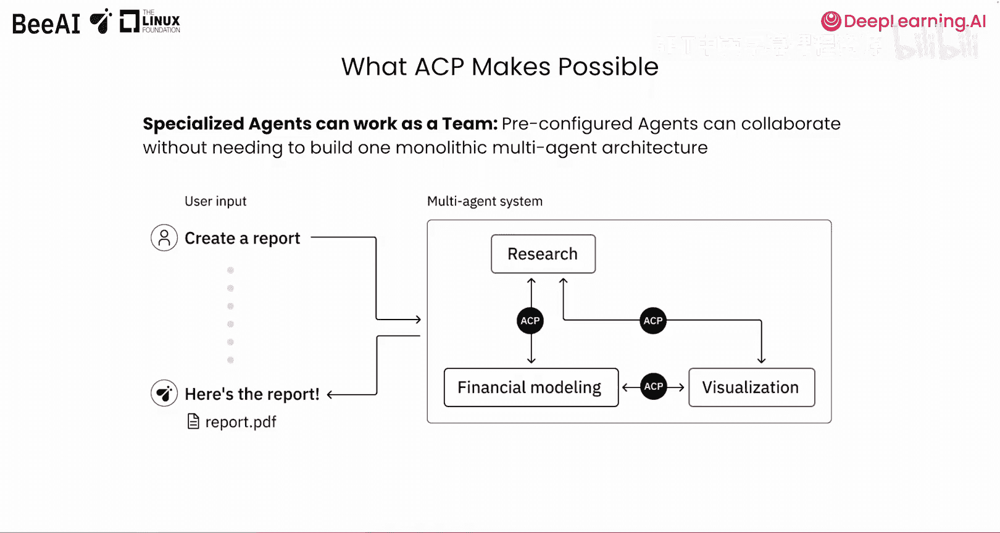
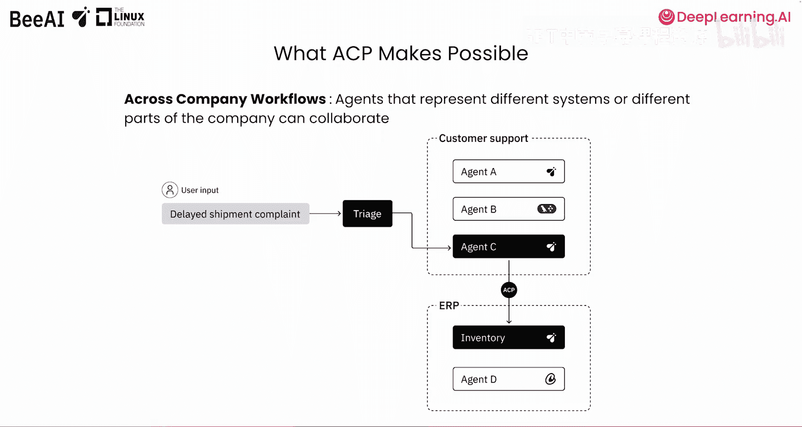
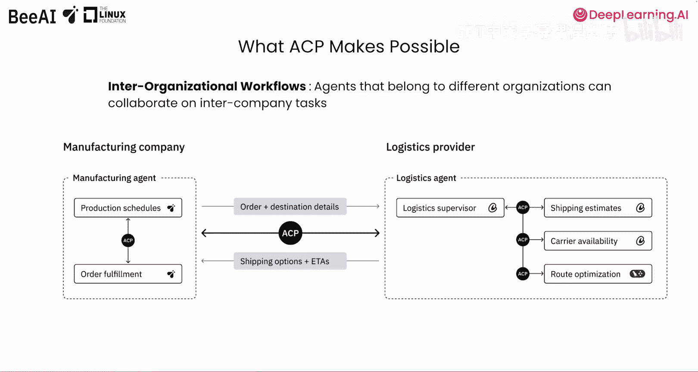

# 002：为什么需要代理通信协议 🧩

在本节课中，我们将学习开放标准的重要性，了解ACP如何填补不断发展的代理生态中的空白，并探讨它支持的各种用例。

## 开放标准的重要性与历史背景

上一节我们介绍了课程目标，本节中我们来看看开放标准的历史背景及其价值。

1989年，蒂姆·伯纳斯·李在欧洲核子研究中心工作期间提出了万维网，旨在实现原始数据在万维网上的传输。他开发了第一个版本的HTTP，这是一种用于传输原始数据的传输协议。

在HTTP出现之前，存在一系列如FTP、Telnet和Gopher等协议，它们各有特定的用例。但HTTP因其简单性和开放治理的特性，迅速普及开来。它是推动网络爆炸性增长的催化剂之一。

## ACP：连接异构代理的桥梁

正如HTTP连接了不同的托管网页，代理通信协议（ACP）利用HTTP来连接多样化的独立代理生态系统。

它提供了一种方式，让代理能够轻松地相互通信和协作，无论它们基于何种框架构建或利用何种技术。

## 当前代理生态的挑战与ACP的解决方案

构建复杂的多代理系统，例如执行搜索、写作、编辑或处理工作流的代理，需要与其他代理协作以实现共同目标。虽然有许多框架针对代理开发，但实现不同框架间代理的即插即用能力仍是一个未被满足的需求。

目前，大多数代理缺乏相互通信的共享协议。连接使用不同技术构建的代理，需要开发者构建脆弱且不可重复的集成，这些集成也容易受到框架不断更新的影响。

ACP为代理提供了一个统一的通信接口，无论其使用何种框架。

以下是ACP的核心价值之一：

*   **开放治理与社区协作**：这意味着它不仅仅是开源（开发者可以查看代码并请求更改，但决策权由单一或一组公司掌握）。ACP的开放治理邀请社区共同规划其发展路线图。因此，ACP成为一个由社区塑造、为社区服务的协议，这与HTTP非常相似。

ACP不仅使开发者无需不断重写集成逻辑而受益，也使最终用户能够获得更好的结果，因为开发者有更多选择来为任务挑选最佳的代理。

## ACP支持的关键用例模式

现在，你将了解一些ACP使之成为可能的激动人心的模式。

### 动态更新代理

鉴于该领域创新速度极快，上个月表现最佳的代理往往不是本月的最佳选择。正如我们刚才讨论的，使代理兼容ACP意味着你可以在系统中更换代理，即使新代理是使用不同技术构建的。这使得你的系统真正具有互操作性，并且对于测试哪些代理在你的系统中能提供最佳性能非常有用。

### 专业化代理团队协作

专业化代理可以作为一个团队工作。因此，与其构建一个处理所有事情的巨型代理，ACP允许专业化的代理团队动态协作。

以下是其工作方式的示例：
*   如果你有一个研究代理，它与一个能创建精美可视化的代理，以及一个专门为金融建模配置的代理协作。
*   当你请求一份报告时，这些代理可以像团队协作时那样，将任务相互传递。

### 跨公司工作流

公司依赖许多平台，例如客户关系管理平台、企业资源规划系统、人力资源系统、项目管理工具等等。

以下是其应用场景：
*   例如，如果一家零售公司使用客户支持平台和ERP系统来管理其库存和物流。
*   每个系统都可以有一个专用代理来管理任务。
*   因此，如果客户提交关于延迟发货的投诉，客户支持代理可以识别出它需要库存代理的协助，并使用ACP发送请求。

每个代理都专注于其领域，但通过ACP进行协作。

### 跨组织协作

ACP也为组织间协作开辟了机会。你将在后续课程中与尼克一起构建一个来自不同组织的代理进行通信的示例。简而言之，ACP可以使来自不同公司的代理安全地协作，即使它们由完全独立的公司托管。随着我们从仅在内部使用代理转向使我们的代理可供外部提供商使用，这开启了一个全新的可能性世界，使公司能够协同工作。

ACP还支持人在回路的协作，以确保你的代理系统能够负责任地按照你的期望运行。

## 总结与下节预告

本节课中，我们一起学习了开放标准的重要性，探讨了ACP如何通过提供统一接口解决当前代理生态中互操作性差的问题，并介绍了它支持的动态更新、专业化团队协作、跨公司工作流以及跨组织协作等关键用例。

在下一课中，我们将更深入地学习ACP的架构组件和核心原则。