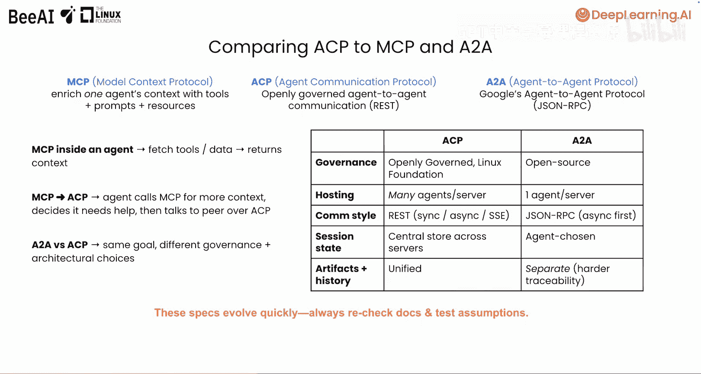
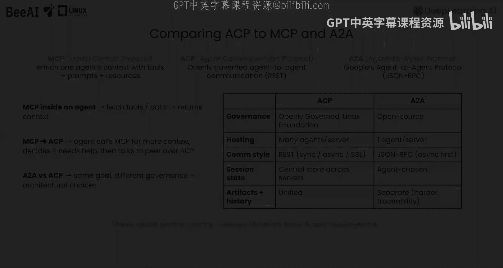

# 003：核心原则 🧠

在本节课中，我们将要学习代理通信协议（ACP）的核心原则。我们将了解ACP在技术栈中的位置、其整体架构、代理的生命周期，并与其他协议（如MCP和A-to-A）进行比较。

## 概述

上一节我们介绍了ACP的价值和应用场景。本节中，我们来看看ACP的技术架构和核心工作原理。理解这些概念将帮助你构建符合ACP规范的代理。

## ACP在技术栈中的位置

要真正掌握ACP的工作原理，理解它在智能体系统中所处的位置很有帮助。一个智能体系统通常包含基础模型、存储、代理编排、应用层等组件。

下图展示了ACP位于应用层之下，有时被称为操作层。它使用HTTP和REST架构风格来促进独立系统之间的通信。

## ACP的架构与交互

ACP基于客户端-服务器架构，使用简单的REST接口。这意味着客户端负责发起通信，服务器则响应该请求。在ACP中，客户端和服务器都可以是AI代理、人类或微服务。客户端总是发起请求，服务器总是响应请求。

以下是一个基本的ACP交互示例，其中服务器主机是一个AI代理：

1.  ACP客户端发现可用的服务器。
2.  客户端向ACP服务器发送一个REST请求。
3.  服务器（封装了一个AI代理）处理请求。
4.  服务器通过REST将响应返回给客户端。

随着系统变得复杂，我们可以看到服务于不同目的的多层协议如何协同工作。

在下图中，我们看到一个客户端通过REST向一个封装了代理的ACP服务器发出请求。该代理确定需要调用一个工具，因此它向一个可用的MCP服务器发送请求以执行工具调用并返回结果。一旦ACP代理完成其运行，它将输出返回给ACP客户端。

## 核心概念详解

在下一课深入构建你的第一个符合ACP规范的代理之前，我们先了解一些核心概念，这将帮助你更深入地理解协议的工作原理。

### 代理详情

代理详情是你定义代理基本身份和能力的地方。你可以指定代理名称、提供描述，并添加可选的元数据以获取额外信息。这些基本信息使你的代理在ACP生态系统中可被发现和使用。

代理详情支持在线和离线发现：
*   **在线发现**：发生在ACP服务器已经在运行，并且可以通过其API端点访问时。
*   **离线发现**：发生在更高级别，例如在代理目录或注册表中。代理详情被嵌入到代理包中，允许用户或系统在无需代理首先运行的情况下发现它们。这使得可以创建代理目录，在那里可以浏览、选择代理，并在需要时启动。

### 激活与执行

要激活你的代理并启用其在线发现，你需要部署它。你可以使用SDK内置服务器（这是更容易上手的方式）或使用外部服务器。启动ACP服务器使代理可供ACP客户端运行。内置服务器将是你在本课程中主要使用的。

一旦代理被激活，它就准备好执行，意味着它可以主动处理请求并生成响应。ACP提供三种执行模式：**同步**、**异步**和**流式**。

以下是每种模式的说明：
*   **同步模式**：客户端等待代理完成其运行，然后返回最终结果。
*   **异步模式**：客户端不等待代理响应，它可以在后台继续执行其他任务。
*   **流式模式**：服务器建立一个SSE（服务器发送事件）连接，在代理生成结果时提供实时更新。

无论采用哪种执行模式，每次运行都会经历诸如“进行中”、“等待中”等状态，并最终达到终止状态，例如“已完成”或“已失败”。

代理通信协议在设计时考虑了生产级环境，因此它优先考虑**安全性**、**可扩展性**和**可观测性**，以确保在大规模下的可靠性能。

## ACP、MCP与A-to-A协议对比

一个常见的问题是：使用ACP、MCP或A-to-A有什么区别？简而言之，MCP旨在通过工具、资源和提示来丰富单个模型的上下文。但MCP和ACP是兼容的，甚至是互补的。

一个代理可能在需要进行工具调用时使用MCP，该调用会向代理返回更多上下文，然后该代理可能决定需要与另一个代理通信，这时它通过ACP进行。然而，MCP与ACP是解耦的，因为它并非主要为代理间通信而设计。例如，截至目前，MCP协议的设计并未轻易支持一个代理从另一个代理接管任务或进行点对点协作。

关于共享内存，MCP支持会话管理，意味着服务器可以是有状态的，并在请求之间维护有关客户端会话的信息。然而，MCP本身不处理状态。ACP SDK支持用于运行和会话的集中式存储，这意味着多个ACP服务器可以跨这些运行或会话持久化信息。

关于消息结构，MCP对消息格式没有特定要求。由于代理需要支持自然语言以及其他模态，ACP消息遵循多模态结构来交换内容。

谷歌的A-to-A协议在ACP之后不久推出，也旨在标准化代理之间的通信。两种协议都有实现多代理系统的共同目标，但在理念和治理上存在分歧。

以下是一些显著的差异：
*   **治理**：A-to-A和ACP都是开源的，但ACP由Linux基金会公开治理，确保其开放、中立并以社区参与为中心。
*   **服务器模型**：在ACP中，你可以在同一服务器上运行多个代理，减少了整体设置和管理工作。而在A-to-A中，每个代理必须使用单独的服务器运行。
*   **架构风格**：ACP遵循基于REST的架构风格，支持标准的Web基础设施和模式，增强了可扩展性和互操作性。A-to-A使用JSON-RPC风格，这可能引入更多复杂性。
*   **输出与历史**：在A-to-A中，代理输出和消息历史是分开的。这使得在不实施额外持久化信息方法的情况下，很难确定多代理轮次中的事件顺序，而这对于透明度和可观测性非常重要。
*   **执行模式**：ACP支持多种代理类型，并允许开发者在同步、异步和流式模式之间明确选择。这使得响应处理可预测，并简化了通过SSE保证流式传输的客户端逻辑。A-to-A也支持无状态和有状态代理，但交互模式由代理动态决定。因此，客户端必须构建得足够灵活，以根据代理能力处理同步、异步或流式响应。

尽管ACP和A-to-A存在一些差异，但重要的是强调它们有很多共同点。你在本课程中学到的关于ACP的知识在很大程度上也适用于A-to-A。

## 总结

本节课中，我们一起学习了ACP的核心原则。你现在应该能够根据你的目标和系统配置，判断何时使用ACP、MCP或A-to-A。重要的是要记住，这些协议都是活跃且快速发展的项目，在本课程录制时的情况可能很快会过时。因此，请务必进行自己的研究，并通过实验验证任何假设。

恭喜你完成了理论部分的学习，现在你已经准备好进入课程的实践环节了。