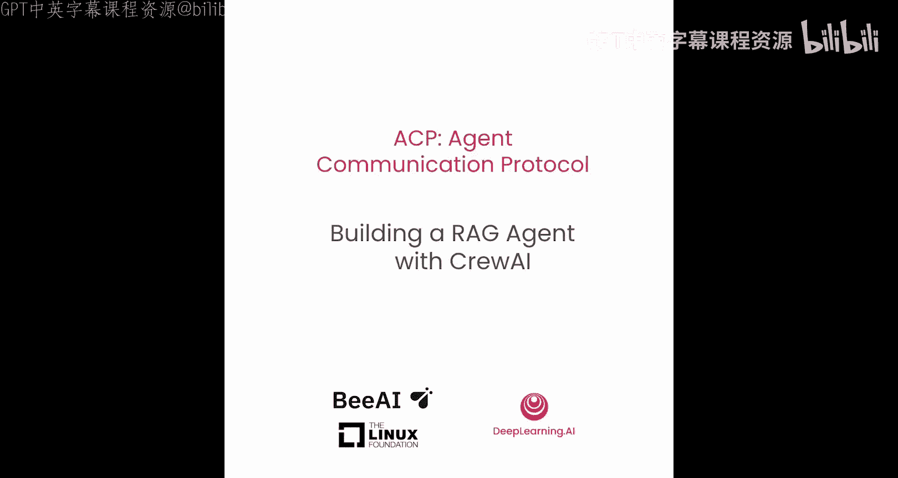
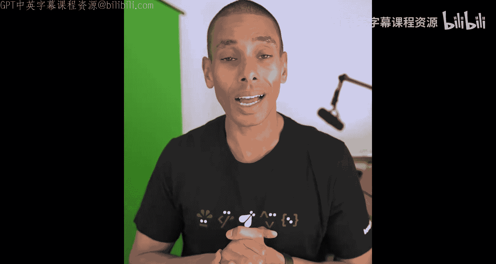
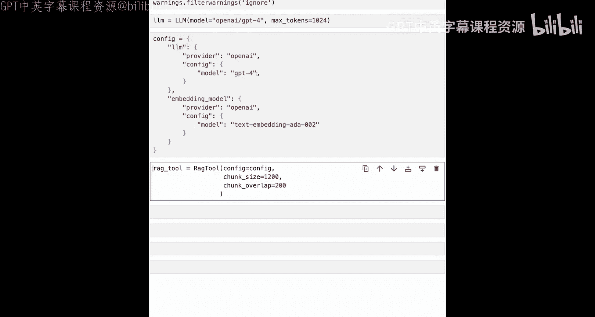
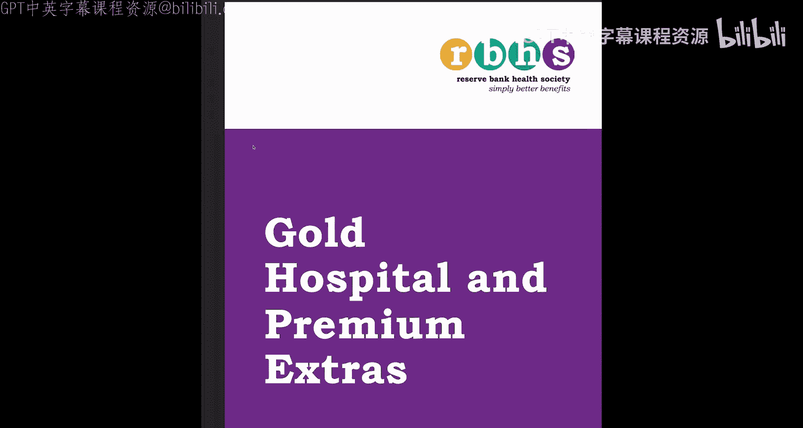
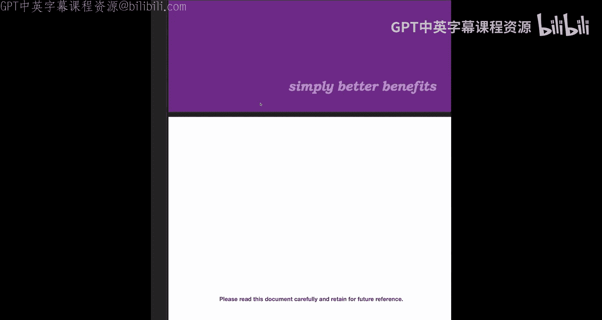
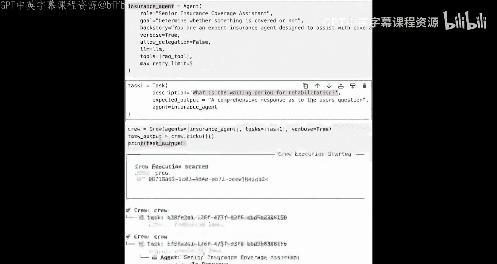

# 004：使用CrewAI构建RAG代理 🛠️

在本节课中，我们将学习如何使用CrewAI框架构建一个检索增强生成（RAG）代理。这个代理将专注于处理保险覆盖范围相关的查询，并为我们后续将其转换为符合ACP协议的代理打下基础。






## 概述

在深入探讨代理通信协议（ACP）之前，我们首先需要一个代理。因此，本节课程将指导您逐步构建一个基于CrewAI的RAG代理。我们将从导入必要的依赖项开始，配置语言模型和嵌入模型，创建RAG工具，定义代理角色和任务，最终运行代理并获得查询结果。

## 导入依赖项

首先，我们需要导入构建代理所需的核心组件。以下是构建RAG代理所需的关键依赖项。

```python
from crewai import Crew, Agent, Task, LLM
from crewai_tools import RagTool
import warnings
warnings.filterwarnings('ignore')
```

*   **Crew**： 构成多代理系统架构的基础。我们将从单个代理开始，但使用Crew来启动整个流程。
*   **Task**： 用于定义任务，我们将在此处传递提示词和期望的输出。
*   **Agent**： 代表我们的代理，包含LLM（大语言模型）和工具。
*   **LLM**： 语言模型提供者，用于创建代理。
*   **RagTool**： CrewAI自带的工具，用于简化构建RAG系统的过程。
*   **warnings**： 用于忽略运行过程中可能产生的不必要警告信息。

## 配置语言模型（LLM）

检索增强生成的核心在于拥有一个向量数据库，查询该数据库，获取上下文信息，并将其传递给语言模型以生成输出。因此，我们需要配置一个LLM。

```python
llm = LLM(
    model="openai/gpt-4",
    max_tokens=1024
)
```

*   **model**： 指定使用的模型。本例中使用OpenAI的GPT-4，但您也可以使用其他提供商（如Anthropic的Claude等）。
*   **max_tokens**： 设置LLM生成内容的最大令牌数。您可以根据需要调整此数值以控制生成内容的长度。

## 配置RAG工具

接下来，我们需要为RAG工具定义配置，包括用于生成输出的LLM和用于嵌入文档块的嵌入模型。

```python
config = {
    "llm": {
        "provider": "openai",
        "config": {
            "model": "gpt-4"
        }
    },
    "embedding_model": {
        "provider": "openai",
        "config": {
            "model": "text-embedding-ada-002"
        }
    }
}
```

*   **llm**： 指定生成答案所使用的语言模型及其配置。
*   **embedding_model**： 指定将文档块转换为向量以存入数据库并进行搜索的嵌入模型。







## 创建RAG工具并加载文档

配置完成后，我们可以实例化RAG工具，并将包含保险信息的文档加载到向量数据库中。

```python
rag_tool = RagTool(
    config=config,
    chunk_size=1200
)

rag_tool.add(
    file_path="./data/gold_hospital_and_premium_extras.pdf",
    data_type="pdf_file"
)
```

*   **chunk_size**： 将文档分割成块的大小（以令牌计）。设置为1200，并包含一定的重叠，以确保不会在不理想的位置切断文本块。
*   **add方法**： 用于将特定文档（本例中是一个关于保险包含项的PDF文件）添加到向量数据库中。您需要根据实际文件路径和名称进行修改。

## 定义代理

现在，我们开始定义代理本身。在CrewAI中，代理的定义非常详细，需要指定角色、目标、背景故事等属性。

```python
insurance_agent = Agent(
    role="高级保险覆盖范围助理",
    goal="确定某项内容是否在保险覆盖范围内",
    backstory="您是一位专业的保险代理，旨在协助处理保险覆盖范围查询。",
    verbose=True,
    allow_delegation=False,
    llm=llm,
    tools=[rag_tool],
    max_retry_limit=5
)
```

*   **role**： 代理扮演的角色，本例中为“高级保险覆盖范围助理”。
*   **goal**： 代理的核心目标，即判断保险是否覆盖某项内容或相关等待期。
*   **backstory**： 代理的背景故事，有助于塑造其行为和响应方式。
*   **verbose**： 设置为True，以便在代理运行时查看进度信息。
*   **allow_delegation**： 设置为False，表示此代理不会将任务委托给其他代理。
*   **tools**： 代理可使用的工具列表，这里包含了我们之前创建的`rag_tool`。
*   **max_retry_limit**： 设置代理尝试获取答案的最大重试次数，作为一种保护机制，防止过多的API调用。

## 定义任务

任务封装了我们要向代理提出的具体问题（提示词），并定义了期望的输出格式。

```python
task1 = Task(
    description="康复治疗的等待期是多久？",
    expected_output="对用户问题的全面回答。",
    agent=insurance_agent
)
```

*   **description**： 传递给代理的具体提示词或问题。您可以将其更改为文档中存在的其他问题。
*   **expected_output**： 描述期望的回答风格，例如全面的回答、摘要或要点列表。
*   **agent**： 指定执行此任务的代理。

## 创建Crew并执行任务

最后，我们将代理和任务封装到一个Crew中，并启动执行流程。

```python
crew = Crew(
    agents=[insurance_agent],
    tasks=[task1],
    verbose=True
)

task_output = crew.kickoff()
print(task_output)
```

*   **Crew**： 将代理和任务组织在一起。虽然目前只有一个代理和一个任务，但该架构支持多代理多任务。
*   **kickoff()**： 启动Crew执行任务，类似于在聊天界面中按下回车键。
*   **打印输出**： 显示任务的最终执行结果。

运行上述代码后，您将看到代理开始工作，从RAG系统中检索相关文档块，并生成最终答案。例如，对于“康复治疗的等待期是多久？”这个问题，代理可能会返回：“根据此保险政策，康复治疗的等待期为两个月。但是，如果康复治疗需求是由于既存状况引起的，则等待期延长至12个月。”

## 总结



在本节课中，我们一起学习了如何使用CrewAI框架构建一个完整的检索增强生成（RAG）代理。我们从导入依赖项开始，逐步配置了语言模型和嵌入模型，创建了RAG工具并加载了保险文档，然后定义了具有特定角色和目标的代理，设置了具体的查询任务，最后通过Crew组织并执行了整个流程。这个RAG代理能够基于提供的文档知识库，智能地回答关于保险覆盖范围和等待期的具体问题，为我们后续将其集成到更复杂的代理通信协议（ACP）系统中奠定了坚实的基础。您可以通过修改提示词、代理配置或加载不同的文档来定制此代理以满足特定需求。