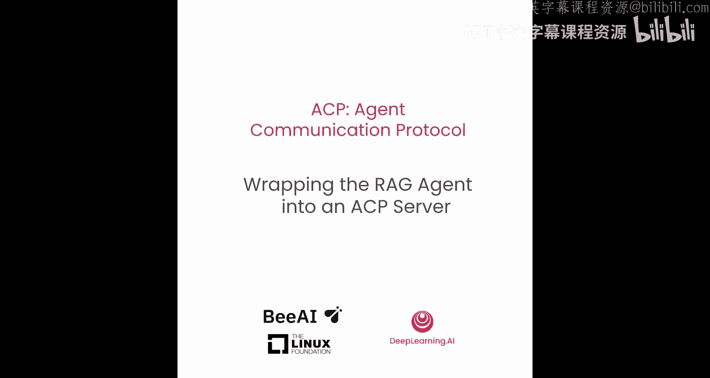
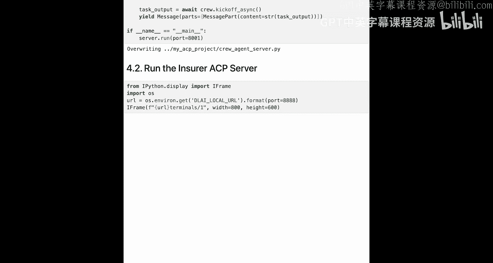
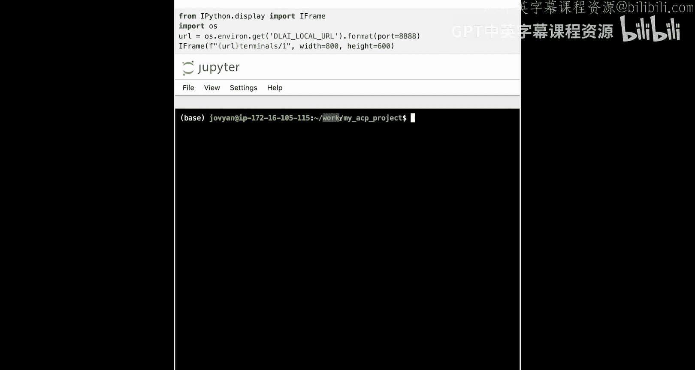
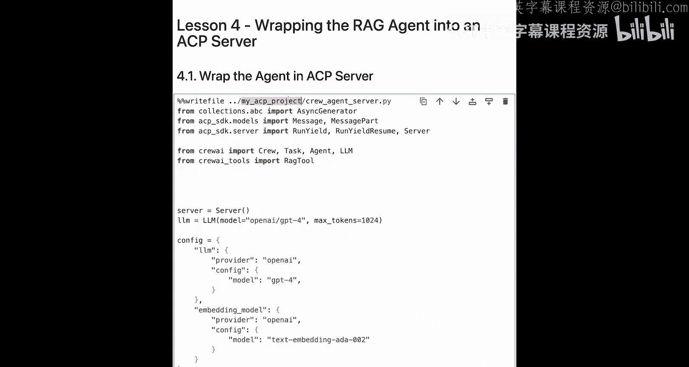
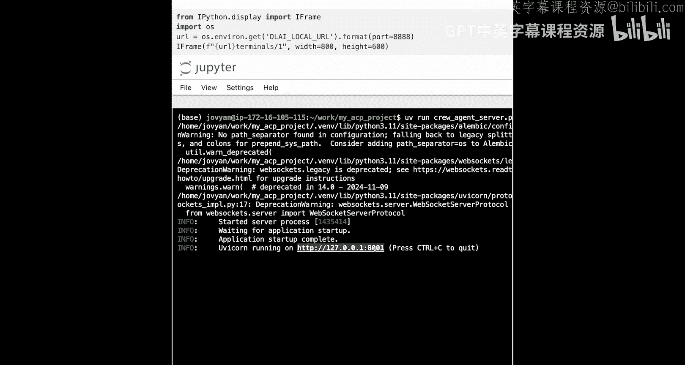
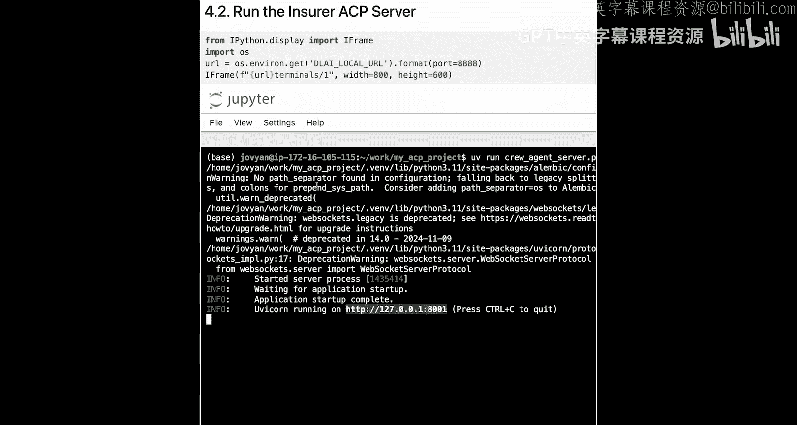
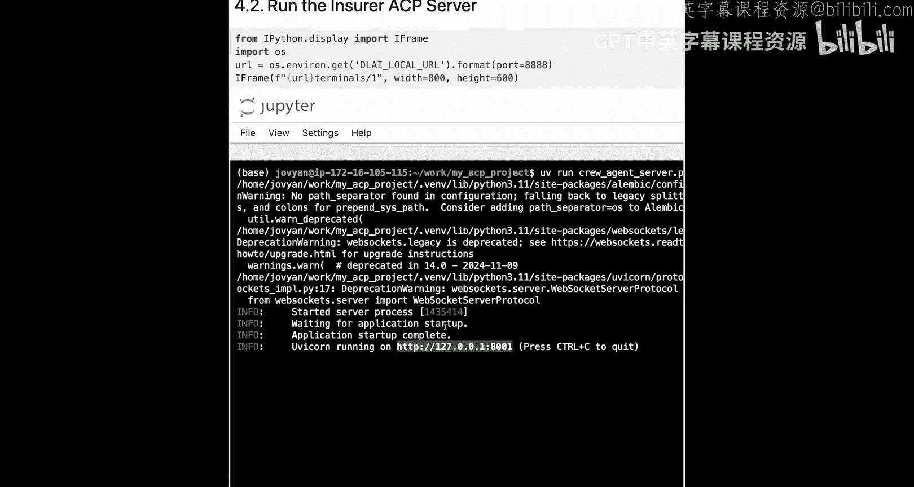

# 005：将RAG智能体封装为ACP服务器 🚀

在本节课中，我们将学习如何将之前构建的RAG智能体封装成一个符合ACP标准的服务器。这将使我们的智能体能够通过统一的协议与其他组织的智能体进行通信。

## 概述




上一节我们完成了RAG智能体的构建。本节中，我们将把这个智能体转换为一个ACP服务器。通过这种方式，我们可以让不同组织的智能体相互通信，这正是ACP协议的优势所在。

## 导出现有代码

首先，我们需要将现有的智能体代码导出为一个独立的Python文件。以下是具体步骤：

以下是代码导出步骤：

1.  将第3课中编写的保险RAG智能体代码保存到一个文件中。
2.  我们将使用一个特定的函数，将当前单元格的内容复制到一个Python脚本中。
3.  导出的文件将命名为 `crew_agent_server.py`。

## 导入ACP依赖项

要将我们的智能体转换为ACP服务器，需要引入一些关键的依赖库。

以下是需要导入的核心模块：

*   `AsyncGenerator` 来自 `collections.abc`：用于定义服务器的输出类型。
*   `Message` 和 `MessagePart` 来自 `acp` 库：用于格式化智能体的输出结果。
*   `run_yield`、`run_yield_resume` 和 `Server` 来自 `acp.server` 库：`run_yield` 和 `run_yield_resume` 构成异步生成器的一部分，展示了ACP服务器的输出类型；`Server` 类则是我们ACP服务器的基础。

导入代码如下：
```python
from collections.abc import AsyncGenerator
from acp import Message, MessagePart
from acp.server import run_yield, run_yield_resume, Server
```

## 创建ACP服务器并包装智能体

现在，我们可以开始创建ACP服务器并包装现有的智能体功能。

首先，创建一个服务器实例：
```python
server = Server()
```

接下来，使用装饰器将我们的智能体函数声明为服务器上的可用智能体。智能体在服务器中的名称基于我们为函数起的名字，同时可以通过文档字符串提供元数据。

我们将函数命名为 `policy_agent`，并使其成为异步函数。它接收一个消息列表作为输入，并返回一个异步生成器。

智能体的用途描述通过文档字符串提供，当其他用户查询此智能体的元数据时，ACP服务器会返回这些信息。

核心包装代码如下：
```python
@server.agent
async def policy_agent(input: list[Message]) -> AsyncGenerator[run_yield | run_yield_resume, None]:
    """
    这是一个用于处理保单覆盖范围相关问题的智能体。
    它使用RAG模式，基于保单文档寻找答案。
    你可以用它来帮助回答关于保险覆盖范围和等待期的问题。
    """
    # 动态获取用户提示，而非使用固定提示
    user_prompt = input[0].parts[0].content

    # 原有的任务设置，现在使用动态提示
    task = AgentTask(
        description=user_prompt, # 替换原有的固定字符串
        agent=researcher_agent,
        expected_output="A detailed answer based on the policy documents."
    )

    # 异步执行智能体任务
    result = await crew.kickoff()

    # 以消息形式返回结果
    yield Message(parts=[MessagePart(content=str(result))])
```

## 运行为独立服务器

代码封装完成后，我们需要将其运行为一个独立的服务器。



我们使用常见的Python结构来启动服务器，并指定运行端口（例如8001），以便后续可以启动其他服务器进行串联调用。

服务器启动代码如下：
```python
if __name__ == "__main__":
    server.run(port=8001)
```





运行导出后的 `crew_agent_server.py` 文件，如果成功，终端将显示服务器正在本地主机的指定端口上运行。

**请注意**：在本学习环境中，服务器启动后会运行120分钟。如果你离开后返回本节课，可能需要重新启动它。如果在本地运行，服务器将持续运行直到你停止Python脚本。

## 总结







本节课中，我们一起学习了将RAG智能体封装为ACP服务器的完整流程。我们导出了现有代码，引入了必要的ACP库依赖，使用装饰器包装了智能体函数使其符合ACP标准，并最终将其启动为一个独立的网络服务。现在，我们的保险策略智能体已经可以通过ACP协议被访问，为下一课中通过ACP客户端调用它并与医院智能体通信做好了准备。