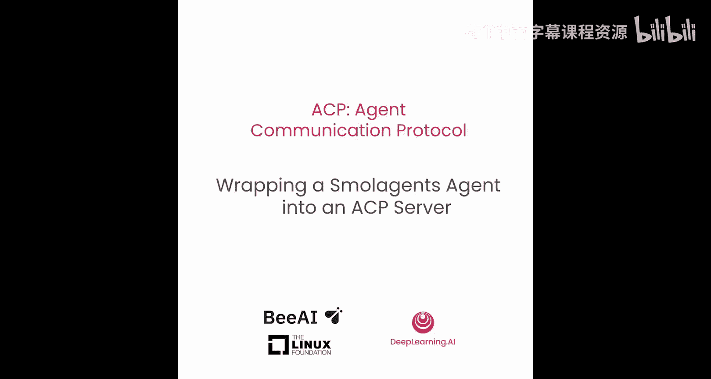
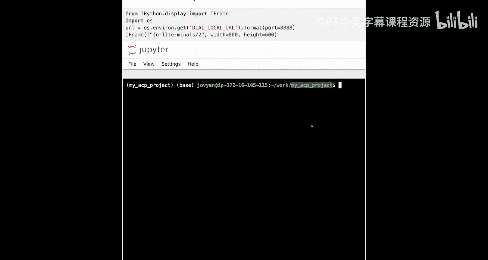
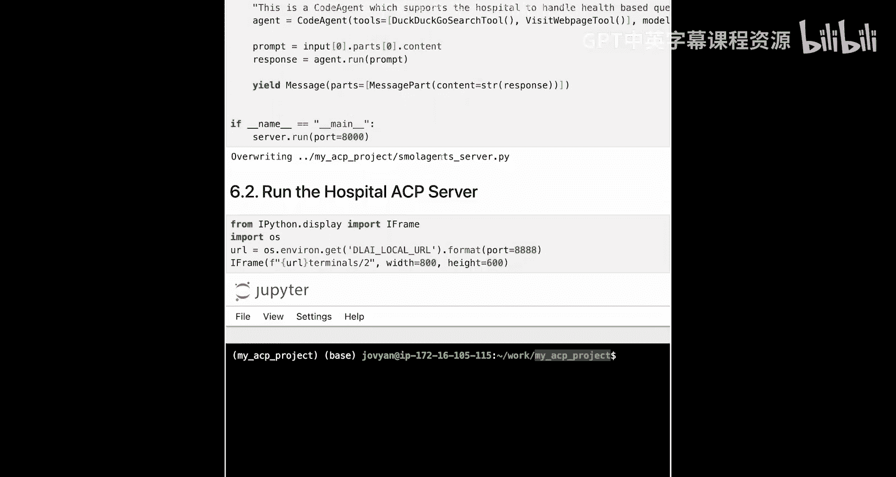
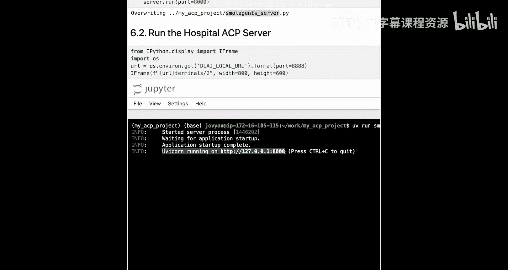
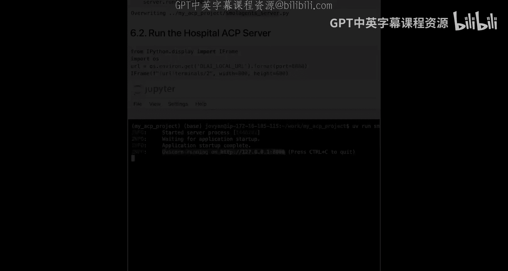

# 007：将Smolagents代理封装为ACP服务器 🏥

在本节课中，我们将学习如何创建第二个ACP服务器，并使用不同的代理框架（Smolagents）来构建一个专注于医疗健康领域的代理。我们将看到如何让多个ACP服务器协同工作，模拟不同组织（如医院和保险公司）之间的交互。

## 概述

上一节我们介绍了如何创建保险公司的ACP服务器。本节中，我们将创建第二个服务器——医院ACP服务器，并开始学习如何顺序调用这些代理，以实现跨组织的互操作性。




## 创建医院ACP服务器

首先，我们需要创建第二个服务器。这个服务器将专注于医院场景，与我们的保险服务器进行交互。这种模式在实际中很常见，不同组织或团队可能使用不同的ACP服务器进行通信。

以下是创建医院ACP服务器的步骤：

### 1. 导入依赖项

首先，我们需要导入必要的依赖项。从ACP的角度看，这些依赖与保险服务器类似，但代理部分会有所不同。

```python
from collections.abc import AsyncGenerator
from acp.models import Message, MessagePart
from acp_sdk import run_yield, run_yield_resume, Server
from smolagents import CodeAgent, DuckDuckGoSearchTool, LiteLLMModel, VisitWebpageTool
```

*   `AsyncGenerator` 用于定义代理函数的返回类型。
*   `Message` 和 `MessagePart` 用于构建ACP服务器的标准化输出。
*   `run_yield`, `run_yield_resume`, `Server` 是ACP SDK的核心组件，用于创建服务器和处理异步生成器。
*   从 `smolagents` 框架导入 `CodeAgent`（代码代理）、`DuckDuckGoSearchTool`（搜索工具）、`LiteLLMModel`（轻量级LLM模型）和 `VisitWebpageTool`（网页访问工具）。这展示了ACP兼容不同代理框架的能力。

### 2. 初始化服务器和LLM

接下来，我们初始化ACP服务器实例和语言模型。

```python
server = Server()

model = LiteLLMModel(model_id='openai/gpt-4')
max_tokens = 2048
```

*   创建 `Server` 实例。
*   使用 `LiteLLMModel` 初始化模型，这里指定为 `openai/gpt-4`。你也可以替换为其他模型，如 `ollama` 或本地模型。
*   设置代理的最大令牌数为2048。

### 3. 定义健康代理

现在，我们使用装饰器定义代理函数。这与定义保险代理的过程类似。

```python
@server.agent
async def health_agent(input: list[Message]) -> AsyncGenerator[Message, None]:
    """
    这是一个代码代理，旨在帮助医院处理基于健康的问题。
    当前或潜在的患者可以使用它来获取关于健康和医院治疗的财务答案。
    """
```

*   使用 `@server.agent` 装饰器将函数注册为服务器上的一个代理。
*   函数命名为 `health_agent`（之前是 `policy_agent`）。客户端将通过此名称调用代理。
*   输入参数 `input` 是一个 `Message` 列表，这是ACP的标准输入格式。
*   返回类型为 `AsyncGenerator[Message, None]`，用于流式输出。
*   **文档字符串（Docstring）至关重要**，它提供了代理的元数据，描述其功能。

### 4. 构建代理逻辑

在函数内部，我们构建代理的核心逻辑。

```python
    agent = CodeAgent(
        tools=[DuckDuckGoSearchTool(), VisitWebpageTool()],
        model=model
    )

    prompt = input[0].parts[0].content

    response = await agent.run(prompt)

    yield Message(parts=[MessagePart(content=str(response))])
```

*   创建 `CodeAgent` 实例，它能够编写Python函数来调用各种工具。
*   将 `DuckDuckGoSearchTool` 和 `VisitWebpageTool` 作为工具传递给代理，使其能够访问互联网信息。
*   将之前定义的 `model` 赋值给代理。
*   从ACP标准输入 `input` 中解包出用户提示（`prompt`）。`input[0].parts[0].content` 提取了第一个消息的第一个部分的内容。
*   使用 `agent.run(prompt)` 运行代理，并等待结果。
*   最后，使用 `yield` 返回一个ACP标准格式的 `Message` 作为输出。`MessagePart` 的 `content` 被设置为代理的响应。

### 5. 运行服务器

最后，添加运行服务器的代码。

```python
if __name__ == "__main__":
    server.run(port=8000)
```

*   当脚本直接运行时，启动服务器。
*   指定运行在端口 `8000` 上（保险服务器运行在 `8001` 端口，以避免冲突）。

## 启动医院服务器

创建好服务器文件（例如 `hospital_server.py`）后，需要在终端中启动它。

如果你在本地运行，只需打开一个新的终端窗口（在Mac上是新的bash终端，在Windows上是新的PowerShell窗口），导航到项目目录，然后运行：


```bash
uv run hospital_server.py
```





如果一切正常，你将看到医院ACP服务器成功运行在 `http://localhost:8000` 上。

## 总结





本节课中，我们一起学习了如何创建第二个ACP服务器。我们使用 **Smolagents框架** 构建了一个医院健康代理，它能够处理健康相关的查询并利用网络搜索工具。通过将服务器运行在不同的端口（`8000`），我们实现了与保险服务器（`8001`）的并存。现在，我们已经拥有了两个可以独立响应请求的ACP服务器，为后续学习代理间的链式调用和互操作性打下了基础。