# 008：串联代理调用 🔗

## 概述
在本节课中，我们将学习如何将运行在不同框架上的多个ACP服务器连接起来，并实现它们之间的顺序调用。我们将从一个医院服务器获取信息，然后将该信息作为上下文传递给一个保险服务器，从而构建一个连贯的工作流程。

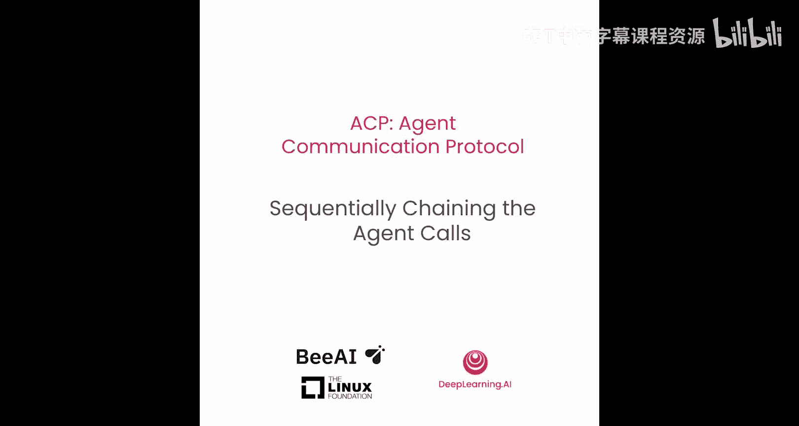


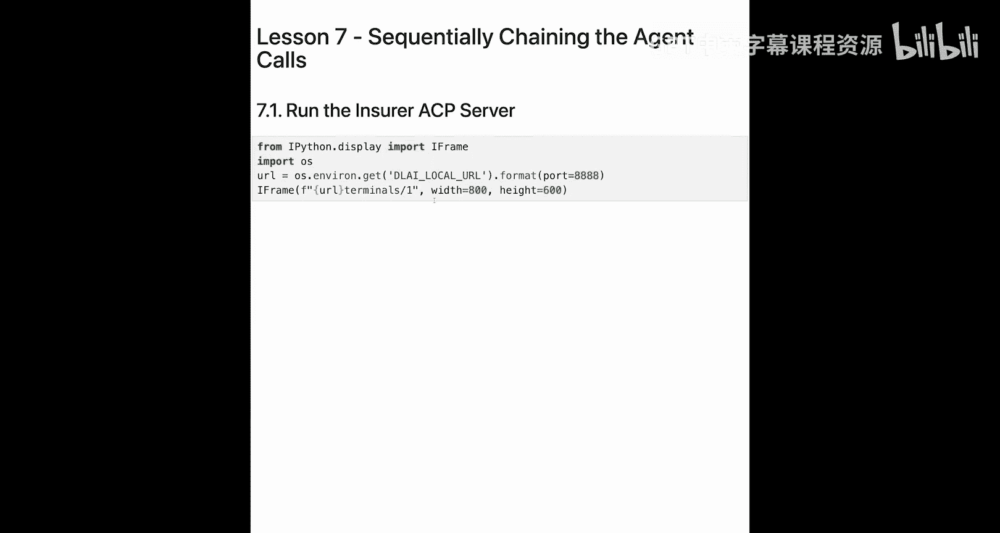

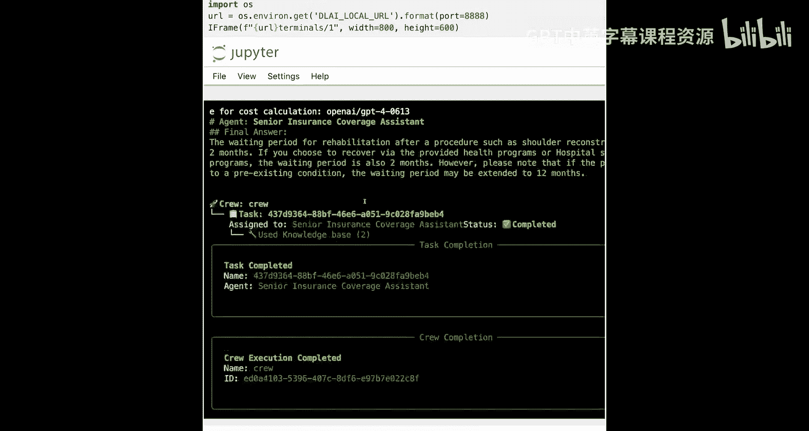

---

## 检查服务器状态
上一节我们介绍了如何分别运行保险和医院ACP服务器。本节中，我们来看看如何让它们协同工作。首先，我们需要确保两个服务器都在正常运行。

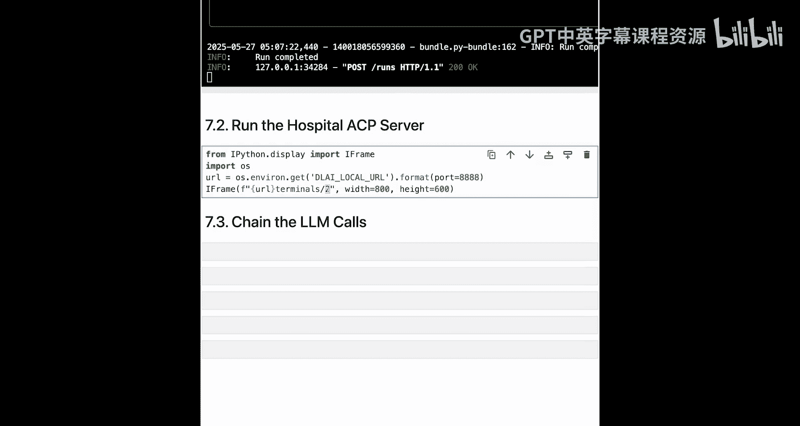

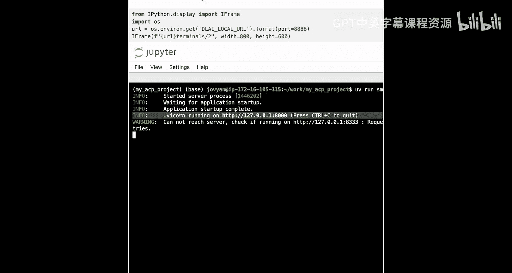

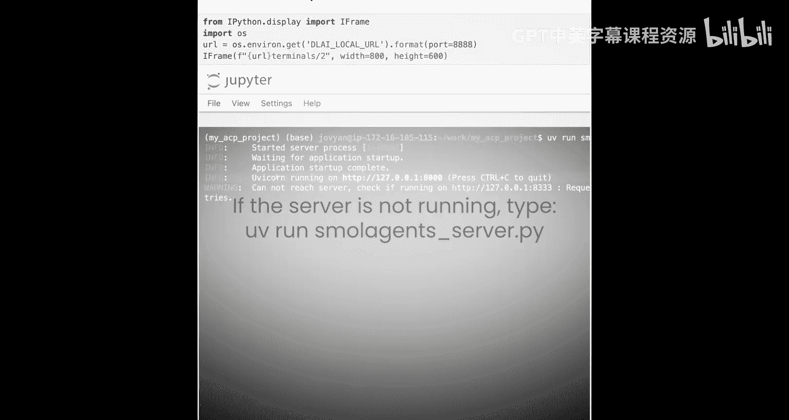

以下是检查步骤：

1.  **检查保险服务器**：保险服务器使用CrewAI框架，是一个检索增强生成（RAG）代理，运行在终端1的端口8001上。确认其处于运行状态。
2.  **检查医院服务器**：医院服务器使用SmalAgents框架，是一个代码代理，运行在终端2的端口8000上。确认其同样处于运行状态。

两个服务器使用不同的框架，这展示了ACP能够兼容多种后端技术。

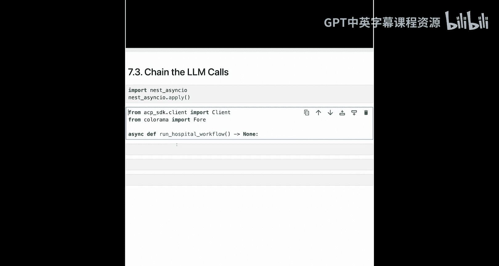

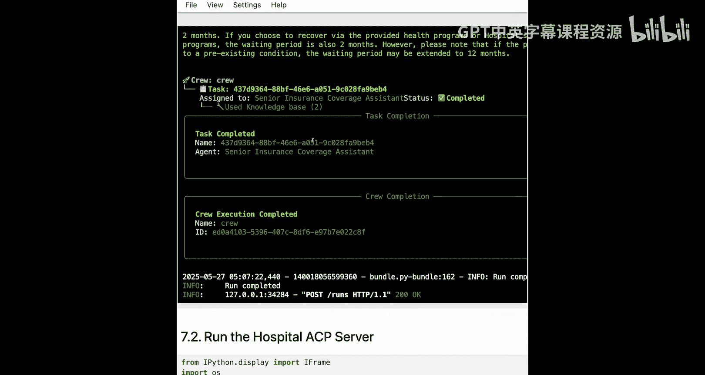

---

## 构建串联调用
现在，核心部分来了：如何让两个服务器对话，并将一个调用的输出作为另一个调用的输入。

我们将使用异步编程来实现顺序调用。首先，我们会调用医院服务器，询问“肩部手术后是否需要康复治疗”。然后，我们将获取其回答，并将其作为上下文传递给保险服务器的策略代理，询问“康复治疗的等待期是多久”。

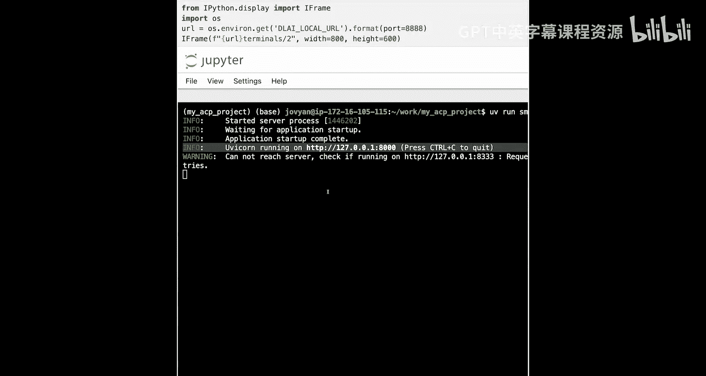

以下是实现串联调用的关键代码步骤：

```python
import asyncio
from acp_sdk import Client
from colorama import Fore, Style

async def hospital_workflow():
    # 1. 创建连接到两个服务器的客户端
    insurer_client = await Client.connect("localhost:8001")
    hospital_client = await Client.connect("localhost:8000")

    # 2. 第一个调用：询问医院服务器
    hospital_run = await hospital_client.run(
        agent_id="health_agent",
        input="do I need rehabilitation after a shoulder reconstruction"
    )
    # 提取回答内容
    hospital_answer = hospital_run.output[0].parts[0].content
    print(Fore.LIGHTMAGENTA_EX + hospital_answer + Style.RESET_ALL)

    # 3. 第二个调用：将医院回答作为上下文传递给保险服务器
    insurance_prompt = f"Context: {hospital_answer}\n\nQuestion: What is the waiting period for rehabilitation?"
    insurance_run = await insurer_client.run(
        agent_id="policy_agent",
        input=insurance_prompt
    )
    # 提取保险回答内容
    insurance_answer = insurance_run.output[0].parts[0].content
    print(Fore.YELLOW + insurance_answer + Style.RESET_ALL)

# 运行工作流
asyncio.run(hospital_workflow())
```

**代码解释**：
*   `Client.connect()`：创建与指定地址和端口的ACP服务器的连接。
*   `client.run()`：向指定的代理发送请求并执行任务。
*   `run.output[0].parts[0].content`：从ACP响应中提取文本内容的标准方式。
*   我们使用`colorama`库为不同服务器的输出添加颜色，以便在终端中清晰区分。

---

## 运行与结果
当我们执行上述代码时，工作流程如下：

1.  首先触发对医院服务器的调用。我们看到它进行了网络搜索并返回结果：**“是的，肩部重建手术后需要康复治疗。”**（以亮粉色显示）。
2.  接着，这个答案被自动作为上下文，触发对保险服务器的调用。保险代理处理信息后返回：**“根据金牌保险计划，肩部重建手术的典型等待期是两个月。”**（以黄色显示）。

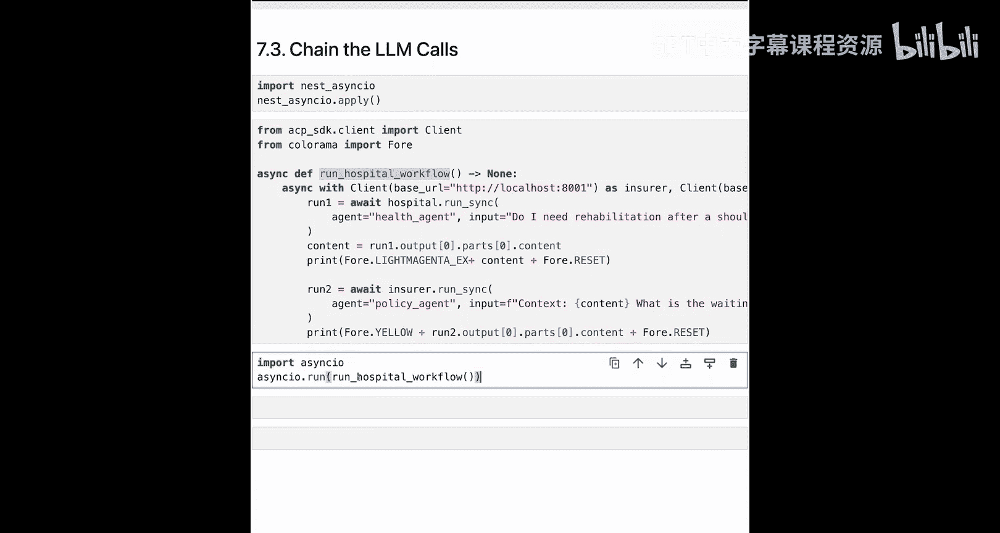

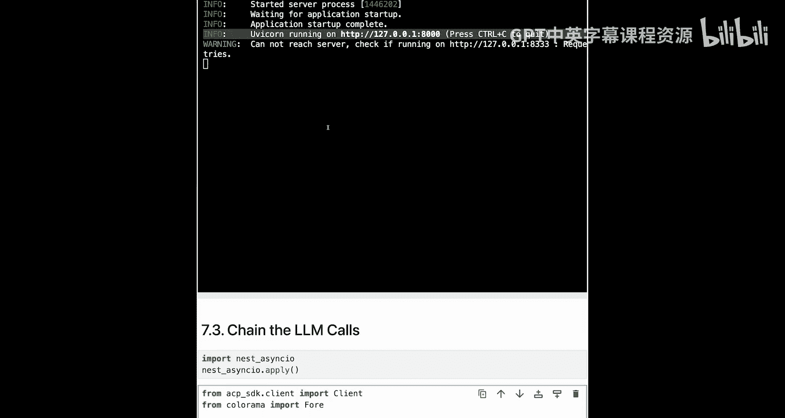

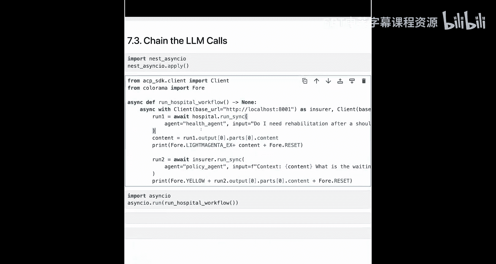

通过这个例子，我们成功地串联了两次ACP调用。这展示了将不同流程、甚至不同组织内的专用代理连接起来的可能性。您可以根据需要，以类似方式构建更复杂的多步骤工作流。

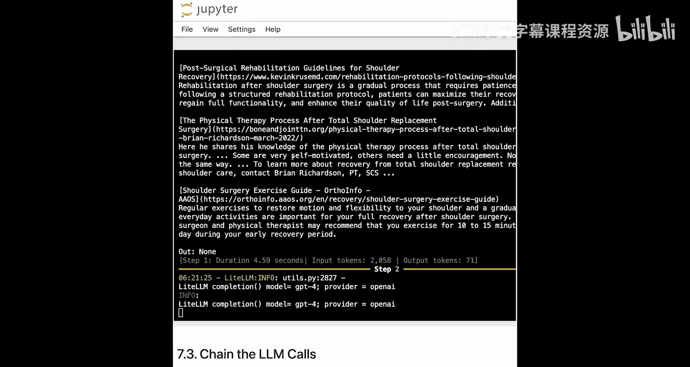

---

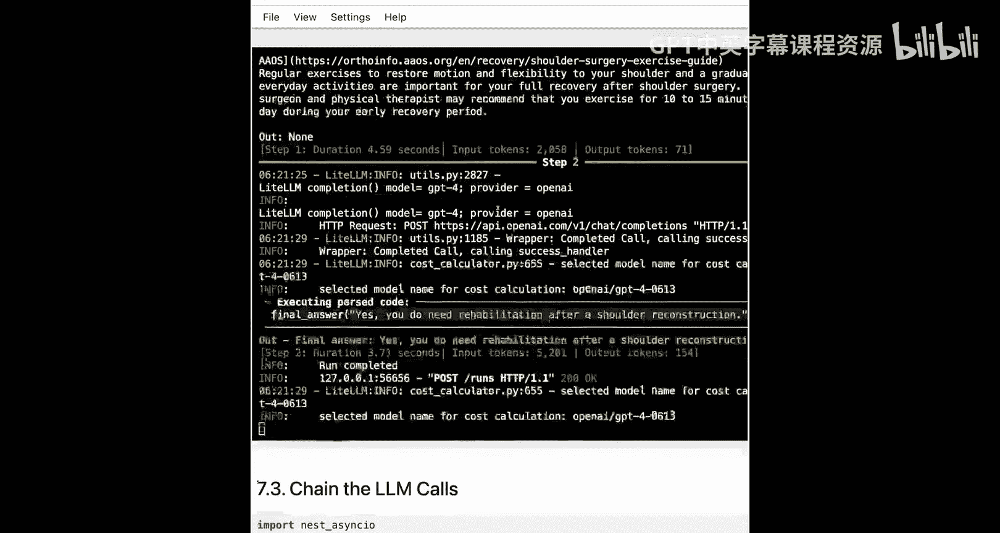

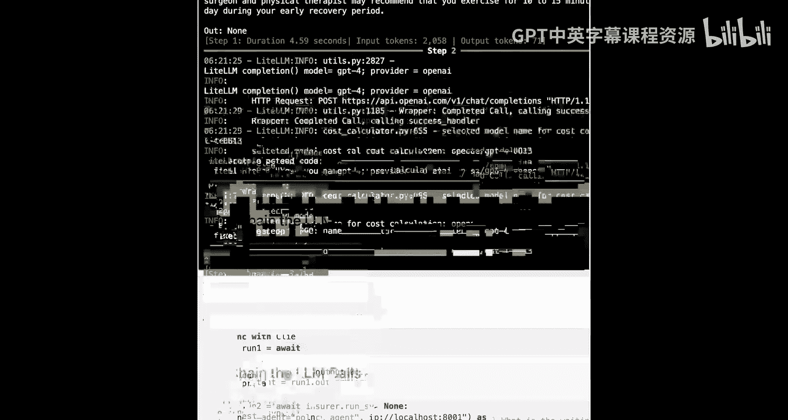

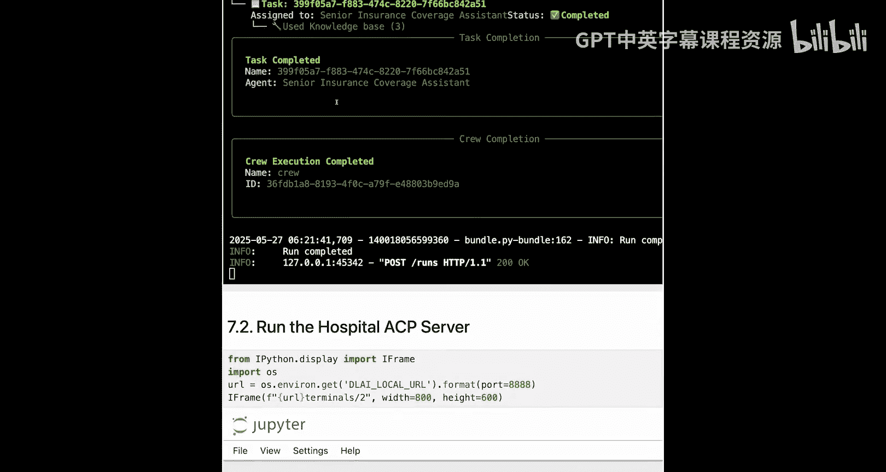

## 总结
本节课中我们一起学习了ACP的核心优势之一：**跨框架、跨服务器的代理协同**。我们掌握了如何：
1.  同时连接多个独立的ACP服务器。
2.  使用异步编程顺序调用不同的代理。
3.  将一个代理的输出作为上下文，无缝传递给下一个代理。

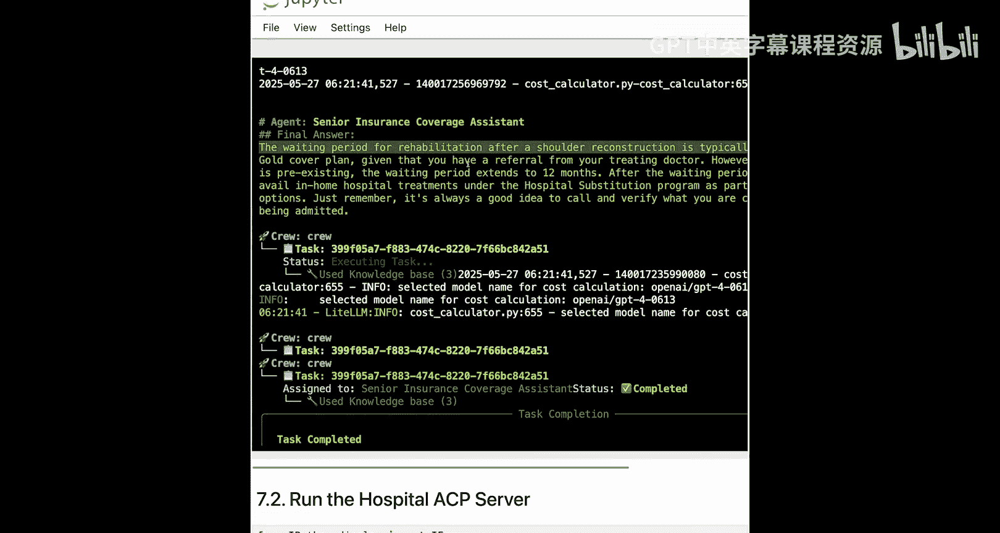

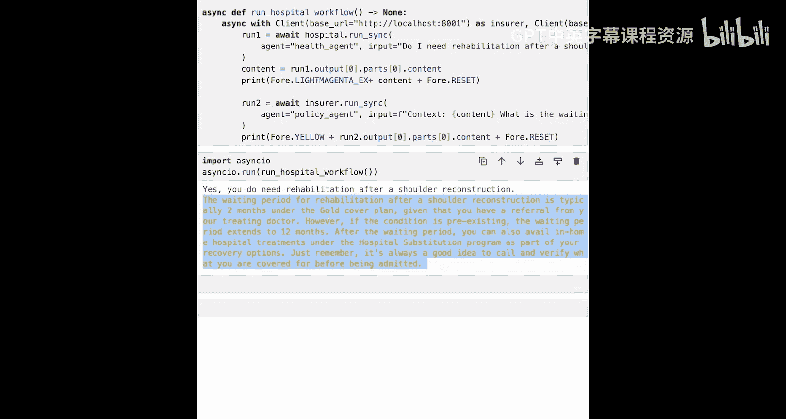

这种方法为构建模块化、可扩展的复杂AI应用系统提供了强大的基础。