# 009：使用路由代理进行分层链式代理调用 🚀

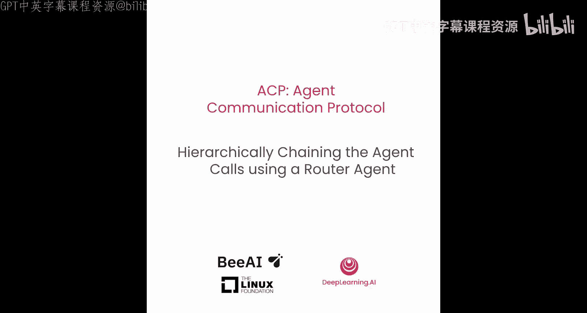


## 概述
在本节课中，我们将学习如何构建一个更智能的代理调用系统。之前我们已经通过顺序调用来连接不同的ACP服务器。现在，我们将引入一个“路由代理”（Router Agent），让它能够自动分析用户的问题，并智能地决定应该调用哪个服务器上的哪个代理来获取最佳答案。这种方法被称为“分层链式调用”。

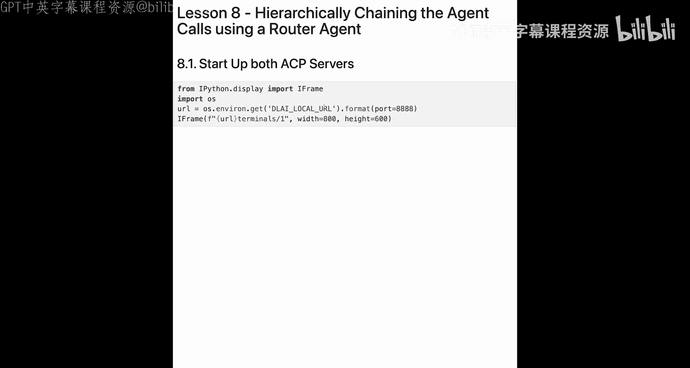

## 准备工作：确保服务器运行

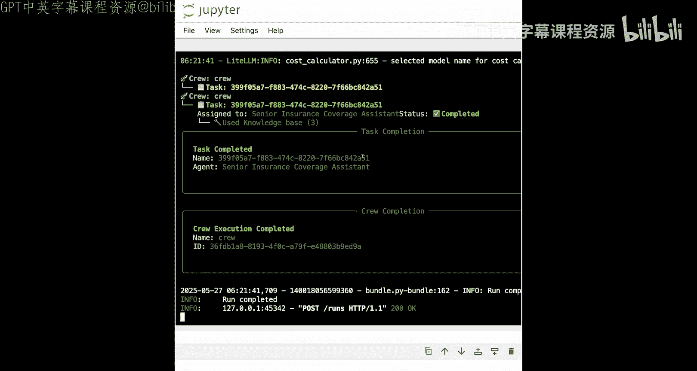

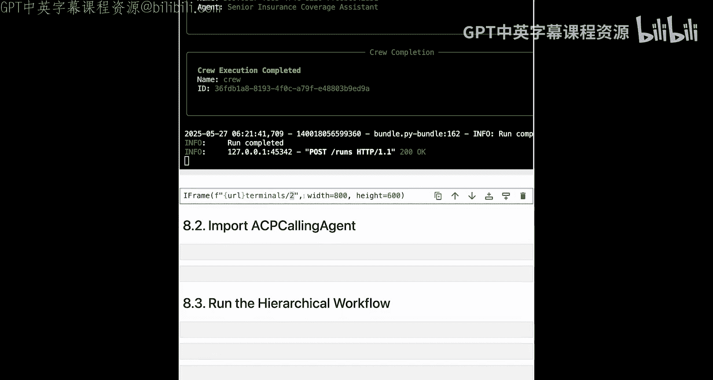

上一节我们介绍了顺序调用，本节中我们来看看如何让代理自动路由请求。首先，我们需要确保所有必要的ACP服务器都在正常运行。

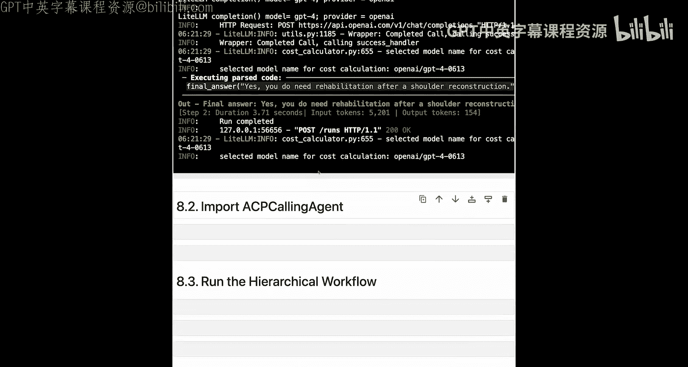

以下是需要检查的服务器：
*   **保险服务器**：运行在本地端口8001上。
*   **医院服务器**：运行在本地端口8000上。

请打开终端，分别确认这两个服务器进程是否处于活动状态。如果通过本课程环境运行，请注意有120分钟的时间限制；若在本地运行，则时间取决于Python脚本的执行。

## 构建分层工作流

准备工作完成后，我们现在开始构建核心的分层调用工作流。主要思路是创建一个“路由代理”，它会接收一个复合问题，自动将其分解，并决定调用哪个后端代理。

首先，我们需要导入必要的依赖库。

```python
import asyncio
import nest_asyncio
from acp_sdk import Client
from small_agents import LiteLLM
from fast_acp import AgentCollection, ACPCallingAgent
from colorama import Fore, init
```

代码解释：
*   `asyncio` 和 `nest_asyncio`：用于处理异步调用。
*   `acp_sdk.Client`：用于连接ACP服务器。
*   `small_agents.LiteLLM`：我们将使用它提供的模型类（例如GPT-4）。你也可以直接使用LiteLLM的补全功能。
*   `fast_acp`：这是一个示例模块，包含了我们需要的 `AgentCollection`（用于收集和管理代理）和 `ACPCallingAgent`（即我们的路由代理）。
*   `colorama`：用于在终端输出彩色文本，提升可读性。

`ACPCallingAgent` 是这个工作流的核心。它的作用类似于Small Agents中的工具调用代理，但它的“工具”是其他ACP代理。它接收一个代理列表和一个语言模型，能够自动规划如何调用这些代理来回答复杂问题。

## 实现医院工作流

接下来，我们定义一个异步函数来实现完整的分层调用流程。

```python
async def run_hospital_workflow():
    # 1. 连接到两个ACP服务器
    insurer_client = Client(“http://localhost:8001”)
    hospital_client = Client(“http://localhost:8000”)

    # 2. 发现所有可用的代理
    collection = await AgentCollection.from_acp_call([insurer_client, hospital_client])
    
    # 3. 整理代理信息，便于路由代理调用
    acp_agents = {}
    for client, agent in collection.agents:
        acp_agents[agent.name] = {“agent”: agent, “client”: client}
    
    # 4. 定义路由代理使用的语言模型
    model = LiteLLM(“gpt-4”) # 可根据需要更换模型

    # 5. 创建路由代理实例
    router_agent = ACPCallingAgent(agents=acp_agents, model=model)

    # 6. 向路由代理提出复合问题
    final_result = await router_agent.acp_agent_call(
        “do I need rehabilitation after a shoulder reconstruction and what is the waiting period from my insurance?”
    )

    # 7. 打印最终结果
    print(f”{Fore.YELLOW}Final Result: {final_result}{Fore.RESET}”)
```

关键步骤分析：
1.  **连接客户端**：创建两个客户端对象，分别指向保险和医院服务器。
2.  **代理发现**：`AgentCollection.from_acp_call` 方法会自动联系所有服务器，获取其上所有已注册代理的详细信息（包括名称、描述等）。
3.  **代理整理**：我们将代理和其对应的客户端绑定在一起。这样，当路由代理决定调用“policy_agent”时，它能知道应该使用 `insurer_client` 去调用。
4.  & 5. **创建路由代理**：使用发现的代理列表和选定的LLM（如GPT-4）实例化路由代理。
5.  **执行调用**：向路由代理提出一个复合问题：“肩关节重建后是否需要康复治疗，以及我的保险等待期是多久？”。路由代理会分析这个问题，将其拆解，并自动调用 `health_agent`（医院服务器）来回答康复必要性，调用 `policy_agent`（保险服务器）来回答等待期问题。
6.  **输出结果**：将整合后的答案打印出来。

运行这个工作流，你将看到路由代理自动在两个服务器间导航，并返回一个统一的答案，例如：“是的，肩关节重建后通常需要康复治疗...关于保险，康复治疗的等待期是两个月...”。

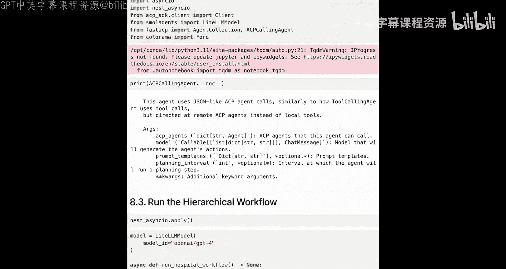

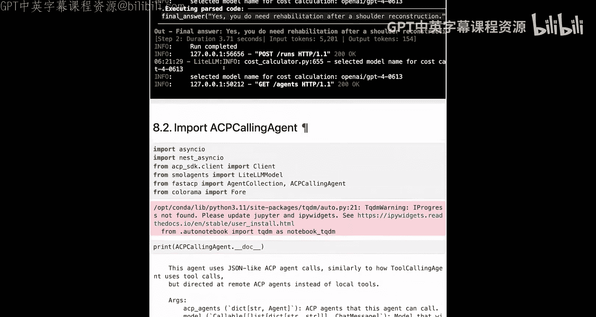

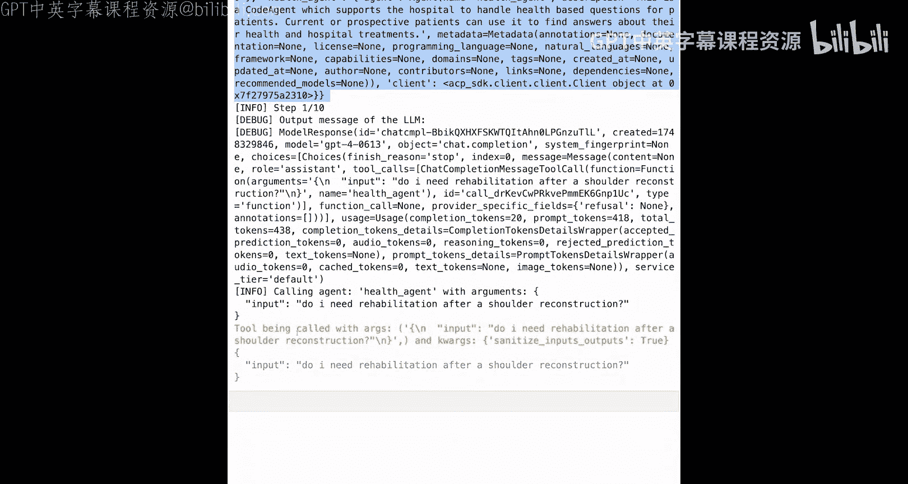

## 总结

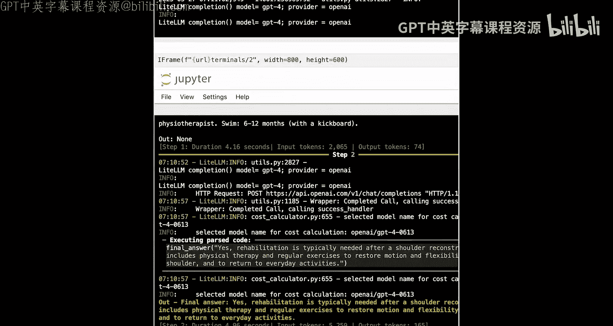

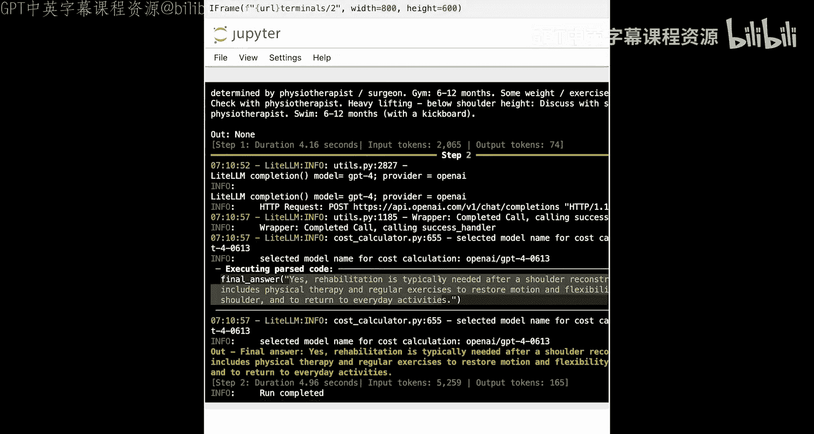

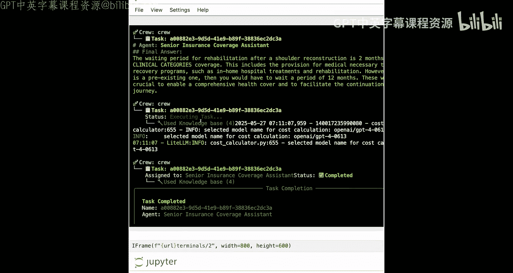

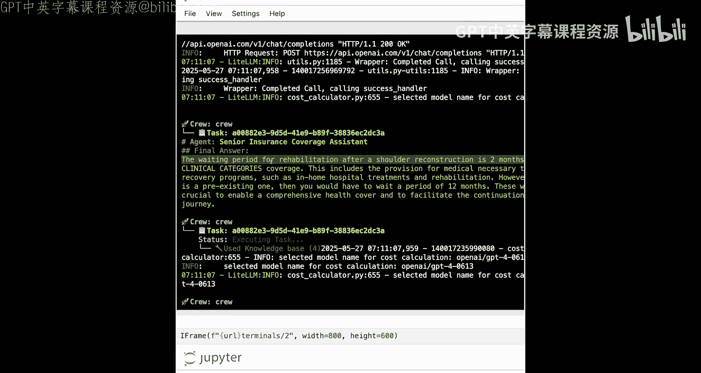

本节课中我们一起学习了ACP的分层链式调用。我们通过构建一个路由代理（`ACPCallingAgent`），实现了智能的代理调用路由。与手动顺序调用相比，这种方法能够：
*   **自动问题分解**：将复杂的复合问题拆解成子问题。
*   **智能路由**：根据代理的描述和能力，自动选择最合适的代理来回答每个子问题。
*   **结果整合**：将来自不同服务器的答案整合成一个连贯的最终回复。

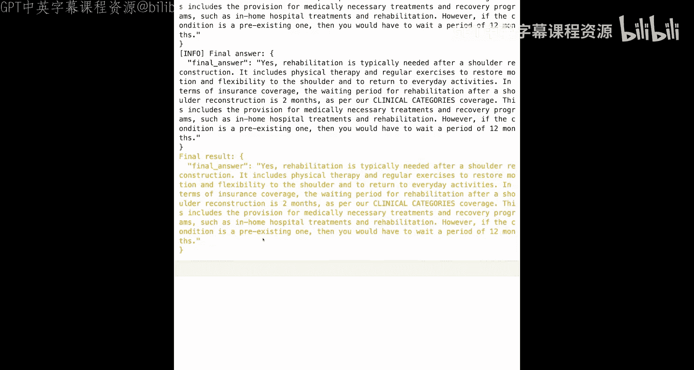

这使得基于ACP构建的代理系统更加灵活和强大，能够处理更复杂的多步骤查询任务。