# 010：将MCP集成到医院服务器 🏥

在本节课中，我们将学习如何将模型上下文协议（MCP）与代理通信协议（ACP）结合使用。我们将通过改造一个现有的医院ACP服务器，使其能够调用一个专门用于查找医生的MCP服务器，来演示这两种协议如何协同工作。

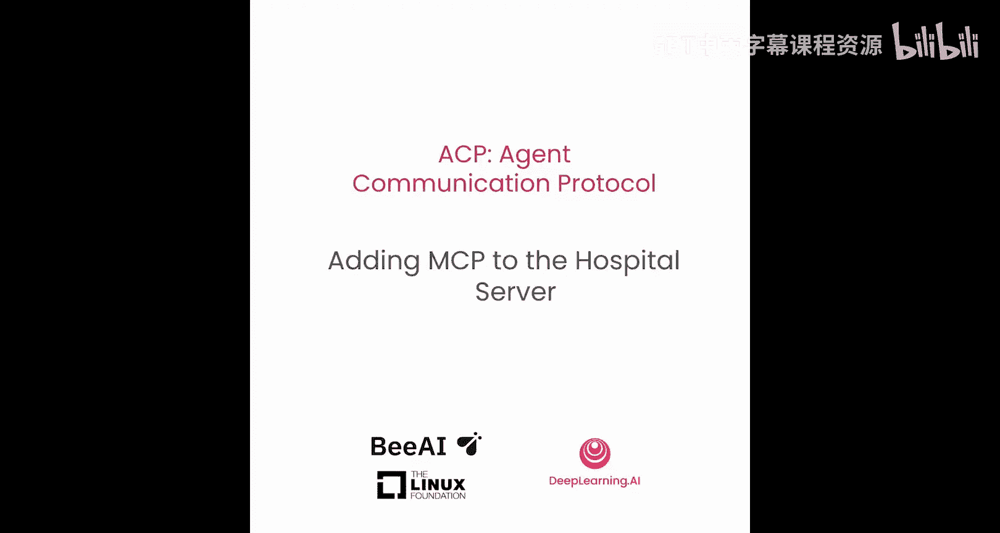


## 概述

之前我们已经介绍了顺序调用和分层调用。现在，我们将探讨如何让ACP和MCP协同工作。ACP定义了代理之间的通信协议，而MCP则主要定义了工具（Tools）的通信协议。通过将它们结合，我们可以构建更强大、功能更丰富的代理系统。

## 创建MCP服务器 🛠️

首先，我们需要创建一个MCP服务器。这个服务器将提供一个工具，允许用户根据所在州（美国）查找附近的医生。

我们将使用Jupyter notebook的魔法函数将MCP服务器代码写入项目目录，以便后续ACP服务器能通过标准输入输出（STDIO）与其通信。

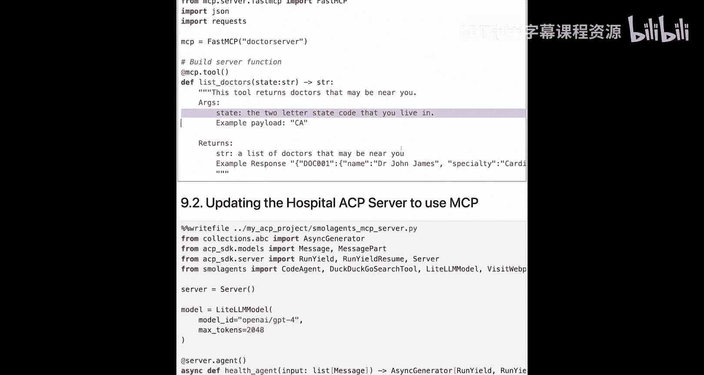

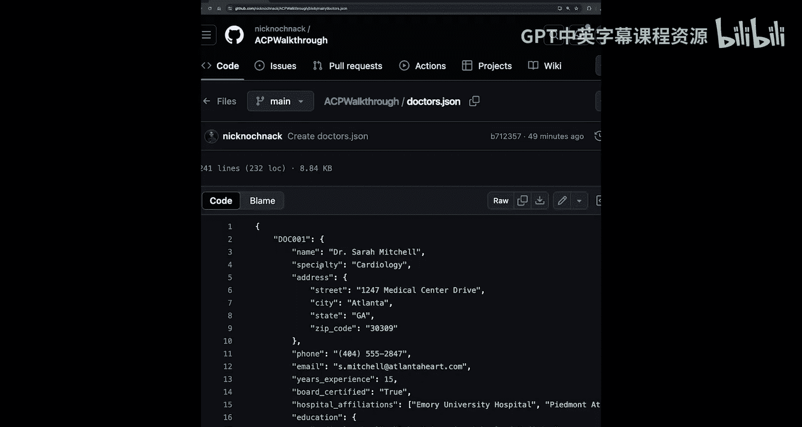

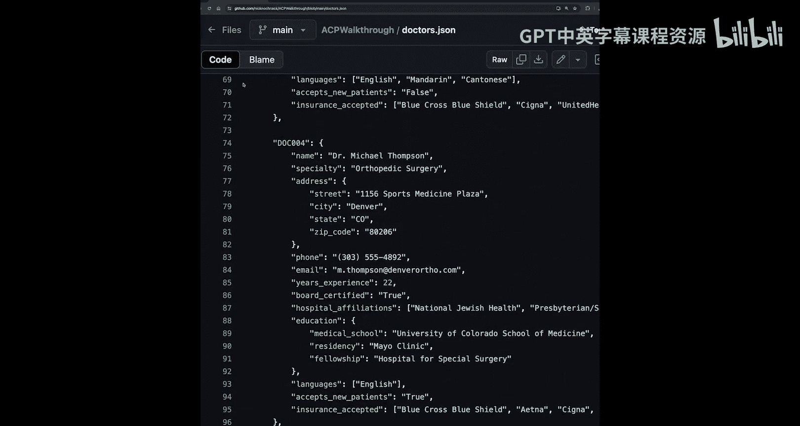

以下是创建MCP服务器的步骤：

1.  **导入必要的库**：我们需要`colorama`用于终端格式化，`fastmcp`用于构建MCP服务器，`json`用于处理数据，`requests`用于从GitHub获取医生数据。
    ```python
    import colorama
    from mcp import fastmcp
    import json
    import requests
    ```

2.  **初始化MCP服务器**：创建一个名为`doctor_server`的MCP服务器实例。
    ```python
    mcp = fastmcp.FastMCP("doctor_server")
    ```

3.  **定义工具函数**：使用`@mcp.tool()`装饰器创建一个名为`list_doctors`的工具。该工具接收一个州名缩写（字符串），并返回一个字符串格式的医生列表。
    ```python
    @mcp.tool()
    def list_doctors(state: str) -> str:
        """
        此工具返回您附近可能存在的医生。
        它接收一个您居住地的两字母州代码。
        返回一个您附近可能存在的医生列表。
        """
        # 从GitHub获取医生数据
        url = "https://raw.githubusercontent.com/Nicknoack/ACP-walkthrough/refs/heads/main/doctors.json"
        response = requests.get(url)
        doctors = json.loads(response.text)
        
        # 根据州筛选医生
        matches = []
        for doctor in doctors.values():
            if doctor["address"]["state"] == state:
                matches.append(doctor)
        
        # 将匹配的医生列表转换为字符串返回
        return str(matches)
    ```

4.  **运行服务器**：确保服务器在`__name__ == "__main__"`条件下以STDIO传输方式运行。
    ```python
    if __name__ == "__main__":
        mcp.run(transport="stdio")
    ```

运行此单元格后，MCP服务器代码将被写入`my_acp_project`目录，供后续ACP服务器调用。

## 更新ACP服务器以集成MCP 🤝

上一节我们创建了MCP服务器，本节我们将更新现有的医院ACP服务器，添加一个能利用该MCP服务器的第二个代理。

首先，我们需要在ACP服务器代码中引入新的依赖。

```python
# 原有的Small Agent导入
from smallagents import CodeAgent, GoogleSearchTool, VisitWebPageTool
# 新增导入，用于支持MCP
from smallagents import ToolCallingAgent, ToolCollection
from mcp import StdioServerParameters
```

接下来，我们需要配置如何连接到刚刚创建的MCP服务器。

```python
# 定义连接到MCP服务器的参数
server_params = StdioServerParameters(
    command="uv", # 使用uv工具
    args=["run", "mcp_server.py"], # 运行MCP服务器的命令参数
    env=None # 无特殊环境变量
)
```

现在，我们可以在ACP服务器中定义第二个代理。第一个代理`health_agent`处理一般的医院查询，第二个代理`doctor_agent`将专门用于查找医生。

以下是定义`doctor_agent`的步骤：

1.  **使用代理装饰器**：使用`@server_agent`装饰器定义一个新的异步函数`doctor_agent`。
2.  **创建工具集合**：使用`with`语句和`ToolCollection.from_mcp`方法连接到MCP服务器，并获取其工具。
3.  **初始化工具调用代理**：使用`ToolCallingAgent`，并将从MCP服务器获取的工具传递给它。
4.  **处理请求并返回响应**：从输入中提取用户提示（prompt），交给代理运行，并将结果返回给用户。

```python
@server_agent
async def doctor_agent(input: List[Message]) -> AsyncGenerator[Message, None]:
    """
    这是一个医生代理，帮助用户查找附近的医生。
    """
    # 连接到MCP服务器并获取工具集合
    async with ToolCollection.from_mcp(server_params, trust_remote_code=True) as tool_collection:
        # 创建工具调用代理，传入MCP工具和语言模型
        agent = ToolCallingAgent(
            tools=[*tool_collection.tools.values()], # 解包所有工具
            model=model # 使用配置的模型，如GPT-4
        )
        # 从输入中提取用户提示
        prompt = input[0].parts[0].content
        # 运行代理获取响应
        response = await agent.run(prompt)
        # 将响应返回给用户
        yield Message(parts=[MessagePart(content=response)])
```

更新并保存ACP服务器代码后，需要重启服务器以使更改生效。在终端中运行：
```bash
uv run smallagents_server.py
```
服务器将在端口8000上重新启动。

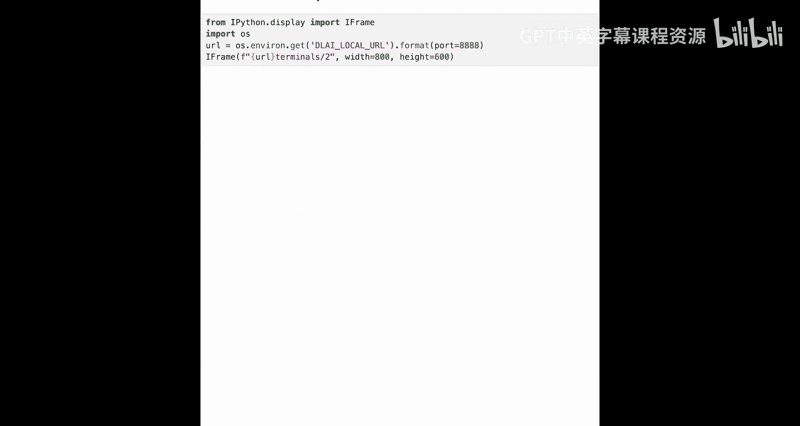

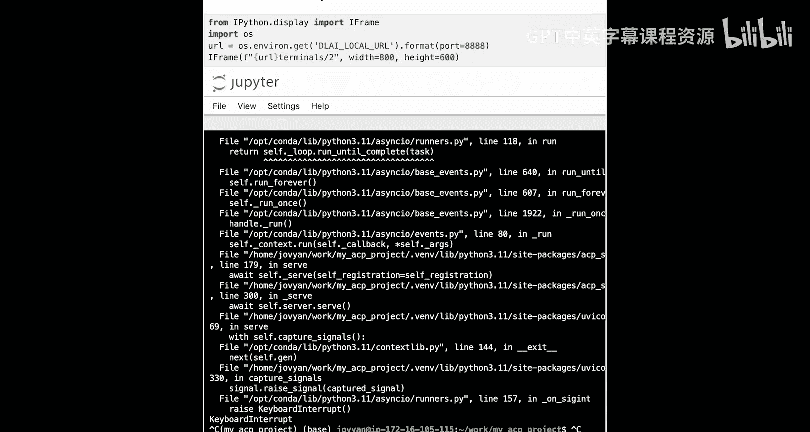

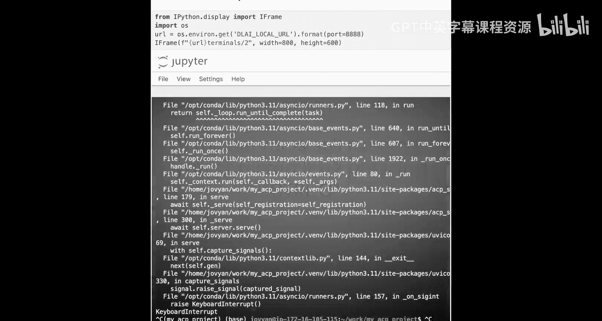

## 调用集成MCP的ACP代理 📞

服务器更新并运行后，我们现在可以编写客户端代码来调用新的`doctor_agent`。

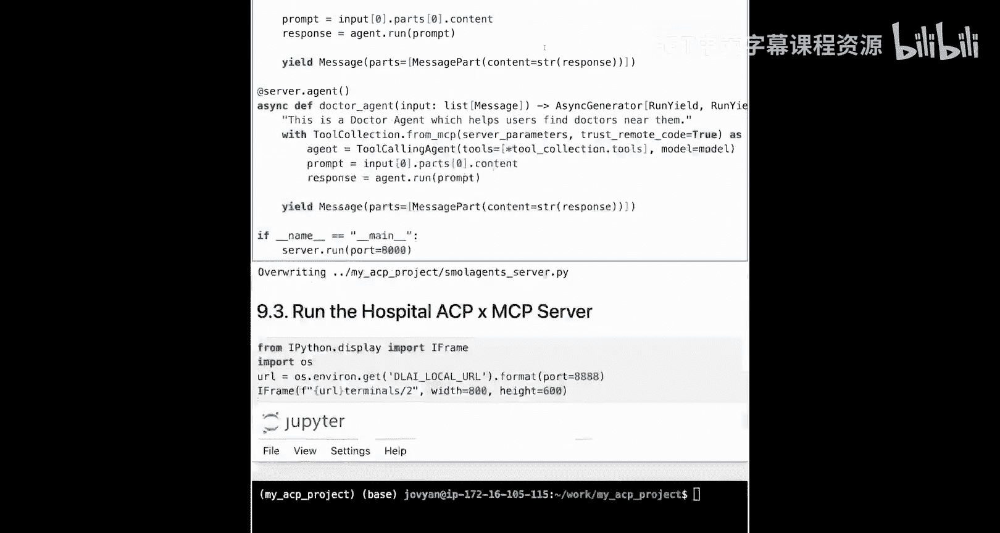

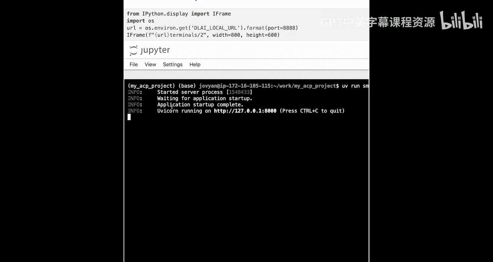

首先，导入必要的客户端依赖。

```python
import asyncio
import nest_asyncio
from acp_sdk import Client
from colorama import Fore, Style
nest_asyncio.apply() # 允许在Jupyter等环境中嵌套事件循环
```

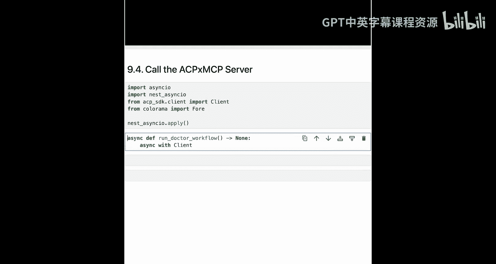

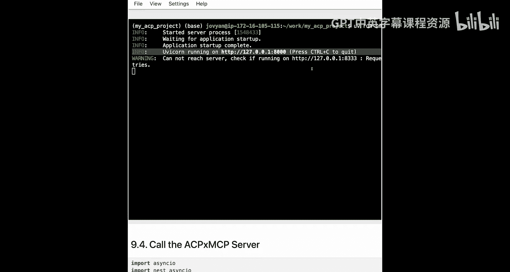

然后，定义一个异步函数来执行工作流。关键点在于指定要调用的代理为`doctor_agent`，并传递一个包含地点和需求的提示。

```python
async def run_doctor_workflow() -> None:
    async with Client(base_url="http://localhost:8000") as hospital_client:
        # 同步调用doctor_agent
        run1 = await hospital_client.run_sync(
            agent="doctor_agent", # 指定调用新创建的医生代理
            prompt="I'm based in Atlanta, Georgia. Are there any cardiologists near me?" # 用户查询
        )
        # 提取并打印响应内容
        content = run1.output.messages[0].parts[0].content
        print(Fore.LIGHTMAGENTA_EX + content + Style.RESET_ALL)

# 运行工作流
asyncio.run(run_doctor_workflow())
```

执行此代码后，`doctor_agent`会通过MCP服务器查询数据，并返回在佐治亚州亚特兰大附近的医生（包括心脏科医生）信息。

## 总结

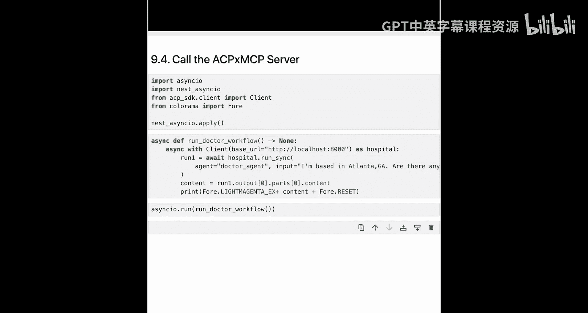

在本节课中，我们一起学习了如何将MCP与ACP结合使用。

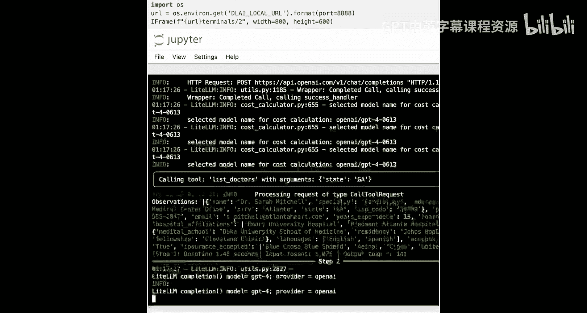

1.  **创建MCP服务器**：我们构建了一个独立的MCP服务器，它提供了一个`list_doctors`工具，能够根据州名筛选并返回医生数据。
2.  **更新ACP服务器**：我们在现有的医院ACP服务器中添加了第二个代理`doctor_agent`。该代理利用`ToolCallingAgent`和从MCP服务器动态获取的工具，扩展了服务器的功能。
3.  **进行调用测试**：我们通过ACP SDK客户端，指定`doctor_agent`并发送查询，成功获取了基于位置的医生信息，验证了ACP与MCP的协同工作。


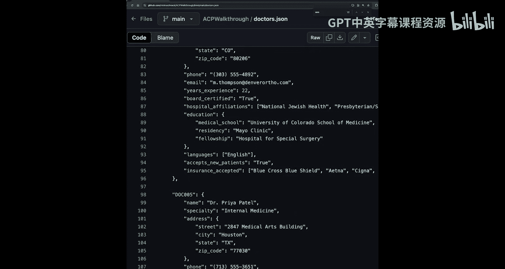

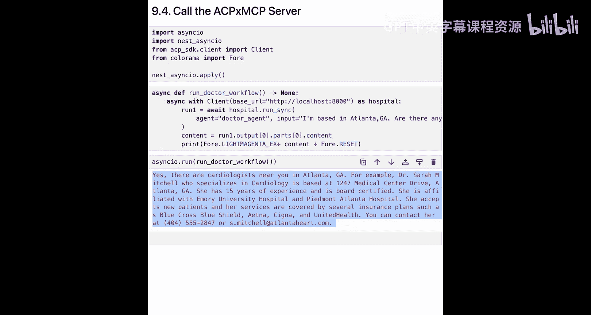

通过这个实例，你掌握了如何让专注于代理间通信的ACP与专注于工具标准化的MCP相互配合，从而构建出既能进行复杂对话又能调用专用工具功能的强大智能代理系统。你可以尝试修改提示词，查询其他州或特定类型的医生，以进一步探索该系统的能力。