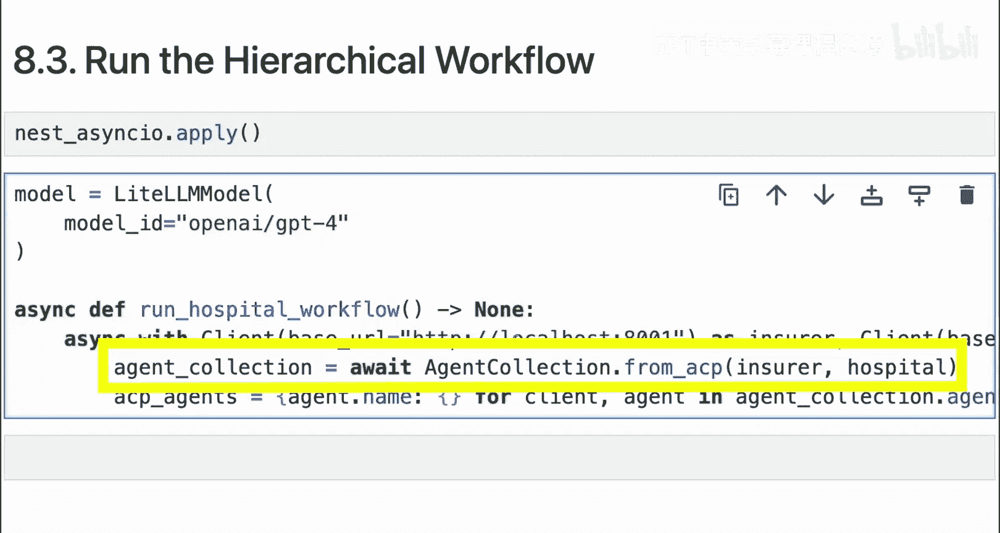
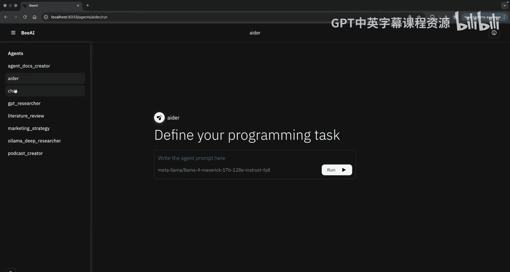
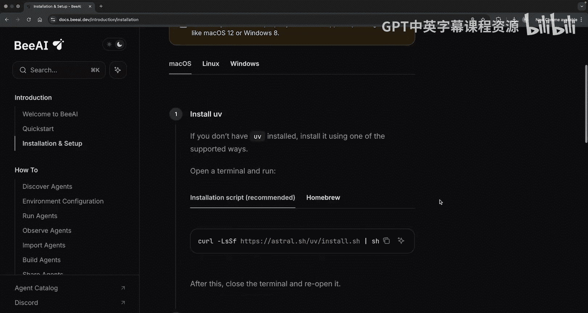
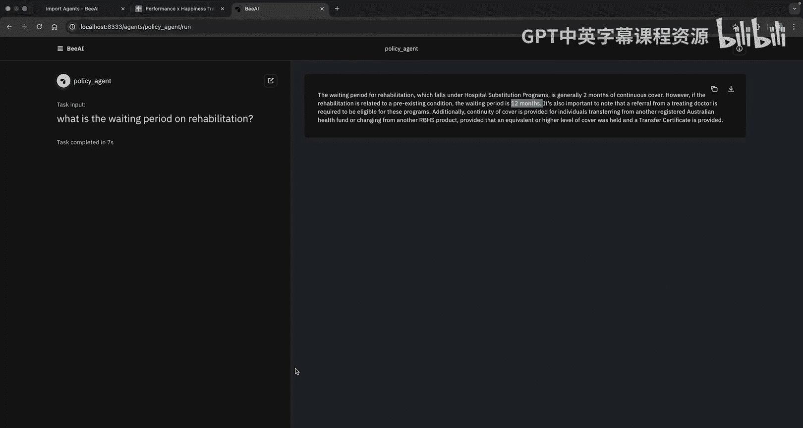

# 011：管理符合ACP规范的代理

## 概述
在本节课中，我们将学习如何将我们构建的符合ACP规范的代理集成到B平台中，实现集中管理和通过用户界面运行。我们将了解注册表的概念，并实践将代理添加到B平台注册表，以及通过命令行和图形界面调用这些代理。

## 什么是注册表？
上一节我们介绍了如何通过Python客户端发现ACP服务器上的代理。但还有其他方法可以实现这一点，其中之一就是通过注册表。

可以将注册表视为一个中心化的仓库，你可以访问其中具有不同用例、工具和能力的各种代理。注册表还允许你集中管理、部署和搜索代理。在即将展示的注册表案例中，你还可以执行离线发现。这意味着你能够在没有网络连接的情况下搜索代理。

你将学习的注册表由B平台提供。它拥有内置的注册表，同时也提供了一个用户界面来运行和管理代理，并提供了使代理符合ACP规范的能力，以便让它们按顺序和分层方式执行任务。

## 安装B平台
根据你运行的操作系统，有几种不同的安装方式。

如果你运行在MacOS或Linux上，可以按照这里的说明进行安装。如果你使用Windows，则可以按照这组说明进行安装。

现在，要启动B平台，你可以运行 `b_platform start` 并按照设置说明进行操作。我将使用X AI，特别是平台上的Llama。你可以使用任何你喜欢的模型。

## 探索B平台内置代理
安装完成后，你会立即获得一些流行的内置代理，例如用于研究的G研究员、用于编程的Ada，以及用于创建播客的播客创建代理。

如果我们选择其中一个，比如Ada，我们可以传递提示并运行它，然后你就得到了你的代理运行结果。

## 集成自定义ACP代理
问题是，你已经付出了所有努力来构建自己的符合ACP规范的代理。那么，你能将它们添加到B平台内部的注册表中吗？当然可以，让我们开始操作。

我们将把我们的ACP代理引入B平台。为此，首先我在本地机器上复制了DeepLearning.AI环境，并更新了它以使用一些不同的语言模型。所以现在，我在我的小型代理服务器中使用了WatsonX的Llama实例，在我的CrewAI代理服务器中也做了同样的事情。

现在，我想向你展示B平台的可能性。我们要做的第一件事，或者我要带你运行的第一个命令是，如果你想在本地运行，如何安装它。

为此，你可以运行 `b_install b_ai` 并继续执行，它应该会在你的机器上运行。然后，你可以通过运行 `b_ai platform start` 来启动它，这将启动B AI服务器。之后，你将能够运行 `b_ai` 及其所有衍生命令。

如果我们先运行 `b_ai`，你可以看到我有许多不同的选项和命令。我们将在本课中重点关注代理命令。

在这里，如果我运行 `b_ai list`，我能够列出所有可用的不同代理。让我们试试看。运行 `b_ai list` 后，你可以看到B AI中预装了许多代理，例如代理文档创建器、Ada聊天、G研究员等等。

现在，我们可以通过运行 `b_ai run` 加上你想运行的代理名称来实际运行这些代理。但我想重点使用你在这些课程中已经构建的代理，而不是使用这些内置的。

## 使代理符合B平台规范
在我们运行之前，让我们先让我们已经创建的ACP代理符合B平台的规范。

所以，在我们的健康代理服务器内部，我将导入元数据能力。这将允许我们定义与该特定代理关联的文档以及如何运行它。

导入元数据能力后，我们将滚动到我们的健康代理。现在，在代理装饰器内部，我将设置 `metadata` 关键字参数，并将其等于我们的元数据类。然后我们将设置UI值。UI类型将是一个“hands-off”代理。还有其他类型的代理，例如聊天代理。用户问候语将是“Ask your health question”。

我也将为我们的小型代理服务器中创建的医生代理设置相同或稍类似的元数据。我将设置元数据，再次将UI设置为“hands-off”代理，然后我们将为此设置用户问候语：“Find a doctor. Past your query and state here”。

现在，让我们快速为我们的CrewAI代理做同样的事情。我们将再次在这里导入元数据，然后在我们的代理装饰器内部设置相同的参数。我们将设置 `metadata` 关键字参数，提供元数据类，然后将UI类型设置为“hands-off”，问候语会略有不同：“Got a question about your policy? Ask here”。

## 启动代理服务器并注册
在设置好我们的代理之后，关于这一点的一个美妙之处是，你可能已经看到，当我们构建最后一个代理并为其更新MCP时，我们实际上并没有注册代理。这是因为B平台当时没有在DeepLearning.AI平台上运行，但我现在在本地运行它。那么这实际上意味着什么呢？

如果我启动我们的两个代理服务器。让我们启动我们的小型代理服务器。运行 `uvicorn small_agent_server:app`，我们应该会启动并运行一个服务器。看，我们正在8000端口上运行，但我们得到了所有这些额外信息。我们稍后会回来看这个。

让我们也启动我们的CrewAI代理服务器。运行 `uvicorn crew_agent_server:app`。我们收到一点警告，但没关系。看起来我们现在正在运行。

现在，关于这一点很酷的是，如果我们运行 `b_ai`，让我们实际上将 `b_ai` 移到它自己单独的终端中。如果我们现在运行 `b_ai list`，看，我们现在有了我们的医生代理、健康代理和政策代理，现在它们被描述或现在在BAI中可用。

## 通过B平台运行代理
所以，如果我们想运行其中一个代理，例如，让我们运行我们的医生代理，我们可以运行 `b_ai run doctor_agent`。看，我们有一个问候语：“Find a doctor. Past your query and state”。让我们尝试使用我们实际构建服务器时使用的相同提示。所以输入：“I'm based in Atlanta, Georgia, are there any cardiologists near me?”。

如果我们看一下我们的服务器，看，它实际上已经启动了。看起来我们得到了一个响应。如果我们跳回来，看起来我们得到了一个响应：“Yes, there are several cardiologists near you in Atlanta, Georgia. One of them is Dr. Sarah Mitche, who's board certified and has 15 years of experience.”。

所以你可以看到，我们现在能够将我们的代理添加到注册表，并且也能够运行它们。如果我们想运行我们的政策代理，例如，我们可以这样做。运行 `b_ai run policy_agent`。你可以看到我们那里有问候语：“Got a question about your policy? Ask here”。所以我们可能会问：“What is the waiting period on physiotherapy?”。

如果我们跳回我们的服务器，你可以看到它现在正在运行。看起来它正在搜索我们的知识库。实际上我不确定我们的向量数据库中是否有这个信息。但让我们看看是否能得到回复。看，我们的代理正在运行。我们得到最终回复了吗？看：“The waiting period on physiotherapy is two months. Group Physiotherapy is covered with a limit of $35 per visit.”。

## 通过用户界面运行代理
我们现在已经使用B平台呈现了一个响应，但是我们也能在UI中使用这个吗？实际上，如果我们运行 `b_ai ui`，这将打开一个单独的UI，你可以在这里使用服务器。如果我们看一下，我们所有的代理都会在这里呈现。

所以我们有我们的医生代理、健康代理，也应该有我们的政策代理。如果我们在这里运行它，我们可以问：“What is the waiting period on...”，我们想说什么来着？“What is the waiting period on...”，我不知道，“dental”？实际上，我们还是坚持用“rehabilitation”吧。

如果我们运行这个，这将启动它。如果我们看一下我们的服务器，看，它们正在运行，但我们现在是在UI内部运行它。我们得到了最终结果：“The waiting period for rehabilitation, which falls under the hospital substitution programs is generally two months of continuous cover unless it's preexisting condition in which case it is 12 months.”。

## 总结
本节课中，我们一起学习了如何将自定义构建的ACP代理集成到B平台中。我们了解了注册表作为中心化管理工具的作用，实践了通过添加元数据使代理符合B平台规范，并成功通过命令行和图形用户界面调用和运行了这些代理。你现在已经掌握了将代理纳入注册表并在一个设计良好的用户界面中运行它们的能力。

**注意**：一定要去查看课程末尾的资源部分。我会确保链接到文档、ACP协议、B平台以及我的ACP GitHub仓库，还有一些其他有用的资源。