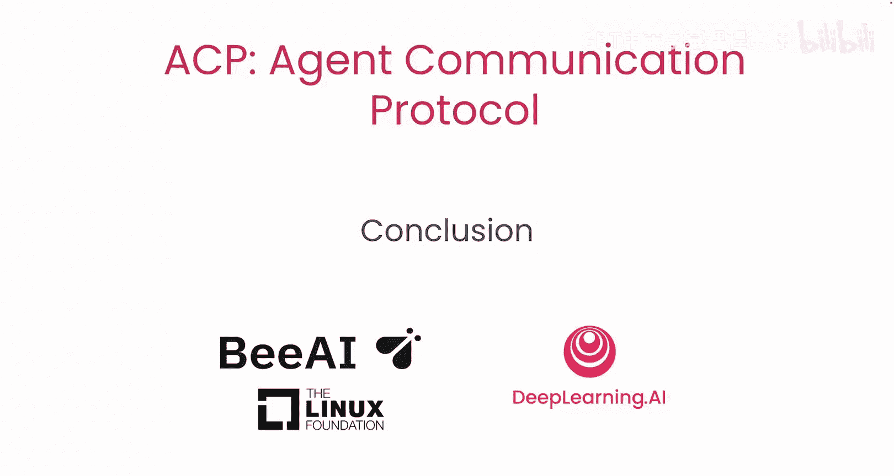
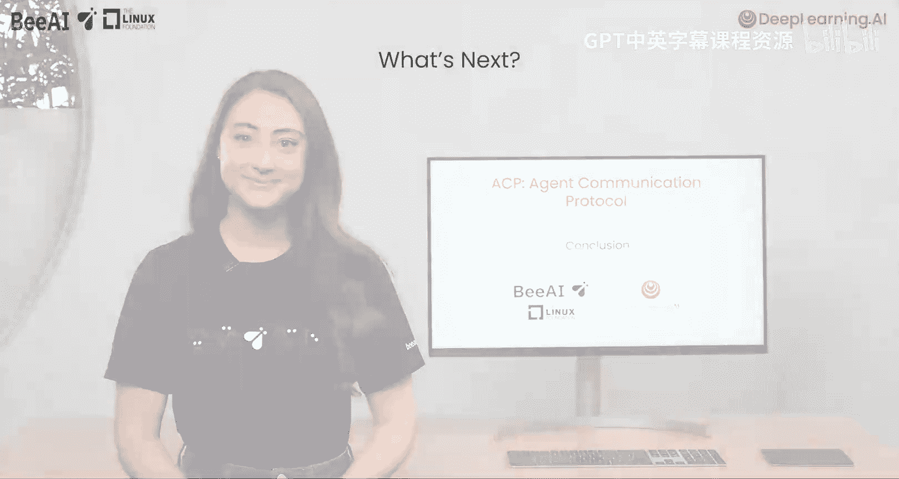
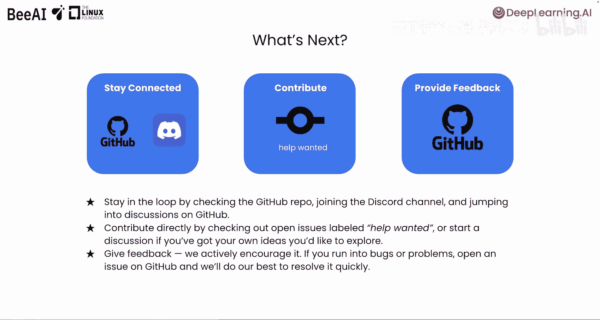
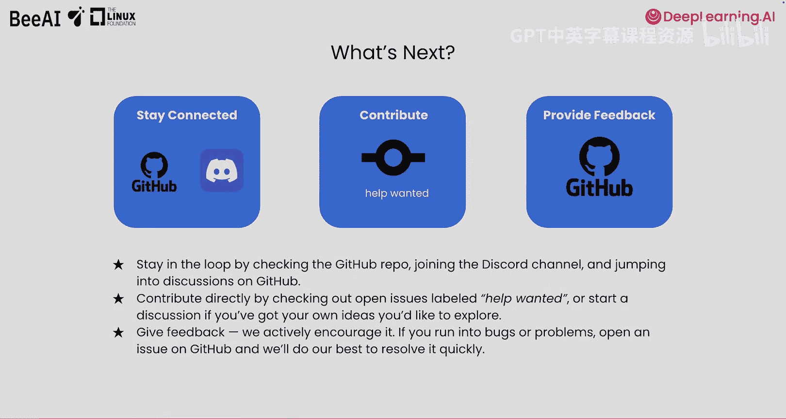

# 012： 总结与后续步骤 🎯

在本节课中，我们将对《代理通信协议》课程进行总结，并了解如何参与到ACP的社区生态中，继续你的学习和构建之旅。

## 课程回顾 📚

上一节我们完成了对ACP的实践探索。本节中，我们一起来回顾整个课程的核心收获。

我们希望，通过动手构建ACP代理，能够激发你的创造力，并让你对代理之间有效协作所能实现的可能性感到兴奋。在整个课程中，你探索了代理通信协议的价值所在，学习了一些其核心原则，并且实际构建并运行了你自己的ACP代理。

## 加入ACP社区 🚀

如果你已准备好迈出下一步，加入正在塑造ACP未来的、不断壮大的社区，以下是你参与的方式。

以下是你可以参与的几种途径：

*   **保持关注**：通过查看Github代码仓库来跟进最新动态。
*   **加入讨论**：加入Discord频道，并参与Github上的讨论。
*   **展示成果**：如果你构建了很酷的东西，请在“展示与讲述”环节与我们分享。
*   **直接贡献**：查看标记为“需要帮助”的公开问题并参与解决。
*   **发起讨论**：如果你有自己的想法想要探索，可以发起一个新的讨论。

## 提供反馈与展望未来 💡

最后，请提供反馈，我们积极鼓励这样做。如果你遇到错误或问题，请在Github上提交一个问题，我们将尽力快速解决。

ACP是开放治理、社区驱动的。它由社区构建，服务于社区。因此，无论你是构建者、贡献者，还是仅仅感到好奇，在这个生态系统中都有你的一席之地。

感谢你与我们一同学习。我们迫不及待想看到你接下来会构建出什么。

---

**本节课总结**：本节课中我们一起回顾了ACP课程的核心内容，学习了如何通过Github、Discord等渠道加入ACP社区并进行贡献、讨论与反馈。ACP作为一个由社区驱动的开放协议，欢迎所有人的参与。