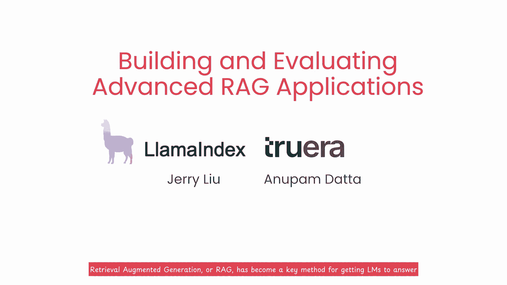

# 001：开篇与介绍 🎬

在本节课中，我们将要学习构建高级检索增强生成（RAG）应用的核心概念与评估方法。课程将介绍两种高级检索技术以及一套系统的评估框架，旨在帮助你构建并迭代出生产就绪的高质量RAG系统。

---

检索增强生成（RAG）已成为让大型语言模型（LLM）能够回答关于用户自身数据问题的关键方法。然而，要实际构建并部署高质量的RAG系统，需要有效的检索技术为LLM提供高度相关的上下文来生成答案。同时，一个有效的评估框架也至关重要，它可以帮助你在系统开发的初始阶段以及部署后的维护期间，持续地迭代和改进你的RAG系统。

本课程涵盖了两种新兴的高级检索方法：**句子窗口检索**和**自动合并检索**。与更简单的方法相比，它们能为LLM提供更好的上下文。课程还将介绍如何使用三个评估指标来评估你的LLM问答系统：**上下文相关性**、**事实依据性**和**答案相关性**。

---

上一节我们概述了课程目标，本节中我们来看看课程的主讲人。

很高兴向大家介绍Jerry Liu，他是Llamaindex的新任联合创始人兼首席执行官，以及Anupam Datta，他是TruEra的联合创始人兼首席科学家。长期以来，我都很喜欢在社交媒体上关注Jerry和Llamaindex，并从中获取关于不断发展的RAG实践技巧。因此，我期待他能在这个新平台上更系统地传授这套知识体系。Jerry是卡内基梅隆大学的教授，并且已经在可信人工智能领域，特别是如何监控、评估和优化AI系统有效性方面，进行了十多年的研究。

谢谢Andrew。很高兴来到这里，也很高兴与你一起合作，Andrew。

---

现在，让我们深入了解本课程将涵盖的两种核心检索方法。

**句子窗口检索**不仅会检索与问题最相关的单个句子，还会检索该句子前后的文本窗口，从而为LLM提供更连贯、信息更丰富的上下文。

**自动合并检索**则采用了一种不同的思路。它将文档组织成树状结构，其中每个父节点的文本内容被划分到其子节点中。当足够多的子节点被识别为与用户问题相关时，整个父节点的文本就会作为上下文提供给LLM。

我知道这听起来步骤很多，但不用担心，我们稍后会在代码中详细演示。主要的收获是，与使用简单的文本块进行检索相比，这提供了一种动态检索更连贯上下文的方法。

---

仅仅拥有先进的检索方法还不够，我们还需要科学地评估系统表现。上一节我们介绍了高级检索方法，本节中我们来看看如何评估基于RAG的LLM应用程序。

我们将使用**RAG三元组**指标来评估RAG系统执行的三个主要步骤。这套方法非常有效。

以下是三个核心评估指标：

*   **上下文相关性**：用于衡量检索到的文本块与用户问题的相关程度。这可以帮助你识别和调试系统在检索LLM上下文时可能存在的问题。
*   **事实依据性**：用于评估LLM生成的答案在多大程度上依赖于所提供的上下文，而不是其内部知识或产生幻觉。
*   **答案相关性**：用于直接衡量生成的答案与原始问题的匹配和有用程度。

但这只是整个QA系统评估的一部分。采用这种系统性的方法，可以让你清晰地分析系统的哪些部分运行良好，哪些部分尚需改进，从而使你能够有针对性地优化最需要工作的环节。如果你熟悉机器学习中的错误分析概念，会发现这有相似之处。我发现采用这种系统方法可以帮助你更有效地构建可靠的QA系统。

---

本课程的目标是帮助你构建基于生产就绪的LLM应用程序，并掌握对系统进行系统性迭代的重要部分。

在本课程的后半部分，你将通过实践练习，使用这些检索方法和评估指标进行迭代。你还将学习如何使用系统化的实验跟踪来建立性能基线，并在此基础上快速改进。我们还将根据协助合作伙伴构建RAG应用的经验，分享一些调整这两种检索方法的实用建议。

许多人都为创建这门课程付出了努力。我要感谢来自Llamaindex的Logan Markewich和来自DeepLearning.AI的Sharon Zhou、Joshua Romero以及Barbara Lewis。Eddie Shu和Diala Lattouf也对本课程做出了贡献。

---

下一节课将概述你在课程后续部分将会看到的内容。你将尝试构建使用句子窗口检索或自动合并检索的问答系统，并比较它们在RAG三元组（上下文相关性、事实依据性和答案相关性）上的表现。

这听起来非常棒，让我们开始吧！我认为你真的能通过这些内容掌握RAG的核心要点。

---

**本节课中我们一起学习了**：构建高级RAG应用的重要性，两种高级检索方法（句子窗口检索和自动合并检索）的基本原理，以及一套用于系统评估与迭代的RAG三元组指标（上下文相关性、事实依据性、答案相关性）。这些是构建生产级RAG系统的基石。