# 002：构建高级RAG应用 🚀

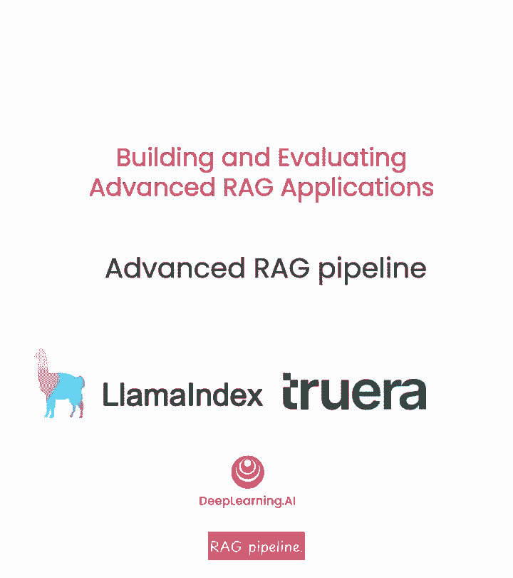

## 概述

在本节课中，我们将全面学习如何使用 LlamaIndex 设置基本和高级的 RAG 管道。我们将加载评估基准，并使用真实数据定义一组指标，以便对高级 RAG 技术进行基准测试。在接下来的几节中，我们将针对基线（基本）管道进行技术研究，并更深入地探讨每种高级检索方法。

---

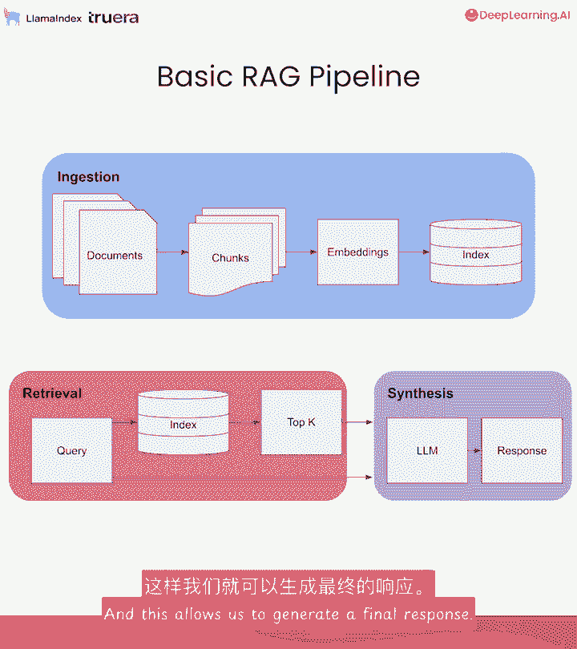

## 基本RAG管道的工作原理

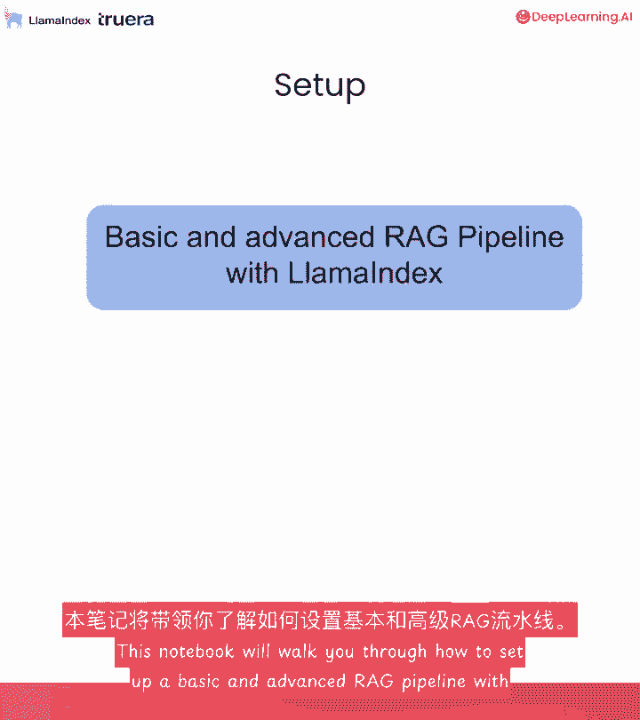

上一节我们介绍了课程目标，本节中我们来看看基本检索增强生成管道的工作原理。

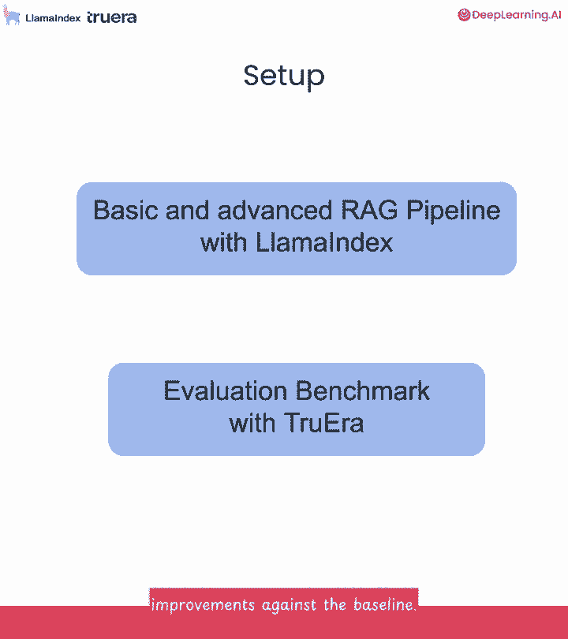

它由三个不同的组件组成：**摄取**、**检索**和**合成**。

在摄取阶段，我们首先为每个文档加载一组文档。我们使用文本分割器将其拆分为一组文本块。然后，对于每个块，我们使用嵌入模型为该块生成嵌入。为每个块生成嵌入后，我们将其卸载到索引中，该索引是存储系统（例如矢量数据库）的视图。

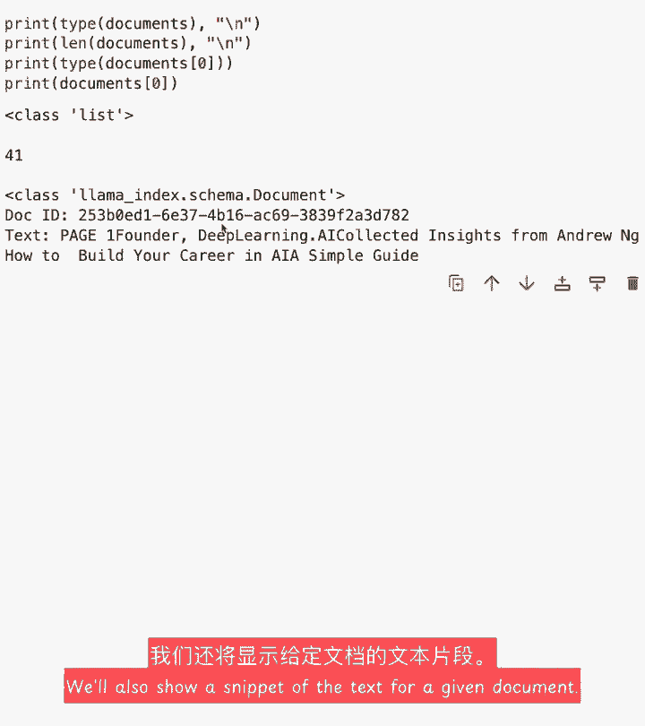

一旦数据存储在索引中，我们就会针对该索引执行检索。首先，针对该索引启动用户查询，然后获取前 K 个与用户查询最相似的块。然后，我们将这些相关块与用户查询结合起来，并在合成阶段将其放入大语言模型的提示窗口中。这使我们能够生成最终响应。

以下代码片段展示了使用 LlamaIndex 创建索引的核心步骤：

```python
# 伪代码示例：创建索引
from llama_index import VectorStoreIndex, ServiceContext
from llama_index.llms import OpenAI
from llama_index.embeddings import OpenAIEmbedding

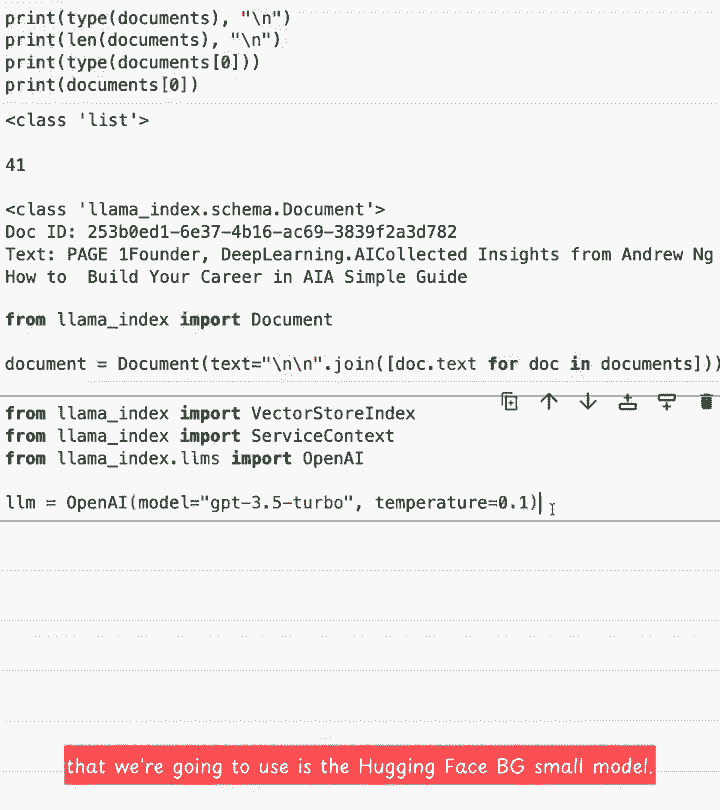

# 定义服务上下文，指定LLM和嵌入模型
service_context = ServiceContext.from_defaults(
    llm=OpenAI(model="gpt-3.5-turbo"),
    embed_model=OpenAIEmbedding(model="text-embedding-ada-002")
)

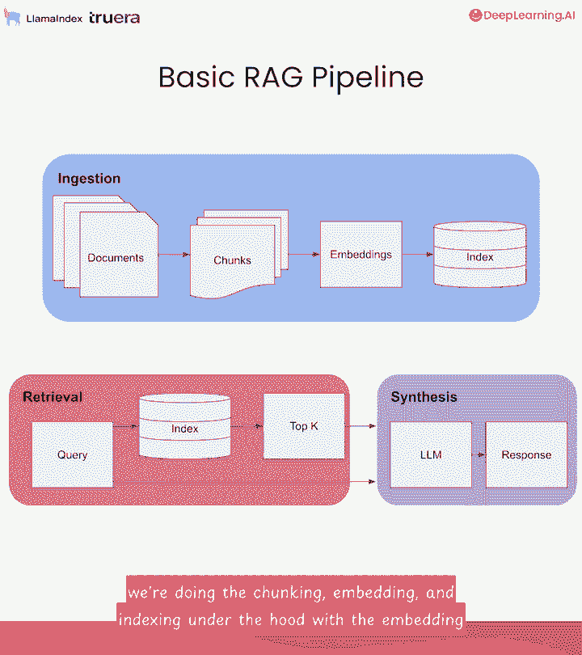

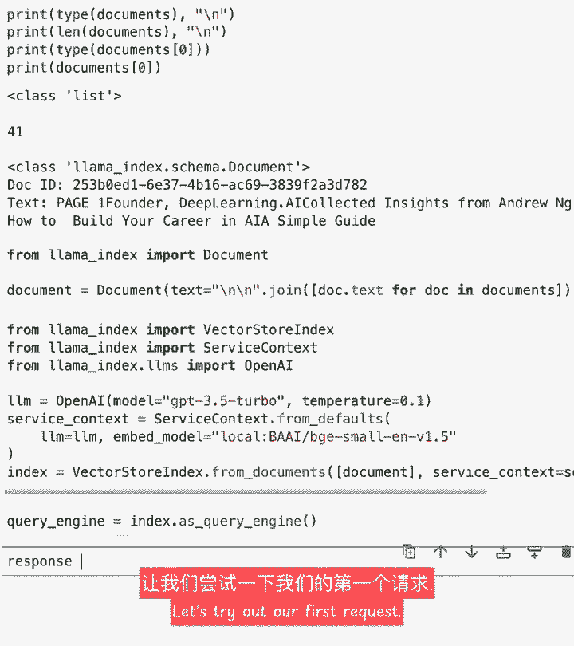

# 从文档创建向量存储索引
index = VectorStoreIndex.from_documents(documents, service_context=service_context)

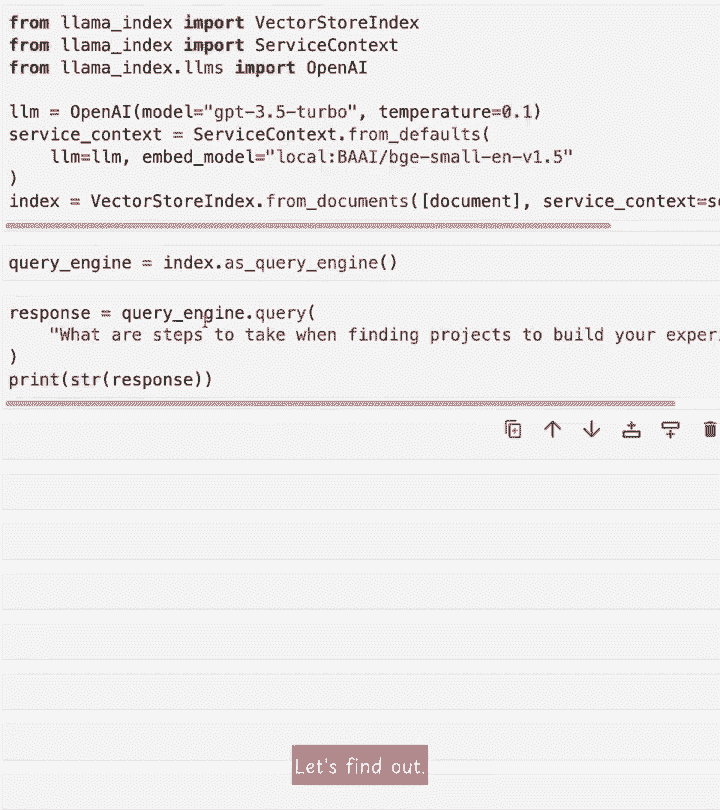

# 获取查询引擎
query_engine = index.as_query_engine()
```

---

## 设置评估基准

现在我们已经设置了基本的 RAG 管道，下一步是针对该管道设置一些评估，以了解它的执行情况。这也将为我们定义高级检索方法（句子窗口检索器以及自动合并检索器）提供基础。

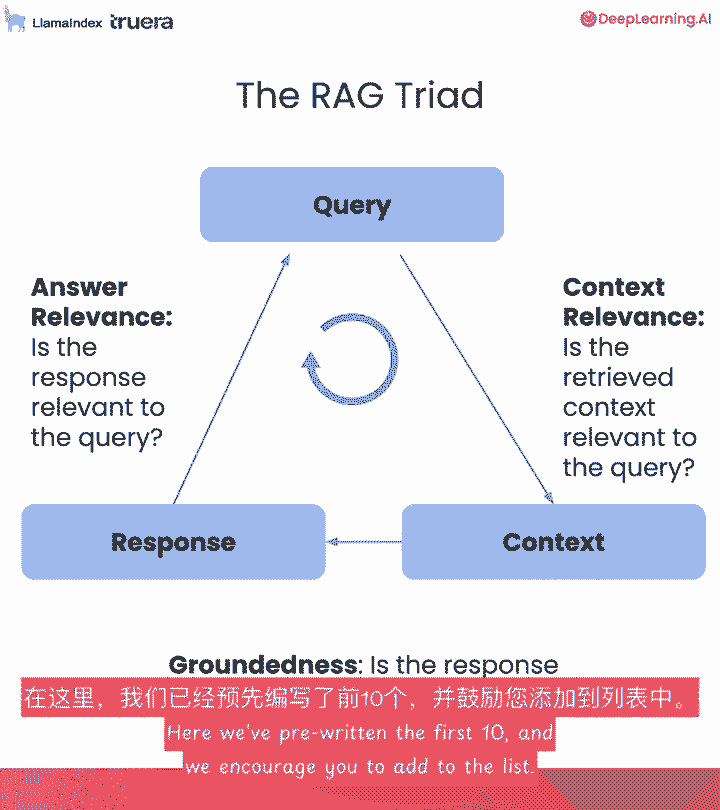

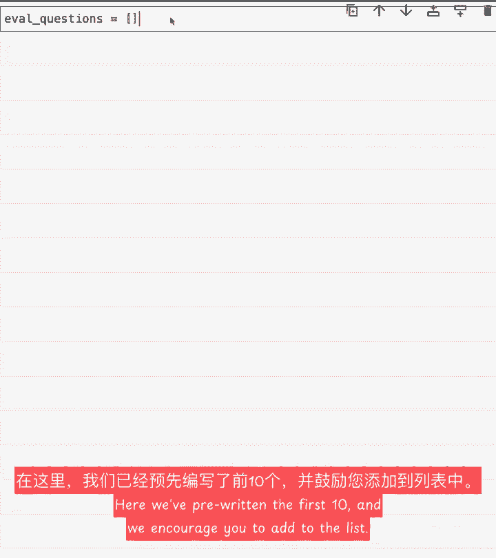

在本节中，我们使用 TruLens 来初始化反馈函数。我们初始化一个辅助函数来返回反馈函数列表，以评估我们的应用程序。在这里，我们创建了一个 RAG 评估三元组，它由查询、响应和上下文之间的成对比较组成。这实际上创建了三个不同的评估模块：**答案相关性**、**上下文相关性**和**事实依据性**。

以下是这三个评估模块的定义：
*   **答案相关性**：衡量响应与查询的相关程度。
*   **上下文相关性**：衡量检索到的上下文与查询的相关程度。
*   **事实依据性**：衡量响应是否由检索到的上下文所支持。

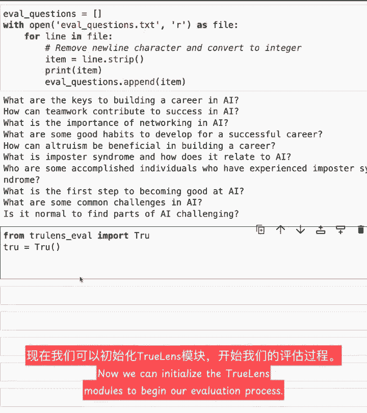

我们需要做的第一件事是创建一组问题来测试我们的应用程序。在这里，我们已经预先编写了前 10 个问题，例如：
*   建立人工智能职业生涯的关键是什么？
*   团队合作如何为人工智能的成功做出贡献？

我们鼓励您也添加到此列表中。例如，我们可以指定一个新问题：“什么是适合我的人工智能工作？”，并将其添加到评估问题列表中。

现在我们可以初始化 TruLens 模块以开始我们的评估过程。我们已经初始化了 TruLens 数据库，我们现在可以初始化我们的评估模块。LLM 正在成为大规模评估生成式 AI 应用程序的标准机制，而不是依赖于昂贵的人工评估或设定基准。LLM 使我们能够以一种根据我们的操作领域定制的方式，并且能够根据应用程序不断变化的需求进行动态调整。

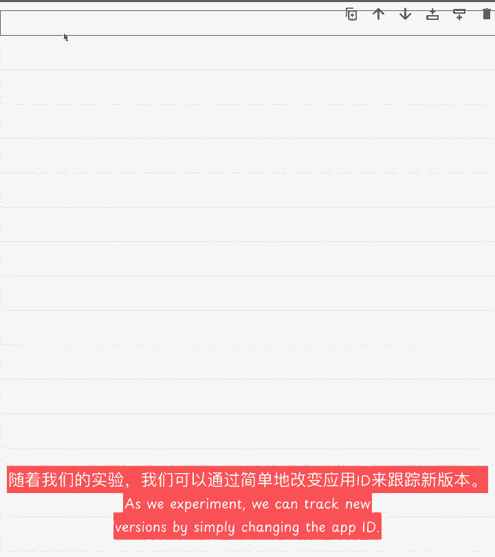

在这里，我们预先构建了一个记录器用于此示例。在记录器中，我们包含了用于评估的标准评估三元组（上下文相关性、答案相关性和事实依据性）。我们还将指定一个应用程序 ID，以便我们可以在实验时跟踪应用程序的此版本。我们可以通过简单地更改应用程序 ID 来跟踪新版本。

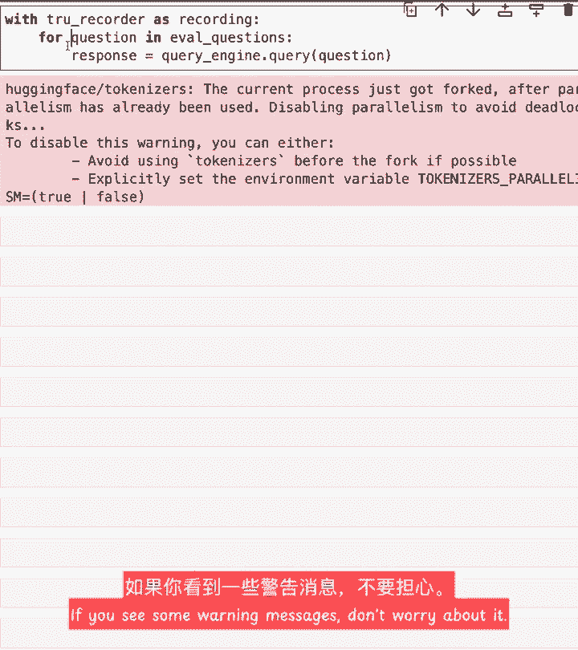

现在，我们可以使用以下命令再次运行查询引擎并附带上下文。这里发生的事情是，我们将每个查询发送到我们的查询引擎，并且在后台，TruLens 记录器正在评估每个查询的指标。如果您看到一些警告消息，不用担心，其中一些是系统性的。

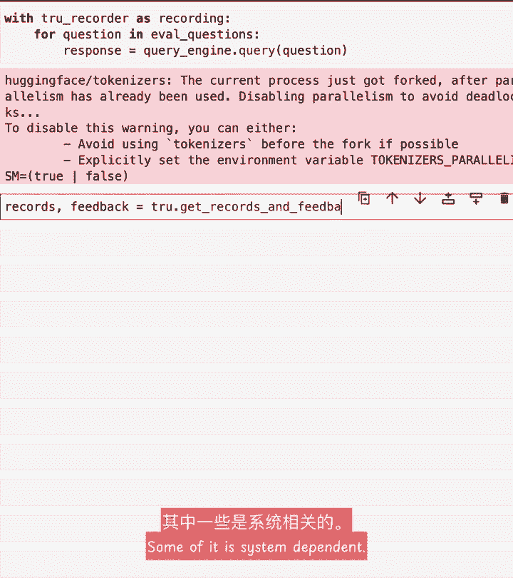

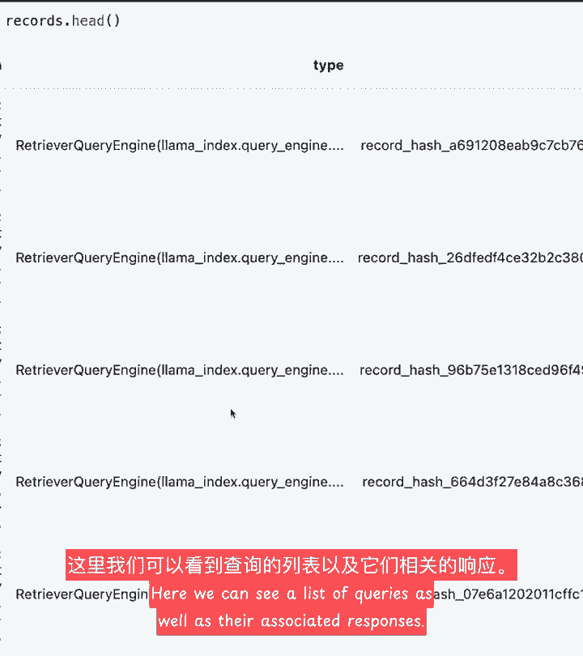

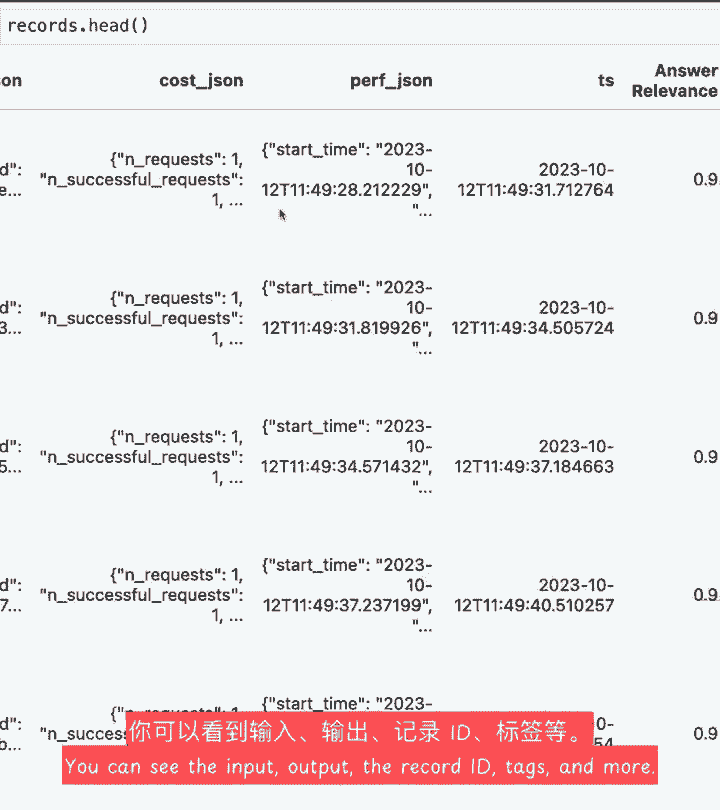

在仪表板中，您可以看到您的评估指标，例如上下文相关性、答案相关性和事实依据性，以及平均延迟、总成本等。在此处的 UI 中，我们看到答案相关性和事实依据性相当高，但上下文相关性相当低。现在，让我们看看是否可以使用更高级的检索技术来改进这些指标。

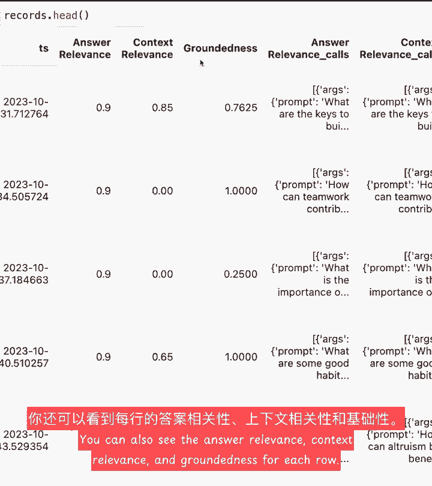

---

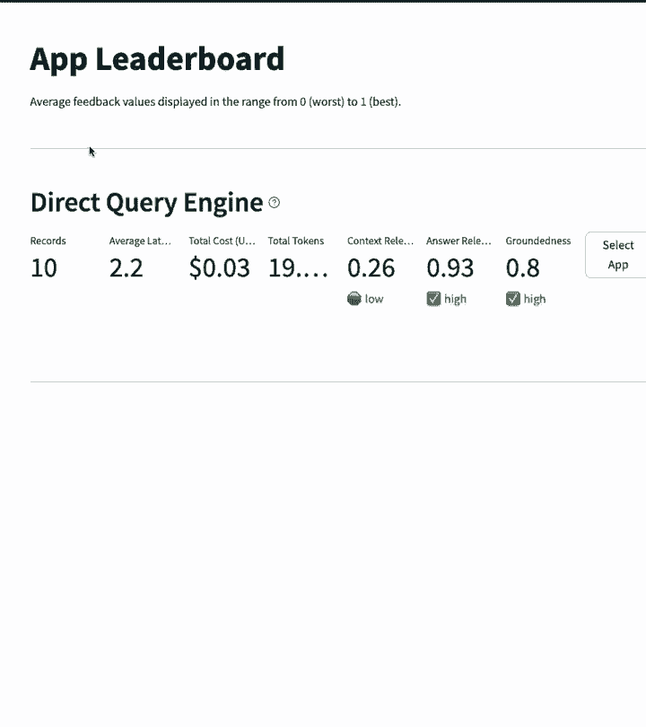

## 高级检索技术：句子窗口检索

我们将讨论的第一个高级技术是句子窗口检索。它通过嵌入和检索单个句子来实现更细粒度的分割，但检索后，句子被替换为在原始检索句子周围有更大的句子窗口。

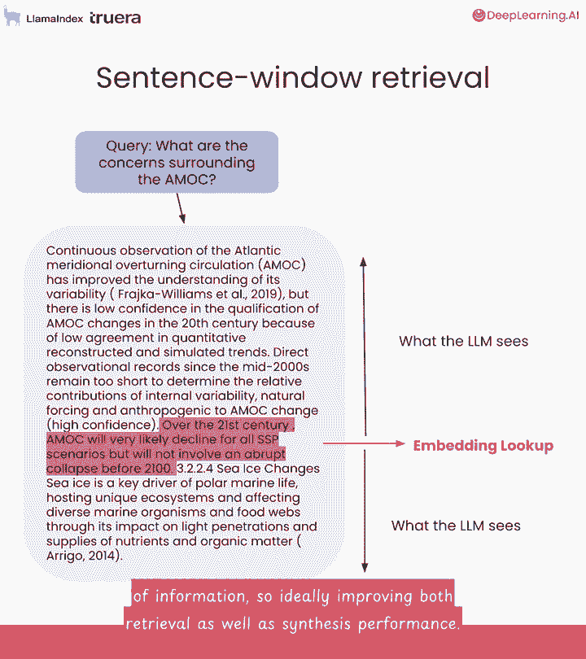

直觉是这允许大语言模型为检索到的信息提供更多上下文，以便更好地回答查询，同时仍然检索更细粒度的信息。因此，理想情况下，它也可以改善检索和综合性能。

现在让我们看看如何实现。我们将使用 OpenAI 的 GPT-3.5 Turbo。接下来，我们将在给定文档上构建句子窗口索引。只是提醒一下，我们有一个用于构建句子窗口索引的辅助函数。类似于之前，我们将从句子窗口索引中获取查询引擎。

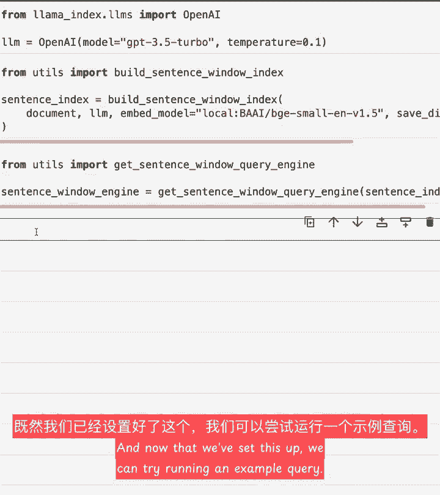

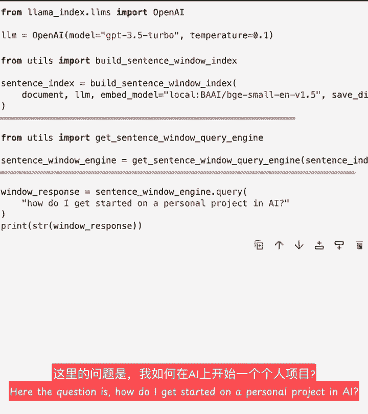

现在我们已经设置了它，我们可以尝试运行一个示例查询。问题是“我如何在人工智能中构建项目组合？”。我们得到回复：“开始在人工智能中的个人项目，首先重要的是确定项目的范围...”。

就像之前一样，让我们尝试获得 TruLens 评估上下文，并尝试对结果进行基准测试。因此，在这里我们导入 TruLens 记录器。`sentence_window` 是句子窗口索引的预构建 TruLens 记录器。现在，我们将在这些评估问题之上运行句子窗口检索器，然后比较性能。

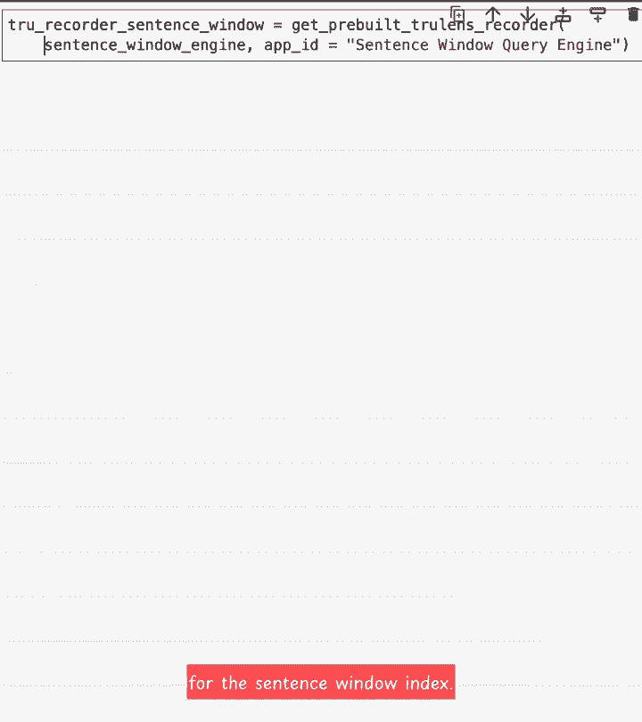

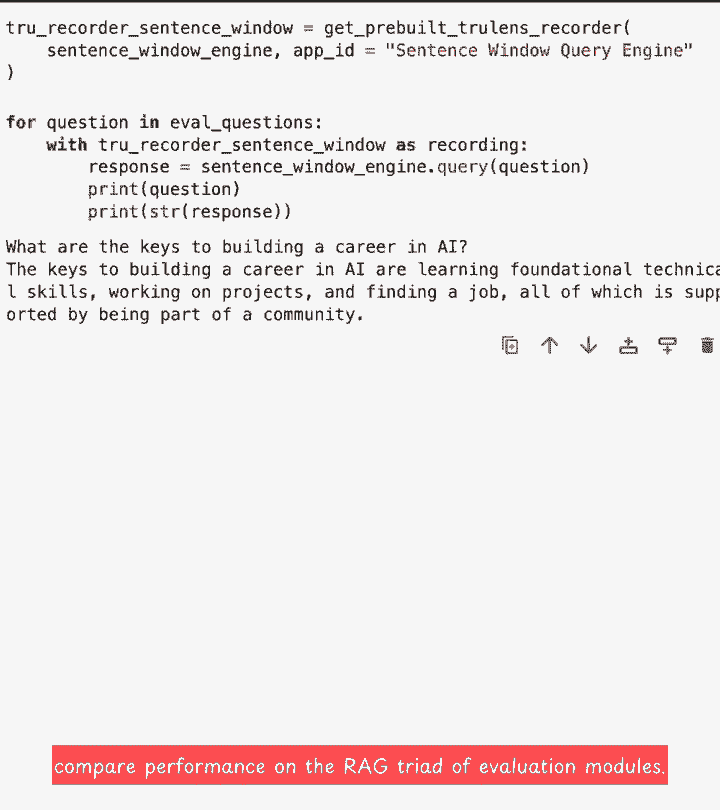

在这里，我们可以在评估模块的三元组中看到响应。运行一些问题或响应的示例：
*   **问题**：团队合作如何为人工智能的成功做出贡献？
    **响应**：团队合作可以通过允许个人利用他们同事的专业知识和能力以及见解来为人工智能的成功做出贡献。
*   **问题**：网络在人工智能中的重要性是什么？
    **响应**：网络在人工智能中很重要，因为它允许个人与在该领域拥有经验和知识的其他人建立联系。

现在我们已经对基本 RAG 管道和句子窗口检索管道这两种技术进行了评估，让我们获取结果的排行榜看看这里发生了什么。

我们看到，与基线 RAG 相比，句子窗口检索在事实依据性上好了八个百分点，答案相关性或多或少相同，上下文相关性也更好。对于句子窗口查询引擎，延迟或多或少是相同的，并且总成本较低。因为事实依据性和上下文相关性较高，但总成本较低。我们可以凭直觉认为，句子窗口检索器实际上为我们提供了更相关的上下文，并且更高效。


当我们返回 UI 时，我们可以更高效地看到，我们现在对直接查询引擎（基线）以及句子窗口进行了比较，并且我们还可以看到我们刚刚在笔记本中看到的矩阵。

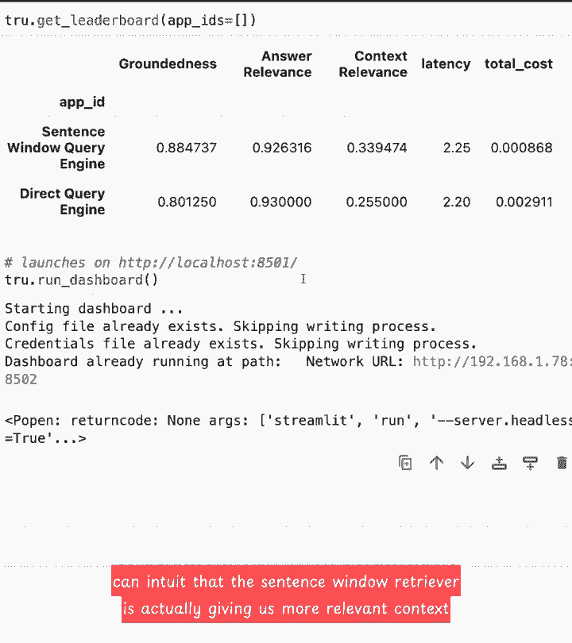

---

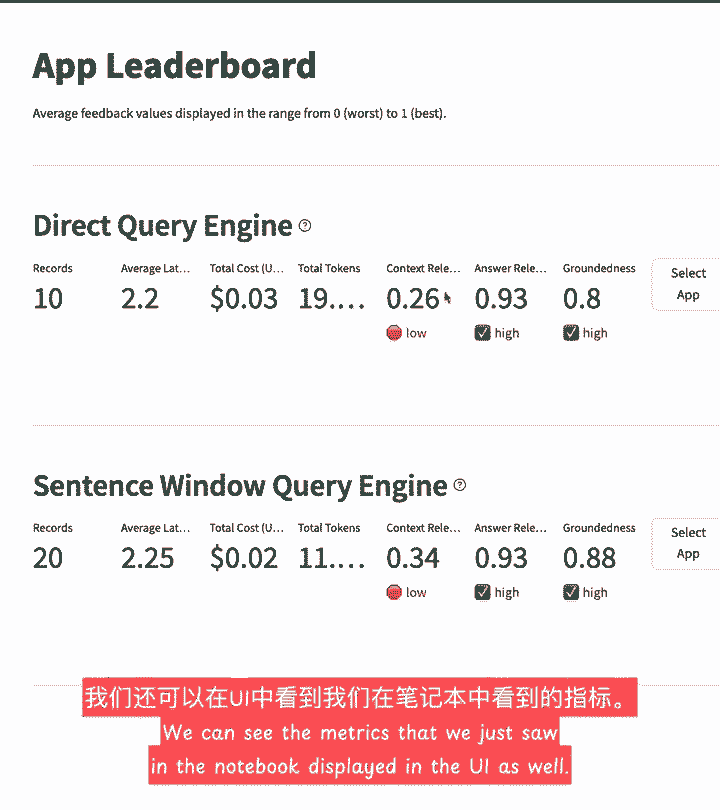

## 高级检索技术：自动合并检索器

我们将讨论的下一个高级检索技术是自动合并检索器。这里我们构建一个由较大父节点和引用父节点的较小子节点组成的层次结构。例如，我们可能有一个块大小为 512 个令牌的父节点，并且在它下面，是链接到此父节点的、块大小为 128 个令牌的四个子节点。

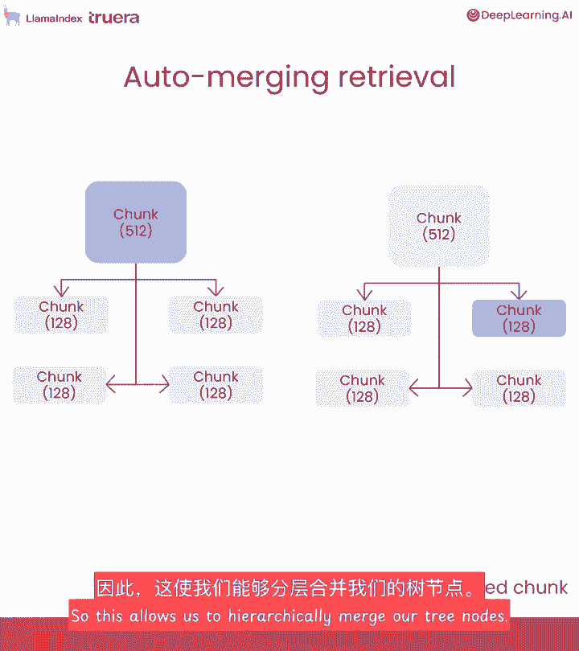

自动合并检索器通过将检索到的节点合并到更大的父节点中来工作。这意味着在检索期间，如果父节点实际上检索了其大部分子节点，那么我们将用父节点替换这些子节点。因此，这允许我们分层合并检索到的节点。所有子节点的组合文本与父节点的文本相同。

类似于句子窗口检索器，在接下来的几课中，我们将更深入地了解它是如何工作的。在这里，我们将向您展示如何使用它。我们再次使用 GPT-3.5 Turbo 作为 LLM 模型。我们从自动合并检索器获得查询引擎。

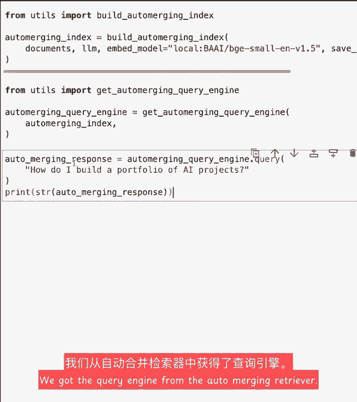

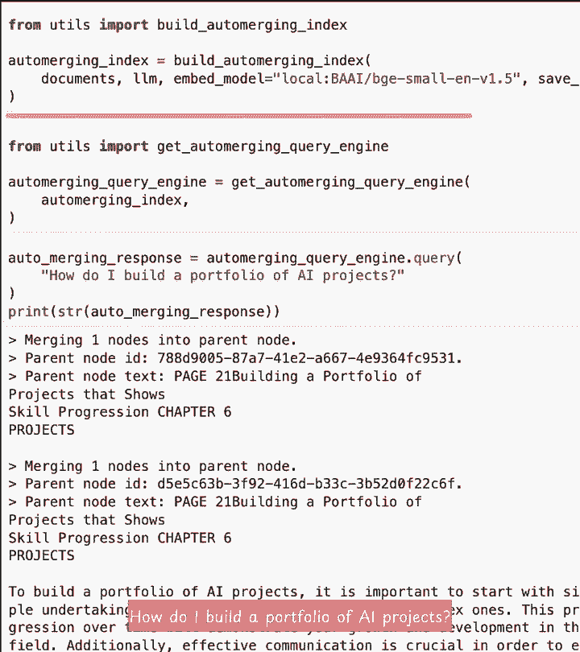

让我们尝试运行一个示例查询：“我如何在人工智能中构建项目组合？”。在日志中，您实际上看到了合并节点过程，我们正在将节点合并到父节点中，基本上是用父节点而不是子节点来构建人工智能项目组合的答案。回复是：“重要的是从简单的任务开始，并逐渐进展到一些更复杂的任务。”

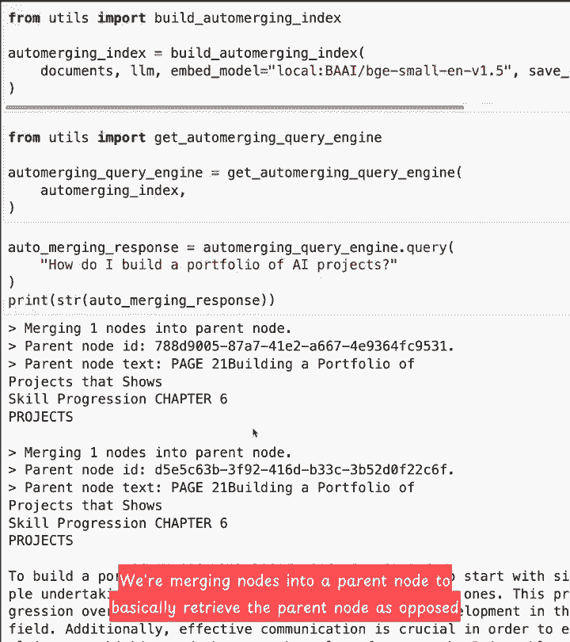

然后，我们在我们的评估问题之上运行具有 TruLens 的自动合并检索器。对于每个问题，您实际上看到正在进行的合并过程，例如“将三个节点合并到父节点中”。如果我们向下滚动一点，我们会看到对于其中一些其他问题，我们也在执行合并过程，例如“将三个节点合并到父节点中”、“将一个节点合并到父节点中”。

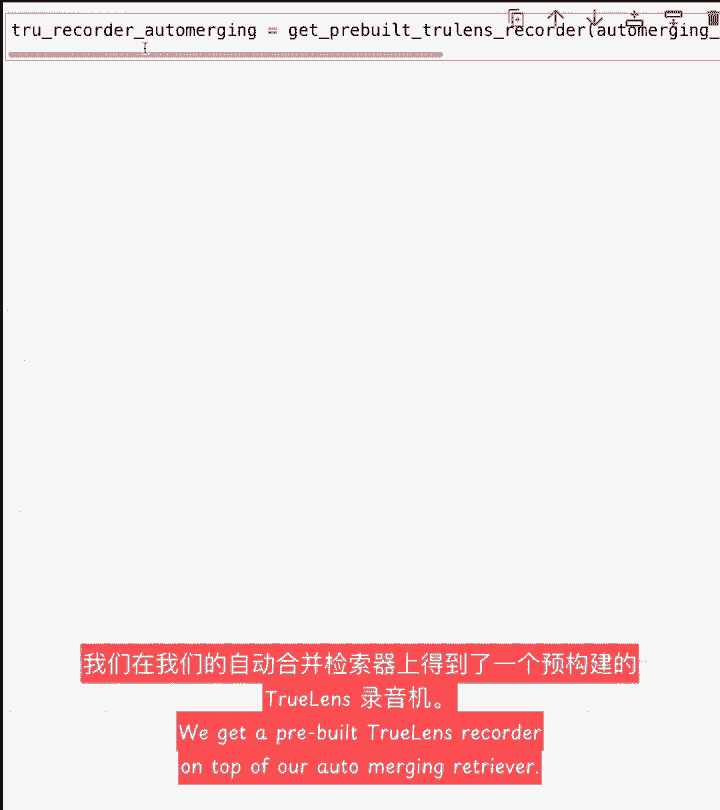

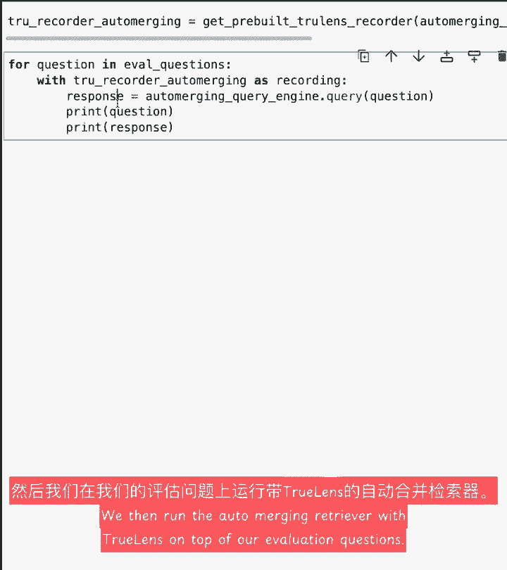

示例问题响应对：
*   **问题**：网络在人工智能中的重要性是什么？
    **响应**：网络在人工智能中很重要，因为它有助于建立一个强大的专业网络社区。

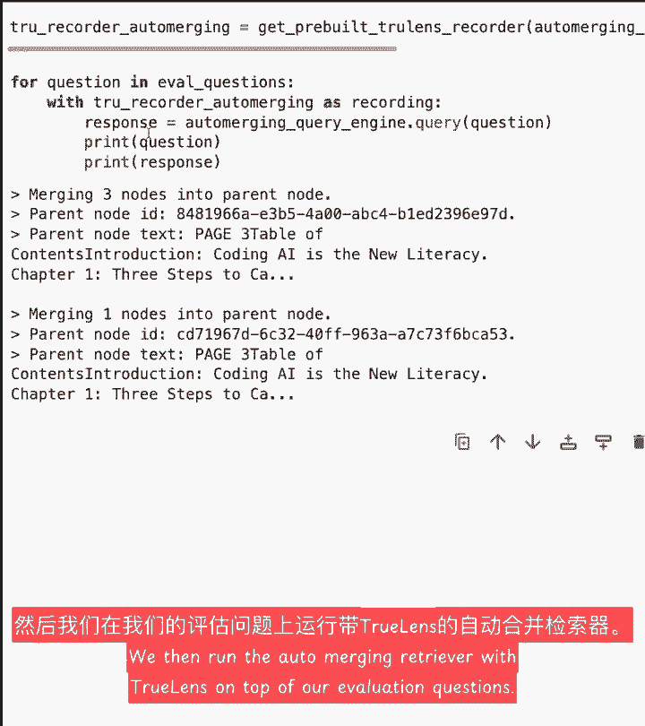

---

## 结果比较与总结


现在我们已经运行了所有三种检索技术（基本的 RAG 管道以及两种高级检索方法），我们可以查看全面的排行榜，看看这三种技术是如何比较的。

除了评估问题之外，我们还得到了自动合并查询引擎的相当不错的结果。我们在事实依据性方面得到了 100%，在答案相关性方面得到了 94%，在上下文相关性方面得到了 43%，这比句子窗口和基线 RAG 管道都要高。我们得到与句子窗口查询引擎大致相同的总成本，这意味着这里的检索效率是合理的。

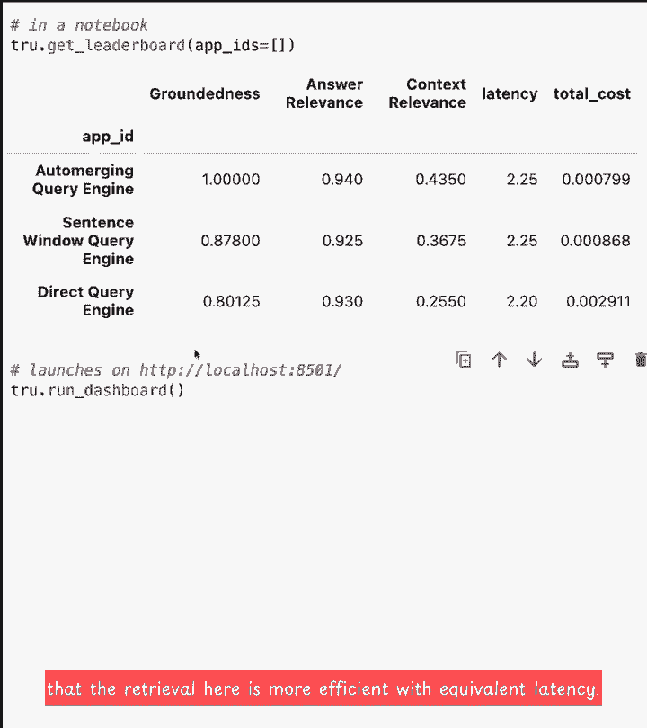

最后，您也可以在仪表板中查看这一点。

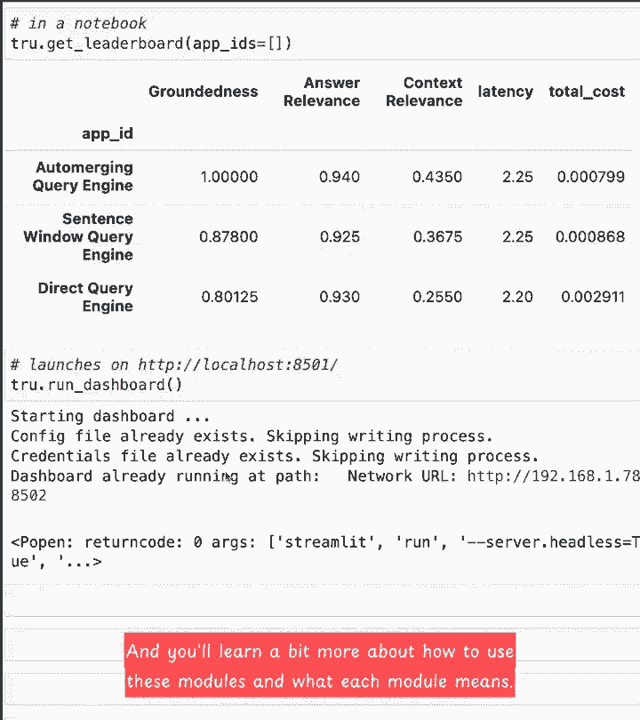

本节课给出了您将全面了解如何设置基本和高级 RAG 管道，以及如何设置评估模块来衡量性能。下一课，我们将深入研究这些评估模块，特别是 RAG 三元组（答案相关性、上下文相关性和事实依据性）。您将更多地了解如何使用这些模块以及每个模块的细节。