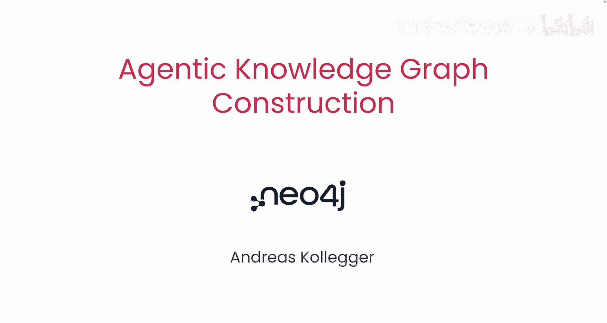
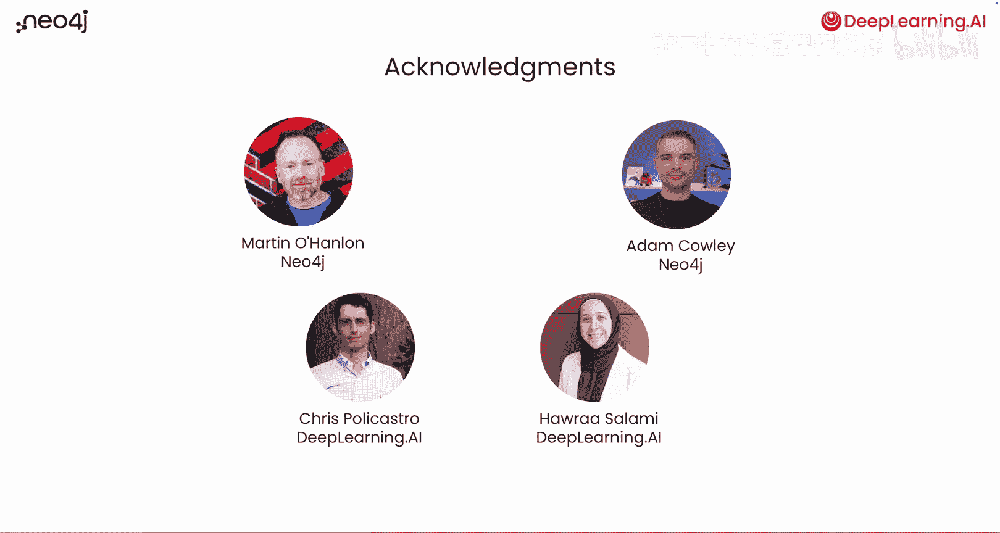

# 001：课程介绍 🎯

在本节课中，我们将学习如何构建一个由多智能体系统驱动的知识图谱，该系统能够将您的结构化和非结构化数据转化为一个强大的知识网络。

欢迎来到与 Neo4j 合作推出的生成式知识图谱构建课程。在本课程中，您将设计一个多智能体系统，将您的结构化和非结构化数据转化为知识图谱。我发现知识图谱在那些信息存储和检索的准确性至关重要的高风险应用中非常有用。本课程将指导您，并为您提供一套构建这些知识图谱的强大工具。我很高兴本课程的讲师是 Andres Colliger，他是 Neo4j 的生成式人工智能开发者布道师。

谢谢，Andrew。我很高兴回到这里，并与您合作这门课程。简单来说，一个知识图谱系统会将您的文本文档分割成块，并将它们存储在向量数据库中。但除此之外，它还会将这些块放入图谱结构中，这些块随后会从中提取实体。例如，来自产品评论的一个文本块可能包含诸如产品、订单、交付问题或产品缺陷等实体。为了构建知识图谱，您需要从这些块中提取相关实体，然后通过边在图中连接这些块和实体。在这里，每条边代表一种关系，例如，它可能代表这个块提到了某个特定产品，或者该产品存在某个问题。实体将与相关的块一起被检索，为大型语言模型提供更相关的上下文，以生成更精确和准确的答案。您还可以将这种类型的图谱连接到另一个图谱，该图谱包含从结构化数据（如 CSV 文件）中提取的附加信息。

在本课程中，Andres 将引导您了解如何构建一个多智能体系统，帮助您完成构建此类知识图谱的所有工作。要将您的结构化和非结构化数据转化为知识图谱，您首先需要确定图谱模式，这意味着您可以从数据中提取哪些类型的实体或节点，以及它们之间存在哪些关系。一旦定义了模式，您就可以构建实际的图谱并将其存储在图形数据库中。您将不再主要依靠人工查看数据来寻找图谱模式，而是设计一个使用 Google 的 Agent Development Kit 的多智能体系统来完成这项工作。

在您学习了 ADK 的基本语法之后，您将一次设计一个智能体来构建您的系统。第一个智能体将与您对话，以提取您想要构建的图谱的目标和类型。根据该目标，一组智能体将专门从您的结构化数据中提取实体和关系。另一组智能体将处理您的非结构化数据。最后，最后一组智能体将连接这两个模型，并相应地构建图谱。

许多人共同努力创建了这门课程。我要感谢来自 Neo4j 的 Martin O‘hanlon 和 Adam Kowli，来自 DeepLearning.AI 的 Christopher Pooccostro 和 Harra Salami 也为本课程做出了贡献。在第一课中，您将了解更多关于知识图谱底层结构的知识，以及如何构建一个知识图谱并利用它来识别产品问题的根本原因。

听起来很棒。让我们开始吧。

---

**本节课总结**

在本节课中，我们一起学习了知识图谱的基本概念及其在高精度应用中的价值。课程介绍了如何利用多智能体系统，自动从结构化和非结构化数据中提取实体与关系，并构建成一个互联的知识网络。我们了解到，整个过程始于定义图谱模式，并通过专门的智能体分工协作来完成数据提取、处理和最终的图谱构建。下一课，我们将深入探讨知识图谱的具体结构及其在问题根因分析中的应用。