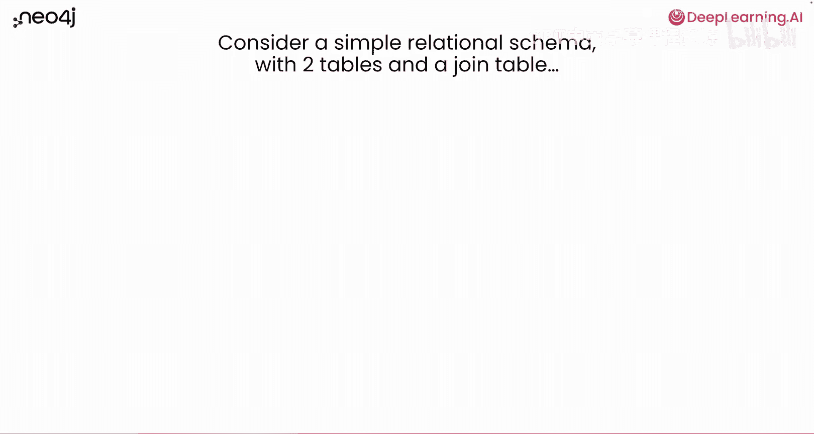
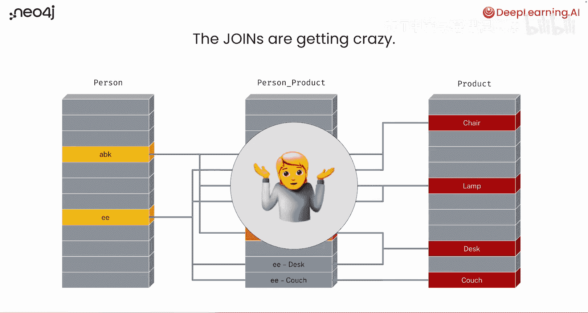
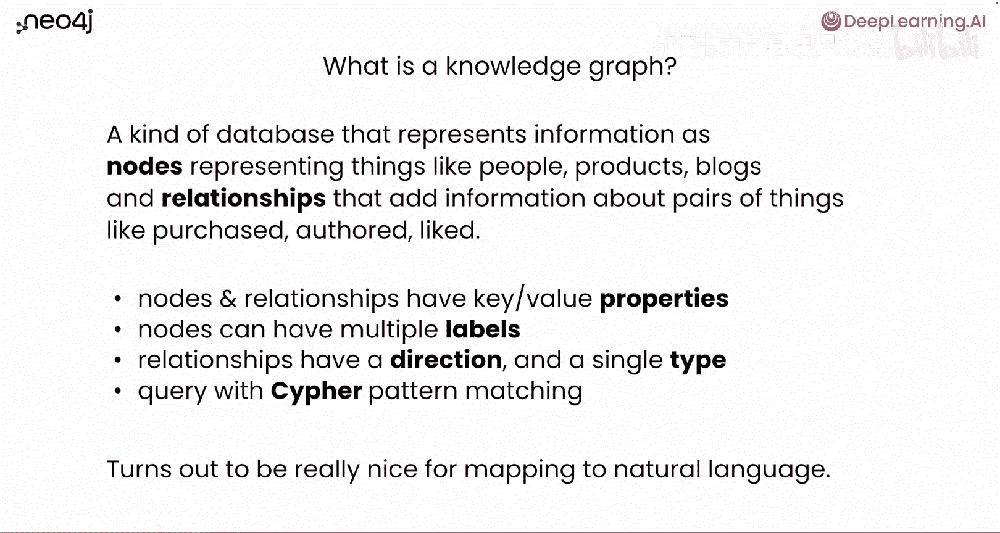
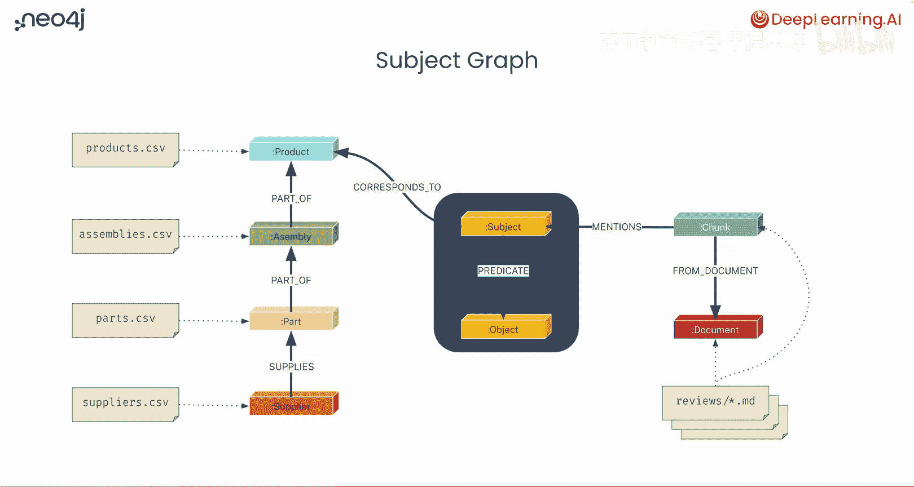
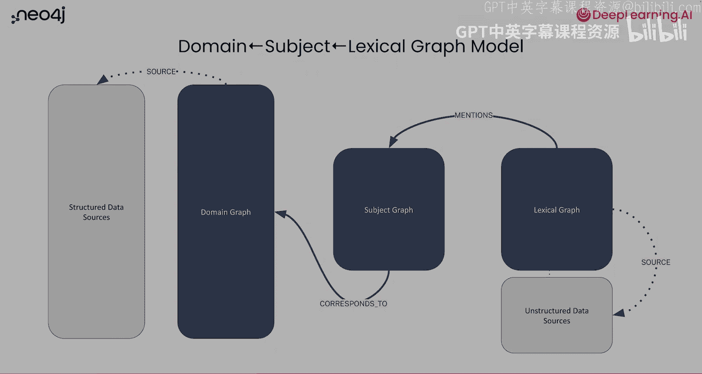

# 002：什么是知识图谱 📚

在本节课中，我们将学习知识图谱的含义，以及它如何帮助表示和检索数据中的关系。随后，我们将探索用于构建知识图谱的数据集。

## 概述

知识图谱是一种数据库，它以节点（代表实体，如人、产品）和关系（代表实体间的连接）的形式来表示信息。与传统的关联表不同，关系在知识图谱中是“一等公民”，它们本身就是具有语义含义的数据记录。这种结构使得通过模式匹配进行查询变得非常直观，尤其适合与擅长自然语言处理的大语言模型结合使用。

## 从关系型数据库到知识图谱

为了更好地理解知识图谱，我们先回顾一下关系型数据库及其模式。

我们可能都熟悉类似这样的场景：左边有一个表，右边有一个表，中间有一个连接表。在这个具体例子中，中间的表是连接表，它允许“人员”和“产品”之间建立多种连接。

让我们思考一下这两个表以及连接表。如果你提出一个问题：“这个人购买了哪些产品？”你首先需要从人员表开始，选择标识为“ABK”的这个人。然后，你需要通过连接表关联到“人员-产品”表，再连接到产品表。最终，你可以看到ABK购买了椅子、台灯和桌子。

如果你扩展这个问题，问：“还有谁购买了ABK购买过的产品？”你需要从ABK出发，连接到产品，再通过连接表关联回其他购买者，比如“EE”。你会发现EE也购买了一些ABK购买的产品，但EE还额外购买了一件产品。

进一步，我们可以问：“我们应该向ABK推荐购买什么产品？”这本质上是一个推荐查询的基础。思路是：找到与ABK有相似购买模式的其他人群，然后推荐那些人群购买过但ABK尚未购买的产品。这需要多次连接操作，过程会变得有些混乱。

## 引入图结构

实际上，有一种更清晰的方式来思考和查询这类问题：将其转化为图。

第一步是忽略所有不相关的记录。我们将暂时搁置那些灰色的、与当前查询无关的记录，专注于与“向ABK推荐产品”这个查询相关的数据。

然后，我们去掉中间所有的连接表记录，将它们转化为箭头，直接将ABK与他购买的产品连接起来，对EE也做同样的处理。稍作重新排列后，我们得到ABK在一侧，EE在另一侧，中间是他们共同购买的产品。同时，EE还连接着一个ABK未购买的产品。

现在，整个结构看起来更清晰，更容易理解发生了什么：ABK和EE都连接到中间的产品，但EE还额外连接着一个ABK未购买的产品。

## 使用Cypher进行模式匹配查询

我们可以通过将其重新表述为模式匹配来开始查询。使用一种名为Cypher的查询语言，它有点像具有模式匹配能力的SQL。

以下是描述我们想要查找的数据记录的模式：
*   **匹配节点**：我们匹配一个标签为“Person”、且属性“name”的值为“ABK”的节点。在图中，节点用圆括号表示。
*   **匹配关系**：然后，我们匹配一个类型为“PURCHASED”的关系（用箭头 `-[:PURCHASED]->` 表示），从ABK指向一些产品节点。
*   **返回结果**：我们可以直接返回这些产品。

我们可以扩展这个模式，以包含购买了这些产品的其他人。既然我们已经从ABK匹配到了他购买的产品，我们也可以匹配指向这些产品的“PURCHASED”关系，从而找到其他购买者。

为了回答推荐问题，我们可以进一步扩展模式。我们匹配从ABK到某些产品，再到其他购买者，然后扩展到这些购买者购买的其他产品。关键是我们需要添加一个**谓词**，要求一个**负向模式**成立：即ABK**没有**购买过那些“其他产品”。用Cypher表示就是 `WHERE NOT (abk)-[:PURCHASED]->(otherProduct)`。

这样，我们就描述了一个既包含应存在的记录（ABK购买产品、其他人购买相同产品、其他人购买其他产品），也包含不应存在的记录（ABK购买其他产品）的模式。最终，“其他产品”集合将缩小到仅包含ABK未购买的产品，这些就是我们将要推荐给他购买的产品。

## 知识图谱的核心特性

那么，究竟什么是知识图谱？

它是一种将信息表示为**节点**（代表事物，如人、产品、博客等）和**关系**的数据库。关系不仅仅是使用连接表的约定，而是数据库中的“一等公民”，它们本身就是具有语义含义的数据记录，代表了两个节点如何连接，并增加了关于这两个节点的信息。

以下是核心概念：
*   **节点和关系**都拥有键值属性。
*   **节点**可以有多个标签。
*   **关系**总是有方向的，并且只有一个类型。
*   用于模式匹配的查询语言叫做 **Cypher**。

事实证明，这种结构非常便于映射到自然语言，也特别适合与生成式AI和大语言模型协同工作，因为大语言模型非常擅长处理自然语言。

回顾一下顶部的Cypher查询，你可以大声读出来并理解其含义：“匹配ABK，他是一个名为ABK的人，他购买了一些产品，这些产品也被其他人购买过，这些人还购买了一些ABK没有购买过的其他产品。”

## 结合结构化与非结构化数据

知识图谱另一个有趣的特点是，它非常便于将非结构化数据与结构化数据结合起来。

除了已有的结构化数据（如产品、人员），你还可以添加任何分块的文本，为其创建向量表示，并将其存储在数据库中。这样，你就可以将**向量相似性搜索**和**模式匹配**结合起来，实现各种强大的访问模式。

例如，假设你想进行**根因分析**。你是一家家具制造商，希望了解客户对产品的投诉。你要求数据分析团队找出哪些产品问题最多，问题的具体部分是什么，以及是否是部件本身的问题。

作为数据工程师，接到这个任务后，你会先问一些澄清性问题：我们做这个分析的真正目的是什么？有哪些可用数据？

在这个场景中，我们可能有一些CSV文件（物料清单），将产品一直连接到供应商。这些可能来自电子表格或不适合直接分析的关系型数据库。同时，你还有一些从互联网上抓取的用户评论数据。

为了进行分析，你需要构建一个知识图谱来连接所有这些数据。

## 目标数据模型

目标数据模型如下图所示。左侧米色方框代表可用的CSV文件，它们将转化为图中的节点或关系，这部分我们称之为**领域图**。

右下角的米色方框代表Markdown文件（用户评论）。这些Markdown文件将被分块，在图中创建一些文档节点。这部分我们称之为**词汇图**，它代表了原始的文本数据以及连接这些文本数据的结构。

连接这两部分的是中间的**主体图**。主体图包含我们从文本块中提取出的“主体”或实体。文本块中的内容会谈论产品、用户名等，所有这些都可能成为实体。我们找到这些实体，称之为主体。主体会通过“谓词”连接到“客体”。例如，用户“ABK” “喜爱” “某张桌子”。这就构成了一个“主体-谓词-客体”的三元组。

因为ABK提到了桌子，而桌子恰好对应我们结构化数据中的一个产品，我们就可以将从文本中提取的实体，与从CSV文件中获得的结构化数据连接起来。

总结来说，在高级层面上，你将得到一个包含多个子图的图谱：一个**领域图**（结构化数据）、一个**主体图**（从文本提取的实体关系）和一个**词汇图**（原始文本块及其结构）。

## 总结

本节课我们一起学习了知识图谱的基本概念。我们了解到，知识图谱通过节点和关系来组织信息，使得表达数据间的连接更加直观。与关系型数据库相比，它的模式匹配查询语言Cypher更接近自然语言。此外，知识图谱的强大之处在于能够无缝整合结构化数据（如CSV表格）和非结构化数据（如用户评论文本），形成领域图、主体图和词汇图相互连接的统一视图，为复杂分析（如推荐和根因分析）提供了强大的基础。在接下来的课程中，我们将动手实践，利用智能体来构建这样的知识图谱。