# 003：多智能体系统架构 🏗️

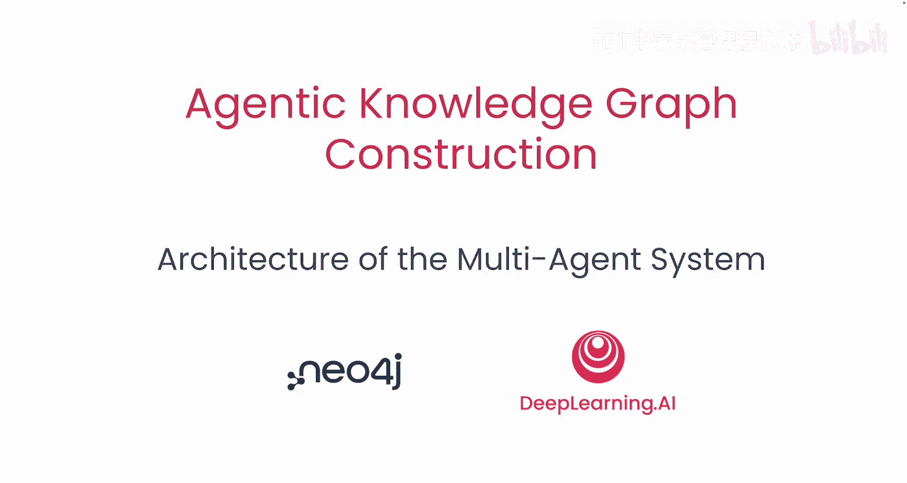

在本节课中，我们将学习如何设计一个多智能体系统，该系统将首先确定图谱模型，然后构建知识图谱。

## 概述

上一节我们明确了知识图谱的构建目标。本节中，我们将深入探讨为实现该目标而设计的**多智能体系统**的详细架构。我们将了解什么是智能体、多智能体系统的优势，以及本课程中将构建的具体系统流程。

## 什么是智能体？🤖

对于智能体有很多定义。从工程角度出发，我喜欢将智能体视为一种新颖的控制流操作符。本质上，它是一个循环。在循环内部，会调用一个大语言模型，该模型会决定它想要做什么。然后，基于这个决定，将任务交还给客户端或计算机端，实际上就是执行一个根据决策选择不同操作的 `switch` 语句。因此，在这个循环中，由于大语言模型的调用，产生了智能行为。但这种智能行为的执行仍然是通过代码完成的。

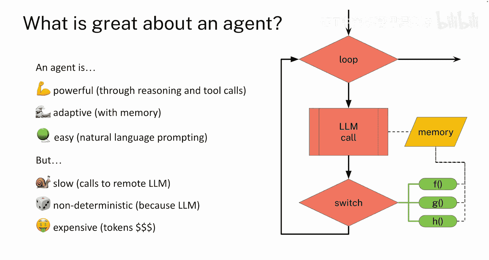

这种架构的强大之处在于，智能体非常强大，因为你可以利用大语言模型进行推理，并调用工具来执行任何可以用代码完成的任务。同时，它也具有适应性，因为大语言模型被赋予了记忆功能，可以通过对话或保存到记忆中的重要信息来学习已发生的事情，从而决定未来的行动。此外，入门相当容易，因为你主要通过提示词用自然语言描述智能体应该做什么。

然而，这种强大和便捷也带来了一些缺点。使用智能体可能较慢，因为调用远程大语言模型成本较高且速度较慢。它也是非确定性的，因为大语言模型本身就是非确定性的。随着时间的推移，令牌成本可能会累积得非常高。如果你在生产环境中长时间运行一个智能体，进行成千上万次调用，令牌成本会迅速变得非常昂贵。

但转向多智能体系统的一个优势是，你实际上可以缓解这里提到的一些缺点。

## 什么是多智能体系统？👥

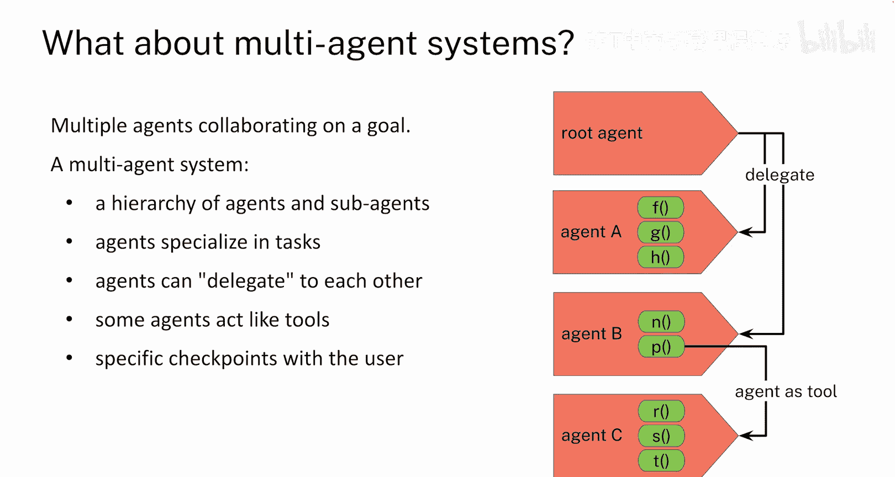

那么，究竟什么是多智能体系统？它当然是一个由多个智能体为单一目标协同工作的系统。智能体通常被组织成一种层次结构，其中有一个顶层智能体管理整体流程，然后可以根据需要设置任意数量的子级智能体，它们负责工作的不同阶段或执行非常具体的任务。

智能体之间通过几种不同的方式交互。存在一个与用户进行的主要对话线程，用户可能通过发送消息来启动工作。然后，每个智能体都可以决定：这项工作是我能做，还是应该由其他人来做？因此，它可以将任务委托给另一个智能体。正如你在图示中看到的，根智能体能够委托给智能体A或智能体B。

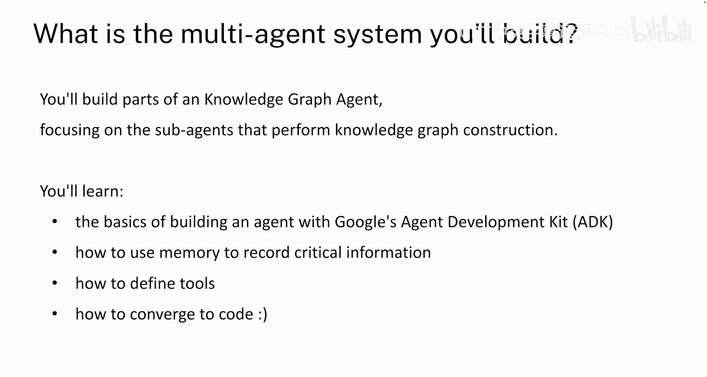

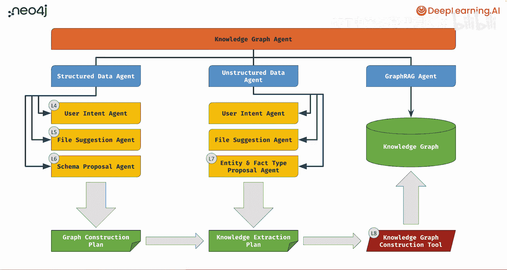

在内部，智能体A和智能体B可以使用它们被赋予的工具来完成一些工作。智能体B的一个工具是独特的，即这里的P智能体。这个P函数本身将是一个智能体，但它被当作一个工具来调用。因此，工具有两种交互方式：要么是智能体之间相互委托，要么是一个作为工具运行的智能体被另一个智能体调用。在此过程中，每当发生这些转换时，都有可能与用户在特定的检查点进行交互。

## 我们将构建的多智能体系统 🛠️

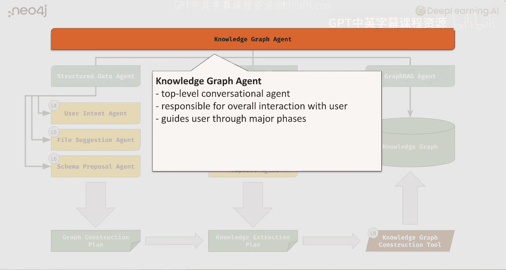

接下来，我们来看看你将构建的多智能体系统具体是什么。你将构建一个知识图谱智能体的部分组件，重点是执行知识图谱构建的子智能体。

你将学习使用 Google 的 **ADK** 构建智能体的基础知识。你将了解什么是记忆以及如何使用它来记录关键信息。你将定义一些工具。当然，所有这些都将从开放式对话汇聚成可执行代码。

这个精美的图表展示了所有智能体、智能体的流程以及它们之间的交互。让我们逐步了解一下。

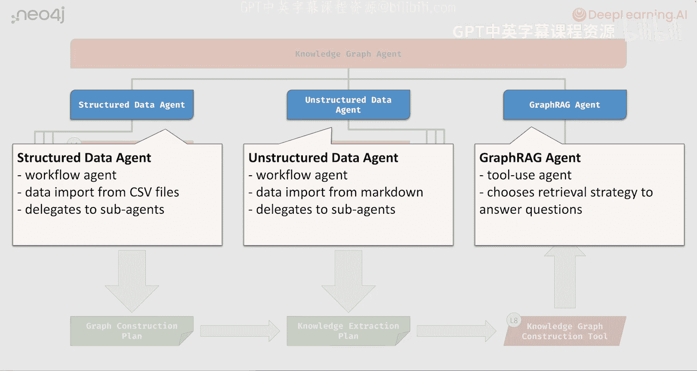

### 顶层：对话引导智能体 💬

在顶层，这个智能体负责管理用户与系统可能性的整体介绍，明确智能体的职责，并帮助用户理解从知识图谱构建到图谱检索的整个可能工作流程。因此，这本质上是一个对话式智能体，它本身不会执行任何实际工作，而是引导用户经历即将发生的不同工作阶段。

### 中层：工作流管理智能体 📋

下一层的智能体才是真正管理各个工作流程的。主要有三个工作流程。在左侧，我们有两个工作流程：**结构化数据智能体**和**非结构化数据智能体**。它们负责引导用户从想法到构建图谱的整个过程。如果它们完成了工作，那么右侧的第三个智能体——**图谱RAG智能体**，则负责帮助用户实际使用该图谱来回答问题。

但结构化数据智能体和非结构化数据智能体是工作流智能体。它们通过与用户交互并帮助他们完成从想法到描述图谱所需的各个步骤来执行工作，而这是通过委托给专门负责工作流程每个阶段的子智能体来实现的。你会看到这里有一些重复，结构化和非结构化数据智能体共享一些共同的子智能体，我们会在深入下一层时提到它们。

### 底层：执行具体工作的子智能体 ⚙️

以下是实际为结构化数据执行工作流程的子智能体。让我们逐一了解，同时需要注意的是这些智能体执行工作的输出。如果你把自己想象成一个被赋予实际执行这项任务的数据工程师，这些智能体中的每一个都类似于你自己在做的工作。

以下是各个子智能体的介绍：

*   **用户意图智能体**：当你被要求执行某项数据分析任务时，你会向提出要求的人提出一些问题，例如：“你能澄清一下你想要我做什么吗？告诉我你的目标是什么，你想让我执行哪种分析？” 事先明确这一点非常重要。这类似于工作的总体需求或方向。因此，这个用户意图智能体虽然是协作和对话式的，但其输出至关重要。我们正在捕获用户的**目标**以及他们希望从这项工作中获得什么。

*   **文件建议智能体**：基于用户意图智能体确立的工作方向和目标，该智能体将查看可用的数据文件，并尝试从中找出哪些文件对实际实现该目标有用。可能还有更多可用文件，甚至可能有多个数据源。在这里，我们将其简化为对磁盘上可用文件的建议。该智能体的输出最终是一个**经用户批准的建议文件列表**。

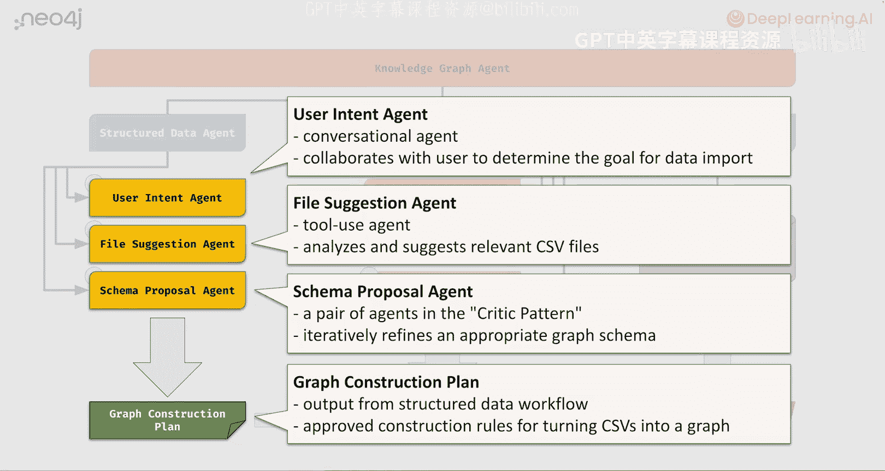

*   **模式提议智能体**：这实际上是一对以“批评者”模式形成的智能体。其中一个智能体负责提出模式可能是什么样子的建议，而下一个智能体则充当批评者，指出“也许那样想不太对，可以考虑这样或那样改变”。我们将在后面的课程中查看细节。但这里的核心思想是，这对智能体内部将循环探讨可能性，进行自我批评，其结果应该是一个**良好的图谱模式**，该模式使用前一个智能体批准的文件，并且符合第一个智能体设定的用户目标，从而产生一个能够回答对用户有用问题的图谱模式。

因此，所有这些工作的输出我们称之为**图谱构建计划**。它本身不是图谱，而是关于如何构建该图谱的描述。

对于非结构化数据工作流，前两个步骤与结构化数据工作流完全相同。我们从理解用户引入非结构化数据的意图开始，然后是文件建议智能体执行类似行为。但第三步是不同的。

在第三步中，与基于CSV文件设计模式不同，你只有文本。那么，如何从文本中创建图谱呢？这里的方法是，我们将有两个专门的智能体来浏览文本并识别所谓的**实体**（即文本中出现的人物、地点和事物），并为这些实体识别文本中描述它们的**事实**。例如，如果文本中有我对本地咖啡店的评论，它可能会揭示“Andrew 非常喜欢 Philz 的咖啡”。这些是可以从文本中提取的事实。这个智能体的目标是找出可以提取哪些类型的事实，而不是进行实际的提取，仅仅是描述可能性。因此，我们将称之为**知识提取计划**。

知识提取计划与来自结构化数据的图谱构建计划一起，为我们提供了所需的所有规则。利用图谱构建计划和图谱提取计划，右下角红色框中的工具（内部包含多个工具）实际上可以获取这些计划，执行提取和构建工作。它会循环所有构建规则来创建一个领域图谱，循环所有 Markdown 文件，将它们分块，进行向量嵌入，同时提取实体和事实，然后将这些连接到结构化数据上。

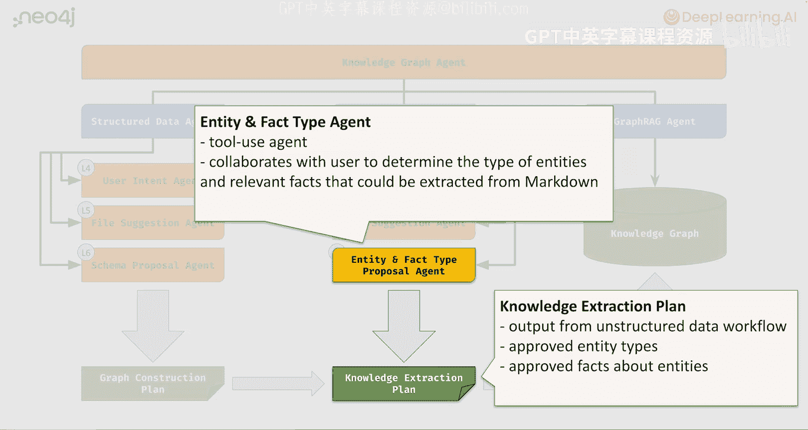

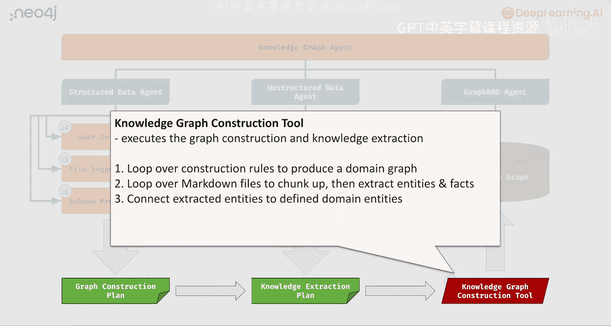

## 课程路线图 🗺️

在课程的第4到第8节，你将经历结构化数据的完整工作流程：从用户意图、文件建议到模式提议。然后，我们将跳到非结构化数据，只学习实体和事实类型提议。最后，在第8课中，我们将查看执行图谱构建本身的特定工具，它完成了所有繁重的工作，而之前的智能体则负责推理工作应该是什么。

## 总结

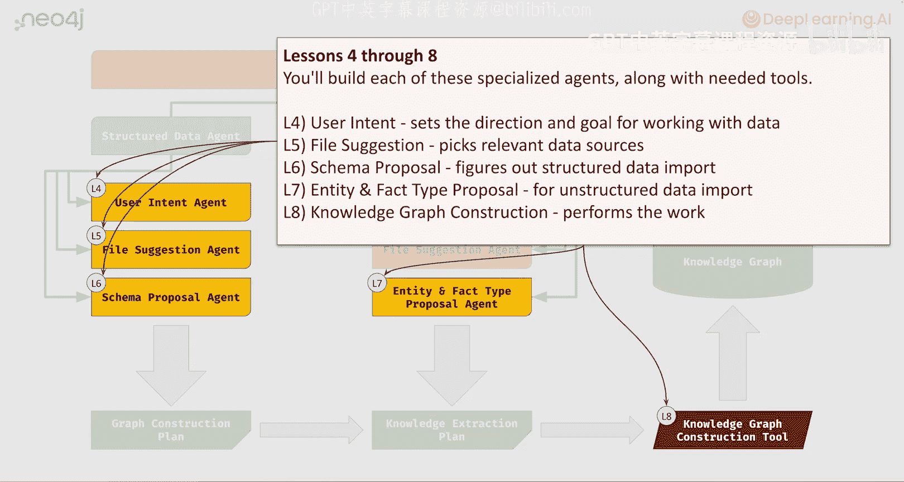

本节课中，我们一起学习了多智能体系统的基本概念和架构。我们了解到智能体是一种结合大语言模型推理和代码执行的新型控制流，而多智能体系统通过层次化分工和协作，可以更高效、更专业地完成复杂任务（如知识图谱构建）。我们详细拆解了将要构建的系统，包括顶层的对话引导、中层的工作流管理以及底层执行具体任务的各个子智能体及其输出。下一节课，我们将开始动手编码，使用 Google 的 ADK 构建你的第一个智能体。