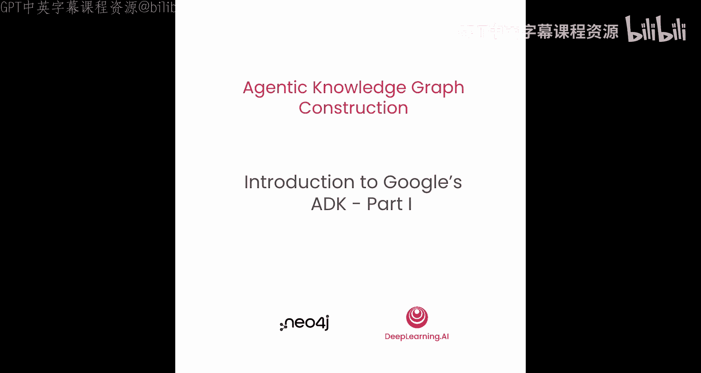
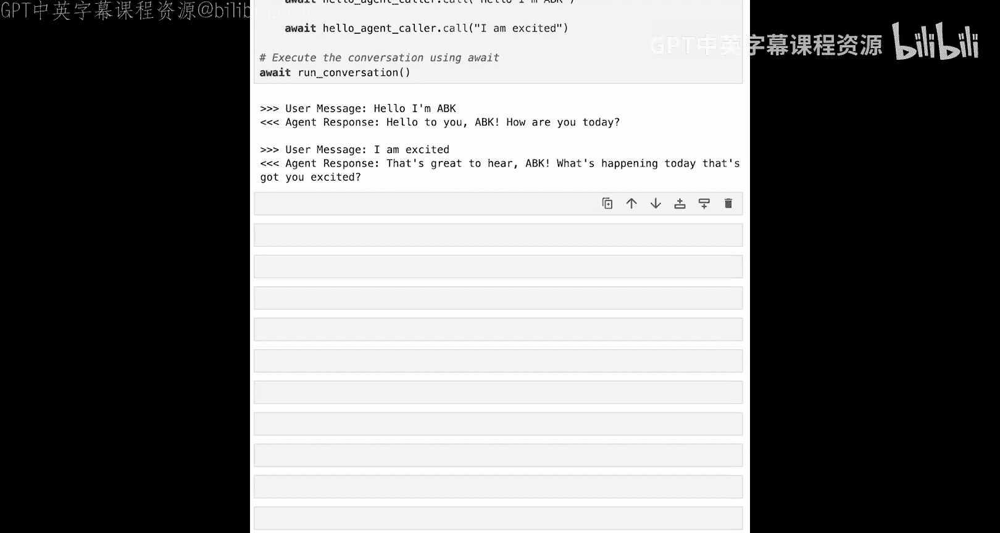

# 004：Google ADK 入门 - 第一部分




在本节课中，我们将学习如何使用 Google 的 Agent Development Kit (ADK) 来构建多智能体系统。ADK 是一个用于开发智能体的框架。我们将从创建一个简单的智能体开始，逐步了解其核心组件和工作原理。

## 环境与库导入

要构建多智能体系统，你将使用 Google 的 ADK。首先，我们需要导入必要的库。

以下是构建智能体所需的核心库：

```python
import os
from google.genai import Agent
from litellm import completion
from google.genai.extensions.litellm import LiteLLM
from google.genai.types import Content
from google.genai import MemorySessionService
from google.genai import Runner
from typing import List, Optional
```

这些导入涵盖了智能体定义、与大语言模型交互、内存管理以及运行环境等关键功能。

## 配置大语言模型

上一节我们介绍了所需的库，本节中我们来看看如何配置智能体将要使用的大语言模型。本课程中我们将使用 OpenAI。

```python
llm = LiteLLM(model="gpt-4")
```

为了测试模型连接是否正常，我们可以发送一个简单的消息。

```python
messages = [{"role": "user", "content": "Are you ready?"}]
response = completion(model="gpt-4", messages=messages)
print(response.choices[0].message.content)
```

如果一切正常，我们将收到来自 OpenAI 的响应，例如：“是的，我准备好了。今天有什么可以帮您的吗？” 这表明 OpenAI 已准备就绪。

## 集成 Neo4j 数据库

智能体系统通常需要与外部数据源交互。我们将使用 Neo4j 图数据库，并导入一个辅助库来简化 ADK 与 Neo4j 的集成。

```python
from neo4j_adk import graph_db
```

这个 `neo4j_adk` 库封装了与 Neo4j 的交互逻辑，并将查询结果格式化为 ADK 期望的字典格式，包含 `status`（成功或错误）和 `query_result` 等字段。

现在，我们可以测试 Neo4j 连接。

```python
result = graph_db.send_query("RETURN 'Neo4j is ready' AS message")
print(result)
```

运行后，你会看到结果被包装成一个格式良好的字典：`{'status': 'success', 'query_result': [{'message': 'Neo4j is ready'}]}`。

## 定义智能体的工具

工具是智能体与外界交互的手段。没有工具，智能体只能进行思考或对话，无法执行具体操作。

我们将定义一个简单的“问好”工具作为示例。

以下是 `say_hello` 工具的定义：

```python
def say_hello(person_name: str):
    """
    向指定名称的人格式化欢迎信息。

    参数:
        person_name (str): 需要问候的人的姓名。

    返回:
        dict: 一个包含状态和查询结果的字典。
    """
    query = "RETURN 'Hello to you, ' + $person_name AS greeting"
    params = {"person_name": person_name}
    result = graph_db.send_query(query, params)
    return result
```

工具的描述文档字符串至关重要，因为它会被传递给大语言模型，帮助模型理解工具的功能和用法。

我们可以直接测试这个工具：

```python
print(say_hello("ADK"))
```

这将返回一个成功的 ADK 格式结果，其中包含查询结果：“Hello to you, ADK”。

**注意**：在查询中使用参数（如 `$person_name`）而非字符串拼接，是防止代码注入攻击的最佳实践。

## 创建智能体

现在我们已经有了一个基本工具，接下来可以定义一个使用该工具的智能体。

定义智能体需要几个核心组件。让我们看看在 Google ADK 中如何实现。

```python
hello_agent = Agent(
    name="hello_agent_v1",
    model=llm,
    description="一个友好的问候智能体，当用户提供姓名时，使用 say_hello 工具进行个性化问候。",
    instruction="""你是一个乐于助人的助手，将与用户聊天。
    你有一个工具：say_hello。
    如果用户提供了他们的名字，请使用 say_hello 工具向他们致以自定义的问候。""",
    tools=[say_hello]
)
```

参数说明：
*   `name`: 智能体名称和版本，便于调试和管理。
*   `model`: 智能体使用的大语言模型。
*   `description`: 描述智能体的职责，供其他智能体在委托任务时理解其用途。
*   `instruction`: 给智能体的系统指令，类似于提示工程中的系统提示，指导其行为。
*   `tools`: 智能体可以使用的工具列表。

## 运行智能体：执行环境

智能体需要一个执行环境来运行。这由一个 `Runner` 类管理，它负责事件循环、调用大语言模型、在智能体间传递结果，并协调各种服务（如内存服务）。

我们将手动设置这个环境，以便理解其工作原理，然后将其封装成一个便捷方法。

首先，逐步设置执行环境：

```python
# 1. 设置内存服务，为智能体运行提供上下文和状态
memory = MemorySessionService()
# 2. 创建会话服务
session_service = memory.create_session(user_id="user1", session_id="session1")
# 3. 创建运行器，将智能体与执行环境绑定
runner = Runner(agent=hello_agent, app_name="HelloApp", session_service=session_service)
```

现在，我们可以模拟用户发送消息并驱动智能体运行一个事件循环。

```python
# 用户消息
user_message = "Hello, I'm ABK."
print(f"User: {user_message}")

# 将消息包装成 ADK 期望的 Content 格式
content = Content(parts=[{"text": user_message}], role="user")

# 预设最终响应
final_response_text = None

# 运行单步事件循环
async for event in runner.run(app_name="HelloApp", user_id="user1", session_id="session1", content=content):
    # 处理事件，例如打印日志
    if event.final:
        # 智能体表示处理完成
        if event.content.parts:
            final_response_text = event.content.parts[0].text
        break

print(f"Agent: {final_response_text}")
```

执行后，智能体应调用 `say_hello` 工具并回复：“Hello to you, ABK.”

## 封装智能体调用器

由于我们会频繁地创建和运行智能体，因此将上述步骤封装成一个可重用的辅助类 `AgentCaller` 会非常方便。

```python
class AgentCaller:
    def __init__(self, agent, user_id="user1", session_id="session1", app_name="DemoApp"):
        self.agent = agent
        self.user_id = user_id
        self.session_id = session_id
        self.app_name = app_name
        self.memory = MemorySessionService()
        self.session_service = self.memory.create_session(user_id=user_id, session_id=session_id)
        self.runner = Runner(agent=agent, app_name=app_name, session_service=self.session_service)

    async def call(self, user_message: str):
        content = Content(parts=[{"text": user_message}], role="user")
        final_response_text = None
        async for event in self.runner.run(app_name=self.app_name, user_id=self.user_id, session_id=self.session_id, content=content):
            if event.final:
                if event.content.parts:
                    final_response_text = event.content.parts[0].text
                break
        return final_response_text

# 工厂函数，便于创建 AgentCaller
def make_agent_caller(agent, **kwargs):
    return AgentCaller(agent, **kwargs)
```

现在，我们可以使用这个封装类轻松地进行多轮对话测试。

```python
# 创建问候智能体的调用器
hello_caller = make_agent_caller(hello_agent)

# 模拟对话
async def run_conversation():
    response1 = await hello_caller.call("Hello, I'm ABK.")
    print(f"Agent: {response1}")
    response2 = await hello_caller.call("I am excited.")
    print(f"Agent: {response2}")

# 运行对话
import asyncio
asyncio.run(run_conversation())
```



## 总结


本节课中我们一起学习了 Google ADK 的基础知识。我们了解了如何导入必要的库、配置大语言模型、集成 Neo4j 数据库，并完成了智能体构建的核心步骤：定义工具、创建智能体、设置执行环境以及运行智能体。最后，我们将复杂的运行逻辑封装成 `AgentCaller` 类，便于后续复用。你已经成功创建了一个能够使用工具进行交互的简单智能体。在接下来的课程中，我们将以此为基础，构建更复杂的多智能体系统。