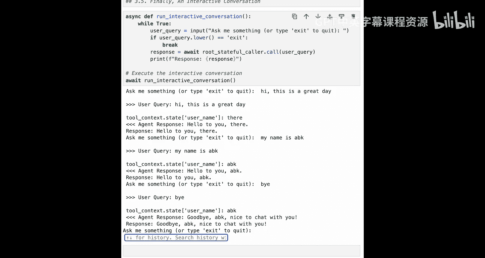
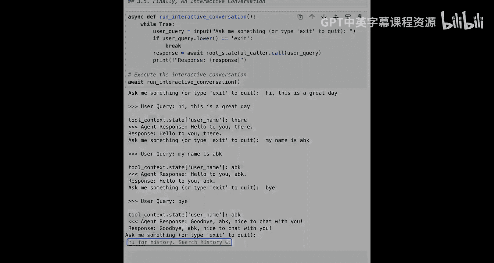

# 005：多智能体系统与状态管理

在本节课中，我们将学习如何构建一个由多个智能体组成的团队，并让它们协同工作。我们将创建一个根智能体来协调两个子智能体，并引入状态（内存）管理，使智能体能够记住会话中的信息。

## 概述

上一节我们介绍了如何使用Google ADK创建一个基本的智能体。本节中，我们来看看如何创建多个智能体，并让它们组成一个团队协同工作。我们将构建一个包含根智能体和两个子智能体（问候和告别）的系统，并引入状态管理功能，使智能体能够记住用户信息。

## 导入库与设置LLM

首先，我们需要导入必要的库并设置我们将要使用的大语言模型。

```python
# 导入所需库
import ...
# 设置OpenAI LLM
llm = ...
```

设置完成后，我们可以通过发送一条测试消息来进行快速检查，确保LLM已准备就绪。

## 创建多智能体系统

准备好一切后，现在可以开始创建多智能体系统。我们将创建多个专门的智能体，每个智能体都设计用于特定的功能。

以下是创建智能体团队所需的步骤：

1.  **定义子智能体的工具**：我们将为问候和告别功能定义工具。
2.  **创建子智能体**：基于定义的工具，创建专门的问候智能体和告别智能体。
3.  **创建根智能体**：创建一个协调者（根智能体），负责接收用户请求并决定是自行处理还是委托给子智能体。

### 定义子智能体的工具

首先，我们定义子智能体将使用的工具。

第一个工具与上一课相同，是 `say_hello` 工具。它接收一个人名并生成问候消息作为响应。

```python
def say_hello(person_name: str) -> str:
    """向指定的人问好。"""
    return f"Hello to you, {person_name}."
```

接下来，我们将添加一个 `say_goodbye` 工具。这个工具比 `say_hello` 更简单，因为它不接受任何参数，只返回一个固定的告别消息。

```python
def say_goodbye() -> str:
    """向用户告别。"""
    return "Goodbye from Cypher."
```

### 创建子智能体

定义好这两个工具后，我们现在可以定义将使用这些工具的智能体。我们将有一个专门的问候智能体和一个专门的告别智能体。

在定义这些子智能体时，强调最佳实践非常重要：为每个智能体提供良好的描述和清晰的指令至关重要。一旦设置了任何多智能体系统，大部分时间将花在优化这些指令上。这回到了经典的提示工程。描述允许其他智能体了解该智能体的功能以及何时应该使用它（这称为委托），而指令则是让智能体自身理解其目的、任务以及可用的工具和何时使用它们。

这是我们的问候子智能体（`say_hello_agent`），它只能访问 `say_hello` 工具。

```python
greeting_agent = Agent(
    name="Greeting Agent",
    description="专门处理简单问候（如 hello, hi）的智能体。",
    instructions="你的职责是当用户以某种方式打招呼时进行回应。使用 say_hello 工具来生成个性化的问候。",
    tools=[say_hello_tool],
    llm=llm
)
```

接下来，我们添加告别智能体（`farewell_agent`）。它类似于问候智能体。

```python
farewell_agent = Agent(
    name="Farewell Agent",
    description="专门处理告别（如 bye, goodbye, see you）的智能体。",
    instructions="你的职责是当用户以某种方式告别时进行回应。例如，当用户使用‘bye’、‘goodbye’、‘thanks bye’或‘see you’等词语时。使用 say_goodbye 工具来生成告别消息。",
    tools=[say_goodbye_tool],
    llm=llm
)
```

### 创建根智能体（协调者）

现在我们有两个子智能体准备就绪，需要将它们组合起来。我们将通过定义根智能体来实现，根智能体将理解这两个子智能体并知道何时将任务委托给它们。

这类似于工具调用，但智能体知道它正在与另一个智能体对话，因此整个对话历史会被传递，并且对话的控制权也会传递给子智能体。所以它与工具调用略有不同，但核心理念是当前工作流程将从负责的智能体（根智能体）转移到其中一个子智能体。

我们将在给根智能体的指令中加倍强调这一点。根智能体被告知其工作是协调一个子智能体团队。

```python
root_agent = Agent(
    name="Friendly Team Coordinator",
    description="协调问候和告别智能体团队的根智能体。",
    instructions="""你是一个友好团队的协调者。你的主要目标是保持友好。
    为了做到这一点，你有两个专门的子智能体：
    1. 问候智能体：用于处理简单的问候，如‘hello’或‘hi’。
    2. 告别智能体：用于处理告别，如‘bye’、‘goodbye’或‘see you’。
    当从用户那里收到此类消息时，请委托给相应的子智能体来响应用户，而不是作为协调者直接响应。
    你没有任何工具可以使用，只能聊天或委托给子智能体。""",
    subagents=[greeting_agent, farewell_agent], # 关键：传入子智能体列表
    llm=llm
)
```

这个顶层的协调者本身没有任何工具可用，它只能聊天或委托给子智能体。我们还在 `subagents` 键中传递了子智能体列表，即问候子智能体和告别子智能体。

## 与多智能体系统交互

现在我们已经将一个智能体团队组合成一个多智能体系统，让我们继续与它交互。

这与我们在第3课第1部分中所做的类似，我们有一个管理对话的异步函数。在这里，对话将与我们之前所做的相同。首先是“Hello, I am ABK.”，然后用户会说“Thanks bye.”。

我们还在此处添加了 `verbose=True` 参数，以便在响应中看到所有幕后发生的情况，帮助你理解用户消息的输入、委托过程、工具调用以及响应。

**交互流程解析：**

1.  **用户消息**：`“Hello, I am ABK.”`
2.  **根智能体响应**：顶层协调者（团队协调者）将调用子智能体。它采取的第一个行动是希望**转移（委托）**给一个子智能体，并且它将转移给问候子智能体。
3.  **问候子智能体行动**：问候子智能体接管控制，查看记录，意识到现在需要处理此消息。它将通过进行工具调用来响应，调用 `say_hello` 函数并传入参数 `person_name: “ABK”`。
4.  **工具响应**：函数返回 `“Hello to you, ABK.”`。
5.  **最终响应**：问候子智能体完成处理，最终代理响应是工具返回的 `“Hello to you, ABK.”`。
6.  **第二条用户消息**：`“Thanks bye.”`
7.  **委托与执行**：当前控制权仍在问候子智能体，它意识到这不应由自己处理，于是**转移**给告别子智能体。告别子智能体接管后，调用 `say_goodbye` 工具。
8.  **最终告别**：工具返回 `“Goodbye from Cypher.”`，成为最终的代理响应。

这个过程详细展示了工具调用、智能体委托以及状态的整体变化。虽然信息量很大，但非常值得花时间理解，因为它会影响整体的智能体定义和编排方式。

## 引入状态（内存）管理

在我们的多智能体系统中再进一步。我们有了智能体的执行环境，有了一个可以协同工作的多智能体团队，它们可以相互委托任务，并且每个智能体也有可以使用的工具。

所有智能体系统的最后一个重要组成部分是拥有**内存**。内存只是特定会话中涉及的智能体（当然也包括用户本身）的内部状态。

在Google ADK中，默认的会话状态本质上是一个可用的字典，你可以在其中更新键值。当你更新这些键的值时，Google ADK会跟踪这些更改。它基本上跟踪状态的变化（增量），并更新整体会话状态，以在所有智能体之间保持一致（无论它们是并行运行还是顺序运行，因为其核心是一个异步系统）。

智能体有几种不同的方式与状态交互：

1.  **通过工具上下文（首选方法）**：每当调用工具时，都有一个额外的参数可用，即调用该工具的**上下文**。给定该工具上下文，工具本身就可以访问智能体的当前状态或当前内存，并可以使用该内存来做出不同的决策、创建不同的输出等。
2.  **通过输出键**：智能体与状态交互的另一种方式是使用输出键。你可以获取智能体的最终响应，并将其保存到状态中，而不是仅仅将其作为智能体的响应返回。这是通过定义输出键来实现的。

### 设置具有状态功能的工具

在下一步中，我们将设置一些内存。我们目前一直使用内存中的会话，因此内存仅保存在RAM中，不会持久化到数据库。对于生产系统，持久化是更好的选择，但为了方便起见，使用内存中的状态完全可以。

我们将更新我们的两个工具，以实际利用该内存中的状态。对于 `say_hello` 和 `say_goodbye`，我们将更新这些工具，以利用工具上下文来更新会话状态或内存。

你应该一次更新一个，并仔细查看这里的差异。

首先，我们需要从Google ADK导入 `ToolContext`。

```python
from google.adk.tools import ToolContext
```

然后，我们将 `say_hello` 函数更新为具有状态功能的 `say_hello_stateful`。

```python
def say_hello_stateful(person_name: str, tool_context: ToolContext) -> str:
    """向指定的人问好，并更新会话状态。"""
    # 更新会话状态中的用户名
    tool_context.state[‘username‘] = person_name
    print(f"[DEBUG] Updated session state ‘username‘ to: {person_name}")
    # 返回问候语
    return f"Hello to you, {person_name}."
```

它仍然接受用户名的参数，但现在有了这个名为 `tool_context` 的额外参数。工具上下文将让我们访问执行环境为会话传入的工具上下文。在工具上下文中，有一个 `state` 字典。我们将使用传入函数的名称来更新会话内存或会话状态中的 `username` 键。

接下来，以类似的方式定义 `say_goodbye_stateful`。

```python
def say_goodbye_stateful(tool_context: ToolContext) -> str:
    """向用户告别，使用会话状态中的用户名（如果存在）。"""
    # 从会话状态中获取用户名，如果不存在则使用默认值
    username = tool_context.state.get(‘username‘, ‘there‘)
    return f"Goodbye from Cypher, {username}."
```

`say_goodbye_stateful` 即使没有接收与人相关的参数，也会传入 `tool_context`。当Google ADK看到工具的最后一个参数是 `ToolContext` 时，它会自动将其注入到工具调用中。因为 `say_hello_stateful` 已经将 `username` 设置到了状态中，`say_goodbye_stateful` 实际上可以访问用户名。这样我们就记住了用户的姓名。

### 创建使用状态化工具的新智能体

然后，你可以为告别定义一个新的状态化智能体，同样，这与我们之前的告别智能体相同，但现在它将调用 `say_goodbye_stateful` 工具。

和以前一样，你可以通过拥有一个根级智能体（协调者智能体）来将这些组合成一个多智能体系统，该协调者将使用所有这些作为子智能体。

这与我们之前的根智能体完全相同，但现在它使用的所有子智能体最终都调用了基于状态的工具。

现在，你有了一个利用内存的多智能体系统。

### 测试状态管理

你可以尝试运行它。我们将使用 `make_agent_caller` 函数，传入新的状态化根智能体（顶层协调者），为其创建一个调用者。为了查看会话中的变化，我们将直接从调用者获取会话，并打印出创建时的初始状态。正如预期的那样，初始状态是空的。

现在定义一个对话，与我们一直进行的对话相同：先说你好，然后说再见。让我们看看会发生什么。

重要的是，我们看到初始状态是空的。我们期望一旦这些调用完成，初始状态将变为最终状态。当我们再次获取会话并从该会话获取状态时，最终状态应该包含由 `say_hello` 调用定义的用户名。

如果愿意，你甚至可以在此笔记本中设置一个交互式环境，设置一个小型辅助函数，循环获取用户消息并调用我们的调用者传入该消息。只要用户不输入“exit”消息，它就会一直运行。你可以尝试与它交互，看看能想出什么。当然，如果你愿意，可以更改任何代码，看看会产生什么影响。

## 总结

在本节课中，我们一起学习了如何构建一个多智能体系统。你创建了一个基本的单智能体来说“你好”，然后创建了一个多智能体系统，其中包含两个专门负责说“你好”和“再见”的子智能体，以及一个协调它们与用户交互的根智能体。此外，我们还引入了状态管理，使智能体能够跨对话记住信息（如用户名）。





掌握了这些，你就为继续进行实际的智能体知识图谱构建做好了准备。