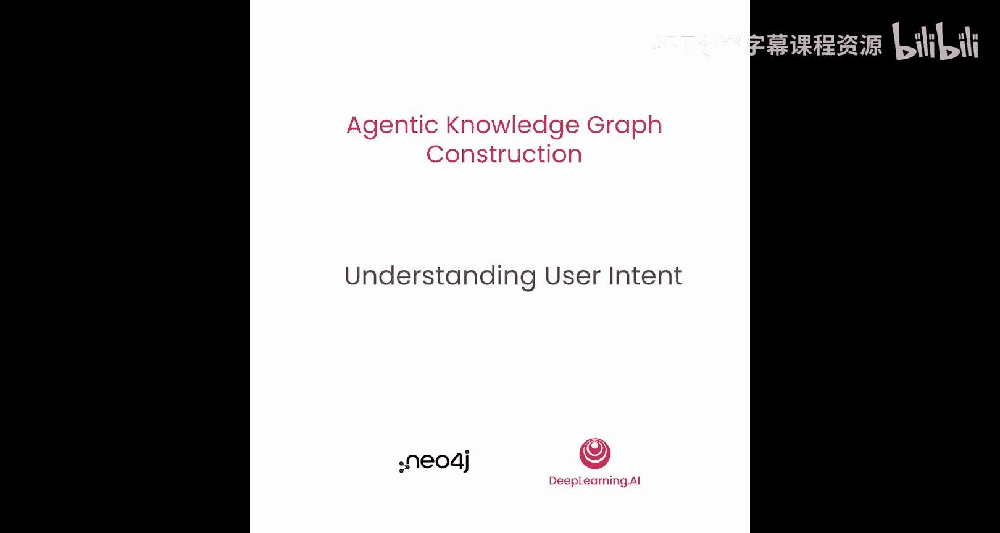
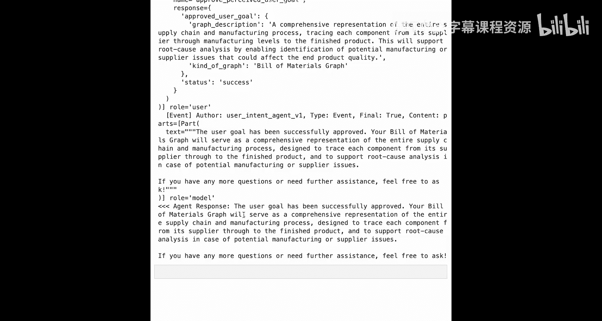

# 006：理解用户意图 🎯

在本节课中，我们将学习如何定义系统中的第一个智能体——用户意图智能体。它的核心目标是帮助你构思可以构建的知识图谱类型，以及你希望从图谱中回答的问题。我们将通过编写代码，一步步实现这个智能体的功能。

## 智能体架构回顾与定位

上一节我们介绍了整体的知识图谱智能体架构。本节中，我们将聚焦于其中的“结构化数据智能体”子模块。这个子模块负责从简历文件中提取信息，并将这些数据最终转换为图谱。

我们将以渐进、协作的方式完成这项工作。第一步是理解用户的意图。在这个初始阶段，明确用户的目标和他们试图实现的内容描述至关重要，因为它将影响所有后续智能体的行为，为整个系统设定方向。

## 用户意图智能体的职责与工具

这个特定的智能体有一个主要工作：将“已批准的用户目标”保存到记忆中。为了实现这一点，它有两个工具可以使用。

以下是该智能体的工作流程：
1.  **感知用户目标**：首先，它通过在与用户的对话互动中，感知用户的目标。
2.  **提出理解并确认**：基于对用户需求的理解，它会调用工具来捕获这个理解，并告诉用户：“我认为您想要的是……”。用户可以选择说“是的，正确”或“不，不太对，再试一次”。
3.  **循环确认**：如果用户要求重试，智能体将继续使用“设置感知到的用户目标”工具，直到用户认为正确并批准。
4.  **最终批准**：只有当用户批准后，智能体才应调用“批准感知到的用户目标”工具。

关键点在于，“设置感知到的用户目标”工具本身不能设置已批准的目标。只有通过调用“批准”工具，我们才能确保有一个与用户的检查点，即用户已明确表示同意。

## 代码实现：设置与提示词构建

明确了智能体的细节后，我们将开始进行常规设置，导入所需的库，并设置语言模型进行快速完整性检查。

接下来，我们将开始定义用户意图智能体本身。我们将逐步描述要提供给智能体的提示词和指令。

**智能体角色与目标**
提示词的第一部分是定义智能体的角色和目标。我们将告诉智能体：你是一位知识图谱用例专家，主要目标是帮助用户构思知识图谱的用例。换句话说，你的工作是帮助用户构思他们想要实现的目标。

**对话提示**
提示词的下一部分我称之为“对话提示”。这有助于智能体在其角色和目标背景下，理解应如何展开工作。因为我们处于理解用户意图、与用户共同构思的背景下，所以可以给出一些基本建议，例如：如果用户不确定要做什么，你可以提出一些建议，特别是围绕知识图谱的经典用例。由于智能体是知识图谱用例专家，你可以解释一些用例，如社交网络、物流、推荐系统、欺诈检测，或者流行文化（如跟踪电影、书籍或音乐）。

**用户目标的构成**
由于用户目标对设定多智能体系统的整体方向至关重要，我特别强调了用户目标的构成。在提示词中，我描述用户目标包含两个部分：
1.  **图谱类型**：例如，是创建社交图谱还是物流图谱？这被描述为最多三个词，用于描述我们正在创建的图谱。
2.  **图谱描述**：提供几句话来描述该图谱的意图。例如，如果图谱类型是“美国货运物流”，描述可以是“一个用于货物的动态路由和交付系统”。

这相当于进行了一些小样本学习，向智能体（并通过智能体向语言模型）强调你试图实现的目标。因为这一点非常重要，值得在提示词本身以及稍后实际使用用户目标的工具描述中重复。

**思维链指引**
提示词的最后一部分是思维链指引。思维链可以很简单，比如“仔细思考，一步一步来”。但在这里，我们会更具体一些。我们希望语言模型遵循一些步骤，因此我们会非常具体地说：我希望你一步一步地做以下事情。智能体可能会有不同的执行方式，但当我们明确知道希望智能体做什么时，在这里具体说明非常有帮助，可以引导智能体的注意力，使其知道在用户初始互动后应如何继续。

最重要的步骤是：
1.  理解用户目标（重申：包括图谱类型和描述）。
2.  如果不确定，智能体应根据需要提出澄清问题。
3.  只有当智能体认为自己理解了用户目标时，才应调用“设置感知到的用户目标”工具。这将把理解到的用户目标（包含图谱类型和描述两个部分）记录到记忆中。
4.  最后，向用户呈现感知到的目标，并请求确认：“我认为您说的是……，对吗？”
5.  如果用户同意，智能体才能调用“批准感知到的用户目标”工具。我们在这里提供了大量关于调用此工具的额外说明，以确保智能体真正理解这个工具的作用：调用此工具后，当前的感知目标将被保存在状态中的“已批准用户目标”键下。

我们将使用Python字符串模板将这些部分组合在一起，形成最终给智能体的提示词。

## 定义智能体工具

现在，我们可以继续定义工具。

**第一个工具：设置感知到的用户目标**
第一个工具是设置感知到的用户目标。通过在工具中设置此功能，并规定只能通过该工具将其感知到的值保存到记忆中，我们真正帮助智能体专注于理解用户目标意味着什么。因为它必须调用这个工具，并且知道它有两个组成部分（我们在提示词中已说明）。在工具定义本身中，它可以看到有两个参数需要传入：`kind_of_graph`（图谱类型）和`graph_description`（图谱描述）。同时，你会注意到我们将`tool_context`作为最后一个参数传入。如果你还记得上一课的内容，当最后一个参数是工具上下文时，ADK会在调用此工具时自动注入它。

我们在工具描述中重申了它的作用：保存感知到的用户目标，包括图谱类型及其描述。我们也描述了参数是什么，这些应该与之前在提示词指令中对智能体所说的完全一致。你说得越多，语言模型在调用工具时做错事的可能性就越小。

在工具内部，它非常简单。它所做的就是组装一个小字典，该字典由这两个组成部分（图谱类型和图谱描述）组成，作为可用的数据。这只是封装如何访问内存的一种非常简单的方式，同时也聚焦于对内存的访问。上下文状态会用这个字典更新，因为这是一个更新操作，ADK会看到状态发生了变化，并将这个增量传播给运行时环境中需要感知它的任何其他部分。

**第二个工具：批准感知到的用户目标**
接下来，你可以定义下一个工具，用于批准感知到的用户目标。这个工具只应在感知到的用户目标已被设置，并且用户也已表示“是的，我批准”之后被触发。如果这两个条件都为真，则应调用此工具。

在工具内部，只要可能且合理，就值得“信任但要验证”语言模型是否在做正确的事情。在这个工具中，它只应在用户批准后被调用。因此，我们再次向语言模型强调：只有在用户批准后才调用此工具。然后，如果用户通过调用此工具表示批准，该工具将把感知到的用户目标记录为已批准的用户目标。同样，我们会告诉智能体：只有在用户已明确批准感知到的用户目标时，才在工具内部调用此工具。

为了进行一点检查，因为我们要求感知到的用户目标必须已被设置，我们可以在做任何其他事情之前检查它是否已被设置。我们如何处理这个设置非常重要，因为对工具的调用可能成功也可能导致错误。这里，我们有一个非常具体的错误：如果感知到的用户目标不在当前上下文中（即不在工具上下文状态或智能体的记忆中），我们将从此工具返回一个错误。

我们提供的错误信息旨在帮助语言模型理解：哪里出错了，你应该怎么做来解决问题。因此，我们告诉语言模型：感知到的用户目标尚未设置，它应该先设置感知到的用户目标，或者如果它不确定用户的意图，应提出澄清问题。

这实际上是在所有不同的地方——从提示词到工具定义，再到工具返回的错误信息——反复向智能体强调，鼓励语言模型根据实际情况做正确的事情。

如果检查成功，我们要做的只是将状态从“感知到的用户目标”复制到“已批准的用户目标”。请注意，由于我们没有向“批准感知到的用户目标”工具传递参数，因此只有当存在感知到的用户目标时，已批准的用户目标才会被设置（通过复制）。之后，状态中应该同时存在感知到的和已批准的用户目标。

为了方便起见，我们将这两个工具添加到一个列表中，因为我们知道在创建实际的智能体本身时会传入一个列表。

## 创建用户意图智能体

现在我们已经有了两个工具（设置感知到的用户目标和批准感知到的用户目标），可以定义用户意图智能体了。

你将给它一个带有版本号的名称（这将是一个唯一的版本名），我们将使用之前定义的语言模型（在所有notebook中都将使用相同的语言模型）。描述非常重要：此用户意图智能体的意图是帮助用户构思知识图谱用例。这有助于整个多智能体系统知道何时使用此智能体本身。回想之前的架构图，这是工作流的一部分。通过使此描述与该智能体在工作流中扮演的角色相匹配，有助于实际管理工作流的协调器知道何时委托给此智能体。

在智能体内部，我们传入之前组装的完整智能体指令，当然，我们也会传入可用的工具列表。

现在，你已经有了一个完整的用户意图智能体，可以开始使用了。

## 与智能体交互

你可以导入`make_agent_caller`并创建一个针对用户意图智能体的调用器，我们称之为`user_intent_caller`。

需要注意的是，如果我们要多次运行此代码，最好回到这里重新初始化状态，以防事情偏离轨道。

让我们设置一个会话来与用户意图智能体交互。在开始实际交互之前获取会话，以便查看会话的当前状态（初始时通常为空）。

然后，我们将创建一个脚本化的对话，这里基本上只有两次调用。

**第一次调用**
用户声明他们想要一个物料清单图谱，并且它应该包含从供应商到成品的所有级别的物料清单。用户还指定他们希望这个物料清单图谱能够支持根本原因分析。

**处理智能体响应**
这是对话的一个重要部分。有时，当智能体收到用户的初始消息时，它可能会决定需要提出澄清问题。因此，如果它提出了，那么感知到的用户目标将不会被设置。智能体可能会回应说：“请告诉我更多关于你试图做的事情。” 我们在这里做一个假设：如果感知到的用户目标没有在会话状态中设置，我们假设语言模型提出了一个澄清问题。让我们以用户的身份提供一个澄清答案，并说：“我担心可能出现的制造或供应商问题。” 希望这足以满足智能体的要求，并鼓励它实际调用感知用户目标工具。

**乐观情况与批准**
乐观地看，如果我们到达这里，那么感知到的用户目标应该已被设置。我们将继续说：“嗯，这听起来很棒。我批准这个目标。” 你可能需要多次运行此代码，因为智能体可能不会立即设置感知到的用户目标；它可能在任何一天都决定在与用户进行更多对话后，才确定自己真正理解了用户目标。

在调试模式下运行批准用户目标的最终调用，你可以看到我们经历的会话过程：会话开始时，会话状态中没有任何内容，所以内存是空的。用户发送了他们的初始消息，智能体回应并实际提出了澄清问题。因为我们有那个检查点，我们决定发送额外的消息：“我担心可能出现的制造或供应问题。” 有了这个，看起来智能体然后决定有足够的信息继续，并理解了我们的目标。它告诉我们它认为我们试图构建的图谱类型，以及它认为我们想要从该图谱中得到什么的描述。最后，它正确地说：“这抓住了您的意图吗？” 这正是我们想要它做的。然后作为用户，我们将假设批准该目标。在批准该目标时，用户意图智能体进行了设置感知用户目标的调用，然后因为用户已批准，它调用了批准感知用户目标工具。你可以看到底部的最终响应：用户目标已成功批准，一切顺利。

现在，工作流知道了用户在这个多智能体系统中构建知识图谱试图实现的整体方向。

## 总结

本节课中，我们一起学习了如何构建“用户意图智能体”。我们定义了它的核心角色是帮助用户构思知识图谱用例，并详细设计了它的工作流程，包括**感知用户目标**和**获取用户批准**两个关键步骤。我们通过精心构造的提示词（包含角色目标、对话提示、目标构成和思维链）来引导智能体的行为，并实现了两个核心工具来与记忆系统交互。最后，我们通过一个具体的对话示例演示了智能体如何与用户协作，最终明确并锁定知识图谱的构建目标，为后续的智能体工作奠定了基础。