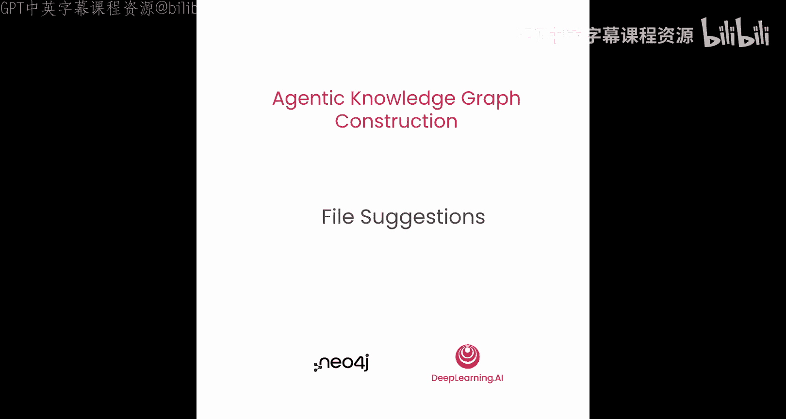
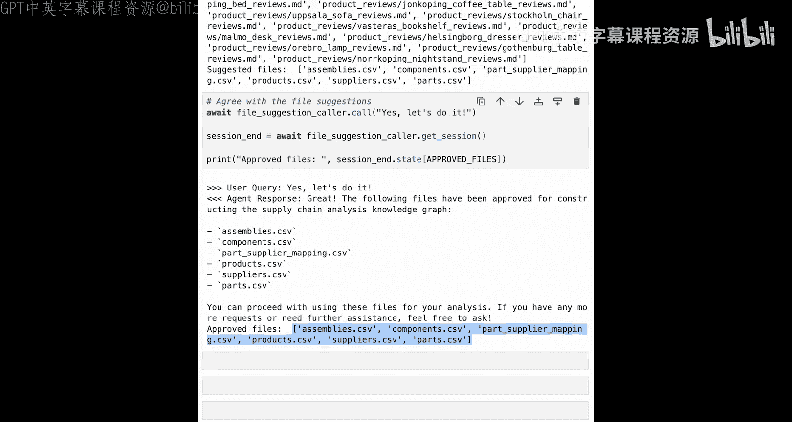

# 007：文件建议智能体 🗂️




在本节课中，我们将学习如何构建工作流中的第二个智能体——文件建议智能体。该智能体的核心任务是，根据已确定的用户目标，从结构化数据中筛选出用于构建领域知识图谱的相关文件。

## 概述

上一节我们介绍了用户意图智能体，它负责明确用户的目标。本节中，我们来看看文件建议智能体。该智能体将基于用户目标，从可用的文件列表中筛选出最相关的文件，并请求用户确认，最终生成一个“已批准文件列表”。

## 智能体工作流程与目标

文件建议智能体遵循与用户意图智能体相似的模式。其核心目标是创建“已批准文件列表”。智能体首先会审视所有可用文件，判断哪些与用户目标相关，然后询问用户：“您批准使用这些文件吗？” 如果用户同意，输出结果就是最终批准的文件列表。

为了实现这个目标，智能体配备了一系列工具来操作文件。

以下是文件建议智能体可用的工具列表：
*   **列出导入文件**：获取所有可用文件的列表。
*   **采样文件**：读取文件内容（约10行），以便评估其相关性。
*   **设置建议文件**：基于评估，将建议的文件列表记录到内存中。
*   **获取建议文件**：从内存中读取当前建议的文件列表。
*   **批准建议文件**：在用户确认后，将建议文件列表更新为已批准文件列表。

所有这些操作都基于前一个智能体（用户意图智能体）的工作成果。文件建议智能体通过调用 **`get_approved_user_goal`** 工具从会话内存中获取用户目标，而不是依赖对话历史记录。这确保了智能体始终基于明确、已批准的目标进行决策。

## 代码实现详解

现在，让我们深入代码，看看如何构建这个智能体。

### 1. 初始设置与库导入

首先进行常规设置，导入所需的库以及之前定义的辅助函数。

```python
# 导入必要的库和辅助函数
import openai
from tools_module import get_approved_user_goal, get_neo4j_import_dir
# ... 其他导入
```

创建与OpenAI的连接并确保其正常工作。

### 2. 定义智能体指令

接下来，我们分步构建智能体的指令。首先定义其角色和目标。

```python
agent_instructions = """
角色：你是一个建设性的评审者，负责审查文件列表。
目标：为构建知识图谱建议相关的文件。
"""
```

然后，提供如何完成任务的提示。具体任务是：基于已批准的用户目标描述，审查文件列表并找出哪些文件对构建此类图谱有用。智能体可以使用 **`sample_file`** 工具查看文件内容以确认其有用性，并且应主要关注如CSV或JSON之类的结构化数据文件。

最后，给出思维链指示。思维链包含两部分：
1.  **准备阶段**：调用 **`get_approved_user_goal`** 工具从会话内存中获取用户目标。
2.  **执行步骤**：仔细思考，重复以下步骤直到完成：
    *   步骤1：获取所有可用文件的列表。
    *   步骤2：评估每个文件的相关性。
    *   步骤3：使用 **`set_suggested_files`** 工具将建议的文件记录到内存中。
    *   步骤4：使用 **`get_suggested_files`** 工具获取建议文件列表（这一步至关重要，它强制智能体专注于内存中的内容，而非对话历史）。
    *   步骤5：将结果呈现给用户批准。如果用户批准，则调用 **`approve_suggested_files`** 工具；如果用户有反馈，则带着反馈回到步骤1。

### 3. 定义智能体工具

现在，定义智能体将使用的各个工具函数。

**获取已批准用户目标工具**
此函数直接返回存储在状态中的已批准用户目标。

**列出导入文件工具**
此工具列出Neo4j可以访问的导入目录中的所有文件。关键点在于，智能体只能访问相对于该导入目录的文件路径，而非绝对路径。

```python
def list_import_files(tool_context):
    import_dir = get_neo4j_import_dir()
    # 递归列出import_dir下的所有文件，并转换为相对路径列表
    all_files = [os.path.relpath(f, import_dir) for f in glob.glob(os.path.join(import_dir, '**/*'), recursive=True) if os.path.isfile(f)]
    # 将列表保存到当前状态
    tool_context.state['all_available_files'] = all_files
    return all_files
```

**采样文件工具**
此工具接收一个相对文件路径，并返回该文件的前100行文本。代码中包含安全检查：确保路径是相对的、路径存在于可用文件列表中、以及文件确实存在。

```python
def sample_file(tool_context, file_path: str):
    # 检查是否为绝对路径
    if os.path.isabs(file_path):
        return "错误：必须提供相对于导入目录的文件路径。"
    # 检查文件是否在可用列表中
    if file_path not in tool_context.state.get('all_available_files', []):
        return f"错误：文件 '{file_path}' 不在可用文件列表中。"
    # 构建完整路径并检查存在性
    full_path = os.path.join(get_neo4j_import_dir(), file_path)
    if not os.path.exists(full_path):
        return f"错误：文件 '{full_path}' 不存在。"
    # 读取文件内容
    try:
        with open(full_path, 'r', encoding='utf-8') as f:
            content = ''.join([next(f) for _ in range(100)]) # 读取最多100行
        return content
    except Exception as e:
        return f"读取文件时出错：{e}"
```

**设置与获取建议文件工具**
*   **`set_suggested_files`**：接收一个文件路径字符串列表，并将其保存到内存中。
*   **`get_suggested_files`**：从内存中读取当前建议的文件列表。

**批准建议文件工具**
此工具在用户确认后调用。它会检查建议文件列表是否已存在于状态中，如果存在，则将其复制到“已批准文件”中。

```python
def approve_suggested_files(tool_context):
    suggested = tool_context.state.get('suggested_files')
    if not suggested:
        return "错误：未找到建议的文件列表。请先设置建议文件。"
    tool_context.state['approved_files'] = suggested.copy()
    return f"成功！已批准文件：{suggested}"
```

将所有工具定义放入一个列表，命名为 `file_suggestion_agent_tools`。

### 4. 创建并运行智能体

有了工具和提示，定义智能体就很简单了。

```python
file_suggestion_agent = Agent(
    tools=file_suggestion_agent_tools,
    instructions=agent_instructions
)
```

现在，使用之前定义的 `make_agent_call` 辅助函数与智能体交互。**关键点**：我们需要初始化会话状态，包含已批准的用户目标，以模拟工作流中前一步已完成。

```python
initial_state = {
    'approved_user_goal': '进行供应链分析，为制造产品创建多级物料清单。'
}
response = make_agent_call(file_suggestion_agent, user_message="我们可以使用哪些文件进行导入？", initial_state=initial_state)
```

运行对话后，智能体会列出所有可用文件（可能包含CSV、Markdown等），并基于其目标，仅建议相关的CSV文件（如装配体、组件、供应商映射等）。用户回复“是的，我们开始吧”表示批准，智能体随后调用批准工具，将建议文件列表转为已批准文件列表。

## 总结

本节课中，我们一起学习了如何构建文件建议智能体。我们定义了它的角色、目标和详细的思维链指令，并实现了一系列关键工具，包括列出文件、采样内容、设置和批准文件列表。这个智能体能够基于明确的用户目标，从文件系统中智能筛选出相关数据文件，为后续的知识图谱构建步骤准备好数据基础。



至此，我们已经完成了结构化数据知识图谱构建工作流中的两个智能体：第一个明确用户意图，第二个基于该意图寻找支持数据。在下一课中，我们将继续下一步：根据用户意图和可用的文件，设计图谱可能的结构。