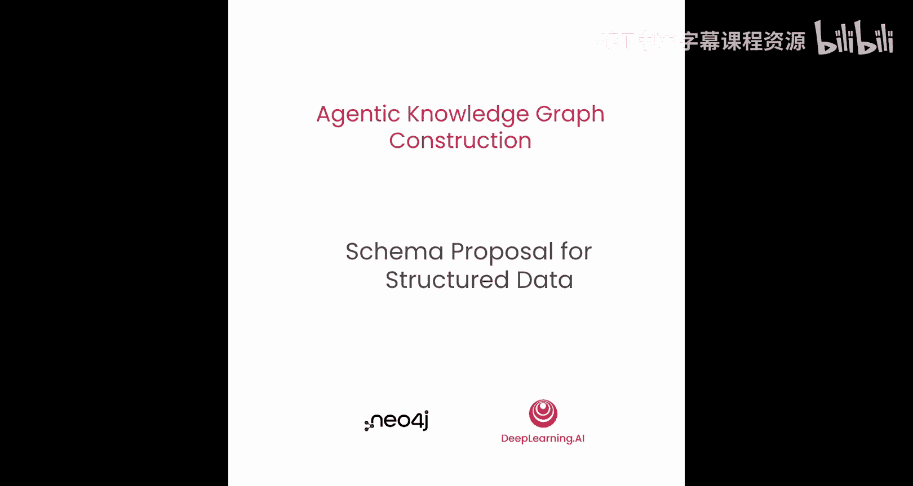
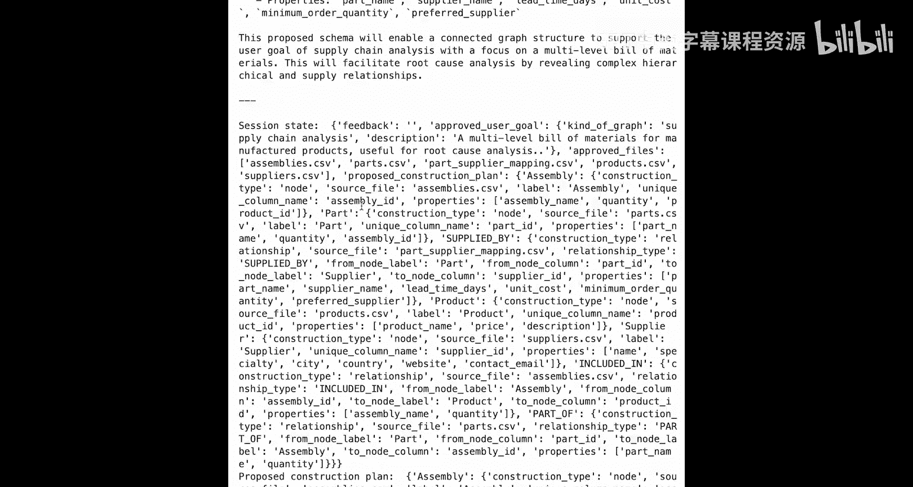
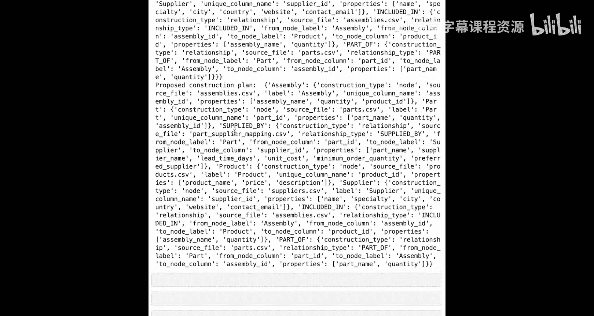
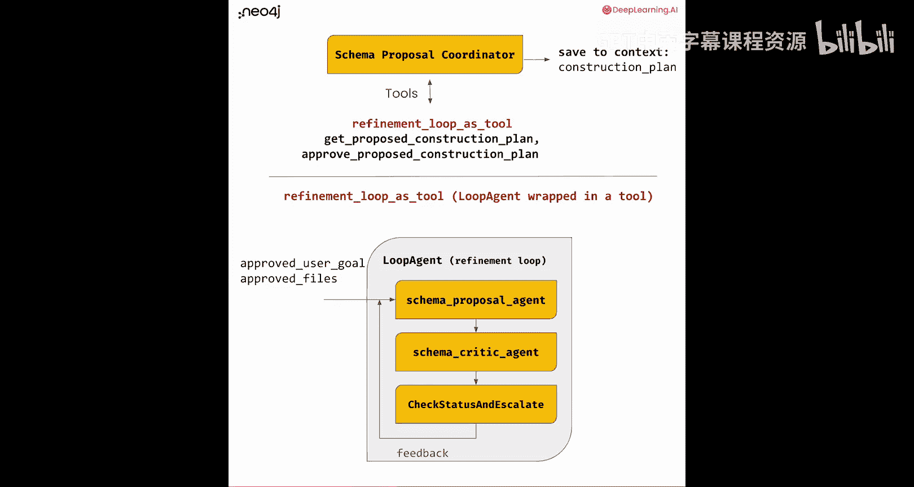

# 008：结构化数据的模式提案




在本节课中，我们将学习如何为结构化数据设计知识图谱的模式。我们已经定义了用户目标和选定的数据文件，下一步是决定构成领域图谱的节点和边的类型。我们将建立一个由多个子智能体组成的循环，来迭代地优化这个图谱模型。

## 从用户意图到模式提案

上一节我们完成了文件建议和批准。现在，我们进入工作流的下一阶段：为图谱模式提出一个方案。这是“结构化数据智能体”的核心任务。

这个智能体在构建方式上引入了一些新思路。它内部实际上包含了多个智能体，特别是：
*   一个负责提出初步图谱方案的“提案智能体”。
*   一个负责审查和批评该方案的“批评智能体”。

这是一种在多智能体系统中非常常见的“批评者模式”。

在顶层的协调器中，它主要使用几个工具，其中一个特别有趣：**将“精炼循环”本身作为一个工具**。这个工具本身就是一个智能体，它协调着几个子智能体共同工作。

## 深入精炼循环

精炼循环是一个协调子智能体的智能体。它包含三个子智能体：
1.  **模式提案智能体**：负责提出初步方案。
2.  **模式批评智能体**：负责审查和批评方案。
3.  **检查状态并升级智能体**：负责根据批评者的输出决定循环是否结束。

这些智能体会循环工作，直到达成最终结果。批评智能体审查提案，检查状态智能体则判断批评者是否满意。如果满意，则由它触发“升级”，终止循环。为了避免无限循环，我们可以设置最大迭代次数。如果无法达成共识，循环将终止，并向用户请求更多指导。

## 构建模式提案智能体

我们首先进行常规的导入并定义要使用的大语言模型。

### 智能体指令设计

接下来，我们重点看看提案智能体和批评智能体的指令设计。

对于提案智能体，我们定义其角色和目标为“属性图谱图数据建模专家”。指令中的一个新颖部分是**反馈注入机制**。我们使用类似XML的标签 `{feedback}` 来包裹反馈内容。这是一个模板变量，会被LangGraph根据上下文状态中的 `feedback` 变量值动态替换。初始时反馈为空。

然后，我们为智能体提供详细的指导，告诉它如何完成工作。这些指导比之前更详尽，因为我们需要将知识图谱构建的最佳实践编码到提示词中。

以下是核心指导原则：
*   **总体原则**：已批准文件列表中的每个文件都应成为图谱的一部分。
*   **识别标识符**：在CSV文件中寻找唯一标识符，并用它们来理解文件角色和构建图谱。
*   **设计规则**：提供判断文件应作为节点还是关系的语义提示（例如，文件名、标识符数量、是否引用其他文件标识符）。
*   **节点规则**：节点通常只有一个唯一标识符。如果文件有多个标识符，额外的标识符可能代表引用关系。
*   **关系规则**：关系分为“完整关系”和“引用关系”，并详细描述了各自的识别方法和图谱化方式。
*   **连通性要求**：最终的模式应该是一个完全连通的图，孤立的组件通常意味着存在问题。

### 思维链设计

我们为智能体设计了更精细的“思维链”指导，引导它一步步思考：
1.  **准备任务**：基于已确定的用户目标、批准的文件列表以及可能已存在的当前构建计划来准备。
2.  **逐步分析**：对每个批准的文件，逐步思考它是节点还是关系。
3.  **验证标识符**：每当找到一个可能的标识符时，使用 `search_file` 工具验证其在该文件内的唯一性。
4.  **应用设计规则**：根据之前提供的设计规则，最终决定文件类型。
5.  **调用构建工具**：
    *   如果判定为节点文件，调用 `propose_node_construction` 工具来记录如何将该文件转化为图谱节点。
    *   如果判定为关系文件，调用 `propose_relationship_construction` 工具。
6.  **生成最终计划**：处理完所有文件后，使用 `get_proposed_construction_plan` 工具向用户呈现完整的构建计划。

### 工具定义

智能体需要使用一系列工具。许多工具（如获取用户目标、获取批准文件、文件采样）已在之前的课程中定义，我们可以直接导入。

以下是本阶段新定义的核心工具：

1.  **`search_file` 工具**：一个简化版的 `grep` 函数，用于在文件中搜索特定内容（如验证标识符唯一性），并返回匹配的行号和数量。
    ```python
    def search_file(file_path: str, search_content: str) -> dict:
        # 读取文件，搜索内容，返回匹配信息
        ...
    ```

2.  **`propose_node_construction` 工具**：定义如何将源数据文件转化为节点。
    *   **输入**：文件路径 (`file_path`)
    *   **定义节点**：
        *   `label`：节点标签（如 `Person`, `Product`），描述节点类别。
        *   `unique_column_name`：CSV中作为节点唯一标识的列名。
        *   `proposed_properties`：从CSV中选取哪些列作为节点的属性。
    *   **实现**：该函数进行基础检查，然后创建一个类型为 `node` 的“构建规则”字典对象，并以 `label` 为键添加到总的构建计划中。
    ```python
    construction_rule = {
        “type”: “node”,
        “source_file”: file_path,
        “label”: label,
        “unique_column”: unique_column_name,
        “properties”: proposed_properties
    }
    ```

3.  **`propose_relationship_construction` 工具**：定义如何创建关系。
    *   **输入**：文件路径 (`file_path`)
    *   **定义关系**：
        *   `relationship_type`：关系类型（如 `SUPPLIES`, `PART_OF`）。
        *   `from_node_label` / `to_node_label`：关系连接的起始和终止节点标签。
        *   `from_node_column` / `to_node_column`：CSV中对应起始和终止节点唯一标识的列名。
        *   `properties`：关系的属性。
    *   **实现**：创建类型为 `relationship` 的构建规则，并以 `relationship_type` 为键添加到构建计划中。

4.  **移除工具**：提供 `remove_node_construction` 和 `remove_relationship_construction` 工具，允许智能体在精炼循环中修正之前提出的规则。

5.  **计划获取与批准工具**：`get_proposed_construction_plan` 工具用于汇总展示所有构建规则。`approve_proposed_construction_plan` 工具用于批准最终的模式提案。

我们将所有工具组合成一个列表，提供给提案智能体。

### 创建并运行提案智能体

现在，我们可以定义模式提案智能体本身。我们创建一个LLM智能体，传入名称、描述、指令和工具列表。一个特别的设置是添加了一个 `callback`，用于在智能体被调用时打印日志，方便我们跟踪执行过程。

接着，我们创建执行环境，并初始化状态（包括用户目标、批准的文件列表以及初始为空的反馈）。然后，我们调用智能体，提示信息为：“如何导入这些文件以构建知识图谱？”

运行后，智能体成功输出了一份构建计划。例如，对于一组产品数据文件，它可能提出：
*   **节点**：`Assembly`（组件）、`Part`（零件）、`Product`（产品）、`Supplier`（供应商）。
*   **关系**：
    *   `INCLUDED_IN`：从 `Assembly` 到 `Product`，表示组件被用于产品，包含 `assembly_name` 和 `quantity` 属性。
    *   `PART_OF`：从 `Part` 到 `Assembly`，表示零件属于组件。
    *   `SUPPLIED_BY`：从 `Part` 到 `Supplier`，表示零件由供应商提供。它正确地识别出 `part_supplier_mapping.csv` 是一个连接表，应转化为关系而非节点。

智能体还提供了详细的解释，表明它很好地理解了数据和我们的指导。

## 构建模式批评智能体

提案智能体完成了它的工作。现在，我们来看精炼循环的第二部分：批评智能体。

批评智能体同样被塑造为“属性图谱知识图谱建模专家”，但它的目标不是创建模型，而是**批评**已创建的模型。

### 批评者的指令

我们为批评者设定角色和目标，并给予它如何开展批评工作的提示。这些提示是从“如何进行良好的知识图谱建模”延伸出来的，但侧重于审查角度：
*   检查提议的唯一标识符是否真正唯一（可使用 `search_file` 工具验证）。
*   检查是否有本应是关系的实体被定义成了节点，反之亦然。
*   验证图谱是否连通：应能手动从源数据追踪到构建的图谱，确保所有CSV文件都被用到，且图谱完全连通。
*   检查是否存在冗余的关系。提案可能过于“热情”地创建了不必要的逻辑关系。





### 批评者的思维链

批评者的思维链指导如下：
1.  **准备**：获取用户目标、批准文件和当前提议的构建计划。
2.  **逐步审查**：仔细检查每个节点和关系构建规则。
3.  **工具验证**：使用可用工具验证这些规则的相关性和正确性。
4.  **做出裁决**：
    *   如果一切通过，用单个词 **`Valid`** 响应。
    *   如果模式有任何问题，用 **`Retry`** 响应，并提供一个简洁的要点列表作为反馈，说明需要做出的修改。

这个反馈将被放入循环，传回给提案智能体，让它根据反馈进行调整。

### 创建批评智能体

批评智能体可以使用与提案智能体相同的工具集。我们创建这个LLM智能体时，一个关键设置是 **`output_key`**。我们将其设置为 `feedback`。这意味着当批评智能体完成工作并发出最终消息时，该消息内容会被自动保存到状态字典的 `feedback` 键下。这样，在后续的循环中，提案智能体就能获取到这个反馈信息。

## 组装精炼循环

我们已经定义了精炼循环中的两个核心子智能体。现在，我们需要定义循环本身，以及第三个自定义智能体：**检查状态并升级智能体**。

### 检查状态并升级智能体

这个智能体的工作很简单：决定循环是否结束。
*   **逻辑**：它检查状态中的 `feedback` 内容。
*   **判断**：如果 `feedback` 为空或内容为 `Valid`，则意味着批评者满意，循环应停止（`should_stop=True`）。
*   **行动**：它产生一个特殊事件，其中包含一个 `escalate` 动作。`escalate` 的值根据 `should_stop` 决定。如果为真，则触发升级，跳出循环；如果为假，则继续循环。

### 创建循环智能体

最后，我们创建循环智能体。它是一个特殊的工作流智能体，接收一个子智能体列表（提案、批评、检查状态），并将它们放入一个循环中执行。这个智能体本身不进行推理，只负责协调。

一个关键参数是 **`max_iterations`**，我们将其设为2。这意味着循环最多执行两次。要么达成共识，要么在尝试两次后退出，避免无限循环。循环结束后，结果要么是一个确认的模式，要么需要用户进一步输入来指导如何设计模式。

### 运行精炼循环

我们为精炼循环创建执行环境，初始化状态，并调用它。运行过程会花费一些时间，因为它至少会完整执行一次“提案->批评”的流程。

在示例运行中，我们可能观察到：
1.  循环开始，提案智能体首次运行并提出方案。
2.  批评智能体启动，审查后可能给出 `Retry` 反馈，指出关系存在重叠或数据不完整等问题。
3.  由于设置了最大迭代次数为2，循环让提案智能体根据反馈再次运行。
4.  批评智能体再次审查。在第二次迭代后，批评者可能仍然不满意。
5.  此时，循环达到最大迭代次数而终止。

由于批评者未满意，在完整的架构中，控制流将返回给顶层的“模式提案协调器”。**这正是引入人工干预的环节**。协调器可以向用户反馈：“不确定如何生成模式，这是当前的进展和批评意见，您认为下一步该怎么办？” 在没有人工介入的当前演示中，我们可以尝试调整初始提示、重新运行或修改其他参数来获得更好的结果。

## 总结

本节课中，我们一起学习了如何构建一个多智能体协作的“精炼循环”，来为结构化数据设计知识图谱模式。

*   我们首先介绍了**模式提案智能体**，它利用详细的领域指导规则，分析数据文件并提出初步的图谱构建方案（节点和关系）。
*   接着，我们引入了**模式批评智能体**，负责从专业性、正确性和连通性等角度审查提案，并提供结构化反馈。
*   然后，我们通过**检查状态并升级智能体**和**循环智能体**，将前两者组织成一个迭代优化流程，并设置了安全边界（最大迭代次数）。
*   这个设计体现了智能体系统的核心模式之一——**批评者模式**，通过分工、协作与迭代，提升复杂任务（如图谱建模）的输出质量。
*   最后，我们看到了当自动循环无法达成共识时，工作流如何自然地**悬停，等待人类专家的介入和指导**，实现了人机协同的混合智能。



通过本课，你掌握了构建具有自我审查和迭代优化能力的智能体工作流的关键方法。