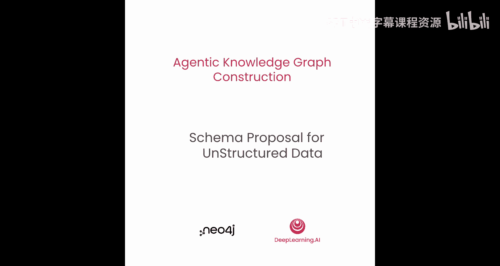
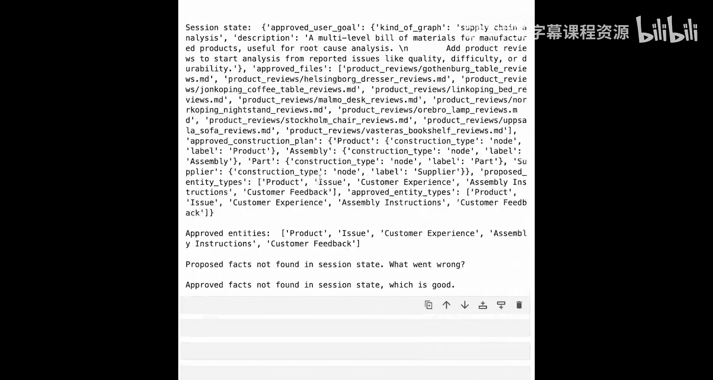
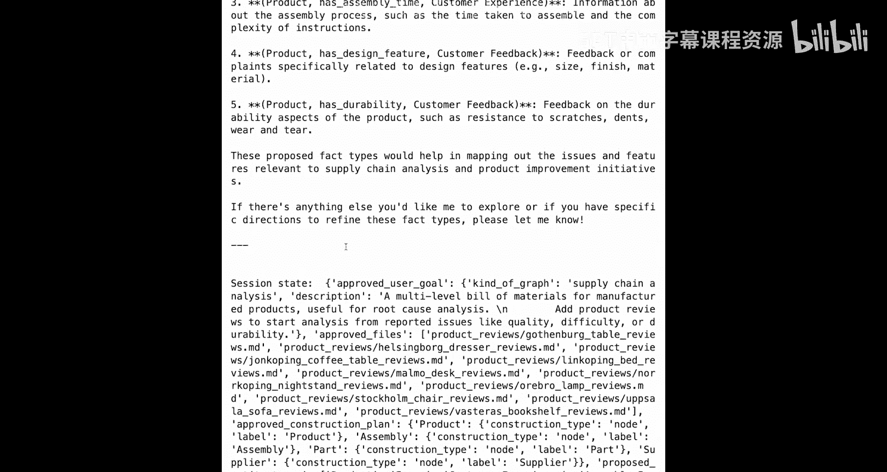
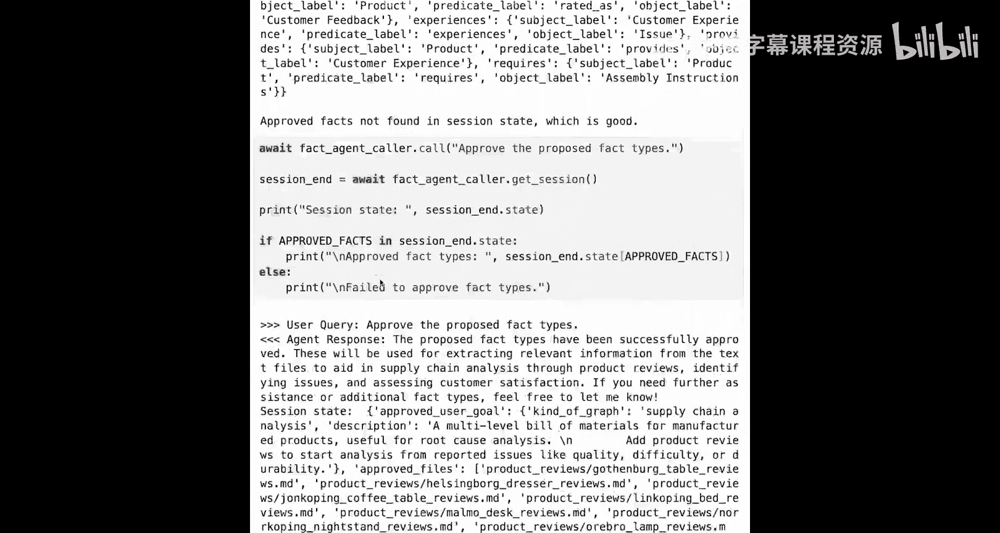
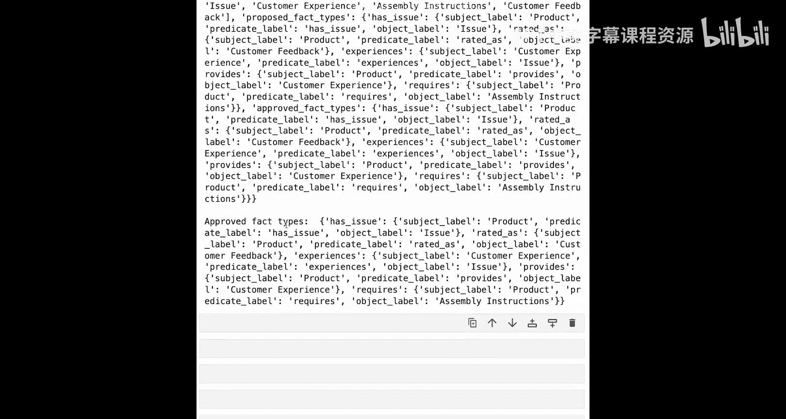

# 009：为非结构化数据设计模式提案 🧠

在本节课中，我们将学习如何为来自Markdown文件的非结构化数据设计知识图谱的构建模式。我们将创建两个专门的智能体来完成这项任务。

## 概述

上一节我们完成了从结构化数据（CSV文件）构建知识图谱的完整工作流。本节中，我们将转向处理非结构化数据的工作流。虽然起始步骤相似，但核心在于引入新的概念：**实体与事实类型提案智能体**。

这个智能体本身由两个专门的子智能体构成：
*   **命名实体识别（NER）模式智能体**
*   **事实类型提取智能体**

请注意，这些智能体的输出是**如何执行知识提取的计划**，而不是执行提取本身。

## 命名实体识别（NER）智能体 🏷️

首先，我们将定义命名实体识别智能体。命名实体识别是一项常见的自然语言处理任务，而大语言模型在此类语言任务上表现出色。

### 智能体指令定义

我们将从定义智能体的指令开始，并将其分解为几个部分组合在一起。

**角色与目标**
首先，定义智能体的角色和目标。这里，我们将其描述为专为自然语言处理设计的顶级算法。其目标是在文本中查找命名实体，但**不实际提取这些实体**。目标是识别存在哪些类型的实体。

**提示与规则**
接着，为智能体提供更多提示，明确我们寻找的目标。我们将描述什么是实体，并将其分为两类：
1.  **已知实体**：这些实体存在于上一课已定义的结构化数据中。如果这些实体出现在文本中，我们也希望提取文本中的相应部分。
2.  **发现实体**：这些实体可能不存在于已描述的图数据中，但可能与用户目标相关。如果它们频繁出现，则可能是有用的信息。

然后，提供更多关于如何识别已知实体和发现实体的设计规则，并像往常一样，提供几个示例来帮助智能体理解其目的。

**思维链指引**
指令的最后部分是思维链指引。这里我们将精确描述如何准备执行当前任务（即识别这些实体）。以下是它需要使用的工具来了解对其的期望：
*   给予完整上下文。
*   以下是建议的执行步骤序列：它知道有哪些文件可用，拥有`sampling_file`工具。因此，使用该工具查看一些文件，发现并同时考虑已知实体和频繁提到的新实体。然后，汇总它认为合适的所有实体列表，并使用`propose_entities`工具提交该列表。
*   和之前一样，将返回给用户确认。然后会有一个单独的工具（此处称为`approve_proposed_entities`）来实际进行批准。

最后，将所有部分组合成一个字符串，这将作为我们命名实体识别智能体的指令。

### 工具定义

指令定义好后，接下来提供工具本身的定义。这些工具将遵循我们在前几课中使用的相同模式。

**实体提案与批准工具**
我们将要求智能体首先提出一些建议，然后使用其他工具将这些建议转化为已批准的版本。因此，这里我们提议的是一个首先被提出、然后被批准的实体列表。当然，你也可以获取这些提案或批准。

**已知类型获取工具**
下一个需要的工具略有不同。它将是一个获取器工具，用于从上一课结构化数据提出的模式中获取已知类型。`well_known_types`工具最终将使用上一课提出的模式中为节点定义的标签。我们将从构建计划中提取它们，然后将其作为列表返回。

我们将导入在前几课中预定义的工具以及此处新增的工具。和之前一样，可以将它们组合成一个列表，作为智能体定义的一部分。

### 查看示例数据

为了了解智能体将处理的内容，可以直接在其中一个可用文件上调用`sample_file`函数并查看其内容。

查看这个Markdown文件，可以看到这是一系列Markdown格式的评论。它有标题，包含一些嵌入的值，如评分。可以看到用户名、位置，当然还有评论本身的文本。文件中只有少量评论，但足以演示其工作原理。

### 构建并运行智能体

现在，指令已定义，工具已定义，我们可以构建智能体本身了。

由于它是较长工作流的一部分，运行此智能体时需要对状态中已累积的内容有一些假设。因此，我们必须创建一个初始状态来测试此智能体。

初始状态需要包含以下几项：
*   已批准的用户目标
*   已批准的文件（此处是它将查看的Markdown文件）
*   构建计划（用于那些已知实体类型）

注意，我们省略了关系构建，因为此步骤不需要。

现在可以运行智能体了。我们将使用辅助模块中的`make_agent_call`，并发送一个简单的请求。基本上就是告诉它：“智能体，你能完成你的工作吗？将一些产品评论添加到知识图谱中，通过制造流程追踪产品投诉。”

智能体完成后，我们会查看会话状态，确保它确实提出了建议，并且希望它没有自动批准，而是在等待我们确认。

运行需要几分钟，因为智能体会去查看几个不同的文件，并尝试提出它认为最适合用于实体的标签集。

如果结果良好，智能体不仅会给出好的响应，还会正确更新会话状态（内存）。我们会看到`proposed_entities`，但还没有`approved_entities`。

如果结果令人满意，可以向同一智能体发送新消息：“我批准那些提议的实体。”完成后，我们应该会发现它确实将提议的实体转移到了已批准的实体中，并能在会话状态中看到。

## 事实类型提取智能体 🔍

接下来，我们将转向第二个智能体：事实类型提取子智能体。

顾名思义，与上一个智能体类似，我们将寻找可以提取的事物的类型，而不是进行提取本身。

### 智能体指令定义

同样，我们从指令开始，因为这是这两个智能体中最重要的部分。

**角色与目标**
对于此智能体，角色和目标方面，我们再次将其描述为顶级算法，将进行一些文本分析。但这里的目标略有不同：它将寻找**可以提取的事实类型**，不要实际提取那些事实，只找出可能的事实类型。

**提示与规则**
为了帮助智能体理解我们真正讨论的内容，我们将提供一些提示。重要的一点是：**不要提议具体的个别事实，而是提议与用户目标相关的一般事实类型**。举例说明总是一个好主意。例如：不要提议“ABK喜欢咖啡”，而是提议“人喜欢饮料”这种一般类型的事实。

这些构成了非常简单的句子，我们称之为**三元组**，形式为`（主语，谓语，宾语）`。注意这里我们用了括号，这是一种经典做法。我们将观察智能体是否实际采用这种格式并在响应中返回。

我们为其提供一些关于如何思考此问题、寻找什么以及如何使用工具的附加设计规则。

**与上一个智能体的区别**
与上一个智能体略有不同。上一个智能体有一个完整的提议实体类型列表；而这里，对于每个单独的事实，我们将**一次添加一个**作为单独的事实，而不是“这里是我们将要提议的事实集合”。这是一个细微的差别。其重要性最终体现在智能体的行为方式以及令牌的实际成本上：往返次数越多，成本会稍高一些。但如果能获得更好的结果，这可能是一个值得的权衡。

**思维链指引**
最后，添加思维链指引。和之前一样，我们将遵循这些指引的相同模式：描述如何准备任务，以及实际执行此任务的建议逐步方法。以这种方式使用工具，对部分文件进行采样，寻找与文本相关的主语和宾语，然后添加关于这些主语和宾语的提议事实。最终得到的结果应该是几个小的三词句子。

然后，将所有内容组合成一个字符串。

### 工具定义

现在，我们将花更多时间查看事实类型提取智能体的工具定义。这是因为它在此过程中进行了一些合理性检查，而这正是将这些功能分离到不同智能体的意图之一。

在上一个智能体（命名实体识别智能体）中，我们给出了一些关于如何寻找实体的指导，但对其发现的内容没有太多限制。在这里，我们将非常具体：它提议的事实**必须与先前智能体定义的现有实体类型相匹配**。以这种方式拆分，能更好地保证我们得到的事实能与想要的实体类型对应。

**添加提议事实的工具**
查看`add_proposed_fact`的定义，我们看到通过参数名称传递的是：一个现有的已批准主语标签、一个提议的谓语标签，然后是一个已批准的宾语标签。这再次构成了三元组的形式。

然而，这些三元组中的主语和宾语都应该已经存在于上一个智能体的结果中。因此，我们将围绕此设置一些防护措施：我们将从状态中获取`approved_entities`，并确保作为参数传入的已批准主语和宾语标签都在该列表中。如果不在，我们将从此工具调用中抛出错误，并告知该标签不存在，应该重试。

我们在此逐条处理的部分原因是为了能够逐条对智能体的行为进行一些纠正。

如果一切正常，我们会重新整理这个三元组，将其保存到当前谓词列表中，并从中创建一个事实列表。

**其他工具**
这里的另外两个函数只是遵循通常的模式：获取提议事实的列表，然后将提议的事实批准到已批准的事实列表中。

然后，可以将该工具列表放在一起，供事实智能体使用，现在我们可以继续构建它。

### 构建并运行智能体

构建智能体，由于我们已经完成了定义所有内容的艰苦工作，所以相当简单。现在可以继续运行它。

此智能体的初始状态与上一个智能体的初始状态相同，因此我们将利用这一点，直接复制上一个智能体的最终状态作为此智能体的初始状态。在完整的多智能体系统中，它们将按顺序运行，并以这种方式共享状态。

但为了单独运行它们，我们将复制状态，然后调用智能体。

用于启动的消息是要求它继续并提出一些建议。

智能体完成所有事实提议后，我们将查看会话状态。我们假设它已提出建议，然后检查是否尚未批准该建议。

如果一切顺利，我们将看到它提出的建议。然后，可以发送另一条消息批准该提议，这应该会将提议的事实类型转移到已批准的事实类型中。查看会话状态，我们会在末尾看到`approved_fact_types`。

## 总结

本节课中，我们一起学习了如何为来自非结构化数据（Markdown文件）的知识图谱构建设计模式。我们定义并运行了两个专门的子智能体：

1.  **命名实体识别（NER）智能体**：负责分析文本，识别并提议与用户目标相关的实体类型（如“产品”、“问题”）。
2.  **事实类型提取智能体**：在实体类型的基础上，分析文本中关于这些实体的陈述，提议可能的事实三元组类型（如“（产品，有，问题）”）。

这两个智能体协同工作，共同输出一个**提取计划**，为后续从非结构化文本中实际提取知识图谱的节点和关系奠定了基础。通过这种模块化的设计，我们可以更精细地控制提取逻辑，并确保实体与事实之间的对应关系。