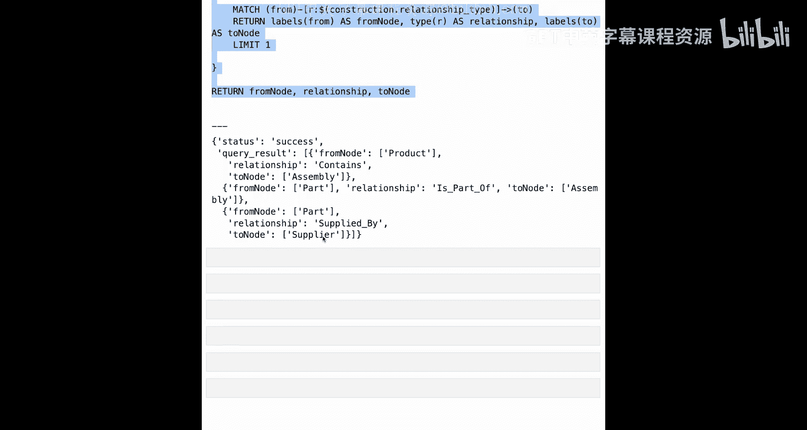

# 010：知识图谱构建 - 第一部分


在本节课中，我们将学习如何根据之前制定的详细计划，构建一个具体的知识图谱。我们将定义并实现一系列工具，这些工具将按照智能体工作流指定的计划，执行从CSV文件加载数据到Neo4j图数据库中的机械过程。

## 概述

上一节我们完成了知识图谱构建计划的制定。本节我们将深入探讨构建计划的具体执行工具。我们将创建一个名为“构建领域图”的核心工具，它由一系列具有特定职责的辅助函数组成，用于处理数据导入、约束创建和关系建立等任务。

## 工具定义与实现

以下是构建领域图所需的一系列工具，我们将逐一介绍。

### 1. 创建唯一性约束

在开始导入数据之前，我们需要为数据库做好准备。第一步是确保为每个节点类型创建唯一性约束。这对应于CSV文件中具有唯一ID列的情况。

**代码实现：**
```python
def create_uniqueness_constraint(label, unique_property_key):
    constraint_name = f"constraint_{label}_{unique_property_key}"
    query = f"""
    CREATE CONSTRAINT {constraint_name} IF NOT EXISTS
    FOR (n:`{label}`)
    REQUIRE n.{unique_property_key} IS UNIQUE
    """
    # 注意：此处使用了字符串拼接，在生产环境中应对输入进行净化处理
    neo4j_query(query)
```

此函数接收节点标签和唯一属性键作为参数，并在Neo4j中创建相应的唯一性约束。由于Neo4j的约束创建语法不支持查询参数化，这里使用了字符串拼接，实际应用中应添加输入净化逻辑。

### 2. 从CSV文件加载节点

定义了约束后，我们需要能够从CSV文件加载节点数据。

**代码实现：**
```python
def load_nodes_from_csv(source_file, label, unique_column, property_list):
    query = """
    LOAD CSV WITH HEADERS FROM $file_url AS row
    CALL {
        WITH row
        MERGE (n:`{label}` {`{unique_column}`: row.`{unique_column}`})
        WITH n, row
        UNWIND $properties AS prop
        SET n[prop] = row[prop]
    } IN TRANSACTIONS OF 1000 ROWS
    """
    # 构建完整的文件URL（相对于Neo4j的import目录）
    file_url = f"file:///{source_file}"
    params = {
        "file_url": file_url,
        "label": label,
        "unique_column": unique_column,
        "properties": property_list
    }
    neo4j_query(query, params)
```

此函数使用Neo4j的`LOAD CSV`语法从指定文件加载数据。它通过`MERGE`子句确保节点的唯一性，并使用`UNWIND`循环为节点设置所有指定的属性。整个过程以每1000行为一个批次进行，以处理大型文件。

### 3. 导入节点

对于每个CSV文件，我们需要按顺序调用上述两个函数：先创建唯一性约束，然后加载节点。

**代码实现：**
```python
def import_nodes(construction_rule):
    # 1. 创建唯一性约束
    create_uniqueness_constraint(
        label=construction_rule['label'],
        unique_property_key=construction_rule['unique_column']
    )
    # 2. 从CSV加载节点
    load_nodes_from_csv(
        source_file=construction_rule['source_file'],
        label=construction_rule['label'],
        unique_column=construction_rule['unique_column'],
        property_list=construction_rule['property_list']
    )
```

此函数封装了节点导入的完整流程，直接从构建计划规则中提取所需参数。

### 4. 从CSV文件加载关系

节点导入完成后，我们可以开始建立节点之间的关系。关系本身不需要唯一性约束，其唯一性由两端的节点保证。

**代码实现：**
```python
def load_relationships_from_csv(source_file, rel_type, from_label, from_column, to_label, to_column, property_list):
    query = """
    LOAD CSV WITH HEADERS FROM $file_url AS row
    CALL {
        WITH row
        MATCH (from_node:`{from_label}` {`{from_column}`: row.`{from_column}`})
        MATCH (to_node:`{to_label}` {`{to_column}`: row.`{to_column}`})
        MERGE (from_node)-[r:`{rel_type}`]->(to_node)
        WITH r, row
        UNWIND $properties AS prop
        SET r[prop] = row[prop]
    } IN TRANSACTIONS OF 1000 ROWS
    """
    file_url = f"file:///{source_file}"
    params = {
        "file_url": file_url,
        "rel_type": rel_type,
        "from_label": from_label,
        "from_column": from_column,
        "to_label": to_label,
        "to_column": to_column,
        "properties": property_list
    }
    neo4j_query(query, params)
```

此函数首先匹配CSV行中指定的“起始”节点和“目标”节点，然后使用`MERGE`创建它们之间的指定类型的关系。如果关系已存在，`MERGE`不会重复创建。同样，它也支持为关系设置属性。

### 5. 构建主图

最后，我们将所有工具整合到一个主函数中，它接收完整的构建计划，并确保以正确的顺序执行：先导入所有节点，再创建所有关系。

**代码实现：**
```python
def construct_main_graph(construction_plan):
    # 第一阶段：导入所有节点
    for rule in construction_plan:
        if rule['construction_type'] == 'node':
            import_nodes(rule)
    # 第二阶段：创建所有关系
    for rule in construction_plan:
        if rule['construction_type'] == 'relationship':
            load_relationships_from_csv(
                source_file=rule['source_file'],
                rel_type=rule['relationship_type'],
                from_label=rule['from_label'],
                from_column=rule['from_column'],
                to_label=rule['to_label'],
                to_column=rule['to_column'],
                property_list=rule.get('property_list', [])
            )
```

## 执行与验证

工具定义完成后，我们可以使用一个具体的构建计划来运行`construct_main_graph`函数。假设我们有以下构建计划（具体内容取决于之前智能体的决策）：

```python
construction_plan = [
    # 节点构建规则示例
    {'construction_type': 'node', 'label': 'Product', 'source_file': 'products.csv', ...},
    {'construction_type': 'node', 'label': 'Part', 'source_file': 'parts.csv', ...},
    # 关系构建规则示例
    {'construction_type': 'relationship', 'relationship_type': 'CONTAINS', 'from_label': 'Product', 'to_label': 'Assembly', ...},
    {'construction_type': 'relationship', 'relationship_type': 'PART_OF', 'from_label': 'Part', 'to_label': 'Assembly', ...},
    {'construction_type': 'relationship', 'relationship_type': 'SUPPLIED_BY', 'from_label': 'Part', 'to_label': 'Supplier', ...},
]
```

运行`construct_main_graph(construction_plan)`后，为了验证图谱是否按预期构建，我们可以执行一个Cypher查询来采样检查每种关系类型是否至少存在一个实例。

**验证查询：**
```cypher
// 提取所有关系构建规则中的关系类型
WITH $construction_rules AS rules
UNWIND rules AS rule
// 对每种关系类型，在图中查找一个匹配的模式
CALL {
    WITH rule
    MATCH (from_node)-[r]->(to_node)
    WHERE type(r) = rule.relationship_type
    RETURN labels(from_node) AS from_labels, type(r) AS rel_type, labels(to_node) AS to_labels
    LIMIT 1
}
RETURN from_labels, rel_type, to_labels
```

执行此查询后，如果输出包含如 `(['Product'], 'CONTAINS', ['Assembly'])`、`(['Part'], 'PART_OF', ['Assembly'])` 和 `(['Part'], 'SUPPLIED_BY', ['Supplier'])` 这样的结果，则证明图谱已成功按照构建计划创建。

## 总结




本节课中，我们一起学习了知识图谱构建工具的具体实现。我们定义了一系列工具函数，包括创建数据库约束、从CSV文件导入节点和关系，并将它们整合到一个主构建函数中。通过执行构建计划并运行验证查询，我们确认了知识图谱已根据规范成功构建。这个过程展示了如何将高级的构建计划转化为可执行的数据导入操作，是智能体工作流中关键的执行步骤。