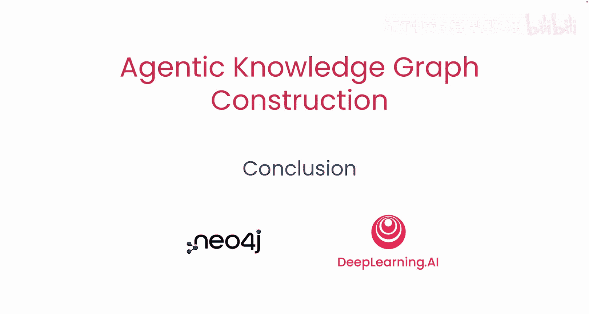

# 012：结论

在本节课中，我们将回顾并总结整个课程的核心内容，了解如何构建一个多智能体系统来将结构化与非结构化数据转化为知识图谱。

---

## 课程概述

在本课程中，我们学习了如何构建一个多智能体系统，该系统能够将您的结构化与非结构化数据转化为知识图谱。

## 核心学习内容回顾

上一节我们介绍了系统的整体流程，本节中我们来总结构建过程中的关键环节。

以下是构建多智能体系统的核心步骤：

1.  **设置系统中的每个专用智能体**：您学习了如何为系统中的每个智能体进行配置。
2.  **设计提示词与定义工具**：您学习了应使用何种提示词，以及如何定义和分配工具给各个智能体。
3.  **在智能体间共享上下文**：您学习了如何在不同的智能体之间有效地共享和传递上下文信息。

## 总结

本节课中，我们一起学习了构建一个用于知识图谱生成的多智能体系统的完整流程。从设置专用智能体、设计提示词与工具，到实现智能体间的上下文共享，您已经掌握了将各类数据转化为结构化知识图谱的关键技术。

恭喜您完成本课程，期待看到您运用所学知识构建出自己的项目。