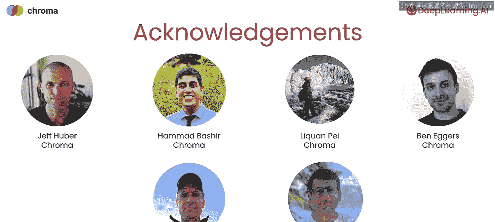

# 001：课程介绍 🎬

在本节课中，我们将对《AI高级检索：Chroma》课程进行概述，了解检索增强生成（RAG）的基本概念、当前简单检索方法的局限性，以及本课程将要探讨的先进技术。

---

检索增强生成（RAG）通过检索相关文档来为大型语言模型（LLM）提供上下文。这使得LLM在回答查询和执行任务时表现更佳。

目前，许多团队使用基于语义相似度或嵌入向量的简单检索技术。但在本课程中，你将学习更复杂的技术，这些技术能带来远优于简单检索的效果。

## RAG的常见工作流程 🔄

上一段我们介绍了RAG的基本概念，本节中我们来看看一个典型的工作流程。

一个常见的RAG工作流程是：获取用户查询并将其转换为嵌入向量，然后在向量数据库中查找具有最相似嵌入向量的文档，这些文档即为提供的上下文。

## 简单检索的局限性 ⚠️

然而，上述方法存在一个问题：它倾向于找到与查询主题相似、但未必真正包含答案的文档。

## 先进的查询改进技术 🛠️

为了解决上述局限性，我们可以对初始用户查询进行改写，这被称为**查询扩展**。改写查询的目的是为了直接检索到更相关的文档。

以下是两种关键的查询扩展技术：

1.  **查询多路扩展**：将原始查询通过不同方式的措辞或重写，扩展成多个查询。
2.  **假设文档生成**：甚至可以先猜测一个假设性的答案雏形，然后尝试在文档集合中寻找与这个“答案”更相似的文本，而不仅仅是寻找与查询主题一般性相关的文档。

## 讲师介绍 👨‍🏫

本课程由Anton Troynikov担任讲师。Anton是推动AI应用检索技术前沿的创新者之一，也是流行开源向量数据库Chroma的联合创始人。如果你学习过由Harrison Chase讲授的LangChain短期课程，那么很可能已经使用过Chroma。

Anton表示，他非常高兴能共同讲授这门课程，并分享他在实际RAG部署中观察到的有效与无效经验。

## 课程内容大纲 📚

接下来，我们简要了解一下本课程的内容安排。

课程首先快速回顾RAG应用。接着，你将了解简单向量搜索在检索中表现不佳的一些常见缺陷。然后，你将学习多种改进检索结果的方法。

正如Andrew所提到的，第一种方法是使用LLM来改进查询本身。另一种方法借助**交叉编码器**来对查询结果进行重新排序，交叉编码器接收一对句子并生成相关性分数。

你还将学习如何根据用户反馈调整查询嵌入向量，以产生更相关的结果。

目前RAG领域创新不断。因此，在最后一课中，我们还将概述一些尚未成为主流、刚刚出现在研究中的前沿技术。我们认为这些技术很快就会变得更加普及。

## 致谢 🙏

我们感谢为这门课程做出贡献的Chroma团队成员，以及Chroma的开源开发者社区。同时也感谢深度学习团队的成员。

---

本节课中我们一起学习了RAG的基本概念、简单检索的局限性，以及本课程将涵盖的先进检索技术，如查询扩展和重新排序。第一课将从RAG概述开始。掌握这些技术后，即使是规模较小的团队也能构建出高效的AI系统。希望学完本课程后，你能运用这些曾被视作“非主流”的方法，构建出真正出色的应用。