# 002：基于嵌入的检索系统概述 🧠

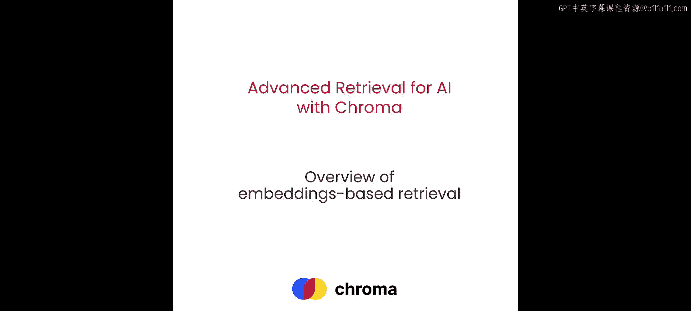

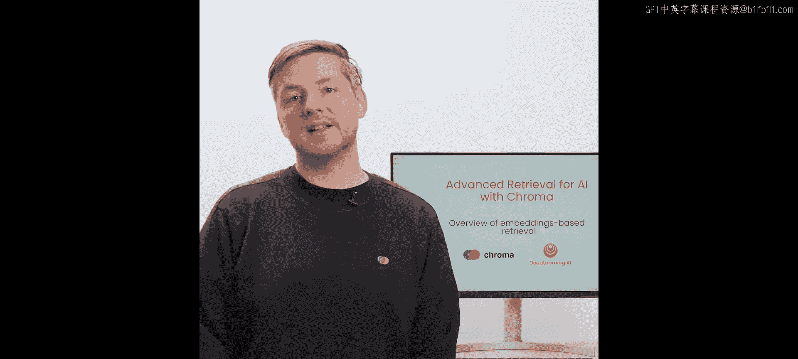

在本节课中，我们将学习基于嵌入的检索系统的基本构成，以及它如何与大型语言模型结合，形成一个完整的检索增强生成工作流。

## 系统总览

上一节我们介绍了课程目标，本节中我们来看看整个系统是如何运作的。检索增强生成的工作流程如下：用户输入一个查询，系统会从预先嵌入并存储在检索系统中的文档集合中寻找相关信息。在本例中，我们使用Chroma作为检索系统。

以下是其核心步骤：
1.  用户查询进入系统。
2.  查询通过一个嵌入模型进行处理，该模型与用于嵌入文档的模型相同，从而生成查询的嵌入向量。
3.  检索系统根据查询的嵌入向量，通过寻找最邻近的文档嵌入向量，来查找最相关的文档。
4.  系统将查询和检索到的相关文档一并提供给LLM。
5.  LLM综合检索到的文档信息，生成最终答案。

## 实践：处理文档

现在，让我们看看如何在实践中实现上述流程。首先，我们需要导入一些辅助函数。

```python
# 这是一个基础的文本换行函数，用于美观地打印文档内容。
def wrap_text(text):
    # 实现文本换行逻辑
    pass
```

我们将以一个PDF文件为例进行演示。这里使用一个简单的开源Python包来读取PDF文件。

```python
from pdf_reader import PDFReader

# 读取微软2022年年度报告
reader = PDFReader('microsoft_annual_report_2022.pdf')
pdf_texts = []
for page in reader.pages:
    text = page.extract_text().strip()
    if text:  # 过滤掉空字符串，确保不向检索系统发送空页面
        pdf_texts.append(text)

# 打印第一页提取的文本作为示例
print(pdf_texts[0])
```

## 文本分块策略

处理完文档后，下一步是对文本进行分块。我们首先按字符进行分块。

我们将使用LangChain中的文本分割工具，具体是`RecursiveCharacterTextSplitter`。这个分割器会递归地根据特定分隔符（如双换行符）来分割文本。如果分割后的块仍然大于目标大小（这里设为1000个字符），它会继续使用下一个分隔符进行分割，直到按字符边界分割。

```python
from langchain.text_splitter import RecursiveCharacterTextSplitter

char_splitter = RecursiveCharacterTextSplitter(
    chunk_size=1000,
    chunk_overlap=0,  # 块之间不重叠，这是一个可以调整的超参数
    separators=["\n\n", "\n", " ", ""]
)
char_chunks = char_splitter.split_text("\n".join(pdf_texts))

print(f"字符分割器共生成 {len(char_chunks)} 个块。")
print("第10个文本块示例：", char_chunks[9])
```

然而，仅按字符分割还不够。因为我们使用的嵌入模型（Sentence Transformers）有有限的上下文窗口长度（256个标记）。如果文本块超过这个长度，模型会直接截断超出的部分，导致信息丢失。

因此，我们还需要按标记数量进行分块。这里使用`SentenceTransformersTokenTextSplitter`。

```python
from langchain.text_splitter import SentenceTransformersTokenTextSplitter

token_splitter = SentenceTransformersTokenTextSplitter(
    chunk_size=256,  # 与嵌入模型的上下文窗口长度一致
    chunk_overlap=0
)
# 对字符分割后的块进行再次分割
final_chunks = []
for chunk in char_chunks:
    final_chunks.extend(token_splitter.split_text(chunk))

print(f"标记分割器共生成 {len(final_chunks)} 个块。")
print("第10个文本块示例：", final_chunks[9])
```

## 嵌入模型与向量化

文本分块完成后，下一步是将这些块加载到检索系统中。我们使用Chroma，并需要为其配置一个嵌入模型。

我们使用Sentence Transformers作为嵌入模型。它是BERT架构的扩展，能够将整个句子或小文档（如我们的文本块）编码成一个单一的密集向量，而不是为每个标记单独生成向量。

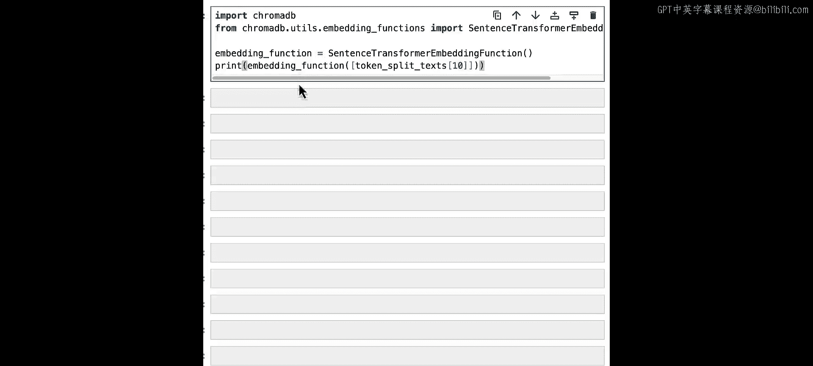

```python
import chromadb
from chromadb.utils import embedding_functions

# 创建Sentence Transformers嵌入函数
sentence_transformer_ef = embedding_functions.SentenceTransformerEmbeddingFunction(model_name="all-MiniLM-L6-v2")

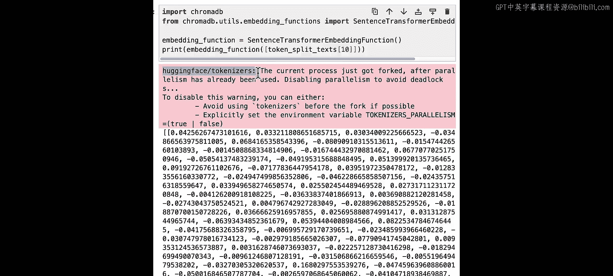

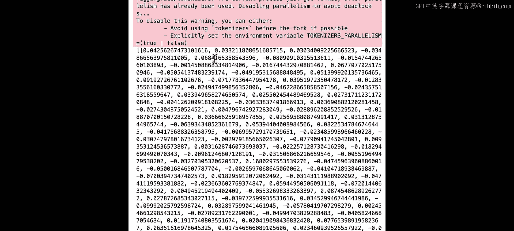

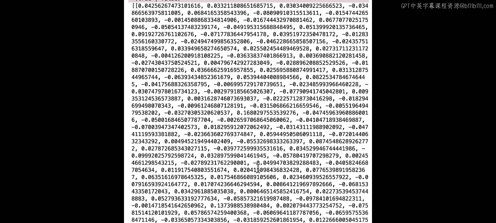

# 演示嵌入函数如何工作：将第10个文本块转换为向量
sample_embedding = sentence_transformer_ef([final_chunks[9]])
print(f"嵌入向量维度：{len(sample_embedding[0])}")
print("向量示例（前10个值）：", sample_embedding[0][:10])
```

这个向量有384个维度，它密集地表示了文本块的语义信息。

## 构建检索系统

现在，我们使用Chroma来建立检索系统。

```python
# 创建Chroma客户端和集合
chroma_client = chromadb.Client()
collection = chroma_client.create_collection(
    name="microsoft_annual_report_2022",
    embedding_function=sentence_transformer_ef
)

# 为每个文本块创建ID（这里用其序号）
ids = [str(i) for i in range(len(final_chunks))]
# 将文档添加到集合中
collection.add(
    documents=final_chunks,
    ids=ids
)

print(f"集合中文档数量：{collection.count()}")
```

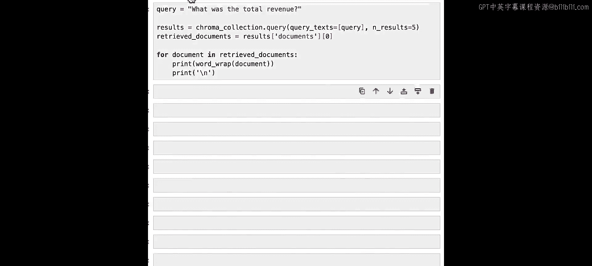

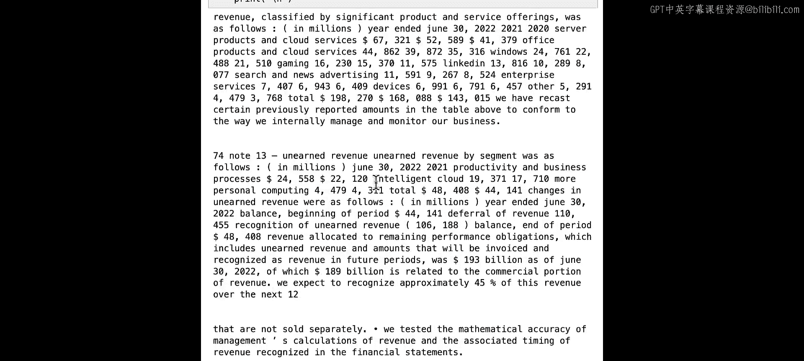

## 执行查询与RAG流程

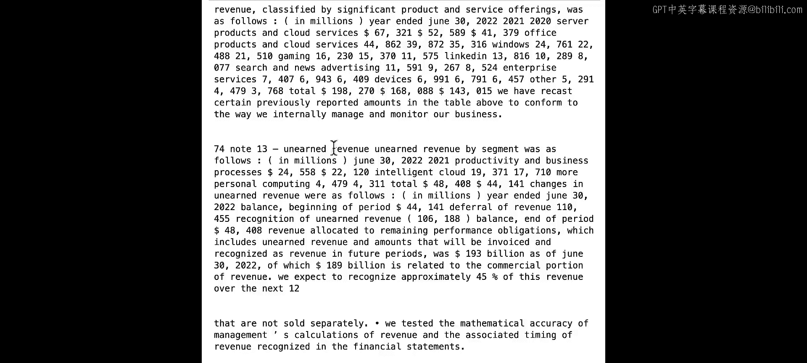

系统搭建好后，让我们连接一个LLM，构建完整的RAG系统来回答查询。

首先，我们提出一个简单的问题：“What was the total revenue for this year?”，并从Chroma中检索相关文档。

```python
query = "What was the total revenue for this year?"
results = collection.query(
    query_texts=[query],
    n_results=5  # 返回最相关的5个文档
)
retrieved_docs = results['documents'][0]  # 获取第一个查询的检索结果

print("检索到的相关文档：")
for i, doc in enumerate(retrieved_docs):
    print(f"\n--- 文档 {i+1} ---")
    print(doc[:500])  # 打印前500个字符
```

接下来，我们将检索到的文档和原始查询一起发送给LLM（这里使用GPT-3.5-turbo），让它生成答案。

```python
import openai
import os

# 设置OpenAI客户端
openai.api_key = os.getenv("OPENAI_API_KEY")

def rag_answer(query, retrieved_docs):
    # 将检索到的文档合并为一个字符串
    information = "\n\n".join(retrieved_docs)

    # 构建消息
    messages = [
        {
            "role": "system",
            "content": "你是一个专业的财务研究助手。用户正在询问一份年度报告中的信息。你将看到用户的问题和来自年度报告的相关信息。请仅使用这些信息来回答用户的问题。"
        },
        {
            "role": "user",
            "content": f"问题：{query}\n\n请根据以下信息回答：\n{information}"
        }
    ]

    # 调用OpenAI API
    response = openai.ChatCompletion.create(
        model="gpt-3.5-turbo",
        messages=messages,
        temperature=0
    )
    return response.choices[0].message.content

# 获取最终答案
answer = rag_answer(query, retrieved_docs)
print("LLM生成的答案：")
print(answer)
```

运行后，我们可能会得到类似“截至2022年6月30日财年，微软的总收入为1982.7亿美元”的答案。

## 总结与探索

本节课中，我们一起学习了基于嵌入的检索增强生成系统的基本构建流程。我们从处理PDF文档开始，经历了文本分块、嵌入向量化、构建Chroma检索库，到最终结合LLM生成答案的全过程。

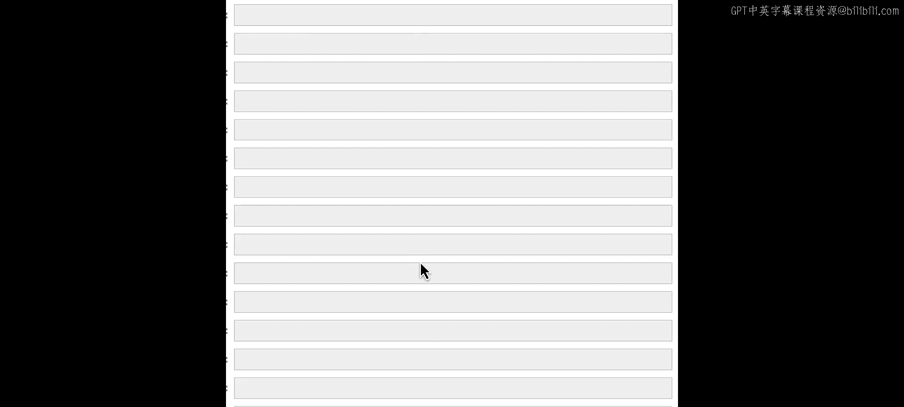

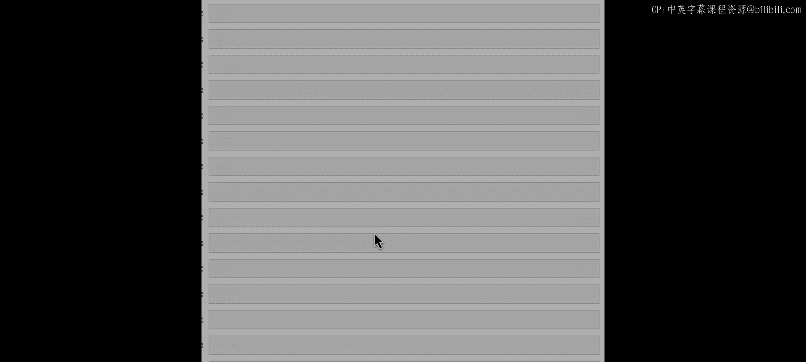

核心在于，RAG将LLM从依赖记忆事实的模型，转变为一个能够处理并综合外部信息的处理器。在进入下一节深入分析系统细节之前，建议你尝试提出自己的问题，与这个检索系统互动，直观感受模型和检索器协同工作的能力与局限。