# 003：检索的陷阱 - 当简单的向量搜索失效！🔍


在本节课中，我们将学习向量检索的一些陷阱。我们将看到一些案例，在这些案例中，简单的向量搜索不足以让检索为你的AI应用良好工作。仅仅因为内容在特定嵌入模型下的向量语义上接近，并不总是意味着你能直接获得理想的结果。

## 环境设置与数据加载

首先，我们需要设置环境并加载数据。我们将使用Chroma和相应的嵌入函数。

```python
# 导入必要的库并设置嵌入函数
from chromadb.utils import embedding_functions
import chromadb

# 创建嵌入函数
sentence_transformer_ef = embedding_functions.SentenceTransformerEmbeddingFunction(model_name="all-MiniLM-L6-v2")

# 使用辅助函数加载Chroma集合
client = chromadb.PersistentClient(path="./chroma_db")
collection = client.get_collection(name="my_collection", embedding_function=sentence_transformer_ef)

# 输出集合中的向量数量以确认
print(f"集合中的向量数量：{collection.count()}")
```
运行后，确认有349个文本块被嵌入到Chroma中。

## 可视化嵌入空间

为了理解检索结果，将高维嵌入向量可视化非常有帮助。我们将使用UMAP技术将向量投影到二维空间。

UMAP（Uniform Manifold Approximation and Projection）是一个开源库，用于将高维数据降维到二维或三维以便可视化。与PCA不同，UMAP会尽可能保留数据点之间的距离结构。

以下是投影步骤：

```python
import umap
import numpy as np
from tqdm import tqdm

# 从集合中获取所有嵌入向量
all_embeddings = collection.get(include=['embeddings'])['embeddings']
all_embeddings_array = np.array(all_embeddings)

# 拟合UMAP变换模型
umap_transform = umap.UMAP(random_state=0)
umap_transform.fit(all_embeddings_array)

# 定义一个函数来投影嵌入向量
def project_embeddings(embeddings, umap_transform):
    projected = np.empty((len(embeddings), 2))
    for i, emb in enumerate(tqdm(embeddings)):
        projected[i] = umap_transform.transform([emb])
    return projected

# 投影所有数据嵌入
projected_data = project_embeddings(all_embeddings_array, umap_transform)
```

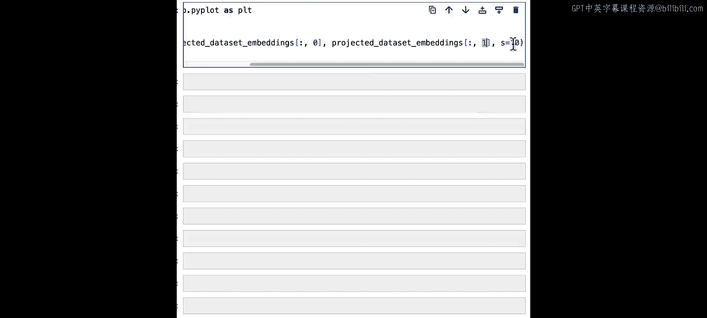

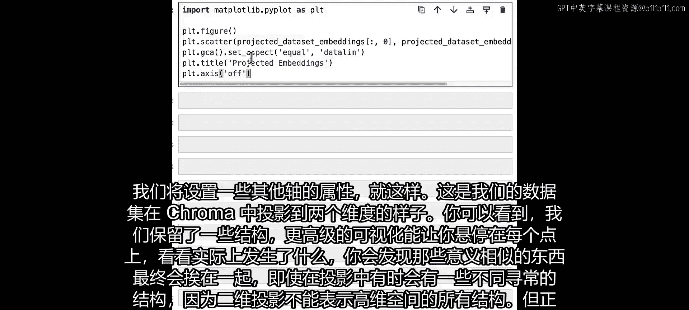

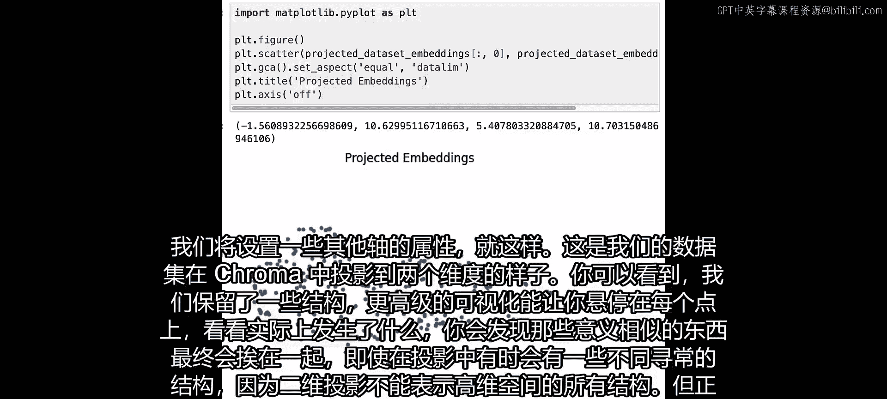

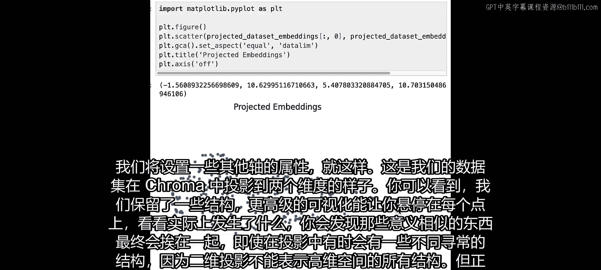

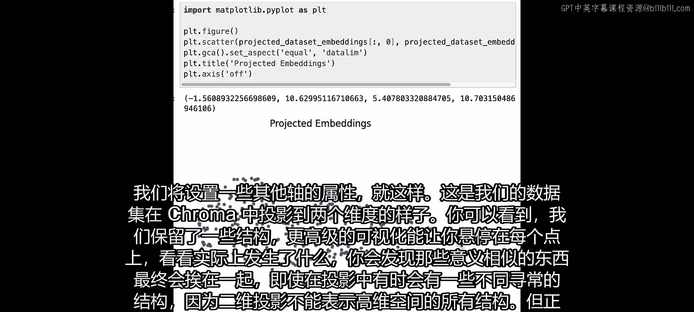

现在，我们可以使用Matplotlib来可视化投影后的数据点。

```python
import matplotlib.pyplot as plt

plt.figure(figsize=(10, 8))
plt.scatter(projected_data[:, 0], projected_data[:, 1], s=10, alpha=0.6)
plt.title("数据嵌入的二维投影")
plt.xlabel("UMAP 维度 1")
plt.ylabel("UMAP 维度 2")
plt.show()
```
这个散点图展示了我们数据在二维空间中的分布。语义相似的内容通常会聚集在一起，尽管二维投影无法完全保留高维空间的所有结构，但它有助于我们形成几何直觉。

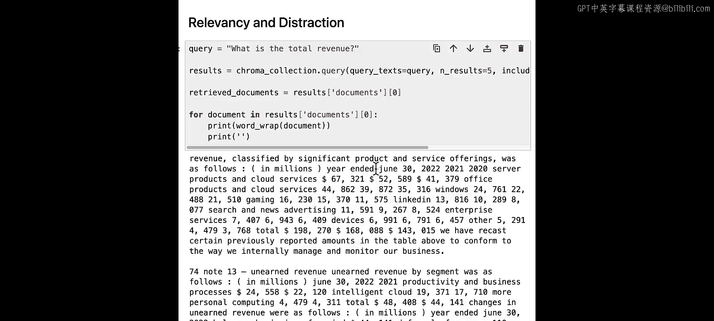

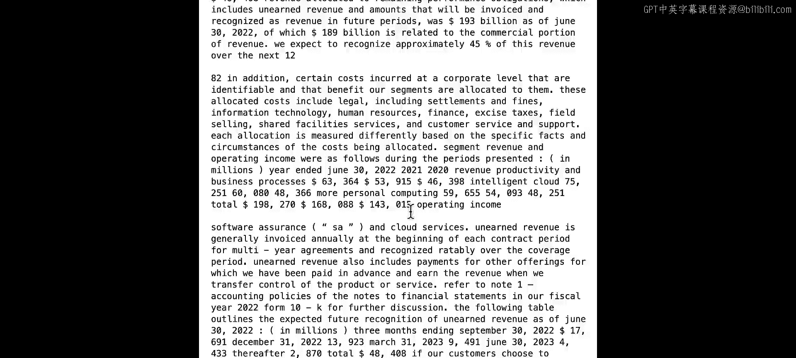


## 分析查询与检索结果

上一节我们可视化了整个数据集。本节中，我们来看看具体的查询及其检索结果，以理解简单向量搜索的局限性。

我们将使用之前的查询“total revenue”进行检索。

```python
# 定义查询
query = "total revenue"

# 使用集合进行查询
results = collection.query(
    query_texts=[query],
    n_results=5,
    include=['documents', 'embeddings']
)

# 提取并打印检索到的文档
retrieved_docs = results['documents'][0]
for i, doc in enumerate(retrieved_docs):
    print(f"结果 {i+1}: {doc[:150]}...")  # 打印前150个字符
```
检索结果可能包含与“收入”相关的文档，但也可能混入一些关于“成本”或其他财务主题的文档，这些是**干扰项**。

接下来，我们将查询和检索到的结果一起可视化，观察它们在嵌入空间中的位置关系。

```python
# 获取查询的嵌入向量
query_embedding = sentence_transformer_ef([query])
# 获取检索结果的嵌入向量
retrieved_embeddings = results['embeddings'][0]

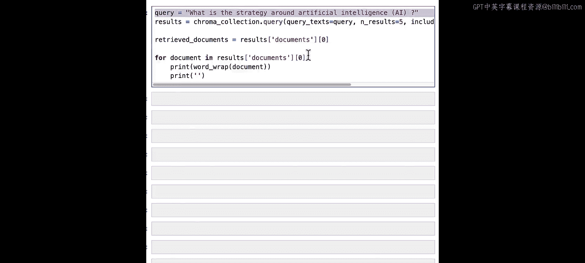


# 投影查询和检索结果的嵌入向量
projected_query = project_embeddings(query_embedding, umap_transform)
projected_retrieved = project_embeddings(retrieved_embeddings, umap_transform)


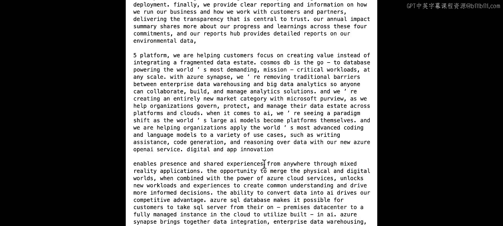

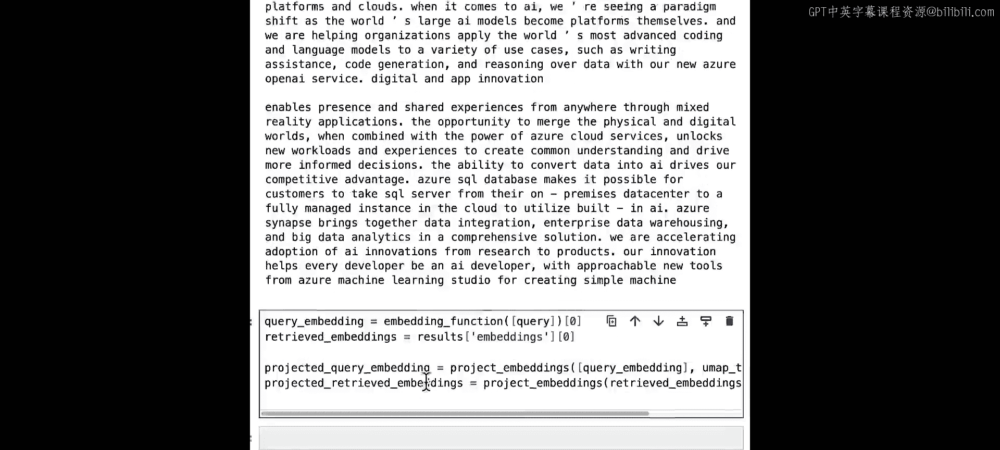

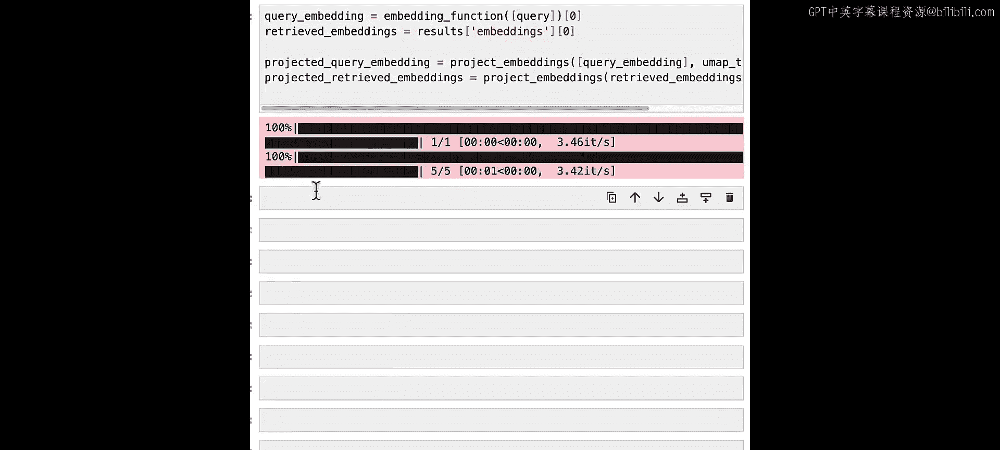

# 可视化
plt.figure(figsize=(10, 8))
# 绘制所有数据点（灰色）
plt.scatter(projected_data[:, 0], projected_data[:, 1], s=10, alpha=0.1, c='gray', label='全部数据')
# 绘制查询点（红色X）
plt.scatter(projected_query[:, 0], projected_query[:, 1], s=200, marker='x', c='red', label='查询')
# 绘制检索结果点（绿色圆圈）
plt.scatter(projected_retrieved[:, 0], projected_retrieved[:, 1], s=100, facecolors='none', edgecolors='green', linewidths=2, label='检索结果')
plt.title(f"查询与检索结果可视化: '{query}'")
plt.xlabel("UMAP 维度 1")
plt.ylabel("UMAP 维度 2")
plt.legend()
plt.show()
```
在图中，红色X代表查询，绿色圆圈代表检索到的文档。你会发现，有些结果点离查询点较远，它们是潜在的干扰项。这是因为嵌入模型是基于通用语义训练的，并不了解我们当前的具体任务（例如，精确查找“总收入”）。

## 探索更多查询案例

为了进一步说明问题，让我们分析其他几个查询。

以下是关于“人工智能战略”的查询示例：

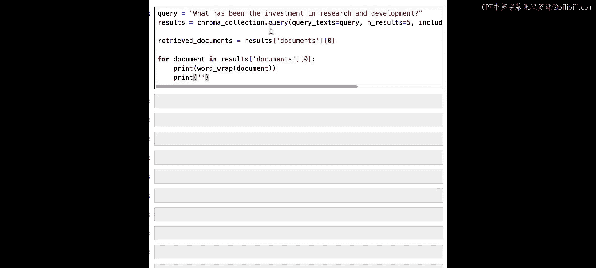

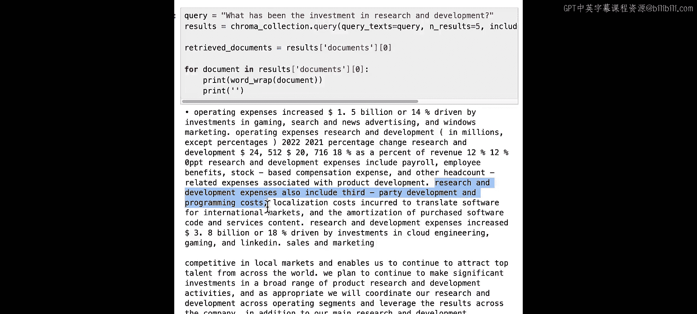


```python
query_ai = "what's the strategy around artificial intelligence that is AI"
# ...（重复上述查询和可视化步骤）
```
结果可能包含与AI相关的文档，但也可能包含关于数据库或元宇宙的文档，这些内容只是与“技术投资”间接相关。

以下是关于“研发投资”的查询示例：


```python
query_rd = "What has been the investment in research and development"
# ...（重复上述查询和可视化步骤）
```
这个通用查询的检索结果可能会更加分散。当一个查询落在数据“云团”之外时，它找到的最近邻可能来自云团的不同部分，因此结果会显得分散，包含更多不相关的干扰项。

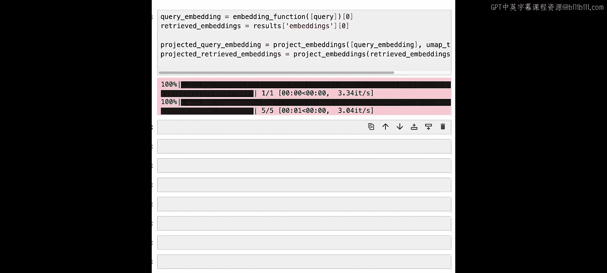

## 处理不相关查询

最后，我们探讨一个完全不相关的查询会带来什么问题。

考虑查询“Michael Jordan近期为微软做了什么”：

```python
query_irrelevant = "what has Michael Jordan done for us lately"
# ...（重复上述查询和可视化步骤）
```
不出所料，检索结果与迈克尔·乔丹毫无关系。但在RAG（检索增强生成）流程中，这些不相关的结果（全部是干扰项）会被提供给大语言模型，导致模型产生混乱或错误的输出，这种现象很难诊断和调试。

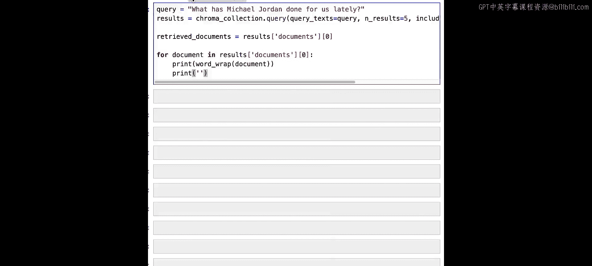

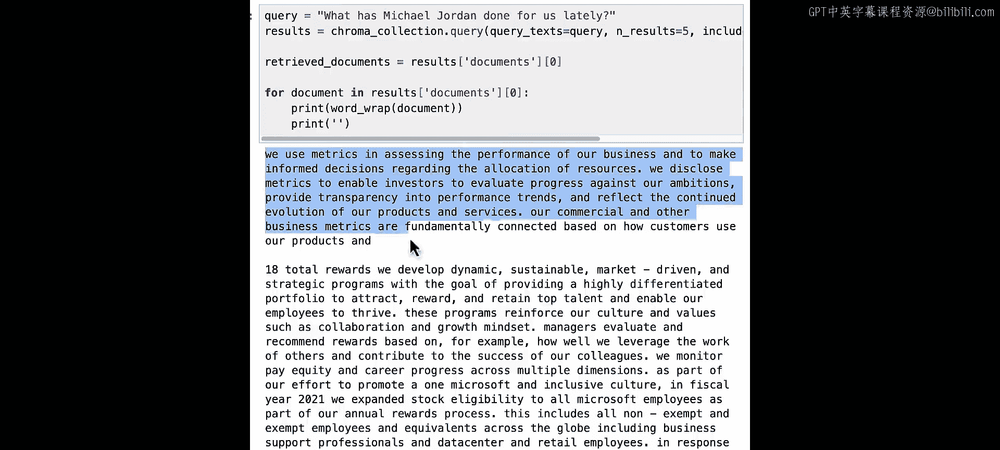

可视化结果显示，这些结果点在空间中非常分散，印证了查询与数据集内容完全不匹配。

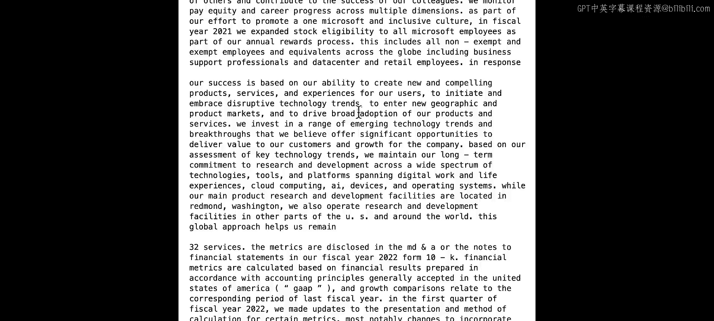

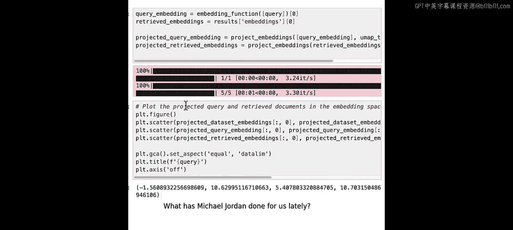

## 总结与下节预告

本节课中，我们一起学习了基于简单向量嵌入的检索系统可能存在的陷阱。我们了解到，即使对于简单的查询，系统也可能返回干扰项或不相关的结果，这主要是因为通用嵌入模型缺乏对特定任务的理解。

我们通过UMAP将高维嵌入空间投影到二维进行可视化，这有助于我们直观地理解查询与数据点的几何关系，以及干扰项产生的原因。

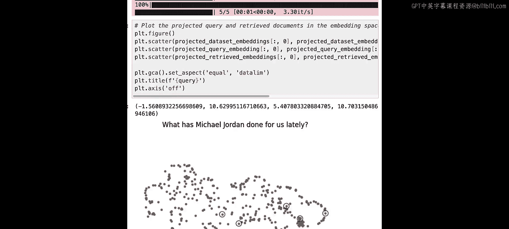

要改善检索质量，我们需要更智能的技术。在下节课中，我们将介绍一种称为**查询扩展**的技术，利用大语言模型来改进查询本身，从而获得更相关、更精确的检索结果。