# 004：Lab 3 - 查询扩展 🧠


在本节课中，我们将学习如何利用大型语言模型来增强查询，从而提升基于向量检索系统的结果相关性。我们将重点介绍两种查询扩展技术：**基于生成答案的扩展**和**基于多查询的扩展**。

信息检索作为自然语言处理的一个子领域已存在多年，有许多方法可用于提升查询结果的相关性。新的变化在于，我们现在拥有了强大的大型语言模型，可以利用它们来增强发送给基于向量检索系统的查询，从而获得更好的结果。

## 准备工作 ⚙️

上一节我们介绍了基础的检索流程，本节中我们来看看如何利用LLM来优化查询。首先，我们需要设置环境并加载必要的工具。

以下是初始化步骤的代码：

```python
# 导入必要的库并设置环境
import chromadb
from chromadb.utils import embedding_functions
import openai
import umap
import matplotlib.pyplot as plt

# 创建Chroma客户端和嵌入函数
client = chromadb.Client()
embedding_func = embedding_functions.OpenAIEmbeddingFunction()

# 设置OpenAI客户端
openai.api_key = "your-api-key"

# 使用UMAP准备数据降维以进行可视化
reducer = umap.UMAP()
```

## 基于生成答案的查询扩展 🤖

这种扩展方法的核心思想是：让LLM为原始查询生成一个假设性的答案，然后将原始查询与这个生成的答案拼接起来，形成一个新的、更丰富的查询，再将其送入检索系统。

以下是实现此功能的核心函数：

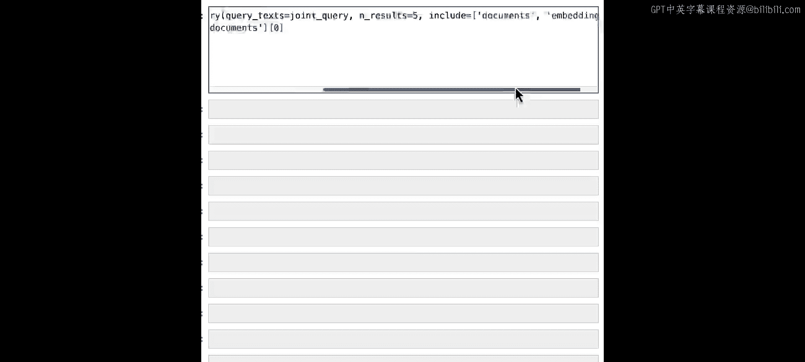

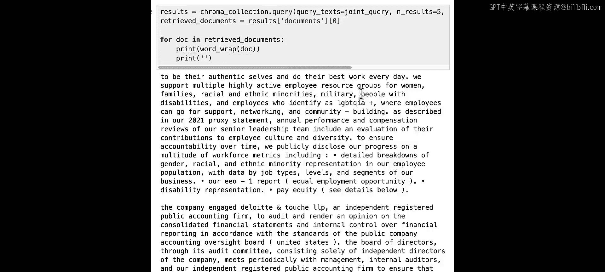


```python
def augment_query_generated(query, model="gpt-3.5-turbo"):
    # 系统提示词，指导模型生成假设性答案
    system_prompt = "你是一个有用的专家金融研究系统。请针对给定的问题，提供一个可能在年度报告等文档中找到的示例答案。"
    # 用户提示词即为原始查询
    user_prompt = query

    response = openai.ChatCompletion.create(
        model=model,
        messages=[
            {"role": "system", "content": system_prompt},
            {"role": "user", "content": user_prompt}
        ]
    )
    hypothetical_answer = response.choices[0].message.content
    # 拼接原始查询和生成的答案
    joint_query = query + " " + hypothetical_answer
    return joint_query
```

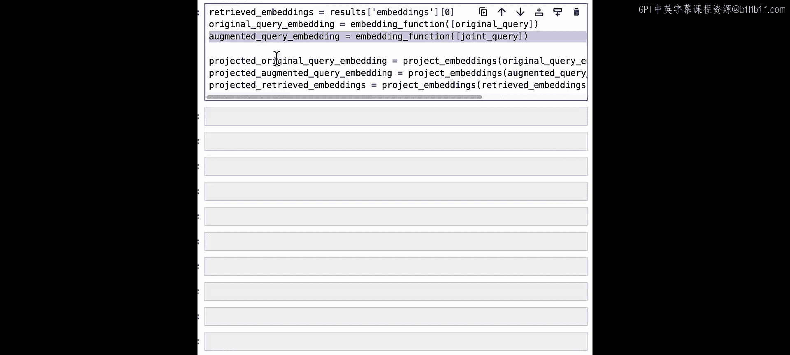

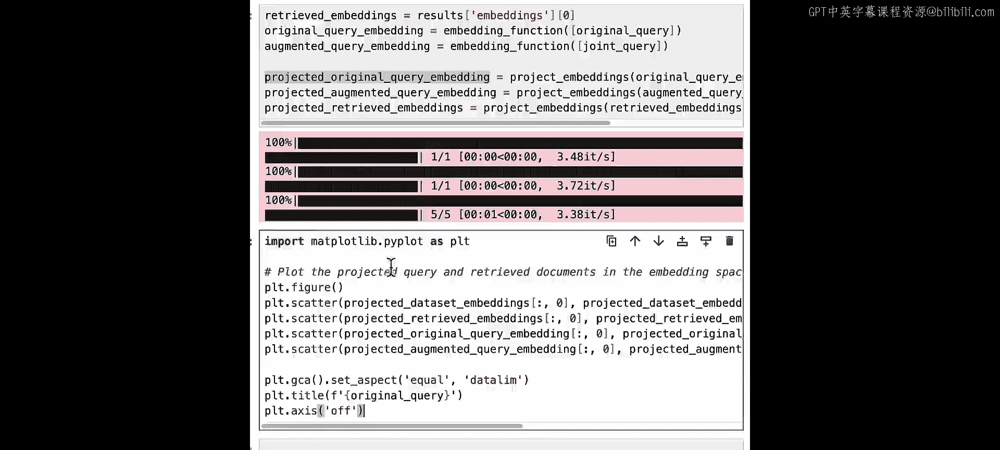

让我们看一个实践例子。假设原始查询是：“高管团队是否有重大人员变动？”

使用上述函数，我们可能会得到一个如下的联合查询：“高管团队是否有重大人员变动？ 在过去财年，高管团队没有发生重大人员变动。核心管理层成员保持稳定...”

将这个联合查询发送给Chroma向量数据库进行检索，我们可以获得与领导层稳定性、董事会构成等更相关的文档。

为了直观展示效果，我们可以比较原始查询嵌入向量和联合查询嵌入向量在空间中的位置。可视化结果显示，联合查询的嵌入向量（橙色X）与原始查询（红色X）位于不同区域，并成功召回了更相关的文档簇（绿色圆点）。


## 基于多查询的扩展 🔄

上一节我们介绍了通过生成答案来扩展单条查询，本节中我们来看看另一种更强大的方法：让LLM生成多个相关的子查询。这种方法特别适用于复杂的原始查询，它可以帮助我们从不同角度获取信息。

以下是生成多个相关查询的函数：

```python
def augment_query_multiple(query, model="gpt-3.5-turbo"):
    system_prompt = """你是一个有用的专家金融研究助手。用户正在询问关于年度报告的问题。
    请针对提供的问题，建议最多五个额外的相关问题，以帮助他们找到所需信息。
    建议只提供简短的疑问句，不要使用复合句。
    建议涵盖该主题不同方面的多种问题。
    确保输出的是完整的、与原始问题相关的问题。"""
    
    response = openai.ChatCompletion.create(
        model=model,
        messages=[
            {"role": "system", "content": system_prompt},
            {"role": "user", "content": query}
        ]
    )
    # 解析响应，获取生成的查询列表
    augmented_queries = parse_response_to_list(response)
    return augmented_queries
```

理解这些将LLM引入检索循环的技术时，**提示工程**变得非常重要。建议学生在实验中尝试修改这些提示词，观察它们如何影响生成的查询类型。

让我们实践一下。假设原始查询是：“导致收入增长的最重要因素是什么？”

使用上述函数，我们可能会得到以下一组扩展查询：
*   导致收入下降的最重要因素是什么？
*   收入来源有哪些？
*   销售和收入在不同产品线之间是如何分布的？
*   定价策略是否有变化？
*   公司是否获得了新客户？

可以看到，这些都是与原始查询相关但侧重点不同的问题，这能有效拓宽检索范围。

以下是执行多查询检索的步骤：

```python
# 1. 构建查询数组：原始查询 + 生成的扩展查询
all_queries = [original_query] + augmented_queries

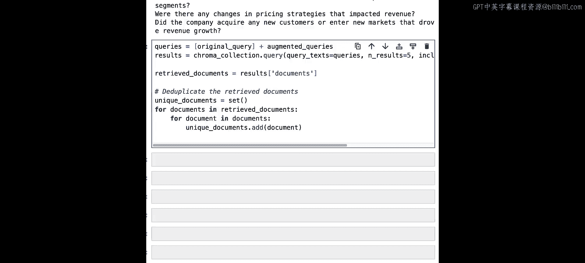

# 2. Chroma支持批量查询，获取所有查询的结果
results = collection.query(
    query_texts=all_queries,
    n_results=5
)

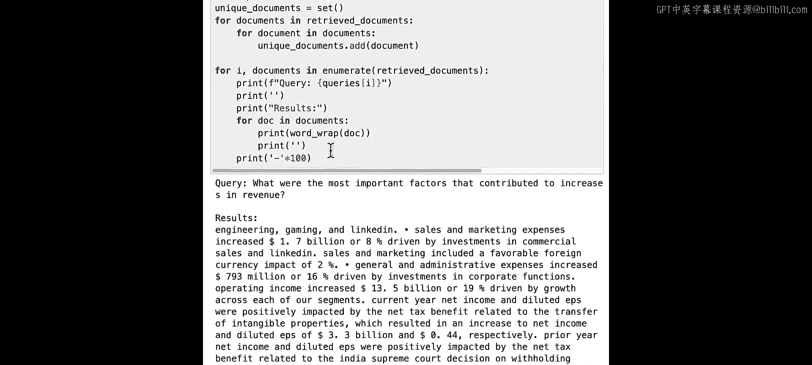


# 3. 由于不同查询可能返回相同文档，需要进行去重
unique_documents = remove_duplicates(results['documents'])
```

通过这种方法，我们能够检索到关于收入增长、Windows收入增加、销售营销费用、税收优惠等不同方面的文档。每个扩展查询都为我们提供了略有不同的结果集。

可视化显示，原始查询（红色X）和多个扩展查询（橙色点）在嵌入空间中指向不同区域，并召回了更广泛的相关信息（绿色圆点）。这大大增加了我们为复杂问题找到所有相关信息的几率。

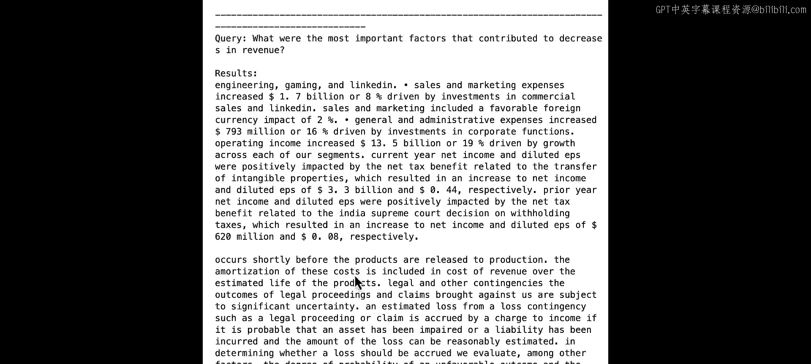

## 总结与展望 📝


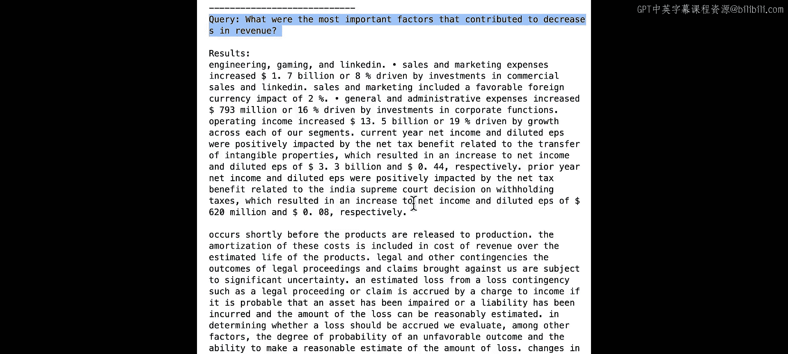

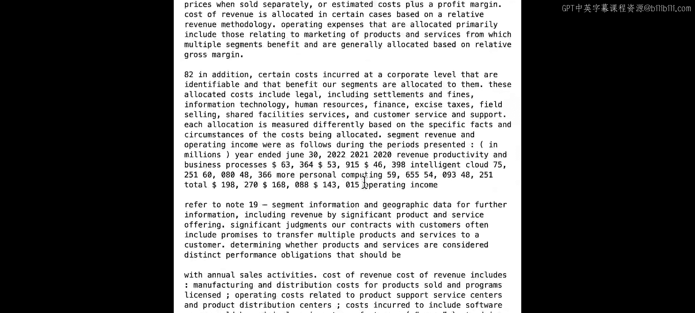

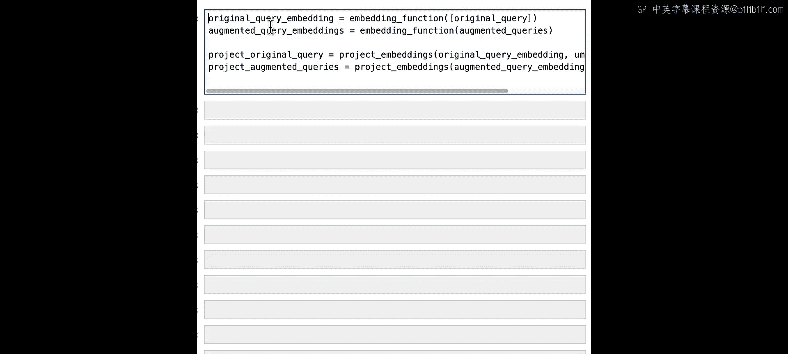

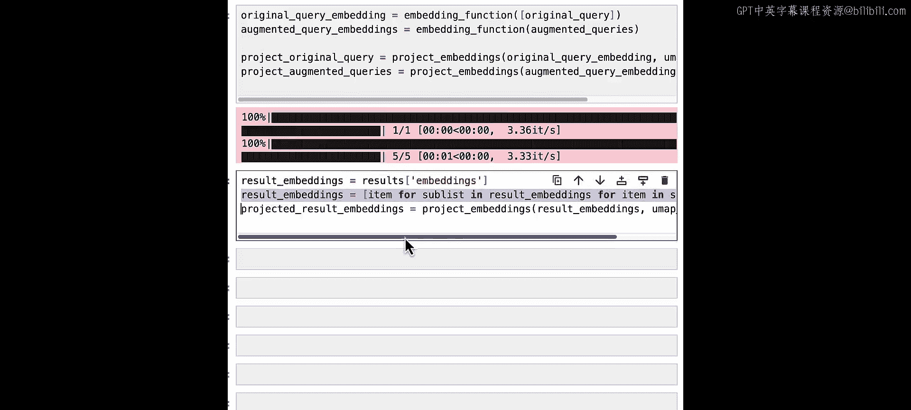

本节课中我们一起学习了两种利用LLM进行查询扩展的技术：
1.  **基于生成答案的扩展**：通过让LLM“幻想”一个答案来丰富查询语义。
2.  **基于多查询的扩展**：通过生成多个相关子查询来从不同角度覆盖主题。

这两种技术的核心**公式**可以概括为：
*   **扩展查询 = LLM(原始查询) + 原始查询**
*   **检索结果 = Retrieve(扩展查询)**

它们的优点是能显著提升复杂查询的召回率。然而，一个明显的缺点是可能会返回大量结果，其中部分可能与原始查询的相关性不高。

在下一个实验中，我们将介绍**交叉编码器重排序**技术。该技术可以对所有返回结果的相关性进行评分，并只筛选出与原始查询最匹配的部分，从而解决结果过多和噪音问题。

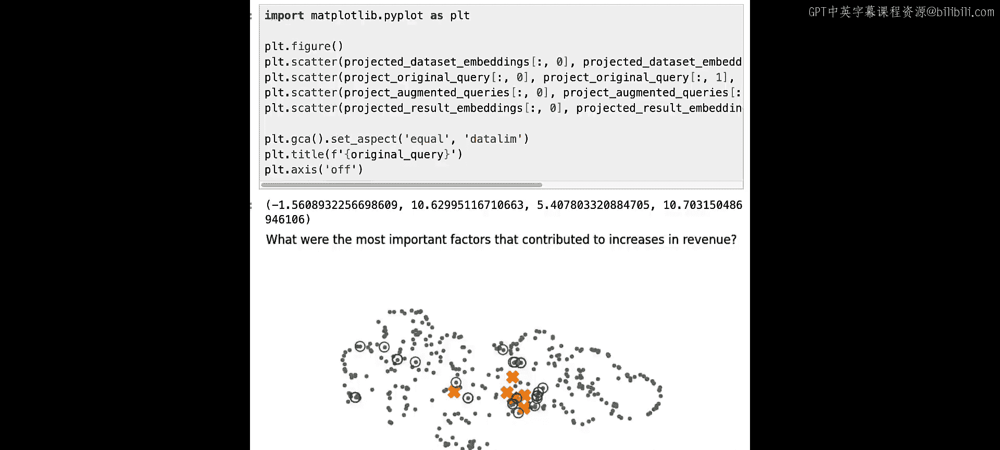

我建议你尝试修改本实验中的查询扩展提示词，针对微软年度报告提出不同类型的问题，观察所得到的结果有何变化。