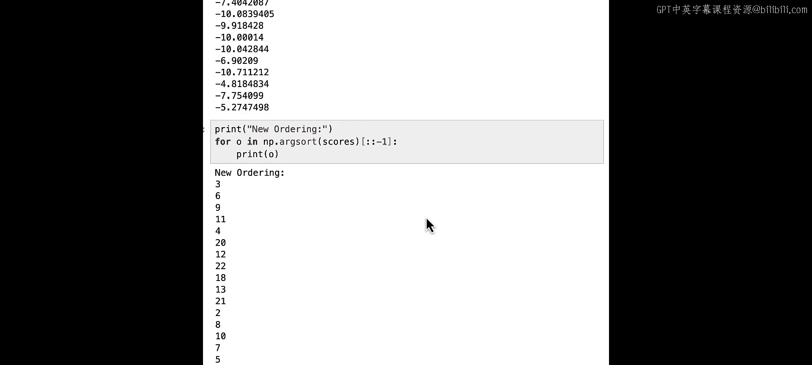

# 005：Lab 4 - 交叉编码器重排序 📊

在本节课中，我们将学习一种名为“交叉编码器重排序”的技术，用于评估检索结果与查询之间的相关性，并对结果进行重新排序，以提升最终答案的质量。

## 概述

上一节我们介绍了如何通过大语言模型来增强查询，以改善检索结果。本节中，我们将探讨另一种技术：交叉编码器重排序。这种方法能为检索到的文档进行相关性评分，并据此重新排序，确保最相关的结果排在最前面。

## 什么是重排序？🤔

重排序是一种根据结果与特定查询的相关性，对结果进行排序和评分的方法。

其工作原理如下：在为一个特定查询检索到结果后，你需要将这些结果连同原始查询一起，输入到一个重排序模型中。这个模型会为每个结果输出一个相关性分数，分数最高的结果被认为最相关。然后，你可以选择排名最高的结果作为最相关的答案。

另一种理解方式是：重排序模型会基于查询，为每个结果计算一个条件分数。

## 实践操作：基础重排序

让我们看看如何在实践中应用这一技术。

首先，像之前一样导入辅助函数，并将数据加载到Chroma数据库中。

重排序的一个用途是从查询结果的“长尾”部分挖掘更多有用信息。我们来看一个之前使用过的查询：“what has been the investment in research and development”。

通常我们要求返回5个结果，但这次我们将要求返回10个。这意味着我们将获得一个可能包含更多有用信息的更长结果列表。我们同样会包含文档和嵌入向量。

检索文档后，我们查看结果。前五个结果与之前相同，因为检索是确定性的。但我们还获得了五个新的结果，它们可能包含与问题相关的信息。

关键在于，如何判断哪些结果真正与我们的特定查询相关，而不仅仅是嵌入空间中的最近邻。我们通过交叉编码器重排序来实现这一点。

## 交叉编码器模型 🧠

我们将使用`sentence-transformers`库中的交叉编码器，并用一个特定模型来实例化它。

以下是`sentence-transformers`中的两种主要模型：
*   **双编码器**：将查询和文档分别编码，然后通过计算余弦相似度来寻找最近邻。
*   **交叉编码器**：将查询和文档一起输入到一个分类器中，直接输出一个相关性分数。

我们将使用交叉编码器来为检索结果评分。具体做法是：将原始查询与每一个检索到的文档配对，输入交叉编码器，得到的分数即为该文档的相关性排名分数。

我们实例化了交叉编码器。接下来要做的第一件事是创建配对列表。

以下是创建配对和评分的步骤：
1.  创建配对：每个配对包含原始查询和一个检索到的文档。
2.  使用交叉编码器为每个配对评分。

让我们打印出这些分数。可以看到，前两个文档的分数很高。值得注意的是，第二个检索到的文档分数远高于第一个。此外，一些来自“长尾”部分的文档，其分数甚至高于前五个结果中的某些文档。

如果我们根据分数重新排序文档，会看到第二个文档现在排名第一，第一个文档排名第二。一些来自“长尾”的文档进入了前五名。实际上，重排序后的前五名包含了原本排名第六和第七的结果，而原本的第四、第五名结果排名则很低。

通过这种方式，我们利用交叉编码器生成的分数对结果进行了重排序。现在，如果我们只取前五个结果，它们应该比之前的结果相关性更高，因为我们从“长尾”中挖掘出了更多与问题真正相关的信息。

## 结合查询扩展进行重排序 🔄

你可能已经想到了，我们可以将重排序技术与上一节的查询扩展结合使用。

考虑到查询扩展会生成多个查询，每个生成的查询都针对复杂问题的不同部分，我们可以使用交叉编码器重排序技术，从所有扩展查询的检索结果中，筛选出对原始查询最有利的结果，而不是简单地将所有结果都发送给大语言模型。

具体操作如下（沿用上一节的代码）：
1.  定义原始查询和生成的扩展查询。
2.  将所有查询（原始+生成的）拼接在一起，进行检索。
3.  对检索结果进行去重。
4.  创建配对：将原始查询与每一个去重后的检索文档配对。
5.  使用交叉编码器为这些配对评分。这样，我们就可以评估扩展查询的检索结果对于原始查询的相关性。
6.  根据评分重新排序，并选择评分最高的五个结果传递给大语言模型。

使用此类交叉编码器模型的一个巨大优势是，它非常轻量级，并且完全在本地运行。

通过这种方式，我们能够从查询扩展产生的众多结果“长尾”中，筛选出与原始查询最相关的信息，并将其传递给大语言模型。

## 总结

在本实验中，我们学习了如何使用交叉编码器作为重排序模型。我们看到了如何应用重排序技术，既可以从单个查询的“长尾”中获取更多信息，也可以过滤扩展查询的结果，只保留与原始查询本身最相关的内容。

这是一个非常强大的技术，值得进一步实验。理解并直观感受重排序分数如何随查询变化（即使检索系统返回的结果相同）是很有益的。这是因为交叉编码器重排序器可能强调查询中与嵌入模型不同的部分，因此它提供的排名更依赖于特定查询本身，而不仅仅是检索系统返回的原始结果。

在下一节中，我们将讨论查询适配器。查询适配器是一种利用用户反馈或其他类型数据，直接修改或增强查询嵌入向量本身，以获得更好查询结果的方法。