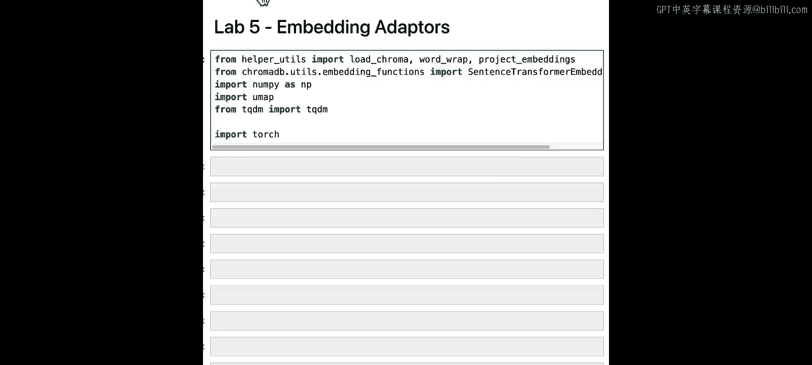
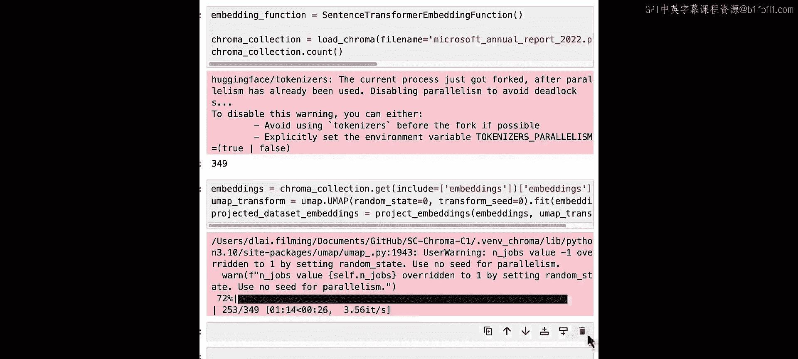
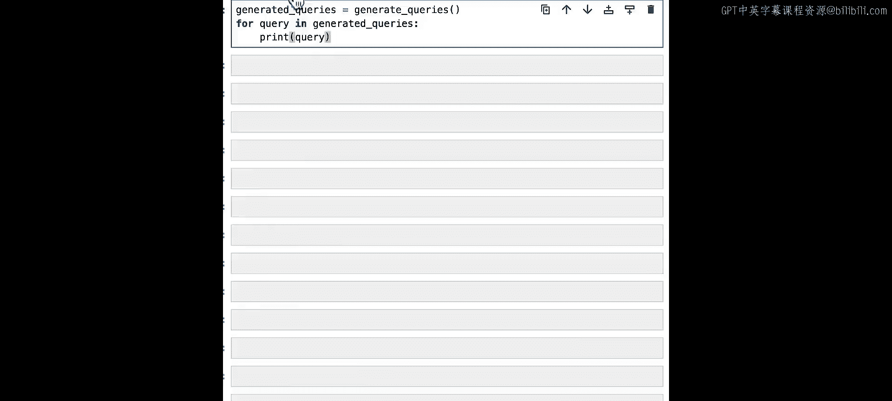
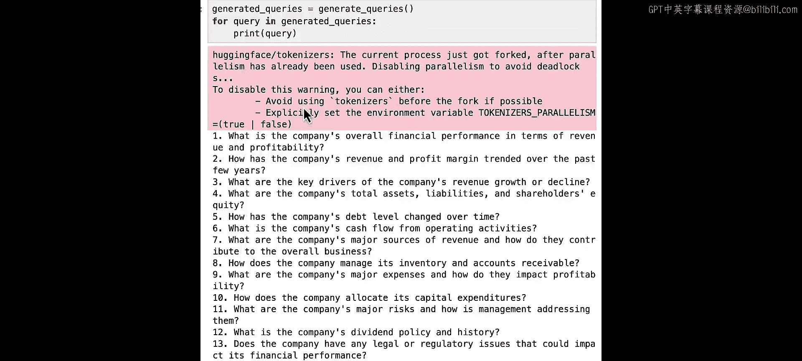
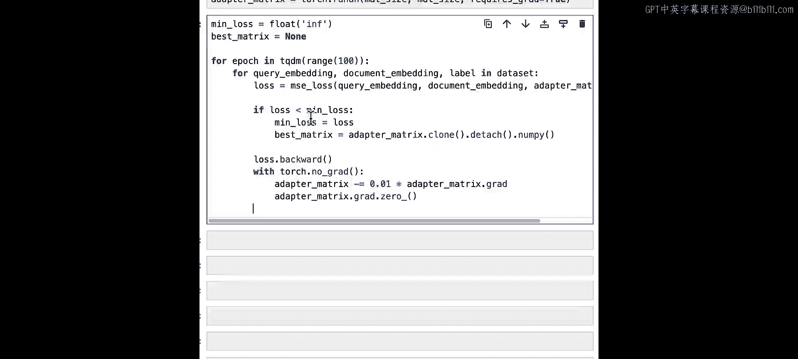
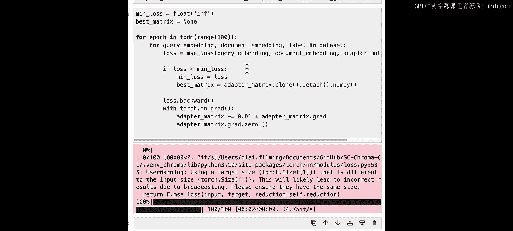
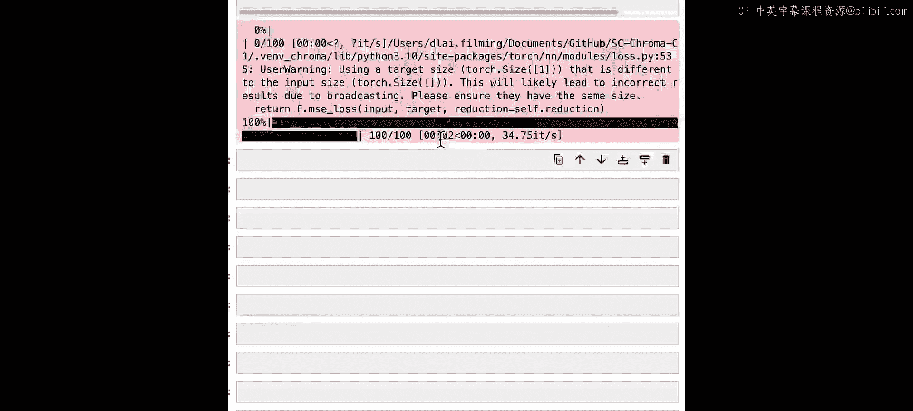
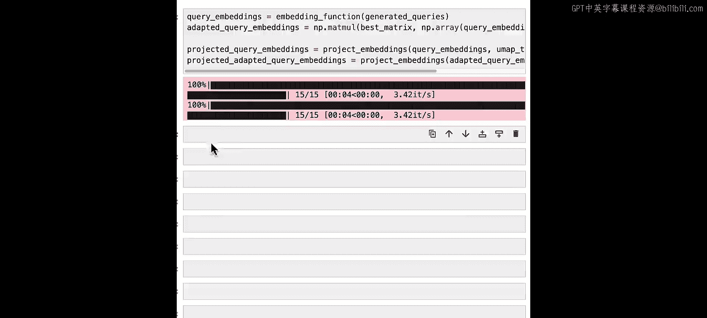
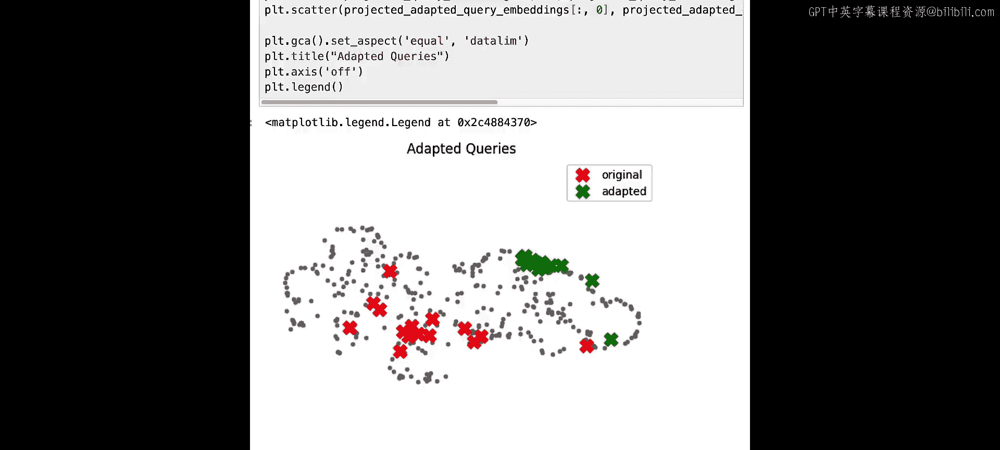

# 006：Lab 5 - 嵌入适配器 🧩

## 概述
在本节课中，我们将学习一种名为“嵌入适配器”的技术。该技术利用用户对检索结果相关性的反馈，自动优化检索系统的性能。我们将了解其工作原理，并通过代码实践，学习如何训练一个嵌入适配器模型来改进查询嵌入，从而获得更精准的检索结果。


---

## 嵌入适配器简介
在前几节课中，我们探讨了如何使用查询增强和交叉编码器重排序来改善检索结果。本节中，我们将学习如何利用用户对检索结果相关性的反馈，通过一种名为“嵌入适配器”的技术，自动提升检索系统的性能。

嵌入适配器是一种直接修改查询嵌入向量的方法，旨在产生更好的检索结果。实际上，我们在检索系统中插入了一个额外的阶段——嵌入适配器。它位于嵌入模型之后，但在检索最相关结果之前。我们通过一组查询的检索结果相关性用户反馈，来训练这个嵌入适配器。





---

## 准备工作
首先，我们需要像往常一样设置环境并加载数据。这里有一个特殊之处：我们需要使用 `torch` 库，因为我们将训练一个非常轻量级的模型。

```python
import torch
# 创建嵌入函数并加载数据到Chroma
# ... (初始化代码)
```

---





## 生成模拟查询数据集
为了训练适配器，我们需要一个数据集。由于我们的RAG应用尚未有真实用户，我们可以使用大语言模型来生成一个模拟数据集。这需要精心设计提示词。

以下是生成查询的提示词示例：
> 你是一位乐于助人的金融研究助手。请提出10到15个在分析年报时重要的简短问题，并遵循给定的输出格式。

运行此提示词后，我们得到了一系列关于公司财务报表的合理问题。

---

## 评估检索结果相关性
接下来，我们从Chroma中检索与这些查询相关的文档。在真实的RAG系统中，可以请用户对输出结果给出“赞”或“踩”的反馈，并将其与检索结果关联，从而获得相关性信号。在本实验中，我们使用大语言模型来评估每个查询的检索结果相关性。

我们再次设计提示词，要求模型判断给定陈述是否与查询相关，并只输出“是”或“否”。然后，我们将“是”转换为标签`+1`，“否”转换为标签`-1`。这样做的原因将在稍后解释。

---

## 构建训练数据集
现在，我们将获取查询嵌入、文档嵌入以及从评估模型得到的标签，开始构建训练嵌入适配器的数据集。

数据集将包含以下三个部分：
*   **适配器查询嵌入**：原始查询的嵌入向量。
*   **适配器文档嵌入**：检索到的文档的嵌入向量。
*   **适配器标签**：根据相关性评估得到的`+1`（相关）或`-1`（不相关）标签。

我们通过循环遍历所有查询和结果，创建这些三元组数据。标签设为`+1`和`-1`并非偶然，因为在训练嵌入适配器模型时，我们将把这些值用作余弦距离损失函数的目标。当两个向量相同时，它们的余弦相似度为`1`；当它们相反时，余弦相似度为`-1`。换句话说，我们希望相关结果的向量与查询向量方向相同，而不相关结果的向量方向相反。这正是我们要训练的模型的目标。

检查数据长度，例如得到150条，这代表15个查询，每个查询有10个结果，每个结果都有相关性标签。

---

## 转换为PyTorch数据集
由于我们使用PyTorch训练嵌入适配器，需要将数据转换为PyTorch张量数据集。

```python
# 将数据转换为PyTorch张量类型
# ... (数据转换代码)
# 打包成PyTorch数据集
dataset = torch.utils.data.TensorDataset(query_embeddings_tensor, doc_embeddings_tensor, labels_tensor)
```

---

## 定义嵌入适配器模型与损失函数
接下来，我们设置嵌入适配器模型。模型本身相当简单：
1.  输入：查询嵌入、文档嵌入和一个适配器矩阵。
2.  计算更新后的查询嵌入：`updated_query_embedding = original_query_embedding @ adapter_matrix`
3.  计算更新后的查询嵌入与文档嵌入之间的余弦相似度。

然后，我们定义损失函数。损失函数接收查询嵌入、文档嵌入、适配器矩阵和标签，运行模型计算余弦相似度，并计算余弦相似度与标签之间的均方误差。`+1`标签意味着余弦相似度应表明向量方向相同，`-1`标签则意味着方向应相反。通过这种方式，我们训练适配器矩阵，使查询向量与相关文档方向一致，与不相关文档方向相反。

我们初始化适配器矩阵进行训练。您可能会发现，这非常类似于传统神经网络中的线性层。

---

## 训练循环
设置训练循环，我们将训练100个周期。在每次迭代中，我们计算损失。如果当前损失优于之前记录的最佳损失，我们就更新记录的最佳矩阵。然后执行反向传播以更新矩阵。



```python
best_loss = float(‘inf’)
best_matrix = None
for epoch in range(100):
    for q_emb, d_emb, label in dataset:
        loss = compute_loss(q_emb, d_emb, adapter_matrix, label)
        if loss < best_loss:
            best_loss = loss
            best_matrix = adapter_matrix.clone()
        # 反向传播和优化器步骤
        # ...
```

运行训练循环。训练速度非常快，因为这本质上等同于训练传统神经网络中的单个线性层。

查看得到的最佳损失值，例如`0.5`，这表示我们从起点取得了相当不错的改进。

---

## 分析适配器矩阵的影响
为了理解适配器矩阵如何影响查询向量，我们可以构造一个全为1的测试向量，并将其乘以我们的最佳矩阵。这将告诉我们向量的各个维度被缩放的程度。





您可以将嵌入适配器视为对空间进行拉伸和挤压：它放大与特定查询最相关的维度，同时缩小不相关的维度。您还会注意到，它甚至可以反转某些维度的方向。

绘制结果图，您可以看到测试向量（全为1）的每个维度是如何被拉伸和挤压的。有些维度被显著拉长，而有些则几乎变为零。这意味着我们的嵌入适配器基本上判断出：这些维度更相关，那些较不相关，这些实际上与我们想找的内容相反，而那些则更相关。

---



## 可视化适配效果
最后，让我们看看这实际上对查询产生了什么效果。我们像之前一样，获取生成的查询并嵌入它们，同时计算适配后的查询嵌入，然后将它们投影出来并绘图。

与原始查询（在数据集中较为分散）相比，新的查询（经过嵌入适配器转换后）集中在了数据集中与我们的查询最相关的特定区域。您可以看到红色的原始查询如何通过嵌入适配器转变为绿色的查询，并将它们推向了空间的特定部分。

---

## 总结与展望
本节课中，我们一起学习了嵌入适配器。这是一种简单而强大的技术，用于根据您的特定应用定制查询嵌入，以提高检索相关性。

为了使这项技术有效，您需要收集一个数据集，可以是像我们这里生成的合成数据集，也可以是基于真实用户行为的数据集。用户数据通常效果最好，因为它真实反映了人们使用检索系统完成特定任务的情况。

由于这种方法涉及提示词工程和大语言模型的使用，值得尝试不同的提示词。同时，也值得尝试不同的适配器矩阵初始化方式，甚至可以考虑使用一个完整的轻量级神经网络来代替简单的矩阵。您可能还想调整嵌入适配器训练过程的超参数，或者收集更具体的数据，针对特定的应用场景（而不是我们这里“理解财务报表”这样非常通用的目标）进行尝试。



在下一课中，我们将介绍一些其他新兴的研究技术，以进一步改进基于嵌入的检索系统。