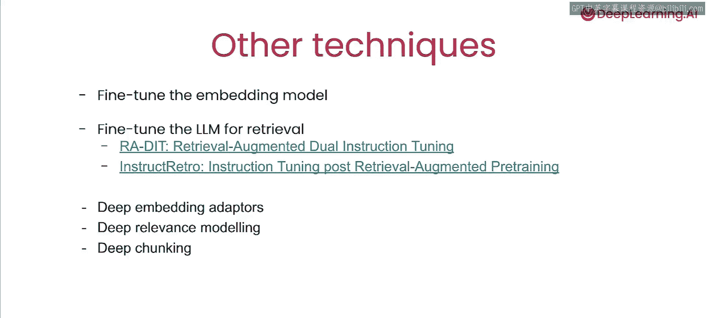

# 007：L6_其他检索技术 🧠

在本节课中，我们将探讨基于嵌入的检索领域中的其他前沿技术与研究方向。基于嵌入的检索仍然是一个非常活跃的研究领域，存在许多值得了解的技术。

上一节我们介绍了嵌入适配器的训练与应用，本节中我们来看看该领域内其他值得关注的技术方向。

## 其他技术概览

以下是几种可以进一步提升检索效果的技术路径：

*   **微调嵌入模型**：你可以直接使用与我们在“嵌入适配器实验”中相同类型的数据，来微调嵌入模型本身。
*   **微调大语言模型**：最近的研究表明，直接微调LLM本身，使其能够预期检索结果并对其进行推理，取得了非常好的效果。你可以参考这里高亮的一些论文。
*   **使用更复杂的嵌入适配器模型**：你可以尝试使用更复杂的模型架构，例如一个完整的神经网络，甚至是一个Transformer层，来构建嵌入适配器。
*   **使用更复杂的相关性建模模型**：除了我们在实验中描述的交叉编码器，你还可以尝试使用更复杂的模型来评估检索结果的相关性。
*   **优化数据分块策略**：一个常被忽视的环节是，检索结果的质量通常取决于数据存入检索系统之前的分块方式。目前有很多研究正在探索使用包括Transformer在内的深度模型，来实现最优和智能的数据分块。

## 课程总结 🎯

本节课中我们一起学习了基于嵌入空间的检索增强生成技术的基础知识。

我们探讨了如何利用大语言模型来增强和优化查询，以获得更好的检索结果。

我们学习了如何使用交叉编码器模型进行重排序，为检索结果的相关性进行评分。

我们还了解了如何利用来自人类的相关性反馈数据来训练嵌入适配器，以改进查询结果。

最后，我们介绍了一些当前研究文献中关于改进AI应用检索的最令人兴奋的工作。

感谢你参与本课程，我们非常期待看到你构建的作品。