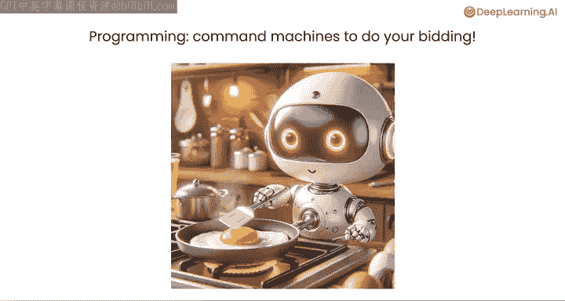
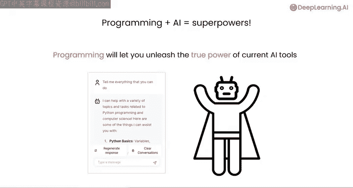
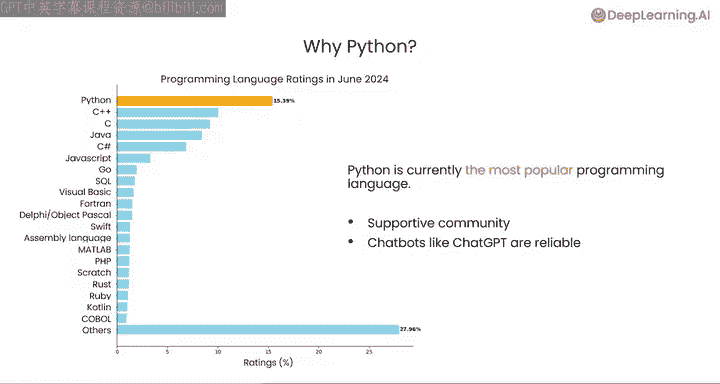
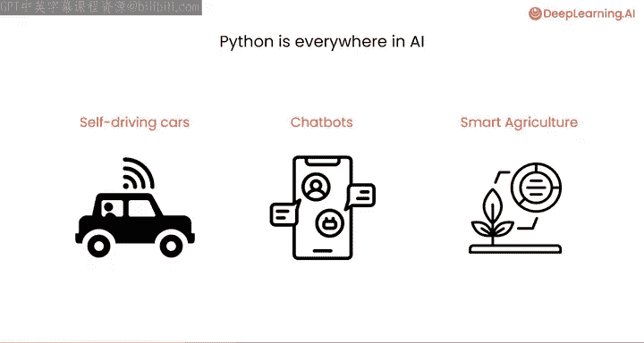
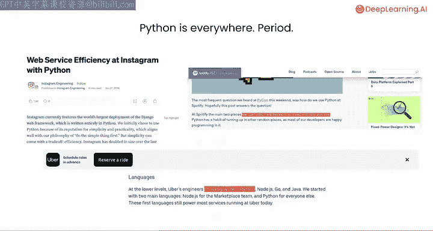

#  002：什么是计算机编程 🖥️

在本节课中，我们将要学习计算机编程的基本概念，了解它是什么、为何重要，以及Python语言在当今世界，尤其是在人工智能领域的核心地位。

## 概述

计算机编程是一门艺术与科学，其核心是编写精确的指令，告诉计算机你希望它为你做什么。事实证明，当你编写出优秀的指令时，计算机能够完成大量工作。

## 编程的力量：从个人效率到人类进步

上一节我们介绍了编程的基本定义，本节中我们来看看编程在实际生活中展现出的强大力量。

编程能够显著提升个人工作效率。我曾遇到一位前行政助理，她通过学习编程，编写了一个程序来监控她上司的日程。如果她的老板在日程安排上做了任何“有趣”的改动，她就会收到通知，从而能及时去修正。这就是一个通过学习编程，编写少量代码，从而更高效完成工作的例子。

我认为，在几乎各行各业中，学习编程、让计算机按你的意愿行事，都能帮助你完成更多工作。

更广泛地说，编程在诸多方面推动了人类的巨大进步，所有这些都离不开人们编写的代码。

*   **科学探索**：帮助我们解开宇宙奥秘的哈勃太空望远镜图像，是由科学家编写的计算机程序进行处理和分析的。
*   **物理研究**：发现希格斯玻色子的粒子加速器，之所以成为可能，是因为开发人员编写了软件来分析其收集的数据，从而推动了我们对物理学的理解。
*   **日常生活**：我们日常使用的互联网，也完全依赖于人们编写的计算机程序。当你拿起手机给别人发信息时，你就在使用别人编写的程序。
*   **辅助技术**：如果你使用GPS导航，或者你或你爱的人使用语音识别、眼动追踪等辅助技术，这些改变了无数残障人士生活的技术，也都是由人编写的程序。

## 编程的核心：向机器下达指令

计算机编程的核心是掌握命令机器为你服务的能力。计算机程序是一组精确的指令，告诉计算机如何执行一项任务。

正如烹饪食谱指导你完成步骤以 consistently 做出美味佳肴一样，计算机程序为计算机执行特定任务提供了指令。

掌握编程能力将使你在能够完成的事情上占据优势。我看到许多人使用编程来自动化重复性任务，例如反复从PDF文档中提取相关数据到电子表格中。

## 编程与人工智能：获取全新洞察

除了分析你或公司已有的数据，编程还能帮助你获得全新的洞察。

我看到许多团队，包括商业分析师，越来越多地使用像ChatGPT这样的人工智能工具来自动浏览网页、下载大量网页并综合成报告，以帮助他们获得市场洞察，了解世界某个地区正在发生的事情。

当你学会编程后，你自己就能更好地识别并利用人工智能来自动化更多这类任务。事实证明，通过编程，你只需编写几行代码，就能命令你的计算机使用ChatGPT或其他AI语言模型等工具。现在，不是你自己，而是你的计算机可以去使用ChatGPT来帮助它完成任务。

本课程编写代码的一个核心部分，就是让你的计算机通过Python使用AI工具，从而为你做更多事情。

## 为什么选择Python？ 🐍

大多数像我这样的AI开发者一直在使用Python。事实证明，Python实际上是最流行的编程语言。

Python拥有一个非常支持性的开发者社区。如果你有问题，全世界有如此多的Python开发者，你通常可以找到人来帮助你，或者发现有人曾遇到过同样的问题。

此外，像ChatGPT、Anthropic的Claude和Google的Gemini这样的聊天机器人也对Python相当了解，因此如果你在某个问题上遇到困难，它们可以帮助你。

所以，当你在编程中遇到问题时，我鼓励你尝试询问聊天机器人来帮助你找到解决方案，正如我将在今天的课程中向你展示的那样。

## Python的应用：无处不在

Python正在为海量的人工智能应用提供动力。Python代码运行在许多自动驾驶汽车中，是驱动聊天机器人的软件的一部分，并应用于从智能农业到医疗保健、金融服务等众多其他AI应用中，不胜枚举。

Python的使用范围远不止于此。许多网站、智能手机应用程序、视频游戏等都在使用Python运行。

因此，当你学习Python时，你就是在学习编程中最重要的工具之一，无论你的目标是什么。

## 总结

本节课中我们一起学习了计算机编程的本质——编写精确指令来控制计算机。我们看到了编程如何提升个人效率并推动人类进步，探讨了编程与人工智能结合带来的新可能，并了解了Python作为最流行编程语言的优势及其广泛的应用领域。我希望这门《AI Python for Beginners》课程只是你的第一步，它将为你奠定基础，让你能够不断前进，用Python和编程做越来越多的事情，从而你也可以通过代码推动人类进步。

那么，让我们进入下一个视频，开始看看聊天机器人如何与Python交互。