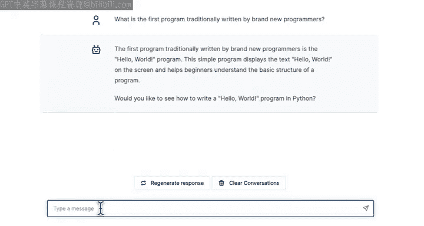
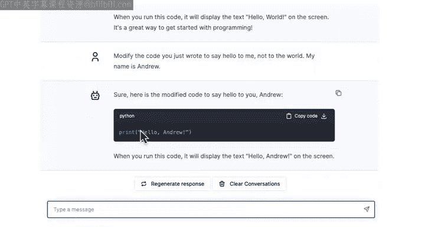
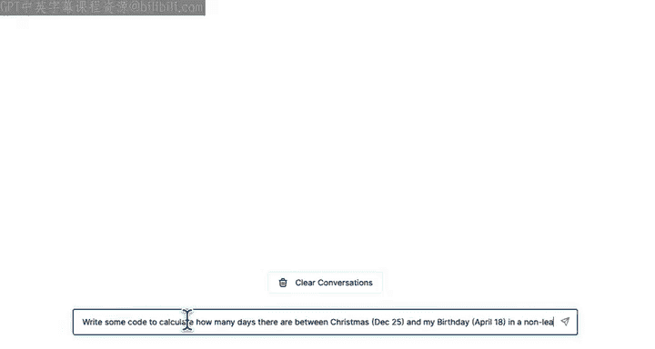
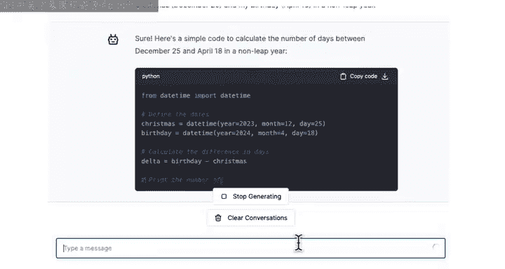
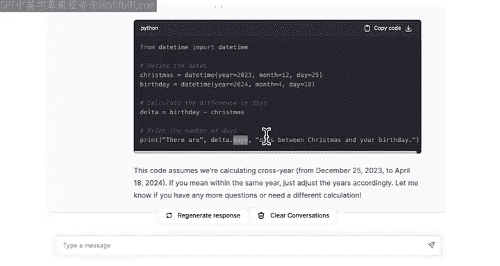

#  003：使用聊天机器人编写代码 🚀

在本节课中，我们将学习程序员如何利用AI聊天机器人来辅助编程工作，提高效率。我们将从询问基本概念开始，逐步过渡到让聊天机器人直接为我们生成代码，并学习如何与它交互以修改和优化代码。

## 概述

程序员在日常工作中频繁使用聊天机器人，这显著提升了工作效率。过去，遇到编程难题时，可能需要花费时间寻找专家求助。现在，你可以直接向AI聊天机器人提问并立即获得答案。本课程提供了内置的聊天机器人供你使用，你也可以自由选择第三方工具，如ChatGPT、Microsoft Copilot、Claude、Google Gemini等。

## 与聊天机器人交互：提问与回答

上一节我们提到了聊天机器人的便利性，本节中我们来看看如何具体使用它。你可以将问题（也称为“提示”）输入聊天机器人。

例如，如果你想知道“什么是编程”，可以输入这个问题，聊天机器人会生成一个合理的答案。

即使本课程提供了内置聊天机器人，你仍然可以自由使用第三方聊天机器人。现在让我们尝试另一个问题。我将清空当前对话，然后输入提示：“什么是Python”。

我刚刚输入的文本被称为“提示”。输入“什么是Python”并按下回车后，聊天机器人会生成一个“响应”。由于历史原因，计算机程序员有时称此响应为“完成”，但“完成”一词指的就是聊天机器人对提示的回复。

以下是聊天机器人可能给出的关于Python的响应示例：
> Python是一种高级编程语言，以其简单的语法而闻名，这使其成为初学者的绝佳选择。

如果你对回答中的某些部分感到好奇，例如“简单的语法”是什么意思，你可以继续提出后续问题。这是我个人常用的工作流程：使用聊天机器人获得答案，如果对某部分不理解，就提出后续问题。对于入门级的编程问题，这类聊天机器人通常能提供很好的答案。

## 编写你的第一个程序：Hello World

现在，有一个程序传统上是由无数新手程序员编写的，包括许多今天拥有杰出职业生涯的程序员。让我们来找出这个程序是什么。

我们可以询问聊天机器人：“传统上，新手程序员编写的第一个程序是什么？”



聊天机器人会回答，新手程序员传统上编写的第一个程序是“Hello World”程序。它简单地在屏幕上显示“Hello World”这句话。如果你想知道如何编写它，可以继续提问。

以下是让聊天机器人编写代码的示例：
```python
print("Hello, World!")
```
这段代码告诉计算机打印出“Hello, World!”这条信息。在编程历史上，当你开始编程时，让计算机说“你好”是一种传统，仿佛你的程序第一次“醒来”时说：“你好，世界，我在这里。”

**请注意**：如果你使用ChatGPT、Claude或Gemini等第三方聊天机器人尝试类似的提示，可能需要明确告诉它你想使用Python编程语言。就像人类有多种语言一样，编程语言也有很多种。如果不指定Python，它可能会用其他编程语言告诉你如何打印“Hello World”。

## 修改与定制代码

上一节我们让聊天机器人编写了代码，本节中我们来看看如何修改它。如果你想修改代码，例如不说“Hello, World!”而说“Hello, Andrew!”，你也可以使用聊天机器人。

你可以给出这样的提示：“修改你刚刚写的代码，向‘我’问好，而不是向‘世界’问好。我的名字是Andrew。”

聊天机器人随后会生成修改后的代码：
```python
print("Hello, Andrew!")
```



## 编写更复杂的代码

聊天机器人不仅能写简单的代码，还能编写更复杂的程序。让我们看一个例子。



假设你想写一段代码来计算圣诞节（12月25日）和你的生日（例如4月18日）之间有多少天（假设是非闰年）。你可以向聊天机器人提出请求。

以下是请求示例：
“编写一些代码来计算圣诞节（12月25日）和我的生日（4月18日）之间有多少天。假设是非闰年。”



聊天机器人可能会生成类似下面的Python代码：
```python
from datetime import date

# 定义日期
christmas = date(2024, 12, 25)  # 假设年份为2024
birthday = date(2024, 4, 18)    # 假设年份为2024

# 计算天数差
delta = christmas - birthday
print(f"There are {delta.days} days between Christmas and my birthday.")
```
你可以将生日和节日替换成你自己的，让聊天机器人进行计算。

因为AI擅长编写简单的代码片段，这正在改变许多人的编码方式。我鼓励你亲自尝试，如果对代码的任何具体方面想深入了解，可以随时提出后续问题。

## 总结



本节课中我们一起学习了如何使用AI聊天机器人辅助编程。我们从提出基本问题开始，了解了“提示”和“响应”的概念。然后，我们让聊天机器人编写了传统的“Hello World”程序，并学习了如何通过后续提示来修改和定制代码。最后，我们还看到了聊天机器人处理更复杂计算任务的能力。在下一课中，我们将不仅查看代码，还要学习如何实际运行代码。